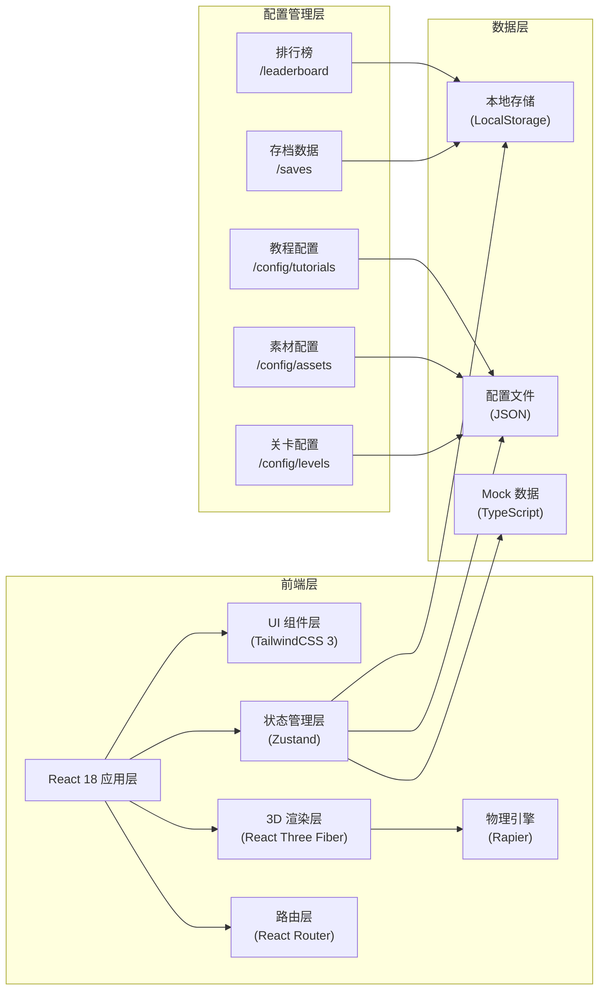
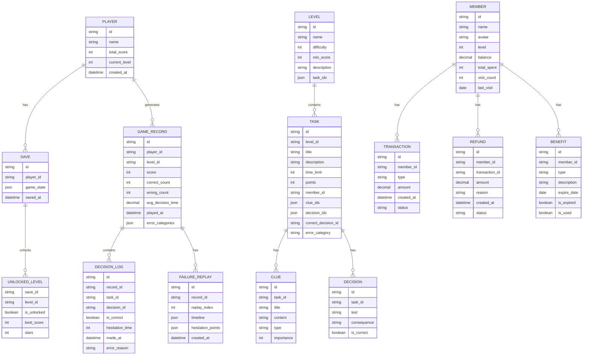

## 1. 架构设计



## 2. 技术描述

- **前端框架**：React 18 + TypeScript 5
- **3D 引擎**：Three.js + @react-three/fiber + @react-three/drei
- **物理引擎**：@react-three/rapier
- **后处理**：@react-three/postprocessing
- **构建工具**：Vite 5
- **样式方案**：TailwindCSS 3
- **状态管理**：Zustand 4
- **路由管理**：React Router DOM 6
- **动画库**：Framer Motion
- **图表库**：Recharts
- **图标库**：Lucide React

## 3. 路由定义

| 路由 | 页面 | 功能说明 |
|------|------|----------|
| `/` | 主菜单 | 游戏入口、开始/继续游戏、教程、关卡选择、排行榜 |
| `/game` | 游戏主场景 | 3D 咖啡店场景、任务系统、线索分析、决策交互 |
| `/members/:id` | 会员档案 | 会员信息、消费记录、核销记录、退款原因、失败回放 |
| `/review` | 复盘中心 | 得分统计、错因分析、权益过期记录、续费率分析 |
| `/leaderboard` | 排行榜 | 本地排名、得分展示、历史记录 |
| `/tutorial` | 教程 | 游戏玩法指引、操作说明 |
| `/level-select` | 关卡选择 | 已解锁关卡展示、难度选择 |

## 4. 数据模型

### 4.1 数据模型定义



### 4.2 配置文件结构

```
src/config/
├── levels/
│   ├── level-1.json
│   ├── level-2.json
│   └── level-3.json
├── assets/
│   ├── models.json
│   ├── textures.json
│   └── materials.json
├── tutorials/
│   ├── tutorial-1.json
│   └── tutorial-2.json
└── members/
    ├── member-a.json
    └── member-b.json
```

## 5. 目录结构

```
MP0018/
├── src/
│   ├── components/
│   │   ├── ui/              # 基础 UI 组件
│   │   ├── game/            # 游戏相关组件
│   │   ├── three/           # 3D 场景组件
│   │   ├── member/          # 会员档案组件
│   │   └── review/          # 复盘组件
│   ├── scenes/
│   │   ├── CoffeeShop.tsx   # 咖啡店 3D 场景
│   │   └── objects/         # 3D 对象组件
│   ├── store/
│   │   ├── useGameStore.ts  # 游戏状态
│   │   ├── usePlayerStore.ts # 玩家状态
│   │   └── useUIVStore.ts   # UI 状态
│   ├── hooks/
│   │   ├── useGameLoop.ts
│   │   ├── usePhysics.ts
│   │   └── useReplay.ts
│   ├── config/
│   │   ├── levels/
│   │   ├── assets/
│   │   ├── tutorials/
│   │   └── members/
│   ├── types/
│   │   ├── game.ts
│   │   ├── member.ts
│   │   └── index.ts
│   ├── utils/
│   │   ├── storage.ts
│   │   ├── scoring.ts
│   │   └── replay.ts
│   ├── pages/
│   │   ├── MainMenu.tsx
│   │   ├── GameScene.tsx
│   │   ├── MemberProfile.tsx
│   │   ├── ReviewCenter.tsx
│   │   └── Leaderboard.tsx
│   ├── data/
│   │   ├── mockMembers.ts
│   │   ├── mockTasks.ts
│   │   └── mockLeaderboard.ts
│   ├── App.tsx
│   ├── main.tsx
│   └── index.css
├── public/
│   ├── models/
│   ├── textures/
│   └── icons/
├── vite.config.ts
├── tsconfig.json
└── package.json
```

## 6. 核心系统设计

### 6.1 游戏状态管理（Zustand）

- `useGameStore`：当前关卡、任务列表、当前任务、得分、时间、决策历史
- `usePlayerStore`：玩家信息、存档、已解锁关卡、总得分
- `useUIStore`：面板开关、当前视图、动画状态

### 6.2 犹豫点记录机制

在 `useGameLoop` hook 中实现：
- 记录玩家查看每个线索的开始/结束时间
- 记录决策面板打开到最终选择的时间
- 超过阈值（如 5 秒）标记为犹豫点
- 存储在 `DECISION_LOG.hesitation_time` 字段

### 6.3 失败回放系统

- 每次失败记录完整决策时间线
- 最多保留最近 3 次失败记录
- 回放时按时间轴重现，犹豫点高亮显示
- 支持倍速播放、暂停、进度跳转

### 6.4 物理交互设计

- 线索卡片：Rapier 刚体，可拖拽、碰撞
- 咖啡杯：物理对象，正确决策拉花动画，错误决策溢出效果
- 档案柜抽屉：物理约束，可滑动打开

### 6.5 性能优化

- 3D 对象按需加载，使用 Suspense
- 物理对象池化复用
- 状态分片，避免不必要重渲染
- 使用 React.memo 和 useMemo 优化
