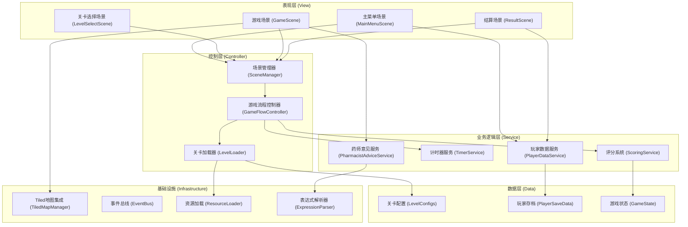

## 1. 技术架构设计



---

## 2. 技术栈说明

| 类别 | 技术选型 | 版本 | 说明 |
|------|---------|------|------|
| 游戏引擎 | Cocos Creator | 3.8.x | 2D游戏开发引擎，支持TypeScript |
| 编程语言 | TypeScript | 5.x | 类型安全，便于维护大型项目 |
| 地图编辑器 | Tiled Map Editor | 1.10.x | 创建药店场景地图，支持多图层 |
| 数据格式 | JSON | - | 关卡配置、玩家数据均使用JSON存储 |
| 构建工具 | Cocos Creator内置 | - | 支持Web、桌面、移动端多平台构建 |

### 核心设计原则

1. **数据驱动**：所有关卡配置、题目内容、药师意见均通过JSON配置文件加载，核心逻辑不硬编码任何题目内容
2. **场景分离**：正式训练与自由练习使用独立的场景入口，便于按岗位和培训需求区分
3. **模块化设计**：各功能模块解耦，通过事件总线通信，便于后续扩展
4. **配置优先**：药师意见触发条件使用表达式配置，新增题目时无需修改代码

---

## 3. 目录结构设计

```
assets/
├── scripts/
│   ├── core/                    # 核心框架
│   │   ├── SceneManager.ts      # 场景管理器
│   │   ├── EventBus.ts          # 事件总线
│   │   ├── ResourceLoader.ts    # 资源加载器
│   │   └── ExpressionParser.ts  # 表达式解析器（用于药师意见条件判断）
│   ├── data/                    # 数据模型
│   │   ├── LevelConfig.ts       # 关卡配置类型定义
│   │   ├── GameState.ts         # 游戏状态
│   │   ├── PlayerData.ts        # 玩家数据
│   │   └── enums/               # 枚举定义
│   │       ├── GameMode.ts      # 游戏模式（正式训练/自由练习）
│   │       ├── PharmacistRole.ts # 岗位枚举
│   │       ├── Difficulty.ts    # 难度枚举
│   │       └── TaskAction.ts    # 任务操作枚举
│   ├── services/                # 业务服务
│   │   ├── ScoringService.ts    # 评分服务
│   │   ├── TimerService.ts      # 计时器服务
│   │   ├── PharmacistAdviceService.ts  # 药师意见服务
│   │   ├── LevelLoader.ts       # 关卡加载器
│   │   └── PlayerDataService.ts # 玩家数据服务
│   ├── scenes/                  # 场景脚本
│   │   ├── MainMenuScene.ts     # 主菜单场景
│   │   ├── LevelSelectScene.ts  # 关卡选择场景
│   │   ├── GameScene.ts         # 游戏主场景
│   │   └── ResultScene.ts       # 结算场景
│   ├── components/              # UI组件
│   │   ├── LevelCard.ts         # 关卡卡片组件
│   │   ├── TaskPanel.ts         # 任务面板组件
│   │   ├── InfoPanel.ts         # 信息面板（补货单/医保/处方）
│   │   ├── ActionBar.ts         # 操作按钮栏
│   │   ├── AdviceBubble.ts      # 药师意见气泡
│   │   └── WrongItemCard.ts     # 错题卡片
│   └── tiled/                   # Tiled相关
│       └── TiledMapManager.ts   # Tiled地图管理器
├── resources/
│   ├── levels/                  # 关卡配置JSON
│   │   ├── level_001.json
│   │   ├── level_002.json
│   │   └── level_challenge_001.json  # 处方不清高难关卡
│   ├── tiled-maps/              # Tiled地图文件
│   │   └── pharmacy.tmx
│   ├── textures/                # 纹理资源
│   │   ├── ui/
│   │   └── tilesets/
│   └── prefabs/                 # 预制体
│       ├── LevelCard.prefab
│       ├── TaskPanel.prefab
│       └── InfoPanel.prefab
└── scenes/                      # Cocos场景文件
    ├── MainMenu.scene
    ├── LevelSelect.scene
    ├── Game.scene
    └── Result.scene
```

---

## 4. 核心数据模型

### 4.1 类型定义（TypeScript）

```typescript
// 岗位枚举
enum PharmacistRole {
    REVIEWER = 'reviewer',      // 审方药师
    SALES = 'sales',            // 营业员
    REPLENISHMENT = 'replenishment'  // 补货专员
}

// 难度枚举
enum Difficulty {
    BEGINNER = 'beginner',
    INTERMEDIATE = 'intermediate',
    ADVANCED = 'advanced',
    CHALLENGE = 'challenge'
}

// 游戏模式
enum GameMode {
    FORMAL_TRAINING = 'formal_training',  // 正式训练
    FREE_PRACTICE = 'free_practice'       // 自由练习
}

// 任务操作
enum TaskAction {
    APPROVE = 'approve',           // 通过
    REJECT = 'reject',             // 拒绝
    SUPPLEMENT = 'supplement',     // 需补充材料
    REPORT = 'report'              // 上报
}

// 关卡配置
interface LevelConfig {
    id: string;
    name: string;
    description: string;
   岗位: PharmacistRole[];
    difficulty: Difficulty;
    timeLimit: number;
    passingScore: number;
    tasks: TaskConfig[];
    pharmacistAdvice: AdviceConfig[];
    prescriptionBlur?: BlurConfig;  // 处方模糊配置（挑战关卡）
}

// 任务配置
interface TaskConfig {
    id: string;
    description: string;
    prescription: PrescriptionData;
    replenishmentOrder: ReplenishmentData;
    insuranceRecord: InsuranceData;
    correctAction: TaskAction;
    wrongActions: WrongActionConfig[];
    score: number;
    knowledgePoint: string;  // 关联知识点
}

// 药师意见配置
interface AdviceConfig {
    id: string;
    condition: string;       // JavaScript表达式，如 "task.prescription.isExpired === true"
    content: string;         // 支持模板变量，如 "注意：{{drugName}}已过期"
    type: 'hint' | 'warning' | 'info';
    priority: number;        // 优先级，数字越大越先显示
}

// 错误操作配置
interface WrongActionConfig {
    action: TaskAction;
    reason: string;          // 错误原因
    penalty: number;         // 扣分
    knowledgeExplanation: string;  // 知识点讲解
}
```

### 4.2 游戏状态管理

```typescript
interface GameState {
    currentMode: GameMode;
    currentLevel: LevelConfig | null;
    currentTaskIndex: number;
    score: number;
    totalScore: number;
    timeRemaining: number;
    taskResults: TaskResult[];
    isPaused: boolean;
}

interface TaskResult {
    taskId: string;
    playerAction: TaskAction;
    correctAction: TaskAction;
    isCorrect: boolean;
    scoreEarned: number;
    timeSpent: number;
    wrongReason?: string;
}
```

---

## 5. 核心模块实现要点

### 5.1 场景管理器 (SceneManager)

- 负责场景切换，维护场景栈
- 支持场景参数传递（游戏模式、关卡ID等）
- 切换场景时自动清理资源

### 5.2 关卡加载器 (LevelLoader)

- 从JSON文件动态加载关卡配置
- 验证配置文件格式正确性
- 支持热更新关卡配置（无需重新构建）
- 按岗位和难度筛选关卡

### 5.3 药师意见服务 (PharmacistAdviceService)

- 内置轻量级表达式解析器
- 根据当前任务上下文动态匹配触发条件
- 支持模板变量替换（如 `{{drugName}}`、`{{patientName}}`）
- 按优先级排序展示多条意见

### 5.4 评分系统 (ScoringService)

- 支持多种评分策略（按正确性、按用时、按操作流畅度）
- 正式训练模式严格扣分
- 自由练习模式提供提示不扣分
- 生成详细的错题分析报告

### 5.5 Tiled地图集成 (TiledMapManager)

- 加载Tiled地图文件
- 管理地图图层（地面、家具、交互点、特效）
- 处理地图交互事件
- 支持动态修改地图状态（如任务标记）

### 5.6 事件总线 (EventBus)

- 全局事件发布订阅机制
- 定义标准事件类型（任务完成、场景切换、数据更新等）
- 避免模块间直接依赖

---

## 6. 关卡配置示例

`assets/resources/levels/level_001.json`:

```json
{
    "id": "level_001",
    "name": "基础处方审核入门",
    "description": "学习识别常规处方的基本要素，掌握基础审核流程",
    "岗位": ["reviewer", "sales"],
    "difficulty": "beginner",
    "timeLimit": 300,
    "passingScore": 60,
    "pharmacistAdvice": [
        {
            "id": "advice_001",
            "condition": "task.prescription.dosage > 100",
            "content": "注意：处方剂量{{dosage}}mg超过常规用量，请仔细核对",
            "type": "warning",
            "priority": 10
        },
        {
            "id": "advice_002",
            "condition": "task.replenishmentOrder.stock < 10",
            "content": "提示：当前库存{{stock}}盒，不足请及时补货",
            "type": "info",
            "priority": 5
        }
    ],
    "tasks": [
        {
            "id": "task_001",
            "description": "审核张某某的感冒处方",
            "prescription": {
                "patientName": "张某某",
                "drugName": "阿莫西林胶囊",
                "dosage": 50,
                "isExpired": false,
                "hasDoctorSignature": true,
                "blurLevel": 0
            },
            "correctAction": "approve",
            "wrongActions": [
                {
                    "action": "reject",
                    "reason": "处方各项要素齐全，无需拒绝",
                    "penalty": 10,
                    "knowledgeExplanation": "处方审核要点：医生签名、药品名称、剂量、有效期均需检查"
                }
            ],
            "score": 20,
            "knowledgePoint": "处方基本要素审核"
        }
    ]
}
```

---

## 7. 处方不清挑战模式实现

挑战关卡通过配置 `prescriptionBlur` 字段实现：

```json
{
    "prescriptionBlur": {
        "enabled": true,
        "blurRadius": 3.5,
        "obscureAreas": ["doctorSignature", "dosage"],
        "tiltAngle": 15,
        "randomSeed": 42
    }
}
```

- `blurRadius`: 整体模糊半径
- `obscureAreas`: 需要重点模糊的区域
- `tiltAngle`: 照片倾斜角度
- `randomSeed`: 随机种子，确保同一关卡每次表现一致

---

## 8. 扩展与维护

### 新增关卡流程

1. 在 `assets/resources/levels/` 目录下创建新的JSON配置文件
2. 配置关卡基本信息、任务列表、药师意见
3. 系统自动加载，无需修改代码

### 新增岗位流程

1. 在 `PharmacistRole.ts` 枚举中添加新岗位
2. 在关卡配置的 `岗位` 字段中引用该岗位
3. 关卡选择页面自动显示对应筛选选项

### 新增操作类型

1. 在 `TaskAction.ts` 枚举中添加新操作
2. 在 `ActionBar.ts` 组件中添加对应按钮
3. 在关卡配置中即可使用新操作类型
