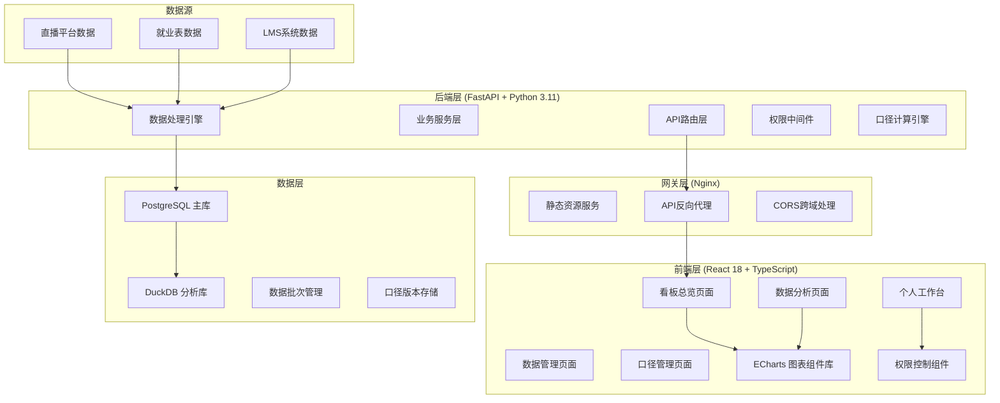
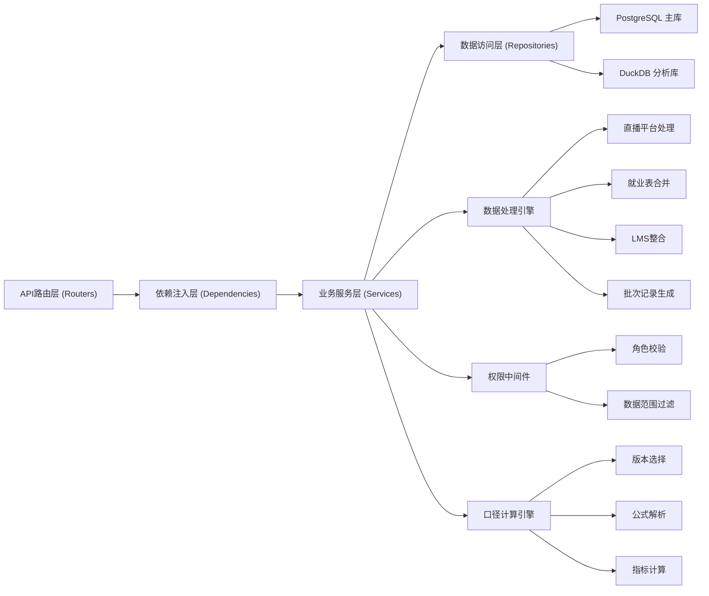
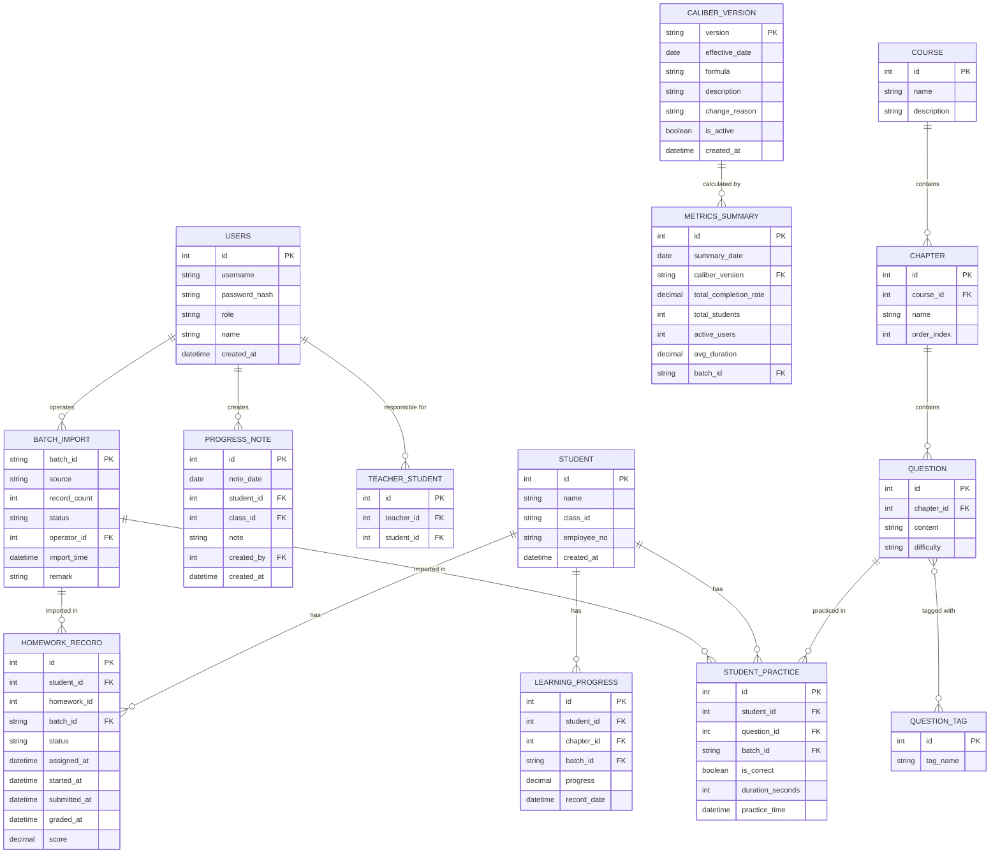

## 1. 架构设计



## 2. 技术描述

### 2.1 技术选型
| 层级 | 技术栈 | 版本 | 说明 |
|------|--------|------|------|
| 前端 | React | 18.x | 组件化开发框架 |
| 前端 | TypeScript | 5.x | 类型安全 |
| 前端 | Vite | 5.x | 构建工具 |
| 前端 | TailwindCSS | 3.x | CSS框架 |
| 前端 | ECharts | 5.x | 数据可视化 |
| 前端 | React Router | 6.x | 路由管理 |
| 前端 | Zustand | 4.x | 状态管理 |
| 后端 | FastAPI | 0.109.x | API框架 |
| 后端 | Python | 3.11 | 运行时 |
| 后端 | SQLAlchemy | 2.x | ORM框架 |
| 后端 | Alembic | 1.x | 数据库迁移 |
| 数据库 | PostgreSQL | 15.x | 主数据存储 |
| 数据库 | DuckDB | 0.10.x | 在线分析处理 |
| 认证 | python-jose | 3.x | JWT认证 |

### 2.2 架构原则
- **分层架构**：前端展示层 → API网关 → 业务逻辑层 → 数据访问层
- **读写分离**：PostgreSQL处理事务性读写，DuckDB提供高性能分析查询
- **数据可追溯**：所有数据操作带批次号，口径版本化管理
- **权限前置**：API层统一鉴权，数据按角色范围过滤

## 3. 路由定义

| 路由 | 页面 | 权限要求 | 说明 |
|------|------|----------|------|
| `/` | 数据总览 | 所有登录用户 | 核心指标卡片和趋势图 |
| `/analysis` | 数据分析 | 所有登录用户 | 四大分析图表 |
| `/import` | 数据导入 | 管理员/管理层 | 批次管理和数据导入 |
| `/caliber` | 口径管理 | 管理员/管理层 | 完成率口径版本管理 |
| `/workbench` | 个人工作台 | 一线教师 | 仅展示权限范围内数据 |
| `/login` | 登录页 | 公开 | 用户认证 |

## 4. API 定义

### 4.1 认证接口
```typescript
interface LoginRequest {
  username: string;
  password: string;
}

interface LoginResponse {
  accessToken: string;
  user: {
    id: number;
    username: string;
    role: 'admin' | 'manager' | 'teacher';
    name: string;
  };
}

// POST /api/auth/login
```

### 4.2 看板数据接口
```typescript
interface OverviewMetrics {
  totalStudents: number;
  totalCompletionRate: number;
  avgPracticeDuration: number;
  todayActiveUsers: number;
  completionRateChange: number;
  practiceCountChange: number;
}

interface TrendDataPoint {
  date: string;
  completionRate: number;
  practiceCount: number;
}

interface TrendResponse {
  data: TrendDataPoint[];
  timeRange: string;
}

// GET /api/dashboard/overview
// GET /api/dashboard/trend?days=30
```

### 4.3 分析数据接口
```typescript
interface ChapterDistribution {
  courseName: string;
  chapterName: string;
  questionCount: number;
  completedCount: number;
  completionRate: number;
}

interface FunnelStage {
  stage: string;
  value: number;
  conversionRate: number;
}

interface TagRank {
  tagName: string;
  practiceCount: number;
  correctRate: number;
}

interface ProgressTrend {
  date: string;
  className: string;
  progress: number;
}

// GET /api/analysis/chapter-distribution
// GET /api/analysis/homework-funnel
// GET /api/analysis/tag-ranking
// GET /api/analysis/progress-trend
```

### 4.4 数据导入接口
```typescript
interface ImportBatch {
  batchId: string;
  importTime: string;
  source: 'live' | 'employment' | 'lms';
  recordCount: number;
  status: 'pending' | 'processing' | 'success' | 'failed';
  operator: string;
  remark?: string;
}

interface ImportRequest {
  source: string;
  file?: File;
  remark?: string;
}

// GET /api/import/batches
// POST /api/import/trigger
// POST /api/import/rollback/{batchId}
```

### 4.5 口径管理接口
```typescript
interface CaliberVersion {
  version: string;
  effectiveDate: string;
  formula: string;
  description: string;
  changeReason: string;
  isActive: boolean;
  createdAt: string;
}

// GET /api/caliber/versions
// POST /api/caliber/versions
// PUT /api/caliber/versions/{version}/activate
```

### 4.6 注释接口
```typescript
interface ProgressNote {
  id: number;
  date: string;
  studentId?: number;
  classId?: number;
  note: string;
  createdBy: string;
  createdAt: string;
}

// POST /api/notes
// GET /api/notes?date=xxx
```

## 5. 服务端架构



## 6. 数据模型

### 6.1 数据模型ER图


### 6.2 DDL 语句

```sql
-- PostgreSQL DDL
CREATE EXTENSION IF NOT EXISTS "uuid-ossp";

-- 用户表
CREATE TABLE users (
    id SERIAL PRIMARY KEY,
    username VARCHAR(50) UNIQUE NOT NULL,
    password_hash VARCHAR(255) NOT NULL,
    role VARCHAR(20) NOT NULL CHECK (role IN ('admin', 'manager', 'teacher')),
    name VARCHAR(100) NOT NULL,
    created_at TIMESTAMP DEFAULT CURRENT_TIMESTAMP
);

-- 学员表
CREATE TABLE students (
    id SERIAL PRIMARY KEY,
    name VARCHAR(100) NOT NULL,
    class_id VARCHAR(50),
    employee_no VARCHAR(50),
    created_at TIMESTAMP DEFAULT CURRENT_TIMESTAMP
);

-- 教师-学员关联表
CREATE TABLE teacher_student (
    id SERIAL PRIMARY KEY,
    teacher_id INTEGER REFERENCES users(id),
    student_id INTEGER REFERENCES students(id),
    UNIQUE(teacher_id, student_id)
);

-- 课程表
CREATE TABLE courses (
    id SERIAL PRIMARY KEY,
    name VARCHAR(200) NOT NULL,
    description TEXT
);

-- 章节表
CREATE TABLE chapters (
    id SERIAL PRIMARY KEY,
    course_id INTEGER REFERENCES courses(id),
    name VARCHAR(200) NOT NULL,
    order_index INTEGER NOT NULL
);

-- 题目表
CREATE TABLE questions (
    id SERIAL PRIMARY KEY,
    chapter_id INTEGER REFERENCES chapters(id),
    content TEXT NOT NULL,
    difficulty VARCHAR(20) CHECK (difficulty IN ('easy', 'medium', 'hard'))
);

-- 题目标签表
CREATE TABLE question_tags (
    id SERIAL PRIMARY KEY,
    tag_name VARCHAR(50) UNIQUE NOT NULL
);

-- 题目-标签关联表
CREATE TABLE question_tag_relation (
    question_id INTEGER REFERENCES questions(id),
    tag_id INTEGER REFERENCES question_tags(id),
    PRIMARY KEY (question_id, tag_id)
);

-- 数据导入批次表
CREATE TABLE batch_import (
    batch_id VARCHAR(50) PRIMARY KEY DEFAULT uuid_generate_v4()::varchar,
    source VARCHAR(20) NOT NULL CHECK (source IN ('live', 'employment', 'lms')),
    record_count INTEGER DEFAULT 0,
    status VARCHAR(20) NOT NULL DEFAULT 'pending' CHECK (status IN ('pending', 'processing', 'success', 'failed')),
    operator_id INTEGER REFERENCES users(id),
    import_time TIMESTAMP DEFAULT CURRENT_TIMESTAMP,
    remark TEXT,
    error_log TEXT
);

-- 学员练习记录表
CREATE TABLE student_practice (
    id SERIAL PRIMARY KEY,
    student_id INTEGER REFERENCES students(id),
    question_id INTEGER REFERENCES questions(id),
    batch_id VARCHAR(50) REFERENCES batch_import(batch_id),
    is_correct BOOLEAN,
    duration_seconds INTEGER,
    practice_time TIMESTAMP NOT NULL,
    created_at TIMESTAMP DEFAULT CURRENT_TIMESTAMP
);

-- 作业记录表
CREATE TABLE homework_records (
    id SERIAL PRIMARY KEY,
    student_id INTEGER REFERENCES students(id),
    homework_id INTEGER NOT NULL,
    batch_id VARCHAR(50) REFERENCES batch_import(batch_id),
    status VARCHAR(20) NOT NULL CHECK (status IN ('assigned', 'started', 'submitted', 'graded', 'passed')),
    assigned_at TIMESTAMP,
    started_at TIMESTAMP,
    submitted_at TIMESTAMP,
    graded_at TIMESTAMP,
    score DECIMAL(5,2),
    created_at TIMESTAMP DEFAULT CURRENT_TIMESTAMP
);

-- 学习进度表
CREATE TABLE learning_progress (
    id SERIAL PRIMARY KEY,
    student_id INTEGER REFERENCES students(id),
    chapter_id INTEGER REFERENCES chapters(id),
    batch_id VARCHAR(50) REFERENCES batch_import(batch_id),
    progress DECIMAL(5,2) NOT NULL,
    record_date DATE NOT NULL,
    created_at TIMESTAMP DEFAULT CURRENT_TIMESTAMP
);

-- 口径版本表
CREATE TABLE caliber_versions (
    version VARCHAR(20) PRIMARY KEY,
    effective_date DATE NOT NULL,
    formula TEXT NOT NULL,
    description TEXT,
    change_reason TEXT,
    is_active BOOLEAN DEFAULT FALSE,
    created_at TIMESTAMP DEFAULT CURRENT_TIMESTAMP
);

-- 指标汇总表
CREATE TABLE metrics_summary (
    id SERIAL PRIMARY KEY,
    summary_date DATE NOT NULL,
    caliber_version VARCHAR(20) REFERENCES caliber_versions(version),
    total_completion_rate DECIMAL(5,2),
    total_students INTEGER,
    active_users INTEGER,
    avg_duration INTEGER,
    batch_id VARCHAR(50) REFERENCES batch_import(batch_id),
    created_at TIMESTAMP DEFAULT CURRENT_TIMESTAMP,
    UNIQUE(summary_date, caliber_version)
);

-- 进度注释表
CREATE TABLE progress_notes (
    id SERIAL PRIMARY KEY,
    note_date DATE NOT NULL,
    student_id INTEGER REFERENCES students(id),
    class_id VARCHAR(50),
    note TEXT NOT NULL,
    created_by INTEGER REFERENCES users(id),
    created_at TIMESTAMP DEFAULT CURRENT_TIMESTAMP
);

-- 索引优化
CREATE INDEX idx_practice_student_time ON student_practice(student_id, practice_time);
CREATE INDEX idx_practice_batch ON student_practice(batch_id);
CREATE INDEX idx_homework_batch ON homework_records(batch_id);
CREATE INDEX idx_progress_date ON learning_progress(record_date);
CREATE INDEX idx_batch_time ON batch_import(import_time DESC);
```

### 6.3 DuckDB 分析视图
```sql
-- DuckDB 中的分析视图，用于加速查询
CREATE VIEW v_chapter_distribution AS
SELECT 
    c.name as course_name,
    ch.name as chapter_name,
    COUNT(q.id) as question_count,
    COUNT(DISTINCT CASE WHEN sp.is_correct THEN sp.student_id END) as completed_count,
    ROUND(
        COUNT(DISTINCT CASE WHEN sp.is_correct THEN sp.student_id END)::DECIMAL 
        / NULLIF(COUNT(DISTINCT sp.student_id), 0) * 100, 
    2) as completion_rate
FROM chapters ch
JOIN courses c ON ch.course_id = c.id
JOIN questions q ON q.chapter_id = ch.id
LEFT JOIN student_practice sp ON sp.question_id = q.id
GROUP BY c.name, ch.name, ch.order_index
ORDER BY c.name, ch.order_index;

CREATE VIEW v_homework_funnel AS
SELECT 
    stage,
    value,
    ROUND(value::DECIMAL / LAG(value, 1, value) OVER (ORDER BY stage_order) * 100, 2) as conversion_rate
FROM (
    SELECT 'assigned' as stage, 1 as stage_order, COUNT(*) as value FROM homework_records WHERE status IS NOT NULL
    UNION ALL
    SELECT 'started', 2, COUNT(*) FROM homework_records WHERE started_at IS NOT NULL
    UNION ALL
    SELECT 'submitted', 3, COUNT(*) FROM homework_records WHERE submitted_at IS NOT NULL
    UNION ALL
    SELECT 'graded', 4, COUNT(*) FROM homework_records WHERE graded_at IS NOT NULL
    UNION ALL
    SELECT 'passed', 5, COUNT(*) FROM homework_records WHERE status = 'passed'
) t
ORDER BY stage_order;
```
