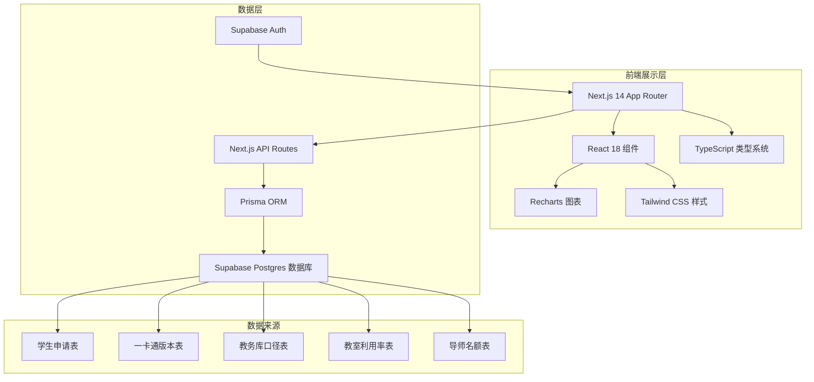
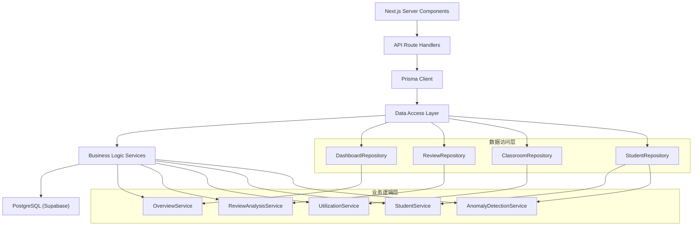
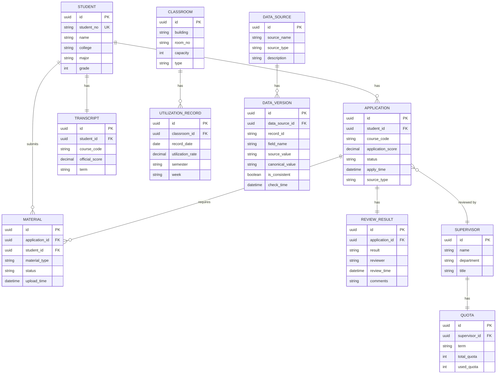

## 1. 架构设计



## 2. 技术描述

- **前端框架**：Next.js 14 (App Router) + React 18
- **初始化工具**：create-next-app@latest
- **UI 样式**：Tailwind CSS 3.4
- **图表库**：Recharts 2.10
- **类型系统**：TypeScript 5.3
- **ORM**：Prisma 5.8
- **数据库**：PostgreSQL 15 (Supabase托管)
- **认证**：Supabase Auth
- **部署**：Vercel (Next.js) + Supabase (数据库)

## 3. 路由定义

| 路由 | 页面类型 | 功能描述 |
|------|----------|----------|
| `/` | Server Component | 总览看板 - KPI指标、趋势概览、异常预警 |
| `/review-analysis` | Server Component | 成绩复核分析 - 多源对照、材料缺失、原因分布 |
| `/classroom-utilization` | Server Component | 教室利用率分析 - 同环比对比、改善复盘、排名 |
| `/student-list` | Server Component | 学生名单总览 - 列表、联动筛选、详情抽屉 |
| `/api/dashboard/overview` | API Route | 获取总览看板核心数据 |
| `/api/dashboard/trend` | API Route | 获取复核趋势数据 |
| `/api/review/multi-source` | API Route | 获取多源数据对照 |
| `/api/review/material-gap` | API Route | 获取材料缺失数据 |
| `/api/classroom/comparison` | API Route | 获取同环比目标对比数据 |
| `/api/classroom/improvement` | API Route | 获取改善效果复盘数据 |
| `/api/students/list` | API Route | 获取学生列表（支持筛选） |
| `/api/students/[id]` | API Route | 获取学生详情 |
| `/api/anomalies/explanation` | API Route | 获取异常点解释数据 |

## 4. API 类型定义

```typescript
// 核心指标
interface KPIData {
  totalApplications: number;
  passedApplications: number;
  passRate: number;
  missingMaterials: number;
  classroomUtilization: number;
  utilizationYoY: number;
  utilizationMoM: number;
}

// 趋势数据点
interface TrendDataPoint {
  month: string;
  applications: number;
  passed: number;
  missingMaterials: number;
  gapAmount: number;
  isAnomaly: boolean;
  anomalyReason?: string;
}

// 多源数据对照
interface MultiSourceData {
  studentId: string;
  studentName: string;
  application: {
    score: number;
    applyTime: string;
    status: string;
  };
  campusCard: {
    score: number;
    checkTime: string;
    status: string;
  };
  academicSystem: {
    score: number;
    recordTime: string;
    status: string;
  };
  isConsistent: boolean;
  inconsistencyFields: string[];
}

// 教室利用率对比
interface UtilizationComparison {
  semester: string;
  current: number;
  yearOnYear: number;
  monthOnMonth: number;
  target: number;
  improvementMeasure?: string;
  isImproved: boolean;
}

// 学生信息
interface StudentInfo {
  id: string;
  name: string;
  studentNo: string;
  college: string;
  major: string;
  grade: number;
  transcriptScore: number;
  applicationStatus: 'pending' | 'approved' | 'rejected' | 'materials_missing';
  reviewResult?: 'passed' | 'failed';
  applyDate: string;
  materials: MaterialItem[];
  supervisorQuota?: {
    used: number;
    total: number;
    available: number;
  };
}

interface MaterialItem {
  name: string;
  type: string;
  status: 'submitted' | 'missing' | 'verified';
  uploadTime?: string;
}

// 异常点解释
interface AnomalyExplanation {
  dataPointId: string;
  period: string;
  anomalyValue: number;
  expectedValue: number;
  deviation: number;
  supervisorQuotaImpact: {
    expectedQuota: number;
    actualQuota: number;
    impactDescription: string;
  };
  otherFactors: string[];
}
```

## 5. 服务端架构图



## 6. 数据模型

### 6.1 数据模型定义 (ER图)



### 6.2 Prisma Schema 定义

```prisma
// prisma/schema.prisma
generator client {
  provider = "prisma-client-js"
}

datasource db {
  provider = "postgresql"
  url      = env("DATABASE_URL")
}

model Student {
  id         String   @id @default(uuid())
  studentNo  String   @unique @map("student_no")
  name       String
  college    String
  major      String
  grade      Int
  createdAt  DateTime @default(now())
  updatedAt  DateTime @updatedAt
  
  applications Application[]
  transcript   Transcript[]
  materials    Material[]
  
  @@map("students")
}

model Application {
  id               String              @id @default(uuid())
  studentId        String              @map("student_id")
  courseCode       String              @map("course_code")
  applicationScore Decimal             @map("application_score")
  status           ApplicationStatus
  applyTime        DateTime            @map("apply_time")
  sourceType       String              @map("source_type")
  createdAt        DateTime            @default(now())
  updatedAt        DateTime            @updatedAt
  
  student      Student        @relation(fields: [studentId], references: [id])
  materials    Material[]
  reviewResult ReviewResult?
  supervisor   Supervisor?    @relation(fields: [supervisorId], references: [id])
  supervisorId String?        @map("supervisor_id")
  
  @@map("applications")
}

enum ApplicationStatus {
  PENDING
  APPROVED
  REJECTED
  MATERIALS_MISSING
}

model Transcript {
  id             String   @id @default(uuid())
  studentId      String   @map("student_id")
  courseCode     String   @map("course_code")
  officialScore  Decimal  @map("official_score")
  term           String
  createdAt      DateTime @default(now())
  
  student Student @relation(fields: [studentId], references: [id])
  
  @@map("transcripts")
}

model Material {
  id            String         @id @default(uuid())
  applicationId String         @map("application_id")
  studentId     String         @map("student_id")
  materialType  String         @map("material_type")
  status        MaterialStatus
  uploadTime    DateTime?      @map("upload_time")
  createdAt     DateTime       @default(now())
  
  application Application @relation(fields: [applicationId], references: [id])
  student     Student     @relation(fields: [studentId], references: [id])
  
  @@map("materials")
}

enum MaterialStatus {
  SUBMITTED
  MISSING
  VERIFIED
}

model ReviewResult {
  id            String       @id @default(uuid())
  applicationId String       @unique @map("application_id")
  result        ReviewStatus
  reviewer      String
  reviewTime    DateTime     @map("review_time")
  comments      String?
  createdAt     DateTime     @default(now())
  
  application Application @relation(fields: [applicationId], references: [id])
  
  @@map("review_results")
}

enum ReviewStatus {
  PASSED
  FAILED
}

model Supervisor {
  id         String   @id @default(uuid())
  name       String
  department String
  title      String
  createdAt  DateTime @default(now())
  
  applications Application[]
  quotas       Quota[]
  
  @@map("supervisors")
}

model Quota {
  id             String   @id @default(uuid())
  supervisorId   String   @map("supervisor_id")
  term           String
  totalQuota     Int      @map("total_quota")
  usedQuota      Int      @map("used_quota")
  createdAt      DateTime @default(now())
  updatedAt      DateTime @updatedAt
  
  supervisor Supervisor @relation(fields: [supervisorId], references: [id])
  
  @@map("quotas")
  @@unique([supervisorId, term])
}

model Classroom {
  id       String   @id @default(uuid())
  building String
  roomNo   String   @map("room_no")
  capacity Int
  type     String
  createdAt DateTime @default(now())
  
  utilizationRecords UtilizationRecord[]
  
  @@map("classrooms")
}

model UtilizationRecord {
  id              String  @id @default(uuid())
  classroomId     String  @map("classroom_id")
  recordDate      DateTime @map("record_date")
  utilizationRate Decimal @map("utilization_rate")
  semester        String
  week            String
  createdAt       DateTime @default(now())
  
  classroom Classroom @relation(fields: [classroomId], references: [id])
  
  @@map("utilization_records")
}

model DataSource {
  id          String        @id @default(uuid())
  sourceName  String        @map("source_name")
  sourceType  String        @map("source_type")
  description String?
  createdAt   DateTime      @default(now())
  
  dataVersions DataVersion[]
  
  @@map("data_sources")
}

model DataVersion {
  id           String   @id @default(uuid())
  dataSourceId String   @map("data_source_id")
  recordId     String   @map("record_id")
  fieldName    String   @map("field_name")
  sourceValue  String   @map("source_value")
  canonicalValue String  @map("canonical_value")
  isConsistent Boolean  @map("is_consistent")
  checkTime    DateTime @map("check_time")
  createdAt    DateTime @default(now())
  
  dataSource DataSource @relation(fields: [dataSourceId], references: [id])
  
  @@map("data_versions")
}
```

### 6.3 初始化数据

```sql
-- 初始化数据源
INSERT INTO data_sources (id, source_name, source_type, description) VALUES
(gen_random_uuid(), '学生申请表', 'application', '学生提交的成绩复核申请表'),
(gen_random_uuid(), '一卡通版本', 'campus_card', '校园一卡通系统数据版本'),
(gen_random_uuid(), '教务库口径', 'academic_system', '教务管理系统官方数据');

-- 初始化导师数据
INSERT INTO supervisors (id, name, department, title) VALUES
(gen_random_uuid(), '张教授', '计算机学院', '教授'),
(gen_random_uuid(), '李教授', '计算机学院', '副教授'),
(gen_random_uuid(), '王教授', '数学学院', '教授'),
(gen_random_uuid(), '刘教授', '物理学院', '副教授');

-- 初始化导师名额
INSERT INTO quotas (id, supervisor_id, term, total_quota, used_quota) VALUES
(gen_random_uuid(), (SELECT id FROM supervisors WHERE name = '张教授'), '2024-2025-1', 30, 28),
(gen_random_uuid(), (SELECT id FROM supervisors WHERE name = '李教授'), '2024-2025-1', 25, 25),
(gen_random_uuid(), (SELECT id FROM supervisors WHERE name = '王教授'), '2024-2025-1', 20, 15),
(gen_random_uuid(), (SELECT id FROM supervisors WHERE name = '刘教授'), '2024-2025-1', 25, 22);

-- 初始化教室数据
INSERT INTO classrooms (id, building, room_no, capacity, type) VALUES
(gen_random_uuid(), '教学楼A', '101', 120, '多媒体教室'),
(gen_random_uuid(), '教学楼A', '102', 80, '普通教室'),
(gen_random_uuid(), '教学楼B', '201', 60, '实验室'),
(gen_random_uuid(), '教学楼B', '202', 150, '阶梯教室');
```
