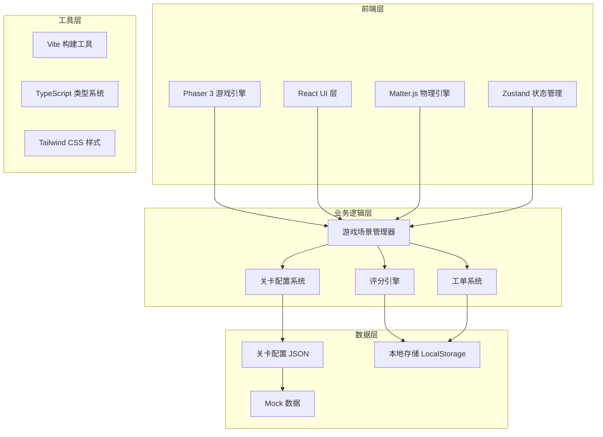

## 1. 架构设计



## 2. 技术描述

- **前端框架**：React 18 + TypeScript 5
- **游戏引擎**：Phaser 3.70+
- **物理引擎**：Matter.js 0.19+
- **构建工具**：Vite 5
- **状态管理**：Zustand 4
- **样式方案**：Tailwind CSS 3
- **图标库**：Lucide React
- **数据持久化**：LocalStorage
- **后端**：无（纯前端游戏，数据本地存储）

## 3. 路由定义

| 路由 | 页面/场景 | 用途 |
|------|----------|------|
| / | 主菜单页 | 关卡选择、游戏设置 |
| /loading | 加载场景 | 资源加载、进度展示 |
| /game/inspection | 巡检观察场景 | 观察巡检路线、记忆测试 |
| /game/contract | 合同审批场景 | 处理租户合同、审批决策 |
| /game/meter | 水电核算场景 | 水电读数、费用计算 |
| /review | 复盘页 | 决策记录、数据分析 |

## 4. 核心数据结构

### 4.1 关卡配置类型定义

```typescript
interface LevelConfig {
  id: string;
  name: string;
  description: string;
  difficulty: 1 | 2 | 3 | 4 | 5;
  timeLimit: number;
  
  // 巡检阶段参数
  inspection: {
    mapLayout: string;
    patrolPoints: PatrolPoint[];
    patrolRoute: number[];
    observeTime: number;
    memoryTest: boolean;
  };
  
  // 合同审批参数
  contracts: {
    tenants: Tenant[];
    approvalOptions: ApprovalOption[];
    correctAnswers: Record<string, string>;
    timePerContract: number;
  };
  
  // 水电核算参数
  meters: {
    waterMeters: MeterReading[];
    electricMeters: MeterReading[];
    unitPrices: {
      water: number;
      electricity: number;
    };
    tolerance: number;
  };
  
  // 工单系统参数
  workOrders: {
    enabled: boolean;
    orders: WorkOrder[];
    timeout: number;
    retryPenalty: number;
  };
  
  // 评分权重
  scoring: {
    inspectionWeight: number;
    contractWeight: number;
    meterWeight: number;
    speedBonus: number;
    accuracyBonus: number;
  };
}

interface PatrolPoint {
  id: string;
  x: number;
  y: number;
  name: string;
  description: string;
}

interface Tenant {
  id: string;
  name: string;
  type: 'office' | 'retail' | 'restaurant' | 'warehouse';
  area: number;
  rentOffer: number;
  contractTerm: number;
  deposit: number;
  businessScope: string;
  creditRating: 'A' | 'B' | 'C';
  specialRequirements?: string;
}

interface ApprovalOption {
  id: string;
  label: string;
  type: 'approve' | 'reject' | 'negotiate' | 'escalate';
  requiresComment: boolean;
}

interface MeterReading {
  id: string;
  tenantId: string;
  previousReading: number;
  currentReading: number;
  displayValue: number;
  tolerance: number;
}

interface WorkOrder {
  id: string;
  type: 'repair' | 'complaint' | 'maintenance' | 'emergency';
  title: string;
  description: string;
  urgency: 'low' | 'medium' | 'high' | 'critical';
  triggerAt: number;
  options: WorkOrderOption[];
  correctOptionId: string;
}

interface WorkOrderOption {
  id: string;
  label: string;
  description: string;
}
```

### 4.2 游戏状态类型定义

```typescript
interface GameState {
  currentLevelId: string | null;
  currentPhase: 'menu' | 'loading' | 'inspection' | 'contract' | 'meter' | 'review';
  score: number;
  startTime: number;
  phaseStartTime: number;
  
  // 巡检阶段状态
  inspection: {
    observed: boolean;
    playerRoute: number[];
    score: number;
  };
  
  // 合同审批状态
  contracts: {
    currentIndex: number;
    decisions: Record<string, ContractDecision>;
    score: number;
  };
  
  // 水电核算状态
  meters: {
    readings: Record<string, number>;
    score: number;
  };
  
  // 工单状态
  workOrders: {
    activeOrders: WorkOrder[];
    completedOrders: WorkOrderResult[];
    timeoutCount: number;
  };
  
  // 历史记录
  history: GameHistory;
}

interface ContractDecision {
  tenantId: string;
  optionId: string;
  comment: string;
  timeSpent: number;
  isCorrect: boolean;
}

interface WorkOrderResult {
  orderId: string;
  optionId: string;
  responseTime: number;
  isCorrect: boolean;
  retried: boolean;
}

interface GameHistory {
  decisions: HistoryEntry[];
  totalTime: number;
  finalScore: number;
  timestamp: number;
}

interface HistoryEntry {
  phase: string;
  action: string;
  time: number;
  correct: boolean;
  details: Record<string, unknown>;
}
```

## 5. 目录结构

```
MP0277/
├── src/
│   ├── components/          # React 组件
│   │   ├── ui/              # 基础 UI 组件
│   │   │   ├── Button.tsx
│   │   │   ├── ProgressBar.tsx
│   │   │   ├── Card.tsx
│   │   │   └── Modal.tsx
│   │   ├── game/            # 游戏相关组件
│   │   │   ├── LevelCard.tsx
│   │   │   ├── TenantCard.tsx
│   │   │   ├── MeterDisplay.tsx
│   │   │   ├── WorkOrderPanel.tsx
│   │   │   └── Timeline.tsx
│   │   └── layout/          # 布局组件
│   │       ├── Header.tsx
│   │       └── GameContainer.tsx
│   ├── scenes/              # Phaser 场景
│   │   ├── BootScene.ts
│   │   ├── LoadScene.ts
│   │   ├── InspectionScene.ts
│   │   └── GameUIScene.ts
│   ├── store/               # Zustand 状态管理
│   │   ├── useGameStore.ts
│   │   └── useSettingsStore.ts
│   ├── types/               # TypeScript 类型定义
│   │   ├── game.ts
│   │   ├── level.ts
│   │   └── index.ts
│   ├── data/                # 关卡配置和数据
│   │   ├── levels/
│   │   │   ├── level1.json
│   │   │   └── level2.json
│   │   └── mockData.ts
│   ├── utils/               # 工具函数
│   │   ├── scoring.ts
│   │   ├── validation.ts
│   │   └── storage.ts
│   ├── hooks/               # React Hooks
│   │   ├── useKeyboard.ts
│   │   ├── useTimer.ts
│   │   └── useWorkOrder.ts
│   ├── pages/               # 页面组件
│   │   ├── MainMenu.tsx
│   │   ├── LoadingPage.tsx
│   │   ├── InspectionPage.tsx
│   │   ├── ContractPage.tsx
│   │   ├── MeterPage.tsx
│   │   └── ReviewPage.tsx
│   ├── App.tsx
│   ├── main.tsx
│   └── index.css
├── public/                  # 静态资源
│   ├── assets/
│   │   ├── images/
│   │   └── sprites/
│   └── favicon.ico
├── api/                     # 后端 API（预留）
├── .trae/
│   └── documents/
│       ├── PRD.md
│       └── TECHNICAL_ARCHITECTURE.md
├── package.json
├── tsconfig.json
├── vite.config.ts
├── tailwind.config.js
└── postcss.config.js
```

## 6. 关键技术实现点

### 6.1 Phaser + React 集成

使用 `@phaserjs/react` 或自定义桥接层实现 Phaser 游戏场景与 React UI 的协同工作，通过 Zustand 共享游戏状态。

### 6.2 关卡可扩展配置系统

所有关卡参数通过 JSON 文件配置，支持热加载，新增训练题和场景只需添加新的 JSON 配置文件。

### 6.3 双操作支持系统

- 触屏：按钮点击、滑动手势、长按操作
- 键盘：WASD/方向键移动、数字键 1-4 快速选择、Enter 确认、Esc 取消

### 6.4 工单超时机制

使用 `setTimeout` 和游戏循环双重计时，超时后自动重置状态，记录超时次数并应用扣分。

### 6.5 复盘数据可视化

使用 Canvas 或轻量图表库绘制报修响应时间趋势图，对比历史成绩。
