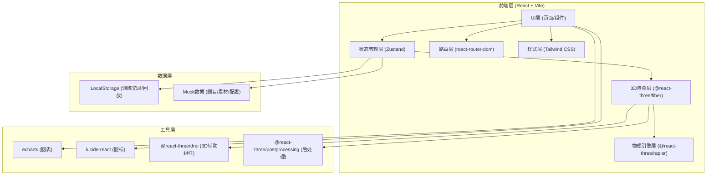
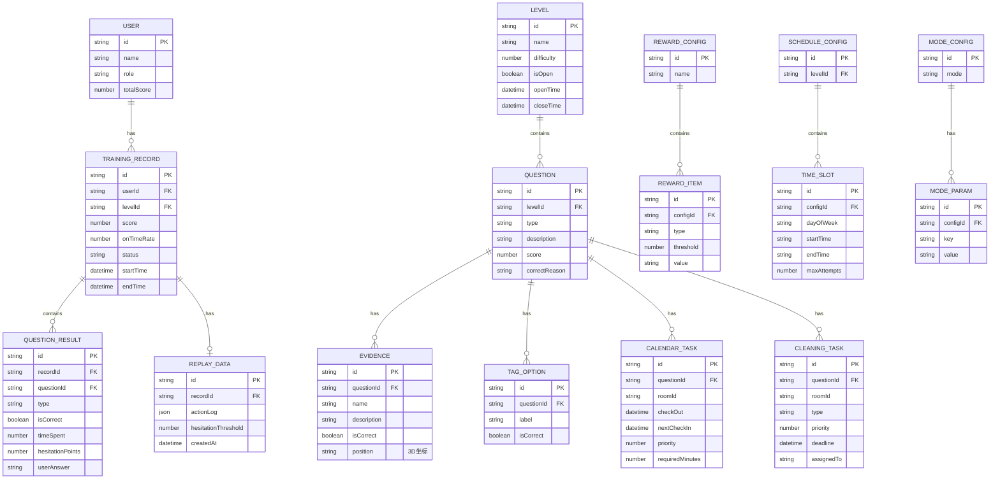

## 1. 架构设计



## 2. 技术栈说明

- **前端框架**：React@18 + TypeScript@5
- **构建工具**：Vite@5
- **3D渲染**：three@0.160 + @react-three/fiber@8 + @react-three/drei@9
- **物理引擎**：@react-three/rapier@0.22
- **后处理**：@react-three/postprocessing@2
- **状态管理**：zustand@4
- **路由**：react-router-dom@6
- **样式**：tailwindcss@3 + postcss + autoprefixer
- **图表**：echarts@5 + echarts-for-react
- **图标**：lucide-react
- **数据持久化**：LocalStorage（封装工具类）
- **后端**：无（纯前端，使用Mock数据）

## 3. 路由定义

| 路由 | 页面 | 说明 |
|------|------|------|
| `/` | HomePage | 首页大厅 |
| `/training/:levelId` | TrainingPage | 训练关卡页（含四类题目） |
| `/records` | RecordsPage | 训练记录与成绩统计 |
| `/replay/:recordId` | ReplayPage | 失败回放页 |
| `/config` | ConfigPage | 配置中心（管理员） |
| `/config/questions` | ConfigQuestionsPage | 题目管理 |
| `/config/assets` | ConfigAssetsPage | 素材管理 |
| `/config/rewards` | ConfigRewardsPage | 奖励配置 |
| `/config/schedule` | ConfigSchedulePage | 开放时间配置 |
| `/config/modes` | ConfigModesPage | 训练模式配置 |

## 4. 数据模型

### 4.1 ER图



### 4.2 Zustand Store 划分

| Store | 职责 | 核心State |
|-------|------|-----------|
| `useUserStore` | 用户信息 | user, role, login/logout |
| `useLevelStore` | 关卡管理 | levels, currentLevel, fetchLevels |
| `useTrainingStore` | 训练状态 | currentQuestionIndex, answers, score, startTimer, pauseTimer, submitAnswer |
| `useRecordsStore` | 训练记录 | records, stats, fetchRecords, getOnTimeRate |
| `useReplayStore` | 回放数据 | replays, currentReplay, playbackState, hesitationPoints |
| `useConfigStore` | 配置管理 | questions, assets, rewards, schedules, modes, CRUD方法 |
| `useSceneStore` | 3D场景状态 | cameraMode, selectedEvidence, highlightedObjects |

### 4.3 LocalStorage 键定义

| Key | 数据类型 | 说明 |
|-----|----------|------|
| `bnb_user` | User | 当前登录用户 |
| `bnb_records` | TrainingRecord[] | 训练记录列表（最多100条） |
| `bnb_replays` | ReplayData[] | 失败回放（最多3条/关卡） |
| `bnb_config` | ConfigBundle | 配置数据（题目/素材/奖励等） |

## 5. 目录结构

```
MP0378/
├── src/
│   ├── components/
│   │   ├── ui/                 # 通用UI组件（Button, Card, Modal等）
│   │   ├── three/              # 3D组件（Room, Cleaner, EvidencePoint等）
│   │   ├── training/           # 训练相关组件（EvidencePanel, TagSelector等）
│   │   ├── records/            # 记录相关组件（StatsChart, RecordList等）
│   │   ├── replay/             # 回放组件（Timeline, HesitationMarker等）
│   │   └── config/             # 配置相关组件（QuestionForm, AssetUpload等）
│   ├── pages/
│   │   ├── HomePage.tsx
│   │   ├── TrainingPage.tsx
│   │   ├── RecordsPage.tsx
│   │   ├── ReplayPage.tsx
│   │   └── config/
│   │       ├── ConfigPage.tsx
│   │       ├── ConfigQuestionsPage.tsx
│   │       ├── ConfigAssetsPage.tsx
│   │       ├── ConfigRewardsPage.tsx
│   │       ├── ConfigSchedulePage.tsx
│   │       └── ConfigModesPage.tsx
│   ├── stores/                 # Zustand stores
│   │   ├── useUserStore.ts
│   │   ├── useLevelStore.ts
│   │   ├── useTrainingStore.ts
│   │   ├── useRecordsStore.ts
│   │   ├── useReplayStore.ts
│   │   ├── useConfigStore.ts
│   │   └── useSceneStore.ts
│   ├── hooks/                  # 自定义hooks
│   │   ├── useTimer.ts
│   │   ├── useHesitation.ts
│   │   ├── useCollision.ts
│   │   └── useLocalStorage.ts
│   ├── utils/                  # 工具函数
│   │   ├── storage.ts
│   │   ├── scoring.ts
│   │   ├── calendar.ts
│   │   └── mockData.ts
│   ├── types/                  # TypeScript类型定义
│   │   ├── index.ts
│   │   ├── training.ts
│   │   ├── records.ts
│   │   ├── replay.ts
│   │   └── config.ts
│   ├── styles/
│   │   └── globals.css         # Tailwind + 自定义样式
│   ├── App.tsx
│   ├── main.tsx
│   └── router.tsx
├── public/
│   └── assets/                 # 静态资源（3D贴图、图标等）
├── index.html
├── package.json
├── vite.config.ts
├── tsconfig.json
├── tailwind.config.js
├── postcss.config.js
└── .trae/
    └── documents/
        ├── PRD.md
        └── TECHNICAL_ARCHITECTURE.md
```

## 6. 核心技术实现说明

### 6.1 3D场景实现
- 使用 `@react-three/fiber` 声明式构建3D场景
- 房源模型：程序化构建低多边形房间（BoxGeometry组合墙体、地板、家具）
- 证据点：使用 `Mesh` + `emissive` 材质配合 `useFrame` 实现脉冲发光动画
- 物理交互：`@react-three/rapier` 的 `RigidBody` + `Collider` 实现保洁员角色碰撞与物体拾取
- 相机控制：drei 的 `OrbitControls`（首页/观察模式）和 `PointerLockControls`（第一人称模式）
- 后处理：`EffectComposer` + `Bloom` + `SSAO` + `Vignette`

### 6.2 犹豫点检测
- 在 `useTrainingStore` 中记录每次操作的 timestamp
- `useHesitation` hook 监控鼠标悬停、选项聚焦时间
- 超过阈值（默认2秒）标记为犹豫点，存入 `QuestionResult.hesitationPoints`
- 回放时根据时间轴渲染犹豫点标记

### 6.3 日历排序与冲突检测
- `calendar.ts` 工具类实现：
  - 时间冲突检测（两任务时间段是否重叠）
  - 人员冲突检测（同一保洁员是否被同时分配）
  - 准备时间检测（退房与入住间隔是否满足保洁时长）
- 拖拽使用 `@dnd-kit/core` 实现2D面板拖拽，3D场景中同步高亮对应房源

### 6.4 回放系统
- 训练过程中通过 `useTrainingStore` 的中间件记录所有 action 到 `actionLog`
- `actionLog` 结构：`{ timestamp, actionType, payload }`
- 回放时 `useReplayStore` 按时间轴逐步 dispatch 相同 action
- 失败回放仅保留最近3条，超出时 FIFO 淘汰

### 6.5 准时率计算
- `scoring.ts` 中实现：
  - 单题准时率 = 是否在推荐时间内完成（0/1）
  - 关卡准时率 = Σ(单题准时率) / 题目数 × 100%
  - 总体准时率 = 所有关卡准时率加权平均（按题目数加权）
