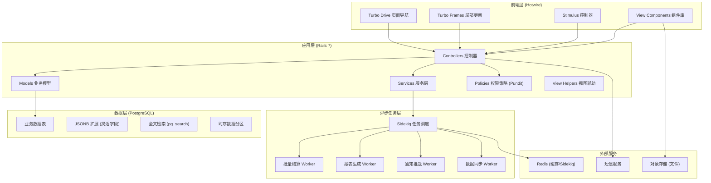
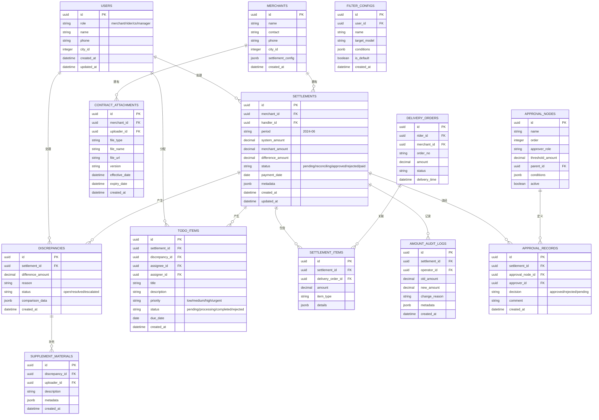

## 1. 架构设计



## 2. 技术描述

### 2.1 核心技术栈

| 层级 | 技术选型 | 版本 | 用途 |
|------|----------|------|------|
| 后端框架 | Ruby on Rails | 7.1+ | MVC 框架，API + 页面渲染 |
| 前端框架 | Hotwire (Turbo + Stimulus) | - | 无 JS 框架的现代交互体验 |
| 组件库 | View Component | 3.0+ | 可复用视图组件 |
| 样式框架 | Tailwind CSS | 3.4+ | 原子化 CSS |
| UI 组件 | Flowbite | 2.0+ | 基于 Tailwind 的组件库 |
| 数据库 | PostgreSQL | 15+ | 关系型数据库，支持 JSONB、全文检索 |
| 异步队列 | Sidekiq | 7.2+ | 异步任务处理 |
| 缓存 | Redis | 7.0+ | 缓存存储 + Sidekiq 后端 |
| 权限管理 | Pundit | 2.3+ | 基于角色的权限控制 |
| 认证 | Devise | 4.9+ | 用户认证系统 |
| 文件存储 | Active Storage | - | 附件上传管理 |
| 图表 | ECharts | 5.4+ | 数据可视化 |

### 2.2 关键设计决策

1. **Hotwire 替代 SPA**：使用 Turbo + Stimulus 实现类 SPA 体验，避免前后端分离复杂度
2. **JSONB 灵活字段**：对账差异、审批记录等非结构化数据使用 JSONB 存储
3. **Service 层解耦**：复杂业务逻辑（结算计算、审批流转）封装在 Service 中
4. **数据库分区**：账单数据表按月份分区，提升查询性能
5. **View Component**：复杂 UI 抽象为可测试、可复用的组件

## 3. 路由定义

```ruby
# config/routes.rb
Rails.application.routes.draw do
  # 认证路由
  devise_for :users, controllers: { sessions: 'users/sessions' }
  
  # 角色根路径重定向
  authenticated :user, ->(u) { u.merchant? } { root to: 'merchant/dashboard#index', as: :merchant_root }
  authenticated :user, ->(u) { u.rider? } { root to: 'rider/dashboard#index', as: :rider_root }
  authenticated :user, ->(u) { u.cs? } { root to: 'cs/dashboard#index', as: :cs_root }
  authenticated :user, ->(u) { u.city_manager? } { root to: 'manager/dashboard#index', as: :manager_root }
  
  root to: 'home#index'
  
  # 结算台主路由
  namespace :cs do
    get 'dashboard', to: 'dashboard#index'
    
    resources :settlements, only: [:index, :show] do
      collection do
        get 'reconciliation' # 对账差异
        get 'discrepancies'  # 差异中心
      end
      member do
        post 'submit_for_approval'
        post 'reject'
        post 'reassign'
        post 'supplement_material'
      end
    end
    
    resources :discrepancies, only: [:index, :show, :update] do
      member do
        post 'resolve'
        post 'escalate'
      end
    end
    
    resources :contract_attachments, only: [:index, :show, :create, :destroy]
    resources :documents, only: [:index, :show] do
      collection do
        get 'export'
      end
    end
    
    resources :todo_items, only: [:index, :update] do
      collection do
        post 'batch_reassign'
      end
    end
    
    namespace :admin do
      resources :approval_nodes, only: [:index, :new, :create, :edit, :update, :destroy]
      resources :amount_audit_logs, only: [:index]
      resources :filter_configs, only: [:index, :create, :destroy]
    end
    
    namespace :reports do
      get 'payment_cycle'
      get 'by_date'
      get 'by_owner'
      get 'drill_down'
    end
  end
  
  # 商户端路由
  namespace :merchant do
    get 'dashboard', to: 'dashboard#index'
    resources :settlements, only: [:index, :show] do
      member do
        post 'confirm'
        post 'raise_dispute'
      end
    end
    resources :contract_attachments, only: [:index, :show, :create]
  end
  
  # 骑手端路由
  namespace :rider do
    get 'dashboard', to: 'dashboard#index'
    resources :delivery_orders, only: [:index, :show]
    resources :settlements, only: [:index, :show]
  end
  
  # 城市经理路由
  namespace :manager do
    get 'dashboard', to: 'dashboard#index'
    resources :approvals, only: [:index, :show] do
      member do
        post 'approve'
        post 'reject'
      end
    end
    namespace :reports do
      get 'overview'
      get 'payment_cycle'
      get 'by_date'
      get 'by_owner'
    end
    namespace :admin do
      resources :approval_nodes, only: [:index, :new, :create, :edit, :update, :destroy]
      resources :users, only: [:index, :new, :create, :edit, :update]
    end
  end
  
  # API 路由 (供 Hotwire UJS 使用)
  namespace :api do
    namespace :v1 do
      resources :settlements, only: [:show]
      resources :discrepancies, only: [:update]
      get 'reports/payment_cycle_data'
      get 'reports/by_date_data'
      get 'reports/by_owner_data'
    end
  end
end
```

## 4. 数据模型

### 4.1 ER 图



### 4.2 数据库迁移示例

```ruby
# db/migrate/20240601000001_create_users.rb
class CreateUsers < ActiveRecord::Migration[7.1]
  def change
    create_table :users, id: :uuid do |t|
      t.string :name, null: false
      t.string :phone, null: false, index: { unique: true }
      t.integer :role, default: 0, null: false # 0: merchant, 1: rider, 2: cs, 3: city_manager
      t.integer :city_id
      t.string :encrypted_password
      t.timestamps
    end
  end
end

# db/migrate/20240601000002_create_settlements.rb
class CreateSettlements < ActiveRecord::Migration[7.1]
  def change
    create_table :settlements, id: :uuid do |t|
      t.references :merchant, type: :uuid, foreign_key: true, null: false
      t.references :handler, type: :uuid, foreign_key: { to_table: :users }
      t.string :period, null: false
      t.decimal :system_amount, precision: 12, scale: 2, default: 0
      t.decimal :merchant_amount, precision: 12, scale: 2, default: 0
      t.decimal :difference_amount, precision: 12, scale: 2, default: 0
      t.integer :status, default: 0, null: false
      t.date :payment_date
      t.jsonb :metadata, default: {}
      t.timestamps
    end
    
    add_index :settlements, [:merchant_id, :period], unique: true
    add_index :settlements, :status
    add_index :settlements, :payment_date
    add_index :settlements, :created_at
  end
end

# db/migrate/20240601000003_create_discrepancies.rb
class CreateDiscrepancies < ActiveRecord::Migration[7.1]
  def change
    create_table :discrepancies, id: :uuid do |t|
      t.references :settlement, type: :uuid, foreign_key: true, null: false
      t.decimal :difference_amount, precision: 12, scale: 2, null: false
      t.text :reason
      t.integer :status, default: 0, null: false # 0: open, 1: resolved, 2: escalated
      t.jsonb :comparison_data, default: {}
      t.timestamps
    end
    
    add_index :discrepancies, :status
    add_index :discrepancies, :created_at
  end
end

# db/migrate/20240601000004_create_todo_items.rb
class CreateTodoItems < ActiveRecord::Migration[7.1]
  def change
    create_table :todo_items, id: :uuid do |t|
      t.references :settlement, type: :uuid, foreign_key: true
      t.references :discrepancy, type: :uuid, foreign_key: true
      t.references :assignee, type: :uuid, foreign_key: { to_table: :users }
      t.references :assigner, type: :uuid, foreign_key: { to_table: :users }
      t.string :title, null: false
      t.text :description
      t.integer :priority, default: 1, null: false # 0: low, 1: medium, 2: high, 3: urgent
      t.integer :status, default: 0, null: false # 0: pending, 1: processing, 2: completed, 3: rejected
      t.date :due_date
      t.timestamps
    end
    
    add_index :todo_items, :assignee_id
    add_index :todo_items, :status
    add_index :todo_items, :priority
    add_index :todo_items, :due_date
  end
end
```

## 5. 核心 Service 定义

### 5.1 结算计算 Service

```ruby
# app/services/settlement_calculator_service.rb
class SettlementCalculatorService
  def initialize(merchant_id, period)
    @merchant = Merchant.find(merchant_id)
    @period = period
  end
  
  def call
    # 计算系统应结算金额
    delivery_orders = fetch_delivery_orders
    system_amount = calculate_system_amount(delivery_orders)
    
    # 创建或更新结算单
    settlement = Settlement.find_or_initialize_by(
      merchant: @merchant,
      period: @period
    )
    
    settlement.system_amount = system_amount
    settlement.status = :pending
    settlement.save!
    
    # 检查金额差异
    check_amount_discrepancy(settlement)
    
    settlement
  end
  
  private
  
  def calculate_system_amount(orders)
    orders.sum(&:settlement_amount)
  end
  
  def check_amount_discrepancy(settlement)
    return if settlement.merchant_amount.zero?
    
    diff = (settlement.system_amount - settlement.merchant_amount).abs
    if diff > 0
      # 不只是弹窗，而是创建差异记录和待办
      Discrepancy.create!(
        settlement: settlement,
        difference_amount: diff,
        comparison_data: {
          system_amount: settlement.system_amount,
          merchant_amount: settlement.merchant_amount
        }
      )
      
      TodoItem.create!(
        settlement: settlement,
        discrepancy: discrepancy,
        title: "结算单金额差异待处理 - #{settlement.period}",
        description: "系统金额与商户金额差异 #{diff} 元，请核实",
        priority: :high,
        due_date: 3.business_days.from_now
      )
    end
  end
end
```

### 5.2 审批流程 Service

```ruby
# app/services/approval_service.rb
class ApprovalService
  def initialize(settlement, operator)
    @settlement = settlement
    @operator = operator
  end
  
  def submit_for_approval
    # 确定下一个审批节点
    next_node = find_next_approval_node
    
    ApprovalRecord.create!(
      settlement: @settlement,
      approval_node: next_node,
      status: :pending
    )
    
    # 创建待办给审批人
    TodoItem.create!(
      settlement: @settlement,
      assignee: next_node.approver,
      assigner: @operator,
      title: "结算单审批待处理",
      priority: :medium,
      due_date: 2.business_days.from_now
    )
  end
  
  def approve(comment = nil)
    record = @settlement.approval_records.pending.last
    record.update!(
      decision: :approved,
      approver: @operator,
      comment: comment
    )
    
    # 检查是否还有下一节点
    next_node = find_next_approval_node
    if next_node
      submit_for_approval
    else
      @settlement.update!(status: :approved)
      # 触发回款计划生成
      PaymentScheduleWorker.perform_async(@settlement.id)
    end
  end
  
  def reject(reason)
    record = @settlement.approval_records.pending.last
    record.update!(
      decision: :rejected,
      approver: @operator,
      comment: reason
    )
    
    @settlement.update!(status: :rejected)
    
    # 创建驳回待办，支持重提
    TodoItem.create!(
      settlement: @settlement,
      assignee: @settlement.handler,
      title: "结算单被驳回，请修正后重提",
      description: "驳回原因：#{reason}",
      priority: :high
    )
  end
  
  def reassign(new_assignee, reason)
    @settlement.update!(handler: new_assignee)
    
    TodoItem.create!(
      settlement: @settlement,
      assignee: new_assignee,
      assigner: @operator,
      title: "结算单已重新分派给您",
      description: "分派原因：#{reason}",
      priority: :high
    )
  end
end
```

## 6. Sidekiq Worker 定义

```ruby
# app/workers/batch_settlement_worker.rb
class BatchSettlementWorker
  include Sidekiq::Worker
  sidekiq_options queue: 'settlements', retry: 3
  
  def perform(period)
    Merchant.find_each do |merchant|
      SettlementCalculatorService.new(merchant.id, period).call
    end
  end
end

# app/workers/report_generation_worker.rb
class ReportGenerationWorker
  include Sidekiq::Worker
  sidekiq_options queue: 'reports', retry: 1
  
  def perform(report_type, params)
    case report_type
    when 'payment_cycle'
      Reports::PaymentCycleService.generate(params)
    when 'by_date'
      Reports::ByDateService.generate(params)
    when 'by_owner'
      Reports::ByOwnerService.generate(params)
    end
  end
end

# app/workers/notification_worker.rb
class NotificationWorker
  include Sidekiq::Worker
  sidekiq_options queue: 'notifications', retry: 3
  
  def perform(user_id, notification_type, payload)
    user = User.find(user_id)
    case notification_type
    when 'todo_assigned'
      send_sms(user.phone, "您有新的待办事项待处理")
      send_app_push(user.id, payload)
    when 'discrepancy_created'
      send_sms(user.phone, "检测到结算金额差异，请及时处理")
    when 'approval_pending'
      send_sms(user.phone, "您有新的审批待处理")
    end
  end
  
  private
  
  def send_sms(phone, message)
    # 集成短信服务
  end
  
  def send_app_push(user_id, payload)
    # 集成推送服务
  end
end
```

## 7. 权限策略 (Pundit)

```ruby
# app/policies/settlement_policy.rb
class SettlementPolicy < ApplicationPolicy
  class Scope < Scope
    def resolve
      case user.role
      when 'city_manager'
        scope.where(city_id: user.city_id)
      when 'cs'
        scope.where(handler_id: user.id)
      when 'merchant'
        scope.where(merchant_id: user.merchant_id)
      when 'rider'
        scope.joins(:settlement_items).where(
          settlement_items: { rider_id: user.id }
        ).distinct
      else
        scope.none
      end
    end
  end
  
  def show?
    case user.role
    when 'city_manager'
      record.city_id == user.city_id
    when 'cs'
      record.handler_id == user.id
    when 'merchant'
      record.merchant_id == user.merchant_id
    when 'rider'
      record.settlement_items.exists?(rider_id: user.id)
    else
      false
    end
  end
  
  # 敏感字段控制
  def can_view_profit_margin?
    user.city_manager? || user.cs_lead?
  end
  
  def can_adjust_amount?
    user.city_manager?
  end
end
```
