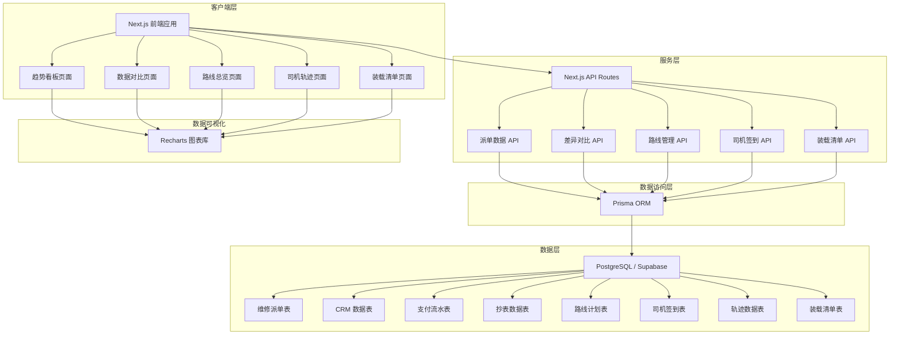
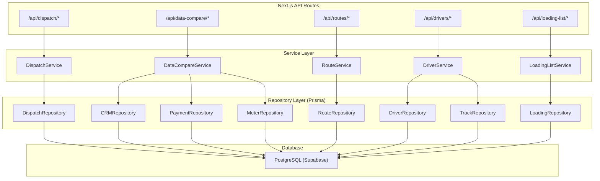
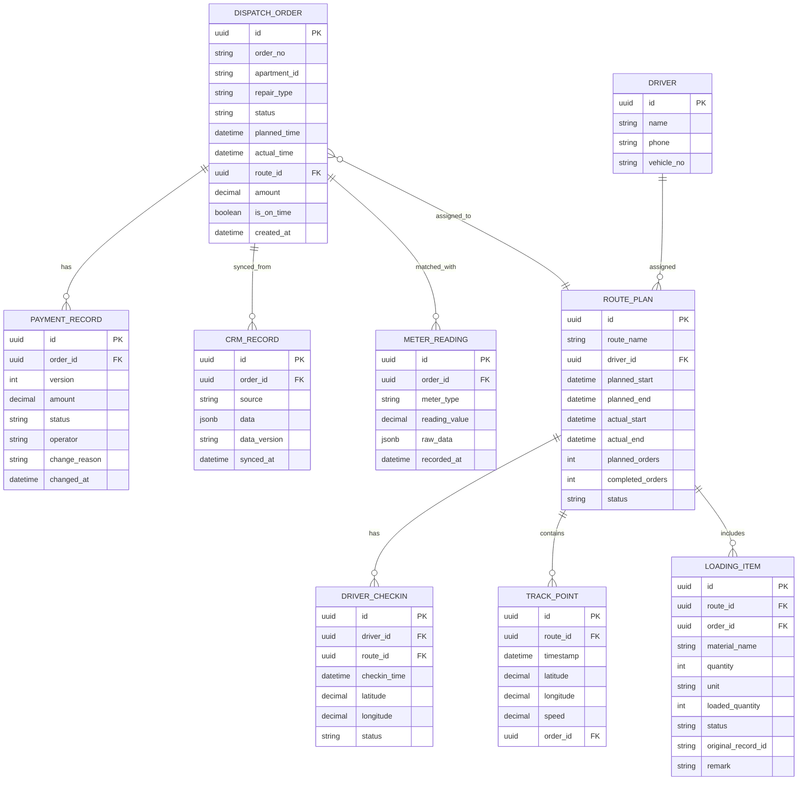

## 1. 架构设计



## 2. 技术描述

- **前端框架**：Next.js 14 (App Router) + TypeScript
- **样式方案**：Tailwind CSS 3
- **图表库**：Recharts 2
- **状态管理**：Zustand
- **图标库**：Lucide React
- **ORM**：Prisma 5
- **数据库**：PostgreSQL（Supabase 托管）
- **包管理器**：pnpm

## 3. 路由定义

| 路由 | 用途 |
|-------|---------|
| `/` | 维修派单趋势看板首页 |
| `/data-compare` | 数据口径差异对比页 |
| `/routes` | 路线计划与执行总览页 |
| `/driver-tracking` | 司机签到与轨迹回放页 |
| `/loading-list` | 装载清单与异常追溯页 |
| `/api/dispatch/trend` | 获取派单趋势数据 |
| `/api/dispatch/kpi` | 获取 KPI 指标数据 |
| `/api/data-compare/differences` | 获取 CRM 与抄表差异明细 |
| `/api/data-compare/payments` | 获取支付流水版本历史 |
| `/api/routes/list` | 获取路线列表 |
| `/api/routes/:id/details` | 获取路线详情与样本明细 |
| `/api/drivers/checkin` | 获取司机签到状态 |
| `/api/drivers/:id/track` | 获取司机轨迹数据 |
| `/api/loading-list` | 获取装载清单列表 |
| `/api/loading-list/:id/original` | 获取原始录入记录 |

## 4. API 接口定义

```typescript
// 派单趋势数据
interface DispatchTrendPoint {
  date: string;
  totalOrders: number;
  onTimeOrders: number;
  delayedOrders: number;
  onTimeRate: number;
  anomalyOrders: number;
}

// KPI 指标
interface KPIData {
  todayOrders: number;
  todayOrdersYoY: number;
  todayOrdersMoM: number;
  onTimeRate: number;
  onTimeRateYoY: number;
  onTimeRateMoM: number;
  delayedCount: number;
  anomalyCount: number;
}

// 数据差异记录
interface DataDifference {
  id: string;
  orderId: string;
  crmValue: Record<string, unknown>;
  meterValue: Record<string, unknown>;
  diffFields: string[];
  diffAmount?: number;
  createdAt: string;
}

// 支付流水版本
interface PaymentVersion {
  id: string;
  orderId: string;
  version: number;
  amount: number;
  status: string;
  operator: string;
  changedAt: string;
  changeReason: string;
}

// 路线计划
interface RoutePlan {
  id: string;
  routeName: string;
  driverName: string;
  plannedStartTime: string;
  plannedEndTime: string;
  actualStartTime?: string;
  actualEndTime?: string;
  plannedOrderCount: number;
  completedOrderCount: number;
  status: 'pending' | 'in_progress' | 'completed' | 'delayed';
  delayMinutes?: number;
}

// 司机签到记录
interface DriverCheckin {
  id: string;
  driverId: string;
  driverName: string;
  routeId: string;
  checkinTime: string;
  checkinLocation: { lat: number; lng: number };
  status: 'checked_in' | 'not_checked_in' | 'abnormal';
}

// 轨迹点
interface TrackPoint {
  timestamp: string;
  lat: number;
  lng: number;
  speed: number;
  orderId?: string;
}

// 装载清单项
interface LoadingItem {
  id: string;
  routeId: string;
  orderId: string;
  materialName: string;
  quantity: number;
  unit: string;
  loadedQuantity?: number;
  status: 'normal' | 'abnormal' | 'missing';
  originalRecordId: string;
  remark?: string;
}
```

## 5. 服务端架构图



## 6. 数据模型

### 6.1 ER 图



### 6.2 Prisma Schema

```prisma
generator client {
  provider = "prisma-client-js"
}

datasource db {
  provider = "postgresql"
  url      = env("DATABASE_URL")
}

model DispatchOrder {
  id            String          @id @default(uuid())
  orderNo       String          @unique
  apartmentId   String
  repairType    String
  status        String
  plannedTime   DateTime
  actualTime    DateTime?
  routeId       String?
  amount        Decimal         @db.Decimal(10, 2)
  isOnTime      Boolean
  createdAt     DateTime        @default(now())
  route         RoutePlan?      @relation(fields: [routeId], references: [id])
  crmRecords    CrmRecord[]
  payments      PaymentRecord[]
  meterReadings MeterReading[]
  loadingItems  LoadingItem[]
}

model CrmRecord {
  id        String   @id @default(uuid())
  orderId   String
  source    String
  data      Json
  dataVersion String
  syncedAt  DateTime @default(now())
  order     DispatchOrder @relation(fields: [orderId], references: [id])
}

model PaymentRecord {
  id           String   @id @default(uuid())
  orderId      String
  version      Int
  amount       Decimal  @db.Decimal(10, 2)
  status       String
  operator     String
  changeReason String
  changedAt    DateTime @default(now())
  order        DispatchOrder @relation(fields: [orderId], references: [id])
}

model MeterReading {
  id           String   @id @default(uuid())
  orderId      String
  meterType    String
  readingValue Decimal  @db.Decimal(10, 2)
  rawData      Json
  recordedAt   DateTime @default(now())
  order        DispatchOrder @relation(fields: [orderId], references: [id])
}

model RoutePlan {
  id              String           @id @default(uuid())
  routeName       String
  driverId        String
  plannedStart    DateTime
  plannedEnd      DateTime
  actualStart     DateTime?
  actualEnd       DateTime?
  plannedOrders   Int
  completedOrders Int              @default(0)
  status          String
  driver          Driver           @relation(fields: [driverId], references: [id])
  orders          DispatchOrder[]
  checkins        DriverCheckin[]
  trackPoints     TrackPoint[]
  loadingItems    LoadingItem[]
}

model Driver {
  id        String      @id @default(uuid())
  name      String
  phone     String
  vehicleNo String
  routes    RoutePlan[]
  checkins  DriverCheckin[]
}

model DriverCheckin {
  id             String     @id @default(uuid())
  driverId       String
  routeId        String
  checkinTime    DateTime
  latitude       Decimal    @db.Decimal(10, 6)
  longitude      Decimal    @db.Decimal(10, 6)
  status         String
  driver         Driver     @relation(fields: [driverId], references: [id])
  route          RoutePlan  @relation(fields: [routeId], references: [id])
}

model TrackPoint {
  id          String     @id @default(uuid())
  routeId     String
  timestamp   DateTime
  latitude    Decimal    @db.Decimal(10, 6)
  longitude   Decimal    @db.Decimal(10, 6)
  speed       Decimal    @db.Decimal(5, 2)
  orderId     String?
  route       RoutePlan  @relation(fields: [routeId], references: [id])
}

model LoadingItem {
  id               String     @id @default(uuid())
  routeId          String
  orderId          String
  materialName     String
  quantity         Int
  unit             String
  loadedQuantity   Int?
  status           String
  originalRecordId String
  remark           String?
  route            RoutePlan  @relation(fields: [routeId], references: [id])
  order            DispatchOrder @relation(fields: [orderId], references: [id])
}
```
