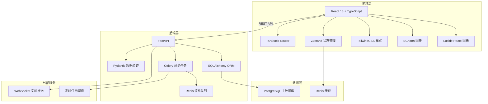
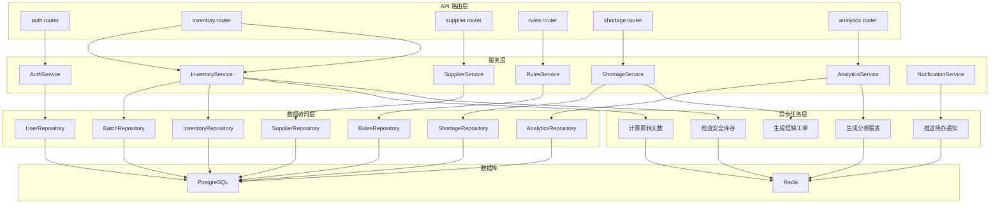
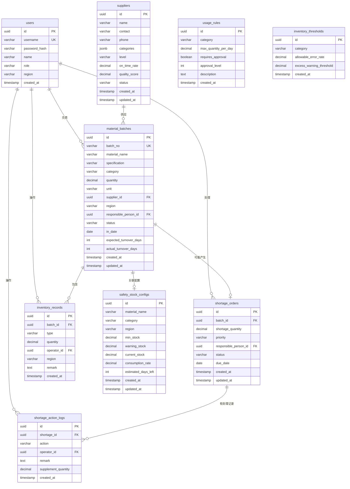

## 1. 架构设计



## 2. 技术描述

- **前端**：React@18 + TypeScript@5 + Vite@5 + TanStack Router@1 + TailwindCSS@3 + Zustand@4 + ECharts@5 + Lucide React
- **后端**：FastAPI@0.109 + Python@3.11 + SQLAlchemy@2 + Pydantic@2 + Celery@5
- **数据库**：PostgreSQL@15 + Redis@7
- **异步处理**：Celery + Redis 作为消息队列，处理短缺预警、库存计算、报表生成等异步任务
- **实时通信**：WebSocket 实现待办消息实时推送

## 3. 路由定义

| 路由 | 页面 | 权限 |
|-------|------|------|
| /login | 登录页 | 公开 |
| /dashboard | 工作台仪表盘 | 所有登录用户 |
| /inventory | 库存台账列表 | 所有登录用户 |
| /inventory/:batchId | 批次详情追踪 | 所有登录用户 |
| /inventory/safety | 安全库存管理 | 一线人员/管理人员 |
| /suppliers | 供应商列表 | 管理人员 |
| /suppliers/:id | 供应商详情 | 管理人员 |
| /rules | 规则配置中心 | 管理人员 |
| /shortage | 短缺待办列表 | 所有登录用户 |
| /shortage/:id | 短缺处理详情 | 相关负责人/管理人员 |
| /analytics | 复盘分析中心 | 项目经理/管理人员 |

## 4. API 定义

### 4.1 类型定义

```typescript
// 通用类型
interface PaginationParams {
  page: number;
  pageSize: number;
}

interface PaginatedResponse<T> {
  items: T[];
  total: number;
  page: number;
  pageSize: number;
}

// 材料批次
interface MaterialBatch {
  id: string;
  batchNo: string;
  materialName: string;
  specification: string;
  category: string;
  quantity: number;
  unit: string;
  supplierId: string;
  supplierName: string;
  region: string;
  responsiblePerson: string;
  status: 'in_stock' | 'in_use' | 'shortage' | 'closed';
  inDate: string;
  expectedTurnoverDays: number;
  actualTurnoverDays?: number;
  createdAt: string;
  updatedAt: string;
}

// 库存台账记录
interface InventoryRecord {
  id: string;
  batchId: string;
  type: 'in' | 'out' | 'transfer' | 'adjust';
  quantity: number;
  operator: string;
  region: string;
  remark: string;
  createdAt: string;
}

// 供应商
interface Supplier {
  id: string;
  name: string;
  contact: string;
  phone: string;
  categories: string[];
  level: 'A' | 'B' | 'C';
  onTimeRate: number;
  qualityScore: number;
  status: 'active' | 'inactive';
  createdAt: string;
}

// 领用规则
interface UsageRule {
  id: string;
  category: string;
  maxQuantityPerDay: number;
  requiresApproval: boolean;
  approvalLevel: number;
  description: string;
  createdAt: string;
}

// 盘点差异阈值
interface InventoryThreshold {
  id: string;
  category: string;
  allowableErrorRate: number;
  excessWarningThreshold: number;
  createdAt: string;
}

// 短缺工单
interface ShortageOrder {
  id: string;
  batchId: string;
  batchNo: string;
  materialName: string;
  shortageQuantity: number;
  priority: 'high' | 'medium' | 'low';
  responsiblePerson: string;
  status: 'pending' | 'processing' | 'supplemented' | 'retried' | 'closed';
  dueDate: string;
  createdAt: string;
}

// 处理记录
interface ShortageActionLog {
  id: string;
  shortageId: string;
  action: 'create' | 'assign' | 'supplement' | 'retry' | 'close';
  operator: string;
  remark: string;
  supplementQuantity?: number;
  createdAt: string;
}

// 安全库存配置
interface SafetyStockConfig {
  id: string;
  materialName: string;
  category: string;
  region: string;
  minStock: number;
  warningStock: number;
  currentStock: number;
  consumptionRate: number;
  estimatedDaysLeft: number;
}

// 周转天数分析
interface TurnoverAnalysis {
  dimension: 'material' | 'region' | 'person';
  name: string;
  avgTurnoverDays: number;
  totalBatches: number;
  shortageCount: number;
  comparisonLastPeriod: number;
}

// 组合查询参数
interface InventoryQueryParams {
  status?: string[];
  dateRange?: [string, string];
  region?: string[];
  responsiblePerson?: string[];
  category?: string[];
  keyword?: string;
  sortBy?: string;
  sortOrder?: 'asc' | 'desc';
  page?: number;
  pageSize?: number;
}
```

### 4.2 API 接口列表

| Method | Path | Description |
|--------|------|-------------|
| POST | /api/auth/login | 用户登录 |
| GET | /api/auth/me | 获取当前用户信息 |
| GET | /api/dashboard/stats | 获取工作台统计数据 |
| GET | /api/inventory | 库存台账列表（支持组合查询） |
| GET | /api/inventory/:id | 获取批次详情 |
| POST | /api/inventory | 创建材料批次 |
| PUT | /api/inventory/:id | 更新批次信息 |
| POST | /api/inventory/:id/record | 添加台账记录 |
| GET | /api/inventory/:id/timeline | 获取批次时间线 |
| GET | /api/inventory/safety | 安全库存列表 |
| POST | /api/inventory/safety | 配置安全库存 |
| GET | /api/suppliers | 供应商列表 |
| POST | /api/suppliers | 创建供应商 |
| PUT | /api/suppliers/:id | 更新供应商 |
| GET | /api/rules/usage | 领用规则列表 |
| POST | /api/rules/usage | 创建领用规则 |
| PUT | /api/rules/usage/:id | 更新领用规则 |
| GET | /api/rules/threshold | 盘点阈值列表 |
| POST | /api/rules/threshold | 创建盘点阈值 |
| PUT | /api/rules/threshold/:id | 更新盘点阈值 |
| GET | /api/shortage | 短缺待办列表 |
| GET | /api/shortage/:id | 短缺详情 |
| POST | /api/shortage/:id/supplement | 补录处理 |
| POST | /api/shortage/:id/retry | 重试处理 |
| POST | /api/shortage/:id/close | 关闭工单 |
| GET | /api/shortage/:id/logs | 处理记录日志 |
| GET | /api/analytics/turnover | 周转天数分析 |
| GET | /api/analytics/trends | 趋势数据 |
| GET | /api/analytics/export | 导出报表 |

## 5. 服务端架构



## 6. 数据模型

### 6.1 ER 图



### 6.2 DDL 语句

```sql
-- 创建扩展
CREATE EXTENSION IF NOT EXISTS "uuid-ossp";

-- 用户表
CREATE TABLE users (
    id UUID PRIMARY KEY DEFAULT uuid_generate_v4(),
    username VARCHAR(50) UNIQUE NOT NULL,
    password_hash VARCHAR(255) NOT NULL,
    name VARCHAR(100) NOT NULL,
    role VARCHAR(20) NOT NULL CHECK (role IN ('admin', 'worker', 'manager')),
    region VARCHAR(100),
    created_at TIMESTAMP NOT NULL DEFAULT CURRENT_TIMESTAMP
);

-- 供应商表
CREATE TABLE suppliers (
    id UUID PRIMARY KEY DEFAULT uuid_generate_v4(),
    name VARCHAR(200) NOT NULL,
    contact VARCHAR(100),
    phone VARCHAR(20),
    categories JSONB DEFAULT '[]',
    level VARCHAR(1) CHECK (level IN ('A', 'B', 'C')),
    on_time_rate DECIMAL(5,2) DEFAULT 100.00,
    quality_score DECIMAL(3,1) DEFAULT 5.0,
    status VARCHAR(20) NOT NULL DEFAULT 'active' CHECK (status IN ('active', 'inactive')),
    created_at TIMESTAMP NOT NULL DEFAULT CURRENT_TIMESTAMP,
    updated_at TIMESTAMP NOT NULL DEFAULT CURRENT_TIMESTAMP
);

-- 材料批次表
CREATE TABLE material_batches (
    id UUID PRIMARY KEY DEFAULT uuid_generate_v4(),
    batch_no VARCHAR(50) UNIQUE NOT NULL,
    material_name VARCHAR(200) NOT NULL,
    specification VARCHAR(200),
    category VARCHAR(100),
    quantity DECIMAL(10,2) NOT NULL,
    unit VARCHAR(20) NOT NULL,
    supplier_id UUID REFERENCES suppliers(id),
    region VARCHAR(100) NOT NULL,
    responsible_person_id UUID REFERENCES users(id),
    status VARCHAR(20) NOT NULL DEFAULT 'in_stock' CHECK (status IN ('in_stock', 'in_use', 'shortage', 'closed')),
    in_date DATE NOT NULL,
    expected_turnover_days INTEGER NOT NULL,
    actual_turnover_days INTEGER,
    created_at TIMESTAMP NOT NULL DEFAULT CURRENT_TIMESTAMP,
    updated_at TIMESTAMP NOT NULL DEFAULT CURRENT_TIMESTAMP
);

-- 库存台账记录表
CREATE TABLE inventory_records (
    id UUID PRIMARY KEY DEFAULT uuid_generate_v4(),
    batch_id UUID REFERENCES material_batches(id) NOT NULL,
    type VARCHAR(20) NOT NULL CHECK (type IN ('in', 'out', 'transfer', 'adjust')),
    quantity DECIMAL(10,2) NOT NULL,
    operator_id UUID REFERENCES users(id) NOT NULL,
    region VARCHAR(100),
    remark TEXT,
    created_at TIMESTAMP NOT NULL DEFAULT CURRENT_TIMESTAMP
);

-- 领用规则表
CREATE TABLE usage_rules (
    id UUID PRIMARY KEY DEFAULT uuid_generate_v4(),
    category VARCHAR(100) UNIQUE NOT NULL,
    max_quantity_per_day DECIMAL(10,2) NOT NULL,
    requires_approval BOOLEAN NOT NULL DEFAULT false,
    approval_level INTEGER NOT NULL DEFAULT 1,
    description TEXT,
    created_at TIMESTAMP NOT NULL DEFAULT CURRENT_TIMESTAMP
);

-- 盘点差异阈值表
CREATE TABLE inventory_thresholds (
    id UUID PRIMARY KEY DEFAULT uuid_generate_v4(),
    category VARCHAR(100) UNIQUE NOT NULL,
    allowable_error_rate DECIMAL(5,2) NOT NULL DEFAULT 2.00,
    excess_warning_threshold DECIMAL(10,2) NOT NULL,
    created_at TIMESTAMP NOT NULL DEFAULT CURRENT_TIMESTAMP
);

-- 安全库存配置表
CREATE TABLE safety_stock_configs (
    id UUID PRIMARY KEY DEFAULT uuid_generate_v4(),
    material_name VARCHAR(200) NOT NULL,
    category VARCHAR(100),
    region VARCHAR(100) NOT NULL,
    min_stock DECIMAL(10,2) NOT NULL,
    warning_stock DECIMAL(10,2) NOT NULL,
    current_stock DECIMAL(10,2) NOT NULL DEFAULT 0,
    consumption_rate DECIMAL(10,2) NOT NULL DEFAULT 0,
    estimated_days_left INTEGER,
    created_at TIMESTAMP NOT NULL DEFAULT CURRENT_TIMESTAMP,
    updated_at TIMESTAMP NOT NULL DEFAULT CURRENT_TIMESTAMP,
    UNIQUE(material_name, region)
);

-- 短缺工单表
CREATE TABLE shortage_orders (
    id UUID PRIMARY KEY DEFAULT uuid_generate_v4(),
    batch_id UUID REFERENCES material_batches(id) NOT NULL,
    shortage_quantity DECIMAL(10,2) NOT NULL,
    priority VARCHAR(20) NOT NULL DEFAULT 'medium' CHECK (priority IN ('high', 'medium', 'low')),
    responsible_person_id UUID REFERENCES users(id) NOT NULL,
    status VARCHAR(20) NOT NULL DEFAULT 'pending' CHECK (status IN ('pending', 'processing', 'supplemented', 'retried', 'closed')),
    due_date DATE NOT NULL,
    created_at TIMESTAMP NOT NULL DEFAULT CURRENT_TIMESTAMP,
    updated_at TIMESTAMP NOT NULL DEFAULT CURRENT_TIMESTAMP
);

-- 短缺处理日志表
CREATE TABLE shortage_action_logs (
    id UUID PRIMARY KEY DEFAULT uuid_generate_v4(),
    shortage_id UUID REFERENCES shortage_orders(id) NOT NULL,
    action VARCHAR(20) NOT NULL CHECK (action IN ('create', 'assign', 'supplement', 'retry', 'close')),
    operator_id UUID REFERENCES users(id) NOT NULL,
    remark TEXT,
    supplement_quantity DECIMAL(10,2),
    created_at TIMESTAMP NOT NULL DEFAULT CURRENT_TIMESTAMP
);

-- 创建索引
CREATE INDEX idx_batches_region ON material_batches(region);
CREATE INDEX idx_batches_status ON material_batches(status);
CREATE INDEX idx_batches_person ON material_batches(responsible_person_id);
CREATE INDEX idx_batches_date ON material_batches(in_date);
CREATE INDEX idx_records_batch ON inventory_records(batch_id);
CREATE INDEX idx_shortage_person ON shortage_orders(responsible_person_id);
CREATE INDEX idx_shortage_status ON shortage_orders(status);
CREATE INDEX idx_logs_shortage ON shortage_action_logs(shortage_id);

-- 初始数据
INSERT INTO users (username, password_hash, name, role, region) VALUES
('admin', '$2b$12$LQv3c1yqBWVHxkd0LHAkCOYz6TtxMQJqhN8/LewYGyJkK0dMXjE', '系统管理员', 'admin', '总部'),
('worker1', '$2b$12$LQv3c1yqBWVHxkd0LHAkCOYz6TtxMQJqhN8/LewYGyJkK0dMXjE', '张三', 'worker', '华东区域'),
('worker2', '$2b$12$LQv3c1yqBWVHxkd0LHAkCOYz6TtxMQJqhN8/LewYGyJkK0dMXjE', '李四', 'worker', '华南区域'),
('manager1', '$2b$12$LQv3c1yqBWVHxkd0LHAkCOYz6TtxMQJqhN8/LewYGyJkK0dMXjE', '王经理', 'manager', '总部');

INSERT INTO suppliers (name, contact, phone, categories, level, on_time_rate, quality_score) VALUES
('建材优供有限公司', '陈经理', '13800138001', '["瓷砖", "地板", "石材"]', 'A', 98.5, 4.8),
('管材世家', '刘总', '13800138002', '["水管", "电线", "五金"]', 'B', 92.0, 4.2),
('油漆专家', '王工', '13800138003', '["乳胶漆", "腻子", "防水涂料"]', 'A', 96.0, 4.7);

INSERT INTO usage_rules (category, max_quantity_per_day, requires_approval, approval_level, description) VALUES
('瓷砖', 500, true, 2, '瓷砖单日领用超500需项目经理审批'),
('水管', 1000, false, 1, '水管日常领用'),
('乳胶漆', 50, true, 2, '油漆类化学品需严格管控');

INSERT INTO inventory_thresholds (category, allowable_error_rate, excess_warning_threshold) VALUES
('瓷砖', 2.0, 1000),
('水管', 3.0, 2000),
('乳胶漆', 1.0, 100);
```
