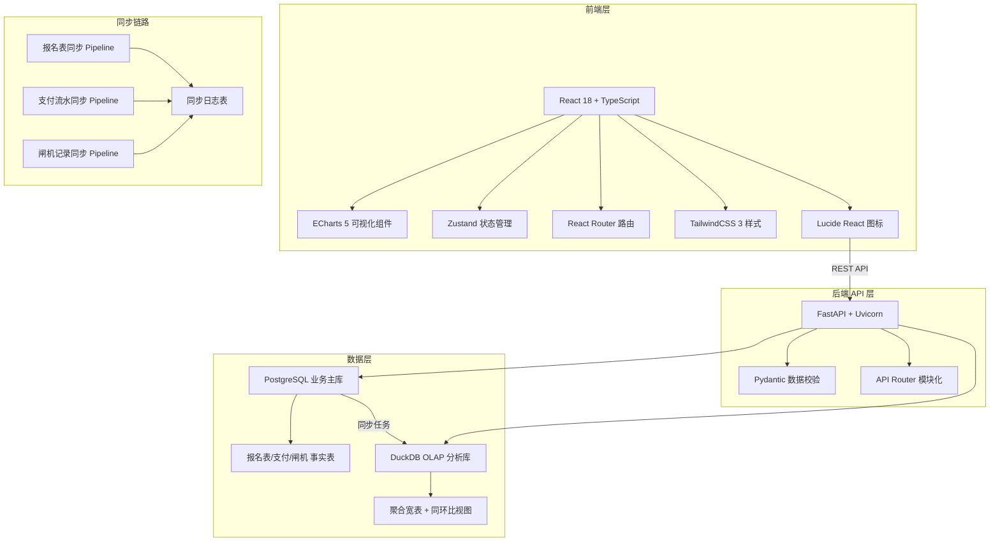
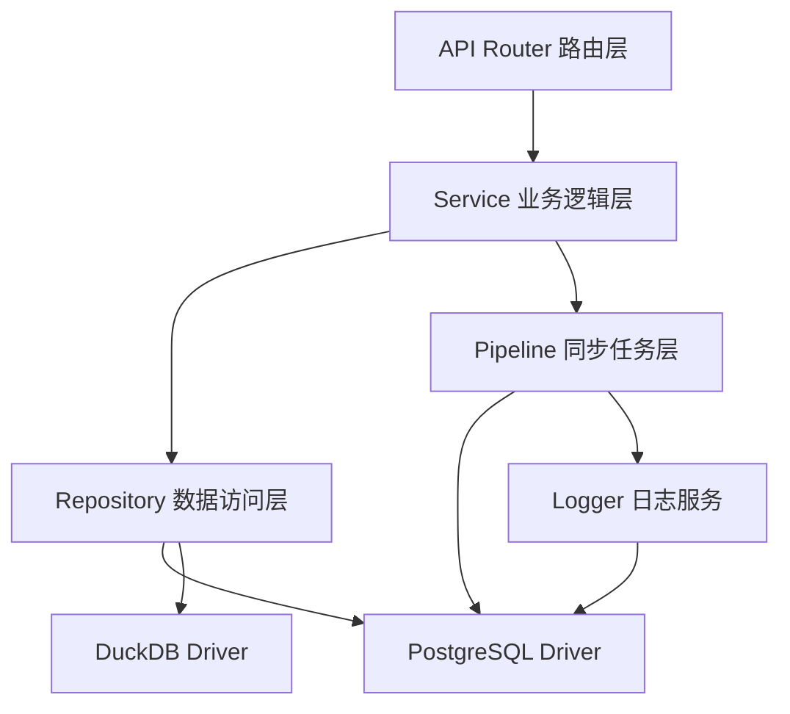
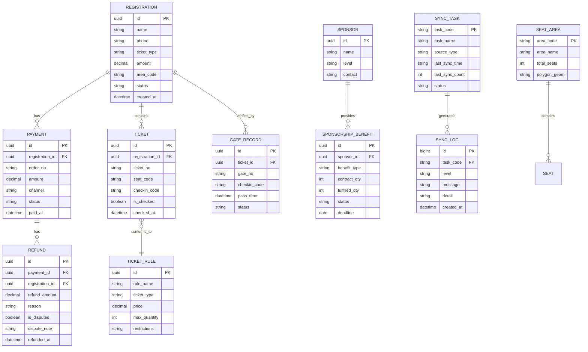

## 1. 架构设计



## 2. 技术栈说明

### 2.1 前端
- **框架**：React 18 + TypeScript
- **初始化工具**：Vite 5
- **路由**：React Router DOM 6
- **状态管理**：Zustand 4
- **样式**：TailwindCSS 3 + PostCSS
- **图表**：ECharts 5 + echarts-for-react
- **图标**：Lucide React
- **日期处理**：dayjs

### 2.2 后端
- **框架**：FastAPI 0.110
- **ASGI 服务器**：Uvicorn
- **数据库驱动**：psycopg2-binary + SQLAlchemy 2
- **DuckDB**：duckdb Python 包
- **数据校验**：Pydantic 2
- **CORS**：fastapi.middleware.cors

### 2.3 数据库
- **PostgreSQL 15**：存储业务明细、同步日志、权限配置
- **DuckDB 0.10**：列式分析引擎，存放聚合宽表，提供同环比查询

## 3. 路由定义

| 路由路径 | 页面组件 | 功能说明 |
|---------|---------|---------|
| `/` | Dashboard | 总览看板：KPI + 趋势 + 同步链路 |
| `/pipeline` | PipelineMonitor | 取数链路监控：同步状态 + 日志 |
| `/seatmap` | SeatMapAnalysis | 座位图分析：热力 + 同环比 + 签到码 |
| `/sponsorship` | SponsorshipMonitor | 赞助权益监测 + 跳转明细 |
| `/verification` | VerificationReport | 核销报表：效率/日期/区域对比 |
| `/ticket-rank` | TicketRank | 票种规则排行 + 绝对值/占比切换 |
| `/refund` | RefundDispute | 退票争议中心 + 样本跳转 |

## 4. API 定义

### 4.1 公共响应格式

```typescript
interface ApiResponse<T> {
  code: number;
  message: string;
  data: T;
  timestamp: number;
}
```

### 4.2 核心 API 列表

| Method | Path | 说明 |
|--------|------|------|
| GET | `/api/kpi/overview` | 获取总览看板 KPI |
| GET | `/api/kpi/trend?days=30` | 获取权益风险趋势数据 |
| GET | `/api/pipeline/status` | 获取同步链路状态 |
| GET | `/api/pipeline/logs?task=&level=&page=` | 获取同步日志（分页） |
| GET | `/api/seatmap/heatmap?period=&compare=` | 座位热力图数据，支持同环比 |
| GET | `/api/seatmap/checkin-trend?period=` | 签到码趋势数据 |
| GET | `/api/sponsorship/list?page=&status=` | 赞助权益清单 |
| GET | `/api/sponsorship/:id/detail` | 赞助权益明细（跳转目标） |
| GET | `/api/verification/efficiency?group=` | 核销效率对比 |
| GET | `/api/verification/date-trend?start=&end=` | 按日期核销趋势 |
| GET | `/api/verification/area-compare` | 区域核销对比 |
| GET | `/api/verification/definition` | 核销口径说明 |
| GET | `/api/ticket/rank?metric=absolute&top=` | 票种排行，metric 支持 absolute/ratio |
| GET | `/api/refund/distribution?start=&end=` | 退票分布 + 争议点标记 |
| GET | `/api/refund/:id/sample` | 退票样本详情（跳转目标） |
| POST | `/api/pipeline/sync/:task` | 手动触发同步任务 |

## 5. 服务端分层架构



### 5.1 后端目录结构

```
backend/
├── app/
│   ├── main.py              # FastAPI 入口
│   ├── config.py            # 配置加载
│   ├── database.py          # 数据库连接
│   ├── api/
│   │   ├── __init__.py
│   │   ├── kpi.py           # 总览 KPI
│   │   ├── pipeline.py      # 同步链路
│   │   ├── seatmap.py       # 座位图
│   │   ├── sponsorship.py   # 赞助权益
│   │   ├── verification.py  # 核销报表
│   │   ├── ticket.py        # 票种排行
│   │   └── refund.py        # 退票争议
│   ├── services/
│   │   ├── kpi_service.py
│   │   ├── pipeline_service.py
│   │   ├── seatmap_service.py
│   │   ├── sponsorship_service.py
│   │   ├── verification_service.py
│   │   ├── ticket_service.py
│   │   └── refund_service.py
│   ├── repositories/
│   │   ├── pg_repository.py   # PostgreSQL 访问
│   │   └── duckdb_repository.py # DuckDB 分析
│   ├── pipeline/
│   │   ├── base_pipeline.py   # 同步基类（含日志）
│   │   ├── registration_pipeline.py
│   │   ├── payment_pipeline.py
│   │   └── gate_pipeline.py
│   ├── models/
│   │   ├── pg_models.py       # SQLAlchemy ORM 模型
│   │   └── schemas.py         # Pydantic Schema
│   └── utils/
│       ├── logger.py
│       └── date_utils.py
├── data/
│   └── mock/               # Mock 数据 CSV/JSON
├── migrations/
│   └── 001_init.sql        # 初始化 DDL
├── requirements.txt
└── start.sh
```

## 6. 数据模型

### 6.1 ER 图



### 6.2 DuckDB 聚合视图

| 视图名 | 用途 |
|--------|------|
| `v_daily_kpi` | 每日核心指标宽表（票量、核销、退款） |
| `v_sponsorship_progress` | 赞助权益完成率快照 |
| `v_seat_sales_wide` | 座位区域销售宽表（含同比环比列） |
| `v_verification_wide` | 核销效率宽表（按日期/区域/通道） |
| `v_ticket_rank_wide` | 票种排行宽表（绝对值列 + 占比列） |
| `v_refund_dispute_wide` | 退票争议聚合宽表 |
