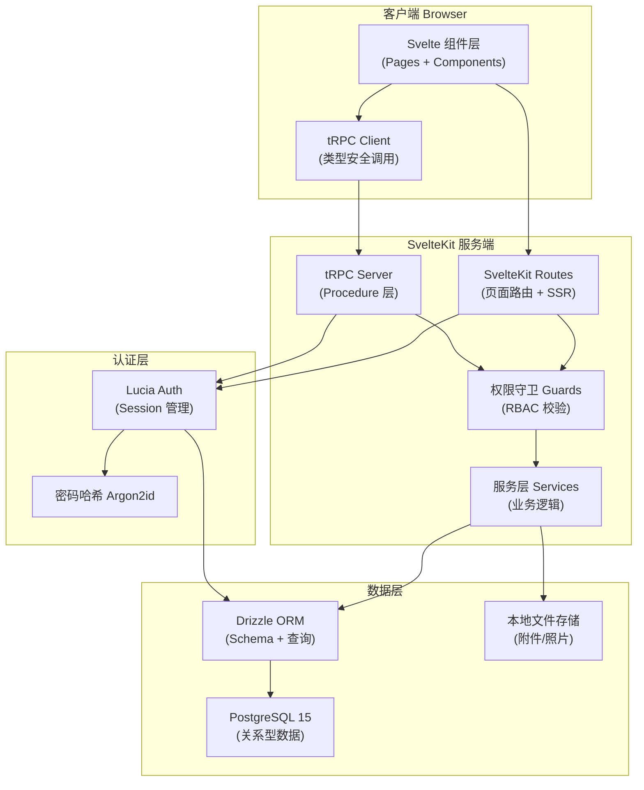
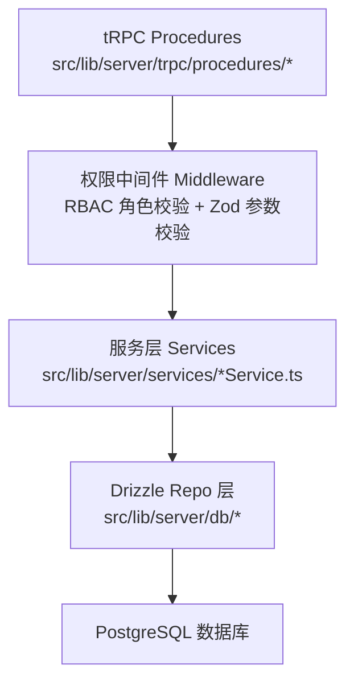
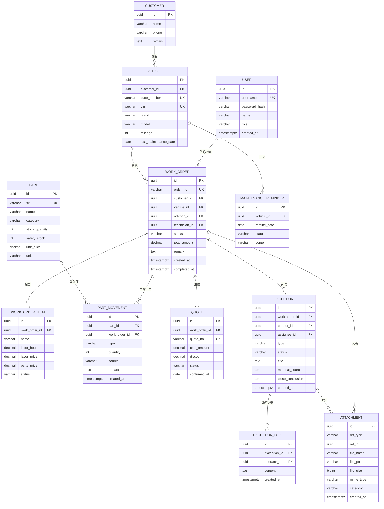

# 汽车维修保养提醒协同台 - 技术架构文档

## 1. 架构设计

整体采用全栈 TypeScript 单体架构，SvelteKit 作为前后端一体化框架，tRPC 实现类型安全的 API 调用，Drizzle ORM 管理 PostgreSQL 数据层，Lucia Auth 提供基于 Session 的身份认证与权限体系。



---

## 2. 技术栈说明

| 层级 | 技术选型 | 版本约束 | 用途说明 |
|------|----------|----------|----------|
| 前端框架 | SvelteKit | ^2.0 | 前后端一体化，SSR + 客户端路由 |
| 语言 | TypeScript | ^5.4 | 全栈类型安全 |
| API 层 | tRPC | ^11 | 端到端类型安全的远程过程调用 |
| ORM | Drizzle ORM | ^0.30 | 轻量类 SQL 语法 ORM，迁移管理 |
| 数据库 | PostgreSQL | ^15 | 关系型数据存储（JSONB 存灵活字段） |
| 认证 | Lucia Auth | ^3.0 | 基于 Session 的认证框架，支持多 Provider |
| 密码哈希 | @node-rs/argon2 | ^1.7 | Argon2id 算法，高性能 Rust 实现 |
| 样式 | Tailwind CSS | ^3.4 | 原子化 CSS 框架 |
| UI 组件 | bits-ui | ^0.21 | Svelte 无样式可访问组件（类 Radix） |
| 图表 | echarts | ^5.5 | 统计报表图表 |
| 图标 | lucide-svelte | ^0.378 | 图标库 |
| 文件上传 | 原生 FormData + busboy | - | 内置处理，不额外引入重型库 |
| 表单校验 | zod | ^3.23 | 前后端共用的 Schema 校验 |
| 包管理 | pnpm | ^9 | 高效包管理器 |

---

## 3. 路由定义

| 路由路径 | 页面用途 | 可访问角色 |
|----------|----------|------------|
| `/login` | 登录页 | 未登录用户 |
| `/` | 工作台首页（数据看板 + 保养日历 + 待办） | 全部已登录角色 |
| `/work-orders` | 工单列表（筛选 + 搜索 + 批量操作） | 全部 |
| `/work-orders/new` | 新建工单 | 顾问、厂长 |
| `/work-orders/[id]` | 工单详情（项目/配件/照片/日志） | 全部 |
| `/work-orders/[id]/edit` | 编辑工单 | 顾问、厂长 |
| `/parts` | 配件库存列表 | 配件员、厂长 |
| `/parts/new` | 新增配件 | 配件员、厂长 |
| `/quotes` | 报价单列表 | 顾问、厂长 |
| `/quotes/new` | 新建报价单 | 顾问、厂长 |
| `/quotes/[id]` | 报价单详情/编辑 | 顾问、厂长 |
| `/inspections` | 质检照片中心 | 全部 |
| `/exceptions` | 异常列表（缺货/返工/客诉） | 全部 |
| `/exceptions/new` | 新建异常 | 技师、配件员、顾问 |
| `/exceptions/[id]` | 异常详情（处理 + 复核） | 全部（复核仅厂长） |
| `/statistics` | 统计报表（返修率 + 经营 + 配件） | 厂长、顾问 |
| `/users` | 用户管理（创建/编辑账号） | 厂长 |
| `/settings` | 系统配置 | 厂长 |
| `/profile` | 个人中心 | 全部 |

tRPC 路由前缀：`/api/trpc/[procedure]`

---

## 4. tRPC 过程定义（核心 API）

### 4.1 认证模块 auth

```typescript
// 输入输出 Schema
type LoginInput = { username: string; password: string };
type AuthUser = {
  id: string;
  username: string;
  name: string;
  role: 'ADVISOR' | 'TECHNICIAN' | 'PARTS' | 'MANAGER';
};

// Procedures
auth.login: (LoginInput) => Promise<void>  // 设置 Session Cookie
auth.logout: () => Promise<void>
auth.me: () => Promise<AuthUser | null>
```

### 4.2 工单模块 workOrder

```typescript
type WorkOrderStatus = 'PENDING' | 'CONFIRMED' | 'IN_PROGRESS' | 
                       'INSPECTION' | 'COMPLETED' | 'CANCELLED';

type WorkOrderItem = {
  id?: string;
  name: string;
  laborHours: number;
  laborPrice: number;
  partsPrice: number;
  status: 'TODO' | 'DOING' | 'DONE';
};

type WorkOrderFilter = {
  status?: WorkOrderStatus[];
  advisorId?: string;
  technicianId?: string;
  plateNumber?: string;
  dateFrom?: string;
  dateTo?: string;
};

// Procedures
workOrder.list: ({ filter, page, pageSize }) => Promise<{ items: WorkOrder[]; total: number }>
workOrder.get: (id: string) => Promise<WorkOrderDetail>
workOrder.create: (input: CreateWorkOrderInput) => Promise<WorkOrder>
workOrder.update: ({ id, ...patch }) => Promise<WorkOrder>
workOrder.batchAssign: ({ ids, technicianId }) => Promise<void>
workOrder.batchUpdateStatus: ({ ids, status }) => Promise<void>
workOrder.addItem: ({ workOrderId, item }) => Promise<void>
workOrder.updateItemStatus: ({ itemId, status }) => Promise<void>
```

### 4.3 配件模块 part

```typescript
type PartMovementType = 'IN' | 'OUT' | 'ADJUST';

// Procedures
part.list: ({ keyword, category, lowStock }) => Promise<Part[]>
part.create: (input) => Promise<Part>
part.update: ({ id, ...patch }) => Promise<Part>
part.movement: ({ partId, type, quantity, source, workOrderId, remark }) => Promise<void>
part.batchOut: ({ items: [{ partId, quantity, workOrderId }] }) => Promise<void>
```

### 4.4 报价模块 quote

```typescript
// Procedures
quote.list: (filter) => Promise<Quote[]>
quote.create: (input) => Promise<Quote>
quote.get: (id) => Promise<QuoteDetail>
quote.updateStatus: ({ id, status }) => Promise<void>
```

### 4.5 质检与附件模块 attachment

```typescript
type AttachmentCategory = 'INSPECTION' | 'CONSTRUCTION' | 'EXCEPTION' | 'OTHER';

// Procedures
attachment.upload: (FormData) => Promise<Attachment[]>  // 多文件
attachment.listByRef: ({ refType, refId }) => Promise<Attachment[]>
attachment.delete: (id) => Promise<void>
```

### 4.6 异常模块 exception

```typescript
type ExceptionType = 'PARTS_SHORTAGE' | 'REWORK' | 'CUSTOMER_COMPLAINT' | 'OTHER';
type ExceptionStatus = 'PENDING' | 'PROCESSING' | 'REVIEWING' | 'CLOSED';

// Procedures
exception.list: ({ status, type, assigneeId }) => Promise<Exception[]>
exception.create: (input) => Promise<Exception>
exception.get: (id) => Promise<ExceptionDetail>
exception.addProcessLog: ({ exceptionId, content, attachments? }) => Promise<void>
exception.submitForReview: (id) => Promise<void>
exception.review: ({ id, passed, reviewComment, closeConclusion? }) => Promise<void>
```

### 4.7 统计模块 stats

```typescript
// Procedures
stats.overview: () => Promise<{ todayOrders, pendingPickup, openExceptions, reworkRate }>
stats.reworkRate: ({ months, technicianId? }) => Promise<ReworkRateData>
stats.reworkOrders: ({ month }) => Promise<WorkOrder[]>  // 钻取
stats.business: ({ months }) => Promise<BusinessData>
stats.partsRanking: ({ topN }) => Promise<PartsRankData>
stats.todoList: (userId) => Promise<TodoItem[]>
stats.maintenanceReminders: ({ year, month }) => Promise<ReminderDayData[]>
```

---

## 5. 服务端分层架构



**职责说明：**
- **Procedures 层**：定义 tRPC 过程，调用 Zod 做参数校验，调用权限中间件
- **Middleware 层**：统一处理身份认证、角色权限校验、异常包装
- **Services 层**：核心业务逻辑（状态流转、计算、事务编排）
- **Drizzle 层**：纯数据库 CRUD + 查询构造，不包含业务判断

---

## 6. 数据模型设计

### 6.1 ER 图



### 6.2 DDL 核心语句

```sql
-- 角色枚举
CREATE TYPE user_role AS ENUM ('ADVISOR', 'TECHNICIAN', 'PARTS', 'MANAGER');
CREATE TYPE wo_status AS ENUM ('PENDING', 'CONFIRMED', 'IN_PROGRESS', 'INSPECTION', 'COMPLETED', 'CANCELLED');
CREATE TYPE wo_item_status AS ENUM ('TODO', 'DOING', 'DONE');
CREATE TYPE movement_type AS ENUM ('IN', 'OUT', 'ADJUST');
CREATE TYPE quote_status AS ENUM ('DRAFT', 'PENDING_CONFIRM', 'CONFIRMED', 'VOID');
CREATE TYPE reminder_status AS ENUM ('PENDING', 'CONTACTED', 'ARRANGED', 'CANCELLED');
CREATE TYPE exception_type AS ENUM ('PARTS_SHORTAGE', 'REWORK', 'CUSTOMER_COMPLAINT', 'OTHER');
CREATE TYPE exception_status AS ENUM ('PENDING', 'PROCESSING', 'REVIEWING', 'CLOSED');
CREATE TYPE attachment_category AS ENUM ('INSPECTION', 'CONSTRUCTION', 'EXCEPTION', 'OTHER');

CREATE TABLE users (
    id UUID PRIMARY KEY DEFAULT gen_random_uuid(),
    username VARCHAR(50) NOT NULL UNIQUE,
    password_hash VARCHAR(255) NOT NULL,
    name VARCHAR(50) NOT NULL,
    role user_role NOT NULL,
    created_at TIMESTAMPTZ NOT NULL DEFAULT NOW()
);

CREATE TABLE customers (
    id UUID PRIMARY KEY DEFAULT gen_random_uuid(),
    name VARCHAR(50) NOT NULL,
    phone VARCHAR(20) NOT NULL,
    remark TEXT
);

CREATE TABLE vehicles (
    id UUID PRIMARY KEY DEFAULT gen_random_uuid(),
    customer_id UUID NOT NULL REFERENCES customers(id),
    plate_number VARCHAR(20) NOT NULL UNIQUE,
    vin VARCHAR(50) UNIQUE,
    brand VARCHAR(50),
    model VARCHAR(100),
    mileage INT DEFAULT 0,
    last_maintenance_date DATE
);

CREATE TABLE work_orders (
    id UUID PRIMARY KEY DEFAULT gen_random_uuid(),
    order_no VARCHAR(32) NOT NULL UNIQUE,
    customer_id UUID NOT NULL REFERENCES customers(id),
    vehicle_id UUID NOT NULL REFERENCES vehicles(id),
    advisor_id UUID NOT NULL REFERENCES users(id),
    technician_id UUID REFERENCES users(id),
    status wo_status NOT NULL DEFAULT 'PENDING',
    total_amount DECIMAL(12,2) NOT NULL DEFAULT 0,
    remark TEXT,
    created_at TIMESTAMPTZ NOT NULL DEFAULT NOW(),
    completed_at TIMESTAMPTZ
);
CREATE INDEX idx_wo_status ON work_orders(status);
CREATE INDEX idx_wo_advisor ON work_orders(advisor_id);
CREATE INDEX idx_wo_tech ON work_orders(technician_id);
CREATE INDEX idx_wo_created ON work_orders(created_at);

CREATE TABLE work_order_items (
    id UUID PRIMARY KEY DEFAULT gen_random_uuid(),
    work_order_id UUID NOT NULL REFERENCES work_orders(id) ON DELETE CASCADE,
    name VARCHAR(200) NOT NULL,
    labor_hours DECIMAL(6,2) NOT NULL DEFAULT 0,
    labor_price DECIMAL(12,2) NOT NULL DEFAULT 0,
    parts_price DECIMAL(12,2) NOT NULL DEFAULT 0,
    status wo_item_status NOT NULL DEFAULT 'TODO'
);

CREATE TABLE parts (
    id UUID PRIMARY KEY DEFAULT gen_random_uuid(),
    sku VARCHAR(50) NOT NULL UNIQUE,
    name VARCHAR(200) NOT NULL,
    category VARCHAR(50),
    stock_quantity INT NOT NULL DEFAULT 0,
    safety_stock INT NOT NULL DEFAULT 0,
    unit_price DECIMAL(12,2) NOT NULL DEFAULT 0,
    unit VARCHAR(20) NOT NULL DEFAULT '个'
);

CREATE TABLE part_movements (
    id UUID PRIMARY KEY DEFAULT gen_random_uuid(),
    part_id UUID NOT NULL REFERENCES parts(id),
    work_order_id UUID REFERENCES work_orders(id),
    type movement_type NOT NULL,
    quantity INT NOT NULL,
    source VARCHAR(100),
    remark TEXT,
    created_at TIMESTAMPTZ NOT NULL DEFAULT NOW()
);
CREATE INDEX idx_pm_part ON part_movements(part_id);
CREATE INDEX idx_pm_wo ON part_movements(work_order_id);

CREATE TABLE quotes (
    id UUID PRIMARY KEY DEFAULT gen_random_uuid(),
    work_order_id UUID REFERENCES work_orders(id),
    quote_no VARCHAR(32) NOT NULL UNIQUE,
    total_amount DECIMAL(12,2) NOT NULL DEFAULT 0,
    discount DECIMAL(5,2) NOT NULL DEFAULT 0,
    status quote_status NOT NULL DEFAULT 'DRAFT',
    confirmed_at DATE
);

CREATE TABLE maintenance_reminders (
    id UUID PRIMARY KEY DEFAULT gen_random_uuid(),
    vehicle_id UUID NOT NULL REFERENCES vehicles(id),
    remind_date DATE NOT NULL,
    status reminder_status NOT NULL DEFAULT 'PENDING',
    content TEXT
);
CREATE INDEX idx_remind_date ON maintenance_reminders(remind_date);

CREATE TABLE exceptions (
    id UUID PRIMARY KEY DEFAULT gen_random_uuid(),
    work_order_id UUID REFERENCES work_orders(id),
    creator_id UUID NOT NULL REFERENCES users(id),
    assignee_id UUID NOT NULL REFERENCES users(id),
    type exception_type NOT NULL,
    status exception_status NOT NULL DEFAULT 'PENDING',
    title VARCHAR(200) NOT NULL,
    material_source TEXT,
    close_conclusion TEXT,
    created_at TIMESTAMPTZ NOT NULL DEFAULT NOW()
);

CREATE TABLE exception_logs (
    id UUID PRIMARY KEY DEFAULT gen_random_uuid(),
    exception_id UUID NOT NULL REFERENCES exceptions(id) ON DELETE CASCADE,
    operator_id UUID NOT NULL REFERENCES users(id),
    content TEXT NOT NULL,
    created_at TIMESTAMPTZ NOT NULL DEFAULT NOW()
);

CREATE TABLE attachments (
    id UUID PRIMARY KEY DEFAULT gen_random_uuid(),
    ref_type VARCHAR(32) NOT NULL,
    ref_id UUID NOT NULL,
    file_name VARCHAR(255) NOT NULL,
    file_path VARCHAR(500) NOT NULL,
    file_size BIGINT NOT NULL,
    mime_type VARCHAR(100) NOT NULL,
    category attachment_category DEFAULT 'OTHER',
    created_at TIMESTAMPTZ NOT NULL DEFAULT NOW()
);
CREATE INDEX idx_attach_ref ON attachments(ref_type, ref_id);

-- Session 表（Lucia Auth 标准结构）
CREATE TABLE user_sessions (
    id VARCHAR(128) PRIMARY KEY,
    user_id UUID NOT NULL REFERENCES users(id) ON DELETE CASCADE,
    expires_at TIMESTAMPTZ NOT NULL
);
CREATE INDEX idx_sessions_user ON user_sessions(user_id);

-- 初始管理员账号：admin / Admin@123
INSERT INTO users (username, password_hash, name, role) VALUES 
('admin', '$argon2id$v=19$m=19456,t=2,p=1$...（实际生成）', '厂长', 'MANAGER');
```

---
