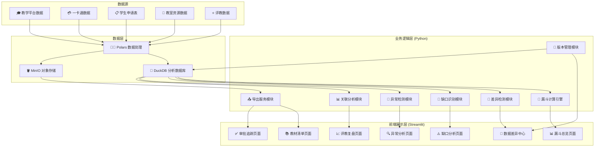
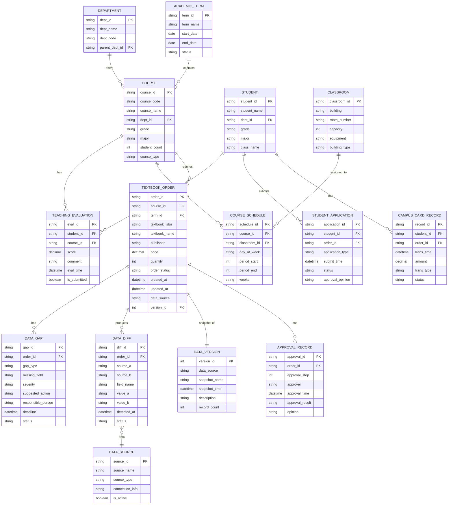

## 1. 架构设计



---

## 2. 技术描述

### 2.1 技术栈选型
| 层级 | 技术选型 | 版本 | 选型理由 |
|------|---------|------|---------|
| 前端框架 | Streamlit | ^1.31.0 | 快速构建数据应用，内置丰富图表组件，适合数据分析场景 |
| 数据处理 | Polars | ^0.20.0 | 高性能数据处理库，比pandas快10-100倍，内存占用低 |
| 分析数据库 | DuckDB | ^0.10.0 | 嵌入式分析型数据库，支持复杂SQL查询，与Polars无缝集成 |
| 对象存储 | MinIO | ^7.2.0 | 兼容S3协议的对象存储，用于存储导出文件、数据快照 |
| 图表库 | Plotly | ^5.18.0 | 交互式图表，支持漏斗图、散点图、热力图等 |
| Excel处理 | openpyxl | ^3.1.0 | 支持条件格式、数据验证的Excel导出 |
| PDF生成 | reportlab | ^4.0.0 | 生成带水印和筛选条件的PDF报告 |
| 配置管理 | pydantic | ^2.6.0 | 类型安全的配置管理，数据验证 |
| 日志系统 | loguru | ^0.7.0 | 结构化日志，便于问题追踪 |

### 2.2 关键设计原则
1. **数据不可变原则**：所有原始数据导入后不可修改，版本化管理
2. **差异记录原则**：多数据源口径不一致时，保留双方数据及差异记录
3. **计算下推原则**：尽可能使用DuckDB进行SQL查询计算，减少内存数据搬运
4. **懒加载原则**：大数据集采用分页和按需加载，避免一次性加载全部数据
5. **可追溯原则**：所有导出文件携带筛选条件元数据，确保数据可追溯

---

## 3. 目录结构

```
MP0154/
├── app.py                          # Streamlit入口文件
├── requirements.txt                # Python依赖清单
├── config/
│   ├── settings.py                 # 全局配置（Pydantic模型）
│   └── logging_config.py           # 日志配置
├── src/
│   ├── data/
│   │   ├── __init__.py
│   │   ├── models.py               # 数据模型定义
│   │   ├── database.py             # DuckDB数据库连接与操作
│   │   ├── minio_client.py         # MinIO客户端封装
│   │   ├── version_manager.py      # 版本管理模块
│   │   ├── diff_detector.py        # 差异检测模块
│   │   └── gap_analyzer.py         # 缺口分析模块
│   ├── analysis/
│   │   ├── __init__.py
│   │   ├── funnel_engine.py        # 漏斗计算引擎
│   │   ├── anomaly_detector.py     # 异常检测模块
│   │   ├── correlation.py          # 关联分析模块
│   │   └── evaluation_analysis.py  # 评教复盘分析
│   ├── export/
│   │   ├── __init__.py
│   │   ├── excel_exporter.py       # Excel导出（带条件水印）
│   │   ├── pdf_exporter.py         # PDF导出
│   │   └── export_utils.py         # 导出工具函数
│   └── utils/
│       ├── __init__.py
│       ├── filters.py              # 筛选条件处理
│       ├── formatters.py           # 数据格式化
│       └── validators.py           # 数据验证
├── pages/                          # Streamlit多页面
│   ├── 1_📊_漏斗总览.py
│   ├── 2_📚_教材清单.py
│   ├── 3_✅_审批追踪.py
│   ├── 4_🔄_数据差异.py
│   ├── 5_⚠️_缺口分析.py
│   ├── 6_🔍_异常分析.py
│   └── 7_📈_评教复盘.py
├── sql/                            # SQL查询模板
│   ├── funnel_queries.sql
│   ├── diff_queries.sql
│   └── anomaly_queries.sql
├── tests/                          # 单元测试
│   ├── test_data_models.py
│   ├── test_funnel_engine.py
│   └── test_export_utils.py
├── sample_data/                    # 示例数据
│   ├── courses.csv
│   ├── textbooks.csv
│   ├── approvals.csv
│   ├── campus_card.csv
│   ├── student_applications.csv
│   ├── classrooms.csv
│   └── evaluations.csv
├── .env.example                    # 环境变量示例
├── .trae/
│   └── documents/
│       ├── PRD_高校教务教材订购漏斗报表.md
│       └── TECH_ARCH_高校教务教材订购漏斗报表.md
└── README.md
```

---

## 4. 数据模型

### 4.1 ER图


### 4.2 DDL语句

```sql
-- 学期表
CREATE TABLE IF NOT EXISTS academic_term (
    term_id VARCHAR(50) PRIMARY KEY,
    term_name VARCHAR(100) NOT NULL,
    start_date DATE NOT NULL,
    end_date DATE NOT NULL,
    status VARCHAR(20) DEFAULT 'active'
);

-- 院系表
CREATE TABLE IF NOT EXISTS department (
    dept_id VARCHAR(50) PRIMARY KEY,
    dept_name VARCHAR(100) NOT NULL,
    dept_code VARCHAR(50) NOT NULL,
    parent_dept_id VARCHAR(50),
    FOREIGN KEY (parent_dept_id) REFERENCES department(dept_id)
);

-- 课程表
CREATE TABLE IF NOT EXISTS course (
    course_id VARCHAR(50) PRIMARY KEY,
    course_code VARCHAR(50) NOT NULL,
    course_name VARCHAR(200) NOT NULL,
    dept_id VARCHAR(50) NOT NULL,
    grade VARCHAR(20),
    major VARCHAR(100),
    student_count INTEGER DEFAULT 0,
    course_type VARCHAR(50),
    FOREIGN KEY (dept_id) REFERENCES department(dept_id)
);

CREATE INDEX IF NOT EXISTS idx_course_dept ON course(dept_id);
CREATE INDEX IF NOT EXISTS idx_course_grade ON course(grade);

-- 教材订购表
CREATE TABLE IF NOT EXISTS textbook_order (
    order_id VARCHAR(50) PRIMARY KEY,
    course_id VARCHAR(50) NOT NULL,
    term_id VARCHAR(50) NOT NULL,
    textbook_isbn VARCHAR(20),
    textbook_name VARCHAR(200) NOT NULL,
    publisher VARCHAR(100),
    price DECIMAL(10, 2),
    quantity INTEGER NOT NULL DEFAULT 0,
    order_status VARCHAR(50) NOT NULL,
    created_at TIMESTAMP NOT NULL DEFAULT CURRENT_TIMESTAMP,
    updated_at TIMESTAMP NOT NULL DEFAULT CURRENT_TIMESTAMP,
    data_source VARCHAR(50) NOT NULL,
    version_id INTEGER,
    FOREIGN KEY (course_id) REFERENCES course(course_id),
    FOREIGN KEY (term_id) REFERENCES academic_term(term_id)
);

CREATE INDEX IF NOT EXISTS idx_order_course ON textbook_order(course_id);
CREATE INDEX IF NOT EXISTS idx_order_term ON textbook_order(term_id);
CREATE INDEX IF NOT EXISTS idx_order_status ON textbook_order(order_status);

-- 学生表
CREATE TABLE IF NOT EXISTS student (
    student_id VARCHAR(50) PRIMARY KEY,
    student_name VARCHAR(100) NOT NULL,
    dept_id VARCHAR(50) NOT NULL,
    grade VARCHAR(20),
    major VARCHAR(100),
    class_name VARCHAR(50),
    FOREIGN KEY (dept_id) REFERENCES department(dept_id)
);

-- 一卡通消费记录
CREATE TABLE IF NOT EXISTS campus_card_record (
    record_id VARCHAR(50) PRIMARY KEY,
    student_id VARCHAR(50) NOT NULL,
    order_id VARCHAR(50),
    trans_time TIMESTAMP NOT NULL,
    amount DECIMAL(10, 2) NOT NULL,
    trans_type VARCHAR(50) NOT NULL,
    status VARCHAR(20) NOT NULL,
    FOREIGN KEY (student_id) REFERENCES student(student_id),
    FOREIGN KEY (order_id) REFERENCES textbook_order(order_id)
);

CREATE INDEX IF NOT EXISTS idx_card_student ON campus_card_record(student_id);
CREATE INDEX IF NOT EXISTS idx_card_time ON campus_card_record(trans_time);

-- 学生申请表
CREATE TABLE IF NOT EXISTS student_application (
    application_id VARCHAR(50) PRIMARY KEY,
    student_id VARCHAR(50) NOT NULL,
    order_id VARCHAR(50),
    application_type VARCHAR(50) NOT NULL,
    submit_time TIMESTAMP NOT NULL,
    status VARCHAR(20) NOT NULL,
    approval_opinion TEXT,
    FOREIGN KEY (student_id) REFERENCES student(student_id),
    FOREIGN KEY (order_id) REFERENCES textbook_order(order_id)
);

-- 审批记录表
CREATE TABLE IF NOT EXISTS approval_record (
    approval_id VARCHAR(50) PRIMARY KEY,
    order_id VARCHAR(50) NOT NULL,
    approval_step INTEGER NOT NULL,
    approver VARCHAR(100) NOT NULL,
    approval_time TIMESTAMP,
    approval_result VARCHAR(20),
    opinion TEXT,
    FOREIGN KEY (order_id) REFERENCES textbook_order(order_id)
);

CREATE INDEX IF NOT EXISTS idx_approval_order ON approval_record(order_id);

-- 数据版本表
CREATE TABLE IF NOT EXISTS data_version (
    version_id INTEGER PRIMARY KEY AUTOINCREMENT,
    data_source VARCHAR(50) NOT NULL,
    snapshot_name VARCHAR(200) NOT NULL,
    snapshot_time TIMESTAMP NOT NULL DEFAULT CURRENT_TIMESTAMP,
    description TEXT,
    record_count INTEGER NOT NULL DEFAULT 0
);

-- 数据差异表
CREATE TABLE IF NOT EXISTS data_diff (
    diff_id VARCHAR(50) PRIMARY KEY,
    order_id VARCHAR(50) NOT NULL,
    source_a VARCHAR(50) NOT NULL,
    source_b VARCHAR(50) NOT NULL,
    field_name VARCHAR(100) NOT NULL,
    value_a TEXT,
    value_b TEXT,
    detected_at TIMESTAMP NOT NULL DEFAULT CURRENT_TIMESTAMP,
    status VARCHAR(20) DEFAULT 'pending',
    FOREIGN KEY (order_id) REFERENCES textbook_order(order_id)
);

CREATE INDEX IF NOT EXISTS idx_diff_order ON data_diff(order_id);

-- 数据缺口表
CREATE TABLE IF NOT EXISTS data_gap (
    gap_id VARCHAR(50) PRIMARY KEY,
    order_id VARCHAR(50) NOT NULL,
    gap_type VARCHAR(50) NOT NULL,
    missing_field VARCHAR(100),
    severity VARCHAR(20) NOT NULL DEFAULT 'medium',
    suggested_action TEXT,
    responsible_person VARCHAR(100),
    deadline DATE,
    status VARCHAR(20) DEFAULT 'open',
    FOREIGN KEY (order_id) REFERENCES textbook_order(order_id)
);

CREATE INDEX IF NOT EXISTS idx_gap_order ON data_gap(order_id);
CREATE INDEX IF NOT EXISTS idx_gap_severity ON data_gap(severity);

-- 教室资源表
CREATE TABLE IF NOT EXISTS classroom (
    classroom_id VARCHAR(50) PRIMARY KEY,
    building VARCHAR(100) NOT NULL,
    room_number VARCHAR(50) NOT NULL,
    capacity INTEGER NOT NULL,
    equipment TEXT,
    building_type VARCHAR(50)
);

-- 课程排课表
CREATE TABLE IF NOT EXISTS course_schedule (
    schedule_id VARCHAR(50) PRIMARY KEY,
    course_id VARCHAR(50) NOT NULL,
    classroom_id VARCHAR(50) NOT NULL,
    day_of_week INTEGER NOT NULL,
    period_start INTEGER NOT NULL,
    period_end INTEGER NOT NULL,
    weeks VARCHAR(100),
    FOREIGN KEY (course_id) REFERENCES course(course_id),
    FOREIGN KEY (classroom_id) REFERENCES classroom(classroom_id)
);

-- 评教表
CREATE TABLE IF NOT EXISTS teaching_evaluation (
    eval_id VARCHAR(50) PRIMARY KEY,
    student_id VARCHAR(50) NOT NULL,
    course_id VARCHAR(50) NOT NULL,
    score DECIMAL(5, 2),
    comment TEXT,
    eval_time TIMESTAMP,
    is_submitted BOOLEAN DEFAULT FALSE,
    FOREIGN KEY (student_id) REFERENCES student(student_id),
    FOREIGN KEY (course_id) REFERENCES course(course_id)
);

CREATE INDEX IF NOT EXISTS idx_eval_course ON teaching_evaluation(course_id);
CREATE INDEX IF NOT EXISTS idx_eval_student ON teaching_evaluation(student_id);

-- 数据源表
CREATE TABLE IF NOT EXISTS data_source (
    source_id VARCHAR(50) PRIMARY KEY,
    source_name VARCHAR(100) NOT NULL,
    source_type VARCHAR(50) NOT NULL,
    connection_info TEXT,
    is_active BOOLEAN DEFAULT TRUE
);
```

---

## 5. 核心模块API设计

### 5.1 漏斗计算引擎
```python
class FunnelEngine:
    def calculate_funnel(
        self,
        term_id: str,
        filters: dict | None = None
    ) -> pl.DataFrame:
        """计算指定学期的漏斗转化数据"""
        ...

    def get_funnel_metrics(
        self,
        term_id: str,
        filters: dict | None = None
    ) -> dict:
        """获取漏斗关键指标"""
        ...

    def get_trend_data(
        self,
        start_term: str,
        end_term: str,
        filters: dict | None = None
    ) -> pl.DataFrame:
        """获取多学期趋势数据"""
        ...

    def drill_down(
        self,
        stage: str,
        filters: dict | None = None
    ) -> pl.DataFrame:
        """下钻查看某环节明细"""
        ...
```

### 5.2 差异检测模块
```python
class DiffDetector:
    def detect_diff(
        self,
        source_a: str,
        source_b: str,
        version_a: int,
        version_b: int
    ) -> pl.DataFrame:
        """检测两个数据源版本之间的差异"""
        ...

    def save_diff_records(
        self,
        diff_df: pl.DataFrame
    ) -> int:
        """保存差异记录到数据库"""
        ...

    def get_diff_summary(
        self,
        order_id: str | None = None
    ) -> dict:
        """获取差异汇总统计"""
        ...
```

### 5.3 缺口分析模块
```python
class GapAnalyzer:
    def identify_gaps(
        self,
        term_id: str
    ) -> pl.DataFrame:
        """识别数据缺口"""
        ...

    def mark_gap(
        self,
        gap_id: str,
        status: str,
        responsible_person: str | None = None
    ) -> bool:
        """标记缺口处理状态"""
        ...

    def get_gap_summary(
        self,
        term_id: str | None = None
    ) -> dict:
        """获取缺口汇总"""
        ...
```

### 5.4 导出服务模块
```python
class ExportService:
    def export_to_excel(
        self,
        data: pl.DataFrame,
        filters: dict,
        sheet_name: str = "数据导出"
    ) -> bytes:
        """导出Excel，带筛选条件水印"""
        ...

    def export_to_pdf(
        self,
        data: pl.DataFrame,
        filters: dict,
        title: str
    ) -> bytes:
        """导出PDF，带筛选条件说明"""
        ...

    def save_to_minio(
        self,
        file_data: bytes,
        file_name: str,
        filters: dict
    ) -> str:
        """保存导出文件到MinIO，元数据包含筛选条件"""
        ...

    def generate_filter_watermark(
        self,
        filters: dict
    ) -> str:
        """生成筛选条件水印文本"""
        ...
```

---

## 6. 配置说明

### 6.1 环境变量配置 (.env)
```env
# 数据库配置
DUCKDB_PATH=./data/textbook_analysis.duckdb

# MinIO配置
MINIO_ENDPOINT=localhost:9000
MINIO_ACCESS_KEY=minioadmin
MINIO_SECRET_KEY=minioadmin
MINIO_BUCKET=textbook-reports
MINIO_SECURE=false

# 应用配置
APP_TITLE=高校教务教材订购漏斗报表
APP_THEME=light
PAGE_SIZE=50

# 日志配置
LOG_LEVEL=INFO
LOG_FILE=./logs/app.log

# 学期配置
CURRENT_TERM=2025-2026-2
```

### 6.2 漏斗阶段配置
```python
FUNNEL_STAGES = [
    {"code": "course_plan", "name": "课程计划", "description": "教学平台排课计划"},
    {"code": "course_selection", "name": "选课确认", "description": "学生选课完成数"},
    {"code": "textbook_apply", "name": "教材申请", "description": "教师提交教材申请"},
    {"code": "approval", "name": "审批通过", "description": "多级审批通过"},
    {"code": "purchase", "name": "采购完成", "description": "供应商采购完成"},
    {"code": "stock_in", "name": "入库确认", "description": "教材仓库入库"},
    {"code": "distribution", "name": "发放完成", "description": "学生领书确认"},
]
```

---

## 7. 测试策略

### 7.1 单元测试
- 数据模型验证测试
- 漏斗计算逻辑测试
- 差异检测算法测试
- 导出功能测试（含筛选条件水印）

### 7.2 集成测试
- 多数据源导入流程测试
- 端到端分析流程测试
- MinIO上传下载测试

### 7.3 性能测试
- 10万条数据查询响应时间 < 2s
- 导出1万行Excel < 5s
- 并发5用户无明显性能下降
