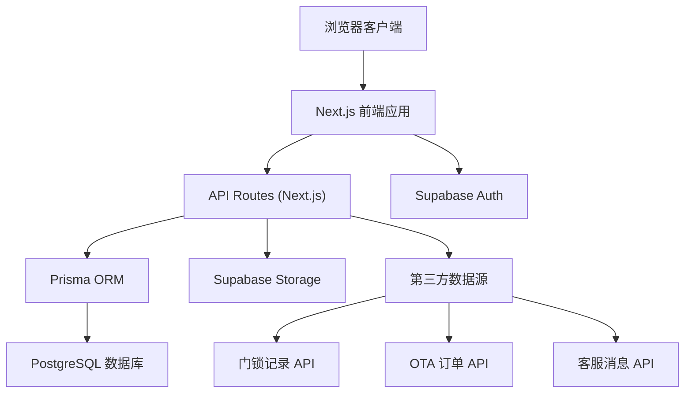
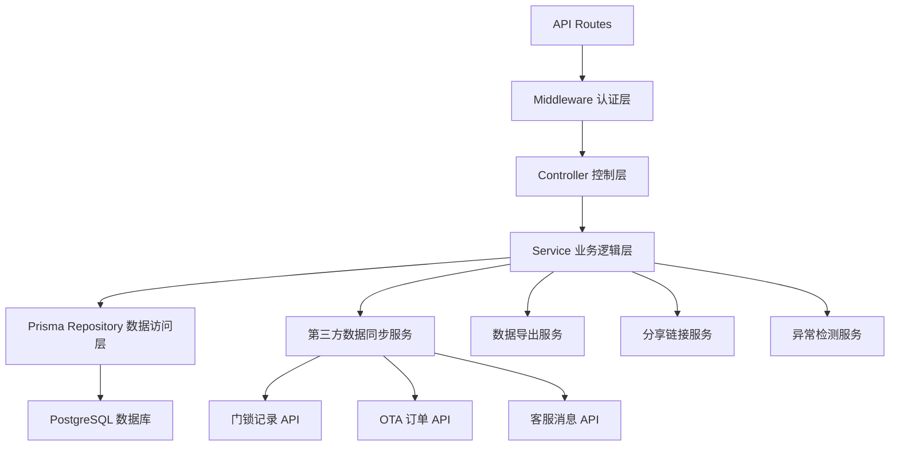
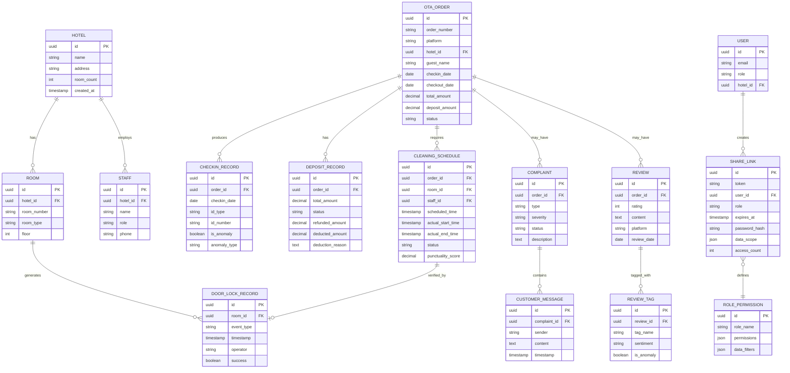

## 1. 架构设计



## 2. 技术栈说明

- **前端框架**：Next.js 14 (App Router) + React 18 + TypeScript
- **样式方案**：TailwindCSS 3 + CSS Variables
- **图表库**：Recharts 2.10
- **ORM**：Prisma 5.x
- **数据库**：PostgreSQL 15
- **身份认证**：Supabase Auth
- **文件存储**：Supabase Storage
- **数据导出**：xlsx (Excel)、jspdf (PDF)、html2canvas (图片)
- **状态管理**：React Context + useSWR
- **初始化工具**：create-next-app

## 3. 路由定义

| 路由 | 页面/用途 | 权限要求 |
|------|-----------|----------|
| `/` | 监测仪表盘首页 | 登录用户 |
| `/checkin-trend` | 入住证件趋势 | 登录用户 |
| `/deposit-detail` | 押金明细构成 | 登录用户 |
| `/complaint-evidence` | 客诉证据明细 | 登录用户 |
| `/review-anomaly` | 点评标签异常 | 登录用户 |
| `/share/[token]` | 分享链接访问页 | 公开（带权限token） |
| `/api/auth/[...nextauth]` | 认证接口 | 公开 |
| `/api/dashboard` | 仪表盘数据接口 | 登录用户 |
| `/api/checkin` | 入住证件数据接口 | 登录用户 |
| `/api/deposit` | 押金数据接口 | 登录用户 |
| `/api/complaint` | 客诉数据接口 | 登录用户 |
| `/api/review` | 点评数据接口 | 登录用户 |
| `/api/share` | 分享链接管理 | 登录用户 |
| `/api/export` | 数据导出接口 | 登录用户 |
| `/api/refresh` | 数据刷新接口 | 登录用户 |

## 4. API 数据定义

### 4.1 核心数据类型

```typescript
// 保洁准时率口径
export interface CleaningPunctuality {
  onTimeCount: number;
  delayedCount: number;
  totalCount: number;
  punctualityRate: number;
  timeRange: { start: Date; end: Date };
  calculationRule: string; // 保洁准时率计算规则说明
}

// 入住证件记录
export interface CheckinRecord {
  id: string;
  date: Date;
  hotelId: string;
  hotelName: string;
  idType: 'id_card' | 'passport' | 'other';
  totalCount: number;
  anomalyCount: number;
  anomalyRate: number;
  anomalyType: string[];
}

// 押金明细
export interface DepositRecord {
  id: string;
  orderId: string;
  guestName: string;
  hotelName: string;
  totalAmount: number;
  status: 'collected' | 'refunded' | 'deducted' | 'pending';
  collectedAmount: number;
  refundedAmount: number;
  deductedAmount: number;
  deductionReason?: string;
  createdAt: Date;
  updatedAt: Date;
}

// 客诉证据
export interface ComplaintEvidence {
  id: string;
  orderId: string;
  guestName: string;
  hotelName: string;
  complaintType: string;
  severity: 'low' | 'medium' | 'high';
  messages: CustomerMessage[];
  relatedRecords: {
    doorLockRecords: string[];
    cleaningRecords: string[];
  };
  createdAt: Date;
  resolvedAt?: Date;
  status: 'open' | 'processing' | 'resolved';
}

// 客服消息
export interface CustomerMessage {
  id: string;
  sender: 'guest' | 'staff' | 'system';
  content: string;
  timestamp: Date;
  attachments?: string[];
}

// 点评标签
export interface ReviewTag {
  id: string;
  tagName: string;
  count: number;
  sentiment: 'positive' | 'neutral' | 'negative';
  isAnomaly: boolean;
  anomalyReason?: string;
  trend: 'up' | 'down' | 'stable';
  relatedReviews: string[];
}

// 门锁记录
export interface DoorLockRecord {
  id: string;
  hotelId: string;
  roomNumber: string;
  eventType: 'checkin' | 'checkout' | 'cleaning' | 'unauthorized';
  timestamp: Date;
  operator: string;
  success: boolean;
}

// OTA 订单
export interface OTAOrder {
  id: string;
  orderNumber: string;
  platform: string;
  hotelName: string;
  guestName: string;
  checkinDate: Date;
  checkoutDate: Date;
  roomType: string;
  totalAmount: number;
  depositAmount: number;
  status: 'confirmed' | 'checked_in' | 'checked_out' | 'cancelled';
  createdAt: Date;
}

// 分享链接
export interface ShareLink {
  id: string;
  token: string;
  role: 'admin' | 'manager' | 'supervisor' | 'investor';
  createdBy: string;
  expiresAt?: Date;
  password?: string;
  dataScope: {
    hotelIds?: string[];
    timeRange?: { start: Date; end: Date };
  };
  createdAt: Date;
  lastAccessedAt?: Date;
  accessCount: number;
}
```

### 4.2 接口响应格式

```typescript
// 统一响应格式
interface ApiResponse<T> {
  success: boolean;
  data?: T;
  error?: {
    code: string;
    message: string;
    details?: Record<string, any>;
  };
  metadata: {
    lastRefreshedAt: Date;
    dataScope: DataScope;
    punctualityRate: number; // 保洁准时率口径
  };
}

interface DataScope {
  role: string;
  hotelIds?: string[];
  timeRange: { start: Date; end: Date };
}
```

## 5. 服务端架构



## 6. 数据模型

### 6.1 ER 图



### 6.2 Prisma Schema 定义

```prisma
generator client {
  provider = "prisma-client-js"
}

datasource db {
  provider = "postgresql"
  url      = env("DATABASE_URL")
}

model Hotel {
  id        String   @id @default(uuid())
  name      String
  address   String
  roomCount Int
  createdAt DateTime @default(now())
  rooms     Room[]
  staff     Staff[]
  orders    OtaOrder[]
  users     User[]
}

model Room {
  id           String           @id @default(uuid())
  hotelId      String
  roomNumber   String
  roomType     String
  floor        Int
  hotel        Hotel            @relation(fields: [hotelId], references: [id])
  doorRecords  DoorLockRecord[]
  schedules    CleaningSchedule[]
}

model Staff {
  id        String   @id @default(uuid())
  hotelId   String
  name      String
  role      String
  phone     String
  hotel     Hotel    @relation(fields: [hotelId], references: [id])
  schedules CleaningSchedule[]
}

model OtaOrder {
  id              String             @id @default(uuid())
  orderNumber     String             @unique
  platform        String
  hotelId         String
  guestName       String
  checkinDate     DateTime
  checkoutDate    DateTime
  totalAmount     Decimal            @db.Decimal(10, 2)
  depositAmount   Decimal            @db.Decimal(10, 2)
  status          String
  createdAt       DateTime           @default(now())
  hotel           Hotel              @relation(fields: [hotelId], references: [id])
  checkinRecords  CheckinRecord[]
  deposits        DepositRecord[]
  complaints      Complaint[]
  reviews         Review[]
  schedules       CleaningSchedule[]
}

model CheckinRecord {
  id           String     @id @default(uuid())
  orderId      String
  checkinDate  DateTime
  idType       String
  idNumber     String
  isAnomaly    Boolean    @default(false)
  anomalyType  String?
  order        OtaOrder   @relation(fields: [orderId], references: [id])
}

model DepositRecord {
  id               String     @id @default(uuid())
  orderId          String
  totalAmount      Decimal    @db.Decimal(10, 2)
  status           String
  refundedAmount   Decimal    @default(0) @db.Decimal(10, 2)
  deductedAmount   Decimal    @default(0) @db.Decimal(10, 2)
  deductionReason  String?
  createdAt        DateTime   @default(now())
  updatedAt        DateTime   @updatedAt
  order            OtaOrder   @relation(fields: [orderId], references: [id])
}

model Complaint {
  id         String            @id @default(uuid())
  orderId    String
  type       String
  severity   String
  status     String
  description String?
  createdAt  DateTime          @default(now())
  order      OtaOrder          @relation(fields: [orderId], references: [id])
  messages   CustomerMessage[]
}

model CustomerMessage {
  id          String     @id @default(uuid())
  complaintId String
  sender      String
  content     String
  timestamp   DateTime
  attachments String[]
  complaint   Complaint  @relation(fields: [complaintId], references: [id])
}

model Review {
  id         String      @id @default(uuid())
  orderId    String
  rating     Int
  content    String
  platform   String
  reviewDate DateTime
  order      OtaOrder    @relation(fields: [orderId], references: [id])
  tags       ReviewTag[]
}

model ReviewTag {
  id         String  @id @default(uuid())
  reviewId   String
  tagName    String
  sentiment  String
  isAnomaly  Boolean @default(false)
  review     Review  @relation(fields: [reviewId], references: [id])
}

model CleaningSchedule {
  id                String          @id @default(uuid())
  orderId           String?
  roomId            String
  staffId           String?
  scheduledTime     DateTime
  actualStartTime   DateTime?
  actualEndTime     DateTime?
  status            String
  punctualityScore  Decimal?        @db.Decimal(5, 2)
  order             OtaOrder?       @relation(fields: [orderId], references: [id])
  room              Room            @relation(fields: [roomId], references: [id])
  staff             Staff?          @relation(fields: [staffId], references: [id])
  doorLockRecords   DoorLockRecord[]
}

model DoorLockRecord {
  id                String              @id @default(uuid())
  roomId            String
  cleaningScheduleId String?
  eventType         String
  timestamp         DateTime
  operator          String
  success           Boolean
  room              Room                @relation(fields: [roomId], references: [id])
  cleaningSchedule  CleaningSchedule?   @relation(fields: [cleaningScheduleId], references: [id])
}

model User {
  id        String      @id @default(uuid())
  email     String      @unique
  role      String
  hotelId   String?
  hotel     Hotel?      @relation(fields: [hotelId], references: [id])
  shareLinks ShareLink[]
}

model ShareLink {
  id           String   @id @default(uuid())
  token        String   @unique
  userId       String
  role         String
  expiresAt    DateTime?
  passwordHash String?
  dataScope    Json
  accessCount  Int      @default(0)
  createdAt    DateTime @default(now())
  lastAccessed DateTime?
  user         User     @relation(fields: [userId], references: [id])
}

model RolePermission {
  id           String @id @default(uuid())
  roleName     String @unique
  permissions  Json
  dataFilters  Json
}
```

### 6.3 数据库索引建议

```sql
-- 时间范围查询优化
CREATE INDEX idx_ota_order_checkin_date ON ota_order(checkin_date);
CREATE INDEX idx_checkin_record_date ON checkin_record(checkin_date);
CREATE INDEX idx_cleaning_schedule_time ON cleaning_schedule(scheduled_time);
CREATE INDEX idx_door_lock_timestamp ON door_lock_record(timestamp);

-- 外键索引（Prisma自动创建，但确认一下）
CREATE INDEX idx_ota_order_hotel_id ON ota_order(hotel_id);
CREATE INDEX idx_complaint_order_id ON complaint(order_id);
CREATE INDEX idx_review_order_id ON review(order_id);

-- 状态查询优化
CREATE INDEX idx_cleaning_schedule_status ON cleaning_schedule(status);
CREATE INDEX idx_deposit_status ON deposit_record(status);
CREATE INDEX idx_complaint_severity ON complaint(severity);

-- 全文搜索
CREATE EXTENSION IF NOT EXISTS pg_trgm;
CREATE INDEX idx_customer_message_content ON customer_message USING gin (content gin_trgm_ops);
CREATE INDEX idx_review_content ON review USING gin (content gin_trgm_ops);
```
