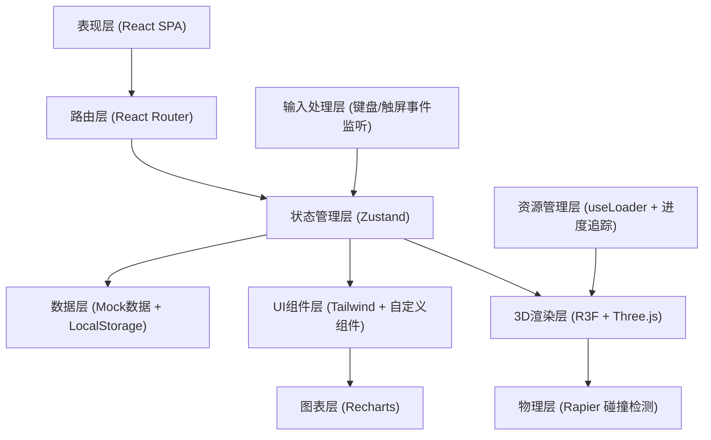
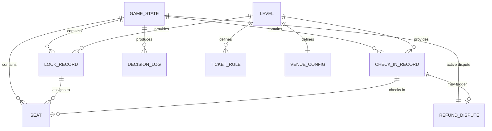

## 1. 架构设计



## 2. 技术说明

- **前端框架**：React@18 + TypeScript + Vite
- **3D引擎**：three@^0.160 + @react-three/fiber@^8.15 + @react-three/drei@^9.92
- **物理引擎**：@react-three/rapier@^0.22（用于座位点击拾取与碰撞检测）
- **后期处理**：@react-three/postprocessing@^2.15（Bloom、Vignette效果）
- **状态管理**：zustand@^4.48（游戏状态、关卡进度、UI状态）
- **样式方案**：tailwindcss@^3.4.0 + 自定义 CSS 变量主题系统
- **图表库**：recharts@^2.10（上座率变化曲线图）
- **图标库**：lucide-react@^0.294
- **动画库**：framer-motion@^10.17（UI动画、页面过渡）
- **路由**：react-router-dom@^6.21
- **数据持久化**：LocalStorage（保存关卡进度与最佳成绩）
- **后端**：无（纯前端应用，使用 Mock 数据）
- **初始化工具**：vite-init（react-ts 模板）

## 3. 路由定义

| 路由 | 用途 |
|------|------|
| `/` | 主入口页，正式训练 / 自由练习模式选择 |
| `/levels` | 关卡选择页，列出所有可玩关卡 |
| `/play/:levelId` | 游戏主场景页，包含四个阶段 |
| `/play/:levelId/review` | 复盘页，查看评分与上座率变化 |

## 4. 数据模型

### 4.1 类型定义（TypeScript）

```typescript
// 票种类型
type TicketType = 'VIP' | 'PREMIUM' | 'STANDARD' | 'ECONOMY';

// 座位状态
type SeatStatus = 'AVAILABLE' | 'LOCKED' | 'SOLD' | 'CHECKED_IN' | 'REFUNDED' | 'CONFLICT';

// 游戏阶段
type GamePhase = 'RULES' | 'LOCKING' | 'CHECKING' | 'REVIEW';

// 训练模式
type PlayMode = 'FORMAL' | 'PRACTICE';

// 座位接口
interface Seat {
  id: string;
  row: string;
  number: number;
  x: number;
  y: number;
  z: number;
  ticketType: TicketType;
  status: SeatStatus;
  orderId?: string;
  price: number;
}

// 票种规则
interface TicketRule {
  type: TicketType;
  name: string;
  price: number;
  color: string;
  description: string;
  quota: number;
  specialRules?: string[];
  rowRange: [string, string];
}

// 锁座记录
interface LockRecord {
  id: string;
  orderId: string;
  ticketType: TicketType;
  seatCount: number;
  timestamp: number;
  customerName: string;
  note?: string;
  assignedSeats: string[];
  isConflict: boolean;
  conflictReason?: string;
}

// 核销记录
interface CheckInRecord {
  id: string;
  code: string;
  orderId: string;
  expectedCount: number;
  actualCount: number;
  checkedSeats: string[];
  timestamp: number;
  hasDispute: boolean;
  disputeReason?: string;
}

// 退票争议
interface RefundDispute {
  id: string;
  checkInId: string;
  orderId: string;
  reason: string;
  affectedSeats: string[];
  options: RefundOption[];
}

interface RefundOption {
  id: string;
  label: string;
  description: string;
  scoreDelta: number;
  occupancyImpact: number;
}

// 关卡配置
interface Level {
  id: string;
  name: string;
  description: string;
  difficulty: 1 | 2 | 3 | 4 | 5;
  venueConfig: VenueConfig;
  ticketRules: TicketRule[];
  lockRecords: LockRecord[];
  checkInRecords: CheckInRecord[];
  targetScore: number;
  targetOccupancy: number;
  unlockCondition?: string;
}

// 场馆配置
interface VenueConfig {
  rows: string[];
  seatsPerRow: number;
  stagePosition: { x: number; y: number; z: number };
  sections: { name: string; rows: string[]; ticketType: TicketType }[];
}

// 游戏状态
interface GameState {
  mode: PlayMode;
  currentLevelId: string | null;
  phase: GamePhase;
  score: number;
  seats: Seat[];
  lockRecords: LockRecord[];
  checkInRecords: CheckInRecord[];
  activeLockRecordId: string | null;
  activeCheckInId: string | null;
  currentDispute: RefundDispute | null;
  decisionHistory: DecisionLog[];
  loadingProgress: number;
  isLoading: boolean;
}

// 决策日志（用于复盘回退）
interface DecisionLog {
  id: string;
  timestamp: number;
  phase: GamePhase;
  action: string;
  targetId: string;
  seatIds: string[];
  scoreDelta: number;
  occupancyDelta: number;
  canRollback: boolean;
}

// 关卡进度
interface LevelProgress {
  levelId: string;
  bestScore: number;
  bestOccupancy: number;
  completedCount: number;
  isUnlocked: boolean;
}

// 复盘数据点
interface OccupancyDataPoint {
  timeLabel: string;
  timestamp: number;
  currentOccupancy: number;
  optimalOccupancy: number;
  phase: GamePhase;
}
```

### 4.2 状态切片设计



## 5. 核心模块划分

```
src/
├── components/              # 复用组件
│   ├── ui/                  # 基础UI组件（按钮、卡片、模态框等）
│   ├── game/                # 游戏相关组件
│   │   ├── PhaseStepper.tsx    # 阶段指示器
│   │   ├── ScoreHUD.tsx        # 评分HUD
│   │   ├── RulesPanel.tsx      # 票种规则面板
│   │   ├── LockListPanel.tsx   # 锁座记录面板
│   │   ├── CheckInPanel.tsx    # 核销记录面板
│   │   ├── DisputeModal.tsx    # 退票争议弹窗
│   │   └── LoadingScreen.tsx   # 加载进度界面
│   ├── scene/               # 3D场景组件
│   │   ├── VenueScene.tsx      # 场馆主场景
│   │   ├── SeatsGroup.tsx      # 座位组（InstancedMesh）
│   │   ├── Stage.tsx           # 舞台组件
│   │   └── CameraRig.tsx       # 相机动画控制
│   └── review/              # 复盘页组件
│       ├── OccupancyChart.tsx  # 上座率折线图
│       ├── ScoreBreakdown.tsx  # 得分明细表
│       └── StatCards.tsx       # 统计卡片组
├── pages/                   # 路由页面
│   ├── HomePage.tsx            # 主入口页
│   ├── LevelSelectPage.tsx     # 关卡选择页
│   ├── GamePlayPage.tsx        # 游戏主场景页
│   └── ReviewPage.tsx          # 复盘页
├── hooks/                   # 自定义 Hooks
│   ├── useGameState.ts         # 游戏状态管理hook
│   ├── useKeyboardControls.ts  # 键盘操作hook
│   ├── useTouchControls.ts     # 触屏操作hook
│   ├── useSceneLoader.ts       # 场景加载与进度追踪hook
│   └── useLevelProgress.ts     # 关卡进度持久化hook
├── store/                   # Zustand stores
│   ├── gameStore.ts            # 游戏核心状态
│   └── progressStore.ts        # 进度与成绩持久化
├── data/                    # Mock 数据与关卡配置
│   ├── levels.ts               # 所有关卡定义
│   └── seatGenerator.ts        # 座位数据生成器
├── utils/                   # 工具函数
│   ├── scoreCalculator.ts      # 分数计算引擎
│   ├── conflictDetector.ts     # 冲突检测逻辑
│   ├── disputeGenerator.ts     # 退票争议生成器
│   ├── occupancyTracker.ts     # 上座率追踪器
│   └── sceneHelpers.ts         # 3D场景辅助函数
├── types/                   # 全局类型定义
│   └── index.ts
├── styles/                  # 全局样式与主题
│   ├── globals.css
│   └── theme.css
├── App.tsx
├── main.tsx
└── router.tsx
```

## 6. 核心算法说明

### 6.1 评分计算引擎 (scoreCalculator.ts)

- **基础分**：每个正确分配的锁座记录 = 票种价格 × 座位数 × 难度系数
- **冲突扣分**：座位冲突 = -50分/次；票种区域错误 = -30分/次
- **核销加分**：准确核销 = +20分/人；超额核销加成分
- **争议处理**：合理方案 +10~30分；不合理方案 -20~40分
- **最终得分**：(基础分 + 核销加分 + 争议加分 - 所有扣分) × 速度奖励系数
- **上座率** = 已核销座位数 / 总可售座位数 × 100%

### 6.2 冲突检测逻辑 (conflictDetector.ts)

- 同一座位被多条锁座记录分配 → 座位冲突
- 分配的座位票种与订单要求票种不匹配 → 类型冲突
- VIP区域座位分配给普通票订单 → 区域越权
- 锁座数量与订单要求座位数不一致 → 数量不符

### 6.3 退票争议触发器 (disputeGenerator.ts)

- 根据核销不匹配概率（可配置）随机触发
- 争议类型：座位不满意、重复购票、活动改期、价格争议
- 每种争议类型提供2-3种处理选项，选项影响得分和上座率
