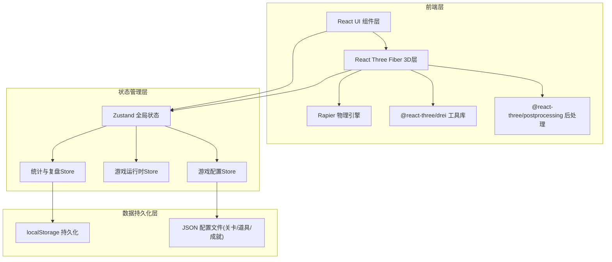
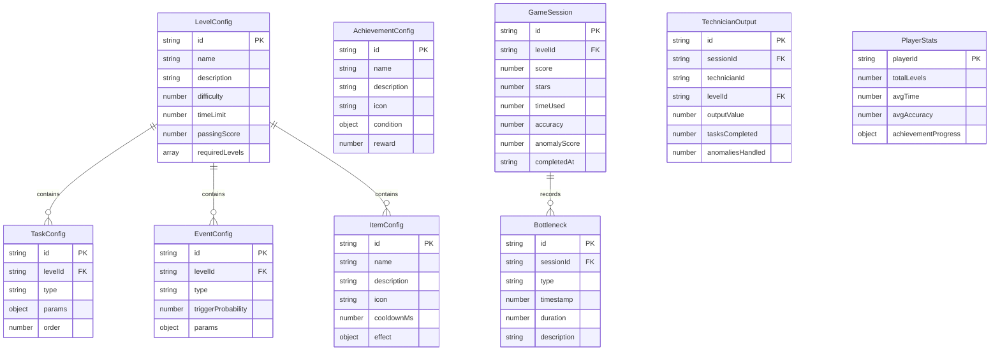

## 1. 架构设计



## 2. 技术说明

- **前端框架**：React 18 + TypeScript + Vite
- **3D渲染**：Three.js + @react-three/fiber + @react-three/drei + @react-three/postprocessing
- **物理引擎**：@react-three/rapier（用于卡片拖拽碰撞检测与物理反馈）
- **状态管理**：Zustand（轻量、支持中间件、易持久化）
- **路由**：React Router v6
- **样式**：Tailwind CSS 3
- **图表**：Recharts（统计页/复盘页可视化）
- **动画**：@react-spring/three（3D动画）+ framer-motion（UI动画）
- **初始化工具**：Vite
- **后端**：无（纯前端，数据存储在 localStorage）
- **数据库**：无（JSON 配置文件 + localStorage 持久化）

## 3. 路由定义

| 路由 | 用途 |
|------|------|
| `/` | 主页面：关卡选择、成就展示、快速入口 |
| `/game/:levelId` | 游戏页面：3D交互场景 |
| `/settlement/:levelId` | 结算页面：得分评级、产值记录 |
| `/stats` | 统计页面：技师产值汇总、训练总览 |
| `/review` | 复盘页面：关卡对比、卡点分析 |
| `/admin` | 管理页面：配置关卡/道具/成就规则 |

## 4. 数据模型

### 4.1 数据模型定义



### 4.2 配置文件结构

关卡配置以 JSON 文件存放于 `src/config/levels/`，道具配置于 `src/config/items.json`，成就配置于 `src/config/achievements.json`，运行时由 Zustand store 加载，管理员可通过 UI 修改并持久化到 localStorage。

```json
// src/config/levels/level-001.json 示例
{
  "id": "level-001",
  "name": "基础手牌匹配",
  "description": "学习基本的手牌与消费记录匹配",
  "difficulty": 1,
  "timeLimit": 120,
  "passingScore": 60,
  "requiredLevels": [],
  "tasks": [
    {
      "id": "task-001",
      "type": "match-record",
      "params": {
        "recordCount": 5,
        "technicianCount": 3,
        "allowMismatch": false
      },
      "order": 1
    },
    {
      "id": "task-002",
      "type": "inventory-requisition",
      "params": {
        "itemTypes": ["面膜", "精华液", "按摩油"],
        "requiredCount": 3
      },
      "order": 2
    }
  ],
  "events": [
    {
      "id": "event-001",
      "type": "consumable-expired",
      "triggerProbability": 0.3,
      "params": {
        "itemName": "面膜",
        "timeLimit": 15
      }
    }
  ]
}
```

## 5. 项目结构

```
src/
├── config/
│   ├── levels/           # 关卡配置JSON
│   │   ├── level-001.json
│   │   ├── level-002.json
│   │   └── ...
│   ├── items.json        # 道具配置
│   └── achievements.json # 成就配置
├── stores/
│   ├── useGameStore.ts   # 游戏运行时状态
│   ├── useConfigStore.ts # 配置管理状态
│   ├── useStatsStore.ts  # 统计与复盘状态
│   └── useUIStore.ts     # UI状态(面板展开等)
├── components/
│   ├── 3d/               # 3D场景组件
│   │   ├── SalonScene.tsx
│   │   ├── DraggableCard.tsx
│   │   ├── HandBadge.tsx
│   │   ├── InventoryCabinet.tsx
│   │   ├── EffectPhoto.tsx
│   │   ├── ParticleBurst.tsx
│   │   └── Lighting.tsx
│   ├── ui/               # 2D UI组件
│   │   ├── TimerBar.tsx
│   │   ├── ItemBar.tsx
│   │   ├── EventPanel.tsx
│   │   ├── ScoreBoard.tsx
│   │   └── HUD.tsx
│   └── pages/            # 页面组件
│       ├── HomePage.tsx
│       ├── GamePage.tsx
│       ├── SettlementPage.tsx
│       ├── StatsPage.tsx
│       ├── ReviewPage.tsx
│       └── AdminPage.tsx
├── hooks/
│   ├── useDrag.ts        # 3D拖拽逻辑
│   ├── useTimer.ts       # 计时器逻辑
│   ├── useEventSystem.ts # 突发事件系统
│   └── useItemSystem.ts  # 道具系统(含冷却)
├── utils/
│   ├── scoring.ts        # 评分计算
│   ├── bottleneck.ts     # 卡点检测算法
│   └── persistence.ts    # localStorage封装
├── types/
│   └── index.ts          # TypeScript类型定义
├── App.tsx
├── main.tsx
└── index.css
```
