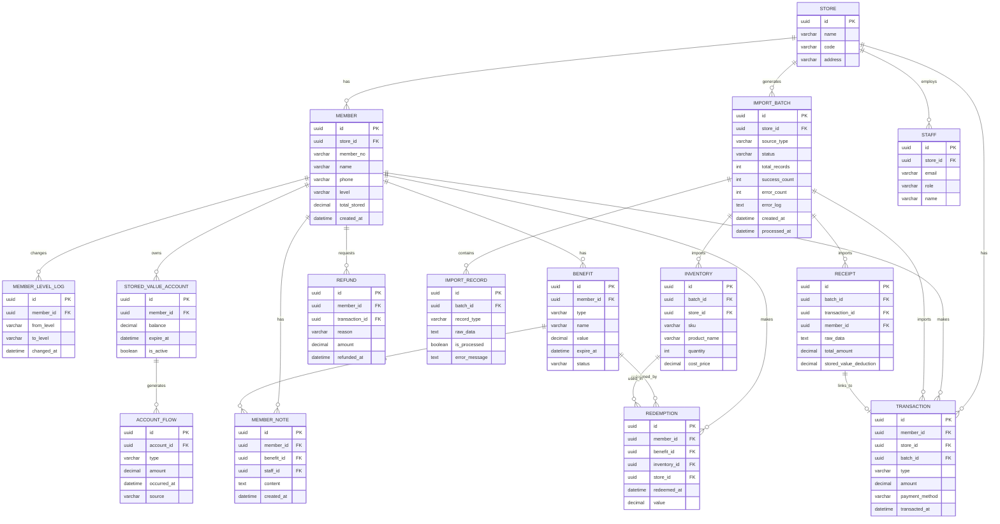

# 连锁咖啡会员储值风险监测系统 - 技术架构文档

## 1. 技术选型

| 层级 | 技术 | 版本 | 说明 |
|------|------|------|------|
| 前端框架 | Next.js | 14+ | App Router, SSR/SSG |
| UI 样式 | Tailwind CSS | 3.4+ | 原子化 CSS |
| 图表库 | Recharts | 2.12+ | React 图表组件库 |
| ORM | Prisma | 5.10+ | 类型安全的数据库访问 |
| 数据库 | PostgreSQL | 15+ | 关系型数据库 |
| BaaS/认证 | Supabase | - | 认证 + 实时数据库 + 存储 |
| 语言 | TypeScript | 5.4+ | 类型安全 |

---

## 2. 系统架构

### 2.1 整体架构图

```mermaid
graph TB
    subgraph "前端层 (Next.js)"
        A[管理层总览仪表盘] --> B[分析区图表]
        C[一线人员明细页] --> D[续费率表格]
        E[数据导入页] --> F[批次管理]
        G[权益过期页] --> H[注释功能]
        I[登录/权限控制]
    end
    
    subgraph "API 层 (Next.js Route Handlers)"
        J[/api/auth/* 认证]
        K[/api/dashboard/* 仪表盘数据]
        L[/api/import/* 数据导入]
        M[/api/members/* 会员管理]
        N[/api/analytics/* 分析数据]
    end
    
    subgraph "服务层 (Supabase)"
        O[Authentication]
        P[PostgreSQL Database]
        Q[Row Level Security]
        R[Storage]
    end
    
    subgraph "数据层 (Prisma ORM)"
        S[数据模型]
        T[数据迁移]
        U[种子数据]
    end
    
    I --> J
    A --> K
    C --> K
    E --> L
    G --> M
    B --> N
    D --> N
    H --> M
    
    J --> O
    K --> S
    L --> S
    M --> S
    N --> S
    S --> P
    S --> T
    S --> U
    Q --> P
```

### 2.2 目录结构

```
MP0014/
├── .trae/documents/
├── app/
│   ├── layout.tsx                 # 根布局
│   ├── page.tsx                   # 首页重定向
│   ├── login/
│   │   └── page.tsx               # 登录页
│   ├── dashboard/
│   │   ├── layout.tsx             # 仪表盘布局（含权限检查）
│   │   ├── page.tsx               # 管理层总览
│   │   ├── analytics/
│   │   │   └── page.tsx           # 分析区
│   │   ├── stores/
│   │   │   └── [storeId]/
│   │   │       └── renewal/
│   │   │           └── page.tsx   # 一线续费率明细
│   │   ├── benefits/
│   │   │   └── page.tsx           # 权益过期管理
│   │   └── import/
│   │       └── page.tsx           # 数据导入与批次管理
├── components/
│   ├── charts/                    # Recharts 图表组件
│   │   ├── FlowDistribution.tsx   # 账户流水分布
│   │   ├── LevelFunnel.tsx        # 等级变化漏斗
│   │   ├── RedemptionRanking.tsx  # 核销记录排行
│   │   └── RefundTrend.tsx        # 退款原因变化
│   ├── layout/                    # 布局组件
│   ├── ui/                        # 基础 UI 组件
│   └── tables/                    # 数据表格组件
├── lib/
│   ├── prisma.ts                  # Prisma Client 单例
│   ├── supabase/
│   │   ├── client.ts              # 浏览器端 Supabase
│   │   ├── server.ts              # 服务端 Supabase
│   │   └── middleware.ts          # 认证中间件
│   ├── permissions.ts             # 权限检查工具
│   └── data-processing/           # 数据加工逻辑
│       ├── receipt.ts             # 小票处理
│       ├── inventory.ts           # 库存处理
│       ├── pos.ts                 # POS流水处理
│       └── batch.ts               # 批次管理
├── prisma/
│   ├── schema.prisma              # 数据模型
│   ├── migrations/                # 数据库迁移
│   └── seed.ts                    # 种子数据
├── public/
├── types/                         # TypeScript 类型定义
└── middleware.ts                  # Next.js 中间件（认证 + RLS）
```

---

## 3. 数据模型设计

### 3.1 ER 图



### 3.2 核心表说明

#### 3.2.1 权限相关
- `Staff`：员工表，关联门店与角色（manager / store_staff）
- `Store`：门店表，数据隔离的基本单位

#### 3.2.2 会员与储值
- `Member`：会员主表，含等级、累计储值
- `StoredValueAccount`：储值账户，追踪余额与有效期
- `AccountFlow`：账户流水，充值/消费/退款明细
- `MemberLevelLog`：等级变更历史

#### 3.2.3 权益与核销
- `Benefit`：权益表（优惠券、储值金等），含过期时间
- `Redemption`：核销记录表
- `MemberNote`：会员注释（用于权益过期跟进）

#### 3.2.4 数据导入
- `ImportBatch`：导入批次表，批次可追溯
- `ImportRecord`：批次内单条记录，含原始数据与错误信息
- `Receipt`：会员小票原始数据
- `Inventory`：库存数据
- `Transaction`：POS 流水（关联小票）

---

## 4. 权限体系设计

### 4.1 角色定义
```
manager     管理层：全门店数据可见
store_staff 一线人员：仅可见所属门店数据
```

### 4.2 行级安全 (RLS) 策略
基于 Supabase PostgreSQL RLS：

```sql
-- 启用 RLS
ALTER TABLE member ENABLE ROW LEVEL SECURITY;
ALTER TABLE transaction ENABLE ROW LEVEL SECURITY;
ALTER TABLE stored_value_account ENABLE ROW LEVEL SECURITY;

-- 管理层：可见全部
CREATE POLICY "manager_all_access" ON member
  FOR ALL USING (auth.jwt() ->> 'role' = 'manager');

-- 一线人员：仅本店
CREATE POLICY "staff_store_access" ON member
  FOR SELECT USING (
    store_id IN (
      SELECT store_id FROM staff WHERE id = auth.uid()
    )
  );
```

### 4.3 前端路由保护
通过 `middleware.ts` 统一拦截，配合 `lib/permissions.ts` 工具函数。

---

## 5. 数据加工流程

### 5.1 指标加工流水线

```
输入文件 (CSV/Excel)
    ↓
上传至 Supabase Storage
    ↓
创建 ImportBatch (status: pending)
    ↓
[1] 小票处理 (lib/data-processing/receipt.ts)
    - 字段映射标准化
    - 会员匹配 / 自动建档
    - 异常数据标记
    ↓
[2] 库存关联 (lib/data-processing/inventory.ts)
    - SKU 匹配
    - 成本核算
    - 库存变动校验
    ↓
[3] POS 流水合并 (lib/data-processing/pos.ts)
    - 交易完整性校验
    - 支付方式归类
    - 储值抵扣核对
    ↓
[4] 指标计算
    - 账户余额更新
    - 等级变更判定
    - 续费率计算
    - 核销/退款统计
    ↓
更新 ImportBatch (status: completed / failed)
    ↓
记录 ImportRecord 明细
```

### 5.2 续费率计算逻辑
```
续费率 = 周期内续费会员数 / 周期内应续费会员数

周期内应续费会员 = 储值账户余额 < 阈值 OR 权益即将过期
```

---

## 6. API 设计

### 6.1 认证
| 方法 | 路径 | 说明 |
|------|------|------|
| POST | `/api/auth/login` | 邮箱密码登录 |
| POST | `/api/auth/logout` | 登出 |
| GET | `/api/auth/session` | 获取当前会话 |

### 6.2 仪表盘
| 方法 | 路径 | 说明 |
|------|------|------|
| GET | `/api/dashboard/overview` | 总览指标（管理层） |
| GET | `/api/dashboard/store/:id` | 单门店指标 |
| GET | `/api/dashboard/stores` | 门店列表 |

### 6.3 分析区
| 方法 | 路径 | 说明 |
|------|------|------|
| GET | `/api/analytics/flow-distribution` | 账户流水分布 |
| GET | `/api/analytics/level-funnel` | 等级变化漏斗 |
| GET | `/api/analytics/redemption-ranking` | 核销排行 |
| GET | `/api/analytics/refund-trend` | 退款原因变化 |
| GET | `/api/analytics/renewal-rate` | 续费率明细 |

### 6.4 数据导入
| 方法 | 路径 | 说明 |
|------|------|------|
| POST | `/api/import/upload` | 上传文件并创建批次 |
| GET | `/api/import/batches` | 批次列表 |
| GET | `/api/import/batches/:id` | 批次详情（含回查） |
| POST | `/api/import/batches/:id/reprocess` | 重处理批次 |

### 6.5 会员与权益
| 方法 | 路径 | 说明 |
|------|------|------|
| GET | `/api/members` | 会员列表（按权限过滤） |
| GET | `/api/members/:id` | 会员详情 |
| GET | `/api/benefits/expiring` | 即将过期权益 |
| POST | `/api/members/:id/notes` | 添加注释 |
| GET | `/api/members/:id/notes` | 注释历史 |

---

## 7. 设计风格

### 7.1 美学定位
**高端数据仪表盘风格（Dark Theme + 咖啡金点缀）**
- 深色背景营造专业感和沉浸感
- 咖啡金（#6F4E37 / #A67B5B）作为品牌主色
- 数据可视化采用高对比渐变
- 大面积留白 + 精致卡片阴影

### 7.2 字体
- 标题：`Playfair Display`（优雅衬线）
- 正文数据：`JetBrains Mono`（等宽，提升数字可读性）
- 辅助文字：`Inter`

### 7.3 配色方案
| 用途 | 色值 |
|------|------|
| 主背景 | `#0F0D0B` |
| 卡片背景 | `#1A1613` |
| 咖啡金主色 | `#8B6F47` |
| 高亮金 | `#C9A961` |
| 成功绿 | `#4A8B5C` |
| 风险红 | `#B84A4A` |
| 中性文字 | `#E8E0D5` |
| 次要文字 | `#8B8378` |

### 7.4 动效原则
- 图表入场：渐入 + 数据增长动画
- 卡片悬停：微妙上浮 + 光晕
- 导航切换：平滑淡入淡出
- 数据刷新：骨架屏 → 内容过渡

---

## 8. 部署方案

- **平台**：Vercel（Next.js 原生支持）
- **数据库**：Supabase 托管 PostgreSQL
- **存储**：Supabase Storage
- **环境变量**：
  - `DATABASE_URL`
  - `NEXT_PUBLIC_SUPABASE_URL`
  - `NEXT_PUBLIC_SUPABASE_ANON_KEY`
  - `SUPABASE_SERVICE_ROLE_KEY`
