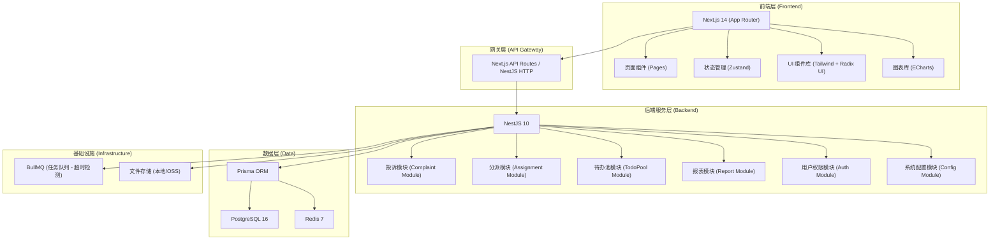
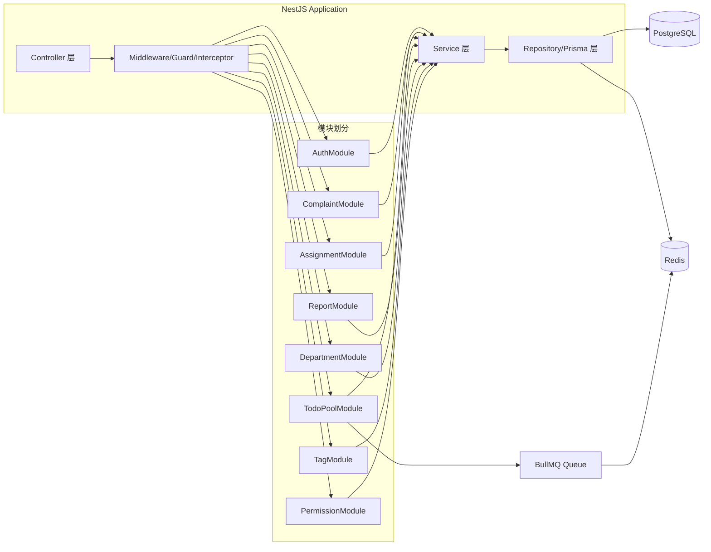
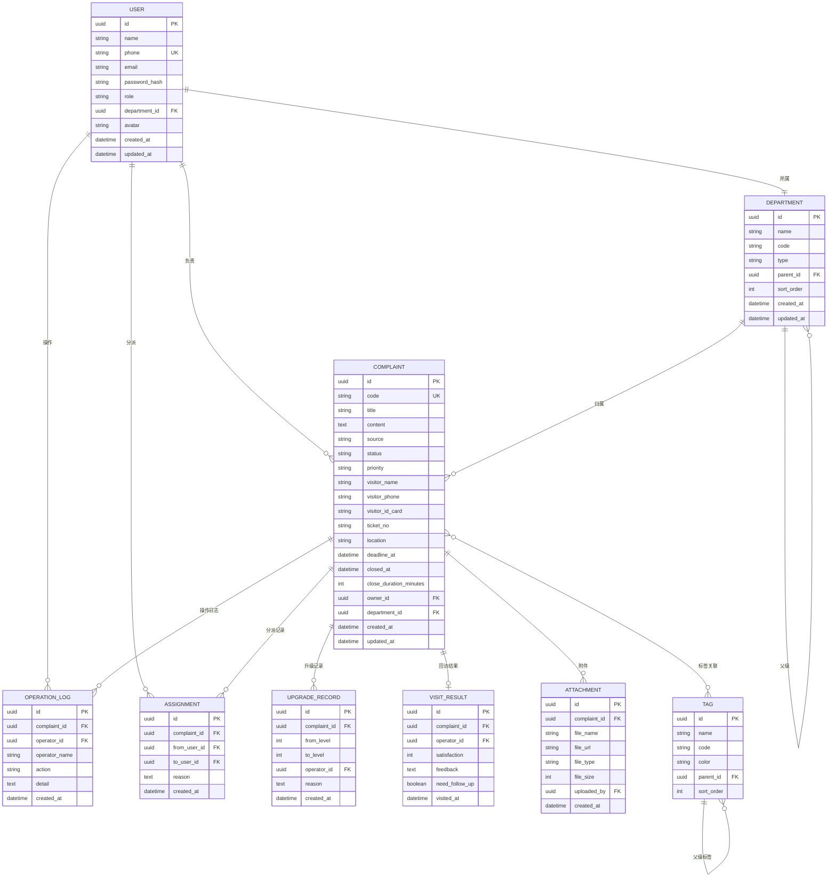
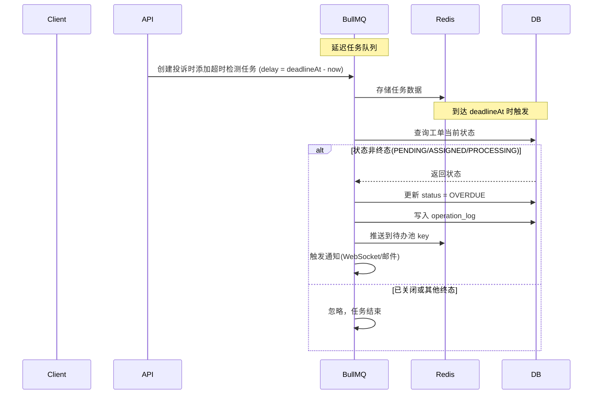

## 1. 架构设计



## 2. 技术描述

### 2.1 整体架构
- Monorepo 结构，使用 pnpm workspaces 管理前后端共享代码
- 前后端分离部署，通过 HTTP API 通信
- 共享类型定义 (types package) 确保接口一致性

### 2.2 前端技术栈
- **框架**：Next.js 14 (App Router, TypeScript)
- **样式**：Tailwind CSS 3 + CSS Variables 主题系统
- **组件**：Radix UI 基础组件 + 自定义业务组件
- **状态管理**：Zustand（轻量全局状态）+ React Query（服务端状态缓存）
- **图表**：ECharts 5（报表可视化）
- **表单**：React Hook Form + Zod 校验
- **HTTP 客户端**：Axios（带拦截器、Token 管理）
- **工具库**：dayjs（日期处理）、clsx/tailwind-merge（类名合并）

### 2.3 后端技术栈
- **框架**：NestJS 10 (TypeScript)
- **ORM**：Prisma 5（数据库访问、迁移管理）
- **数据库**：PostgreSQL 16（业务数据持久化）
- **缓存/队列**：Redis 7（会话缓存、任务队列、限流）
- **任务队列**：BullMQ（超时检测、定时任务、异步通知）
- **认证**：JWT（Access Token + Refresh Token）
- **权限**：CASL（基于角色的字段级权限控制）
- **校验**：class-validator + class-transformer
- **文档**：Swagger/OpenAPI（自动生成 API 文档）

### 2.4 项目初始化
- 根目录：pnpm workspaces monorepo
- 包管理：pnpm 8
- Node.js：v20 LTS
- 构建工具：Turborepo（增量构建缓存）
- 代码规范：ESLint + Prettier + Husky + lint-staged

## 3. 路由定义

### 3.1 前端路由 (Next.js App Router)

| 路由 | 页面 | 权限要求 |
|------|------|----------|
| `/login` | 登录页 | 公开 |
| `/` | 投诉任务分派台（首页） | 票务员及以上 |
| `/complaints/[id]` | 投诉详情页 | 票务员及以上 |
| `/todo-pool` | 待办池（超时/补材料/驳回） | 运营专员及以上 |
| `/reports` | 报表分析页 | 运营主管 |
| `/settings/departments` | 责任归属配置 | 运营主管 |
| `/settings/tags` | 问题标签管理 | 运营主管 |
| `/settings/permissions` | 角色与敏感字段配置 | 运营主管 |

### 3.2 后端 API 路由 (NestJS)

| 模块 | 方法 | 路由 | 说明 |
|------|------|------|------|
| Auth | POST | `/api/auth/login` | 用户登录 |
| Auth | POST | `/api/auth/refresh` | 刷新 Token |
| Users | GET | `/api/users` | 用户列表 |
| Users | GET | `/api/users/:id` | 用户详情 |
| Complaints | GET | `/api/complaints` | 投诉列表（分页+筛选） |
| Complaints | GET | `/api/complaints/:id` | 投诉详情 |
| Complaints | POST | `/api/complaints` | 创建投诉 |
| Complaints | PATCH | `/api/complaints/:id` | 更新投诉 |
| Complaints | POST | `/api/complaints/:id/assign` | 分派投诉 |
| Complaints | POST | `/api/complaints/:id/reassign` | 重新分派 |
| Complaints | POST | `/api/complaints/:id/reject` | 驳回重提 |
| Complaints | POST | `/api/complaints/:id/upgrade` | 升级处理 |
| Complaints | POST | `/api/complaints/:id/supplement` | 补充材料 |
| Complaints | POST | `/api/complaints/:id/visit` | 回访登记 |
| Complaints | POST | `/api/complaints/:id/close` | 关闭工单 |
| TodoPool | GET | `/api/todo-pool/overdue` | 超时任务列表 |
| TodoPool | GET | `/api/todo-pool/supplement` | 待补材料任务 |
| TodoPool | GET | `/api/todo-pool/rejected` | 被驳回任务 |
| Reports | GET | `/api/reports/close-duration` | 关闭时长统计 |
| Reports | GET | `/api/reports/date-trend` | 日期趋势数据 |
| Reports | GET | `/api/reports/owner-drill` | 负责人下钻数据 |
| Reports | GET | `/api/reports/export` | 报表导出 |
| Departments | GET | `/api/departments/tree` | 责任归属树 |
| Departments | CRUD | `/api/departments` | 部门/岗位/人员管理 |
| Tags | CRUD | `/api/tags` | 问题标签管理 |
| Permissions | GET | `/api/permissions/roles` | 角色列表 |
| Permissions | GET | `/api/permissions/sensitive-fields` | 敏感字段配置 |
| Permissions | PUT | `/api/permissions/sensitive-fields` | 更新敏感字段配置 |

## 4. API 类型定义

```typescript
// 用户角色
export type UserRole = 'VISITOR' | 'TICKET_STAFF' | 'PATROL_STAFF' | 'OPERATOR' | 'SUPERVISOR';

// 投诉状态
export type ComplaintStatus = 'PENDING' | 'ASSIGNED' | 'PROCESSING' | 'SUPPLEMENTING' | 'REJECTED' | 'OVERDUE' | 'VISITING' | 'CLOSED';

// 优先级
export type Priority = 'LOW' | 'MEDIUM' | 'HIGH' | 'URGENT';

// 用户
export interface User {
  id: string;
  name: string;
  phone: string;
  email?: string;
  role: UserRole;
  departmentId?: string;
  avatar?: string;
  createdAt: Date;
}

// 投诉工单
export interface Complaint {
  id: string;
  code: string;
  title: string;
  content: string;
  source: 'ONLINE' | 'TICKET' | 'ON_SITE' | 'PHONE';
  status: ComplaintStatus;
  priority: Priority;
  visitorName: string;
  visitorPhone: string;
  visitorIdCard?: string;
  ticketNo?: string;
  location?: string;
  deadlineAt: Date;
  closedAt?: Date;
  closeDuration?: number;
  ownerId?: string;
  owner?: User;
  departmentId?: string;
  department?: Department;
  tags: Tag[];
  attachments: Attachment[];
  visitResult?: VisitResult;
  createdAt: Date;
  updatedAt: Date;
  operationLogs: OperationLog[];
}

// 分派记录
export interface Assignment {
  id: string;
  complaintId: string;
  fromUserId?: string;
  toUserId: string;
  reason?: string;
  createdAt: Date;
}

// 升级记录
export interface UpgradeRecord {
  id: string;
  complaintId: string;
  fromLevel: number;
  toLevel: number;
  operatorId: string;
  reason: string;
  createdAt: Date;
}

// 回访结果
export interface VisitResult {
  id: string;
  complaintId: string;
  operatorId: string;
  satisfaction: 1 | 2 | 3 | 4 | 5;
  feedback: string;
  needFollowUp: boolean;
  visitedAt: Date;
}

// 操作日志
export interface OperationLog {
  id: string;
  complaintId: string;
  operatorId: string;
  operatorName: string;
  action: string;
  detail: string;
  createdAt: Date;
}

// 部门/责任归属
export interface Department {
  id: string;
  name: string;
  code: string;
  type: 'DEPARTMENT' | 'POSITION' | 'STAFF';
  parentId?: string;
  sortOrder: number;
  children?: Department[];
}

// 问题标签
export interface Tag {
  id: string;
  name: string;
  code: string;
  color: string;
  parentId?: string;
  sortOrder: number;
}

// 附件
export interface Attachment {
  id: string;
  complaintId: string;
  fileName: string;
  fileUrl: string;
  fileType: 'IMAGE' | 'VIDEO' | 'DOCUMENT';
  fileSize: number;
  uploadedBy: string;
  createdAt: Date;
}

// 敏感字段配置
export interface SensitiveFieldConfig {
  field: string;
  label: string;
  roles: UserRole[];
  maskPattern?: string;
}

// 列表响应
export interface PaginatedResponse<T> {
  items: T[];
  total: number;
  page: number;
  pageSize: number;
  totalPages: number;
}
```

## 5. 服务端架构图



## 6. 数据模型

### 6.1 ER 图



### 6.2 Prisma Schema

```prisma
// schema.prisma
generator client {
  provider = "prisma-client-js"
}

datasource db {
  provider = "postgresql"
  url      = env("DATABASE_URL")
}

enum UserRole {
  VISITOR
  TICKET_STAFF
  PATROL_STAFF
  OPERATOR
  SUPERVISOR
}

enum ComplaintStatus {
  PENDING
  ASSIGNED
  PROCESSING
  SUPPLEMENTING
  REJECTED
  OVERDUE
  VISITING
  CLOSED
}

enum Priority {
  LOW
  MEDIUM
  HIGH
  URGENT
}

enum ComplaintSource {
  ONLINE
  TICKET
  ON_SITE
  PHONE
}

enum DepartmentType {
  DEPARTMENT
  POSITION
  STAFF
}

enum FileType {
  IMAGE
  VIDEO
  DOCUMENT
}

model User {
  id           String        @id @default(uuid())
  name         String
  phone        String        @unique
  email        String?
  passwordHash String
  role         UserRole
  departmentId String?
  department   Department?   @relation(fields: [departmentId], references: [id])
  avatar       String?
  complaints   Complaint[]   @relation("ComplaintOwner")
  operations   OperationLog[]
  assignments  Assignment[]  @relation("AssignmentToUser")
  fromAssignments Assignment[] @relation("AssignmentFromUser")
  visitResults VisitResult[]
  uploads      Attachment[]
  createdAt    DateTime      @default(now())
  updatedAt    DateTime      @updatedAt
}

model Department {
  id        String         @id @default(uuid())
  name      String
  code      String         @unique
  type      DepartmentType
  parentId  String?
  parent    Department?    @relation("DepartmentTree", fields: [parentId], references: [id])
  children  Department[]   @relation("DepartmentTree")
  sortOrder Int            @default(0)
  users     User[]
  complaints Complaint[]
  createdAt DateTime       @default(now())
  updatedAt DateTime       @updatedAt
}

model Complaint {
  id                  String            @id @default(uuid())
  code                String            @unique
  title               String
  content             String            @db.Text
  source              ComplaintSource
  status              ComplaintStatus
  priority            Priority
  visitorName         String
  visitorPhone        String
  visitorIdCard       String?
  ticketNo            String?
  location            String?
  deadlineAt          DateTime
  closedAt            DateTime?
  closeDurationMinutes Int?
  ownerId             String?
  owner               User?             @relation("ComplaintOwner", fields: [ownerId], references: [id])
  departmentId        String?
  department          Department?       @relation(fields: [departmentId], references: [id])
  tags                Tag[]             @relation("ComplaintTags")
  assignments         Assignment[]
  upgradeRecords      UpgradeRecord[]
  visitResult         VisitResult?
  operationLogs       OperationLog[]
  attachments         Attachment[]
  createdAt           DateTime          @default(now())
  updatedAt           DateTime          @updatedAt
}

model Assignment {
  id         String     @id @default(uuid())
  complaintId String
  complaint  Complaint  @relation(fields: [complaintId], references: [id], onDelete: Cascade)
  fromUserId String?
  fromUser   User?      @relation("AssignmentFromUser", fields: [fromUserId], references: [id])
  toUserId   String
  toUser     User       @relation("AssignmentToUser", fields: [toUserId], references: [id])
  reason     String?    @db.Text
  createdAt  DateTime   @default(now())
}

model UpgradeRecord {
  id          String     @id @default(uuid())
  complaintId String
  complaint   Complaint  @relation(fields: [complaintId], references: [id], onDelete: Cascade)
  fromLevel   Int
  toLevel     Int
  operatorId  String
  reason      String     @db.Text
  createdAt   DateTime   @default(now())
}

model VisitResult {
  id            String     @id @default(uuid())
  complaintId   String     @unique
  complaint     Complaint  @relation(fields: [complaintId], references: [id], onDelete: Cascade)
  operatorId    String
  satisfaction  Int
  feedback      String     @db.Text
  needFollowUp  Boolean    @default(false)
  visitedAt     DateTime   @default(now())
}

model OperationLog {
  id           String     @id @default(uuid())
  complaintId  String
  complaint    Complaint  @relation(fields: [complaintId], references: [id], onDelete: Cascade)
  operatorId   String
  operatorName String
  action       String
  detail       String     @db.Text
  createdAt    DateTime   @default(now())
}

model Tag {
  id        String      @id @default(uuid())
  name      String
  code      String      @unique
  color     String
  parentId  String?
  parent    Tag?        @relation("TagTree", fields: [parentId], references: [id])
  children  Tag[]       @relation("TagTree")
  sortOrder Int         @default(0)
  complaints Complaint[] @relation("ComplaintTags")
}

model Attachment {
  id          String     @id @default(uuid())
  complaintId String
  complaint   Complaint  @relation(fields: [complaintId], references: [id], onDelete: Cascade)
  fileName    String
  fileUrl     String
  fileType    FileType
  fileSize    Int
  uploadedBy  String
  createdAt   DateTime   @default(now())
}
```

### 6.3 索引策略

```sql
-- 投诉工单常用查询索引
CREATE INDEX idx_complaint_status ON complaint(status);
CREATE INDEX idx_complaint_owner ON complaint(owner_id);
CREATE INDEX idx_complaint_department ON complaint(department_id);
CREATE INDEX idx_complaint_deadline ON complaint(deadline_at);
CREATE INDEX idx_complaint_created ON complaint(created_at DESC);
CREATE INDEX idx_complaint_priority ON complaint(priority);
CREATE INDEX idx_complaint_multi ON complaint(status, deadline_at, owner_id);

-- 操作日志倒序索引
CREATE INDEX idx_operation_log_complaint ON operation_log(complaint_id, created_at DESC);

-- 待办池场景复合索引
CREATE INDEX idx_complaint_status_deadline ON complaint(status, deadline_at) 
  WHERE status IN ('OVERDUE', 'SUPPLEMENTING', 'REJECTED');

-- Redis 缓存键设计
-- session:{userId}            -> 用户会话
-- complaint:{id}              -> 投诉详情缓存 (TTL 300s)
-- complaints:list:{cacheKey}  -> 列表缓存 (TTL 60s)
-- todo:overdue:{userId}       -> 用户超时任务计数
-- stats:daily:{date}          -> 每日统计数据
```

## 7. 关键业务流程设计

### 7.1 超时检测机制



### 7.2 敏感字段权限控制

采用 CASL + 装饰器实现字段级权限：
1. 在 Prisma 查询层使用 `select` 动态选择字段
2. Controller 层通过 `@SensitiveFields()` 装饰器声明
3. 根据当前用户角色过滤返回数据中的敏感字段
4. 支持掩码显示（如手机号 `138****1234`）

### 7.3 待办池设计

三种类型的待办任务统一存储在 Redis Sorted Set 中，按优先级+时限排序：
- 超时任务：score = deadlineAt timestamp
- 待补材料：score = lastRemindAt timestamp
- 驳回重提：score = rejectedAt timestamp

后端提供聚合查询接口，前端统一渲染待办数量徽章。
