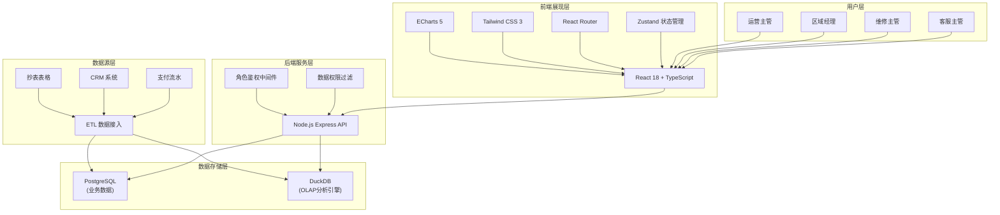
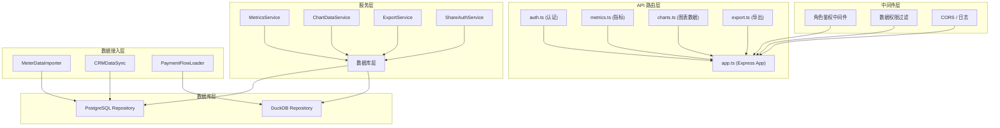
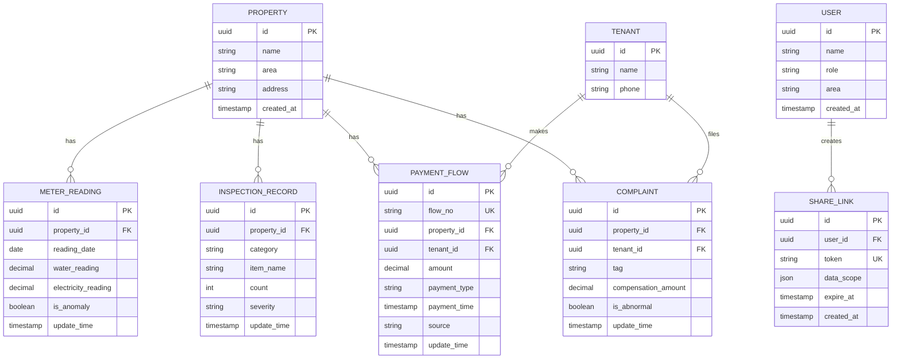

## 1. 架构设计
本系统采用前后端分离架构，前端使用 React + ECharts 实现数据可视化，后端使用 Node.js Express 提供 API 服务，数据层整合 PostgreSQL（业务数据）和 DuckDB（OLAP 分析）。数据源通过 ETL 接入抄表表格与 CRM 系统，支付流水作为明细追溯来源。



## 2. 技术说明
- **前端框架**: React 18 + TypeScript + Vite
- **图表库**: ECharts 5.x
- **样式方案**: Tailwind CSS 3.x
- **状态管理**: Zustand
- **路由**: React Router DOM 6.x
- **图标**: lucide-react
- **后端**: Node.js Express 4.x + TypeScript
- **数据库**: PostgreSQL 15.x (业务数据存储)
- **分析引擎**: DuckDB (列式分析，加速聚合查询)
- **数据接入**: CSV/Excel 导入 + REST API 对接 CRM
- **初始化工具**: vite-init (react-express-ts 模板)

## 3. 路由定义
| 路由 | 页面 | 权限要求 |
|------|------|----------|
| `/` | 仪表盘概览 | 已登录用户 |
| `/flow` | 收款流水明细 | 已登录用户 |
| `/risk` | 风险监测 | 已登录用户 |
| `/export` | 数据下载 | 已登录用户 |
| `/share/:token` | 分享链接访问 | 分享令牌鉴权 |
| `/login` | 登录页 | 公开 |

## 4. API 定义

### 4.1 TypeScript 类型定义
```typescript
// 共享类型定义 (shared/types.ts)

// 水电读数
interface MeterReading {
  id: string;
  propertyId: string;
  propertyName: string;
  date: string;
  waterReading: number;
  electricityReading: number;
  waterUsage: number;
  electricityUsage: number;
  isAnomaly: boolean;
  updateTime: string;
}

// 验房清单
interface InspectionItem {
  id: string;
  category: string;
  itemName: string;
  count: number;
  percentage: number;
  severity: 'low' | 'medium' | 'high';
  updateTime: string;
}

// 收款流水
interface PaymentFlow {
  id: string;
  flowNo: string;
  propertyId: string;
  propertyName: string;
  tenantName: string;
  amount: number;
  paymentType: string;
  paymentTime: string;
  source: string;
  updateTime: string;
}

// 投诉标签
interface ComplaintTag {
  id: string;
  tagName: string;
  count: number;
  amount: number;
  isAbnormal: boolean;
  x: number;
  y: number;
  updateTime: string;
}

// 房源排行
interface PropertyRanking {
  id: string;
  propertyName: string;
  area: string;
  repairCount: number;
  complaintCount: number;
  repairRate: number;
  complaintRate: number;
  photoUrl: string;
  updateTime: string;
}

// 核心指标
interface DashboardMetrics {
  moveOutRate: number;
  inspectionPassRate: number;
  avgRepairDuration: number;
  complaintRate: number;
  updateTime: string;
}

// 用户角色
type UserRole = 'operation_manager' | 'area_manager' | 'repair_manager' | 'service_manager';

interface User {
  id: string;
  name: string;
  role: UserRole;
  area?: string;
  permissions: string[];
}
```

### 4.2 REST API 接口
| 方法 | 路径 | 描述 | 请求参数 | 响应 |
|------|------|------|----------|------|
| GET | `/api/metrics` | 获取仪表盘核心指标 | role, area | `DashboardMetrics` |
| GET | `/api/meter-readings` | 获取水电读数趋势 | propertyId, months, role, area | `MeterReading[]` |
| GET | `/api/inspection-items` | 获取验房清单构成 | role, area | `InspectionItem[]` |
| GET | `/api/payment-flows` | 获取收款流水明细 | page, pageSize, startTime, endTime, propertyId, role, area | `{ list: PaymentFlow[], total: number }` |
| GET | `/api/complaint-tags` | 获取投诉标签分布 | role, area | `ComplaintTag[]` |
| GET | `/api/property-ranking` | 获取房源排行 | metric, mode('absolute'\|'ratio'), role, area | `PropertyRanking[]` |
| GET | `/api/export/report` | 导出报告 | format('excel'\|'pdf'), role, area | 文件流 |
| POST | `/api/auth/share` | 生成分享链接 | userId, expireDays | `{ shareUrl: string, token: string }` |
| GET | `/api/auth/share/:token` | 分享链接鉴权 | token | `{ user: User, dataScope: object }` |

## 5. 服务端架构图


## 6. 数据模型

### 6.1 ER 图


### 6.2 DDL 语句
```sql
-- PostgreSQL 表结构

-- 房源表
CREATE TABLE properties (
    id UUID PRIMARY KEY DEFAULT gen_random_uuid(),
    name VARCHAR(100) NOT NULL,
    area VARCHAR(50) NOT NULL,
    address VARCHAR(255),
    created_at TIMESTAMP DEFAULT CURRENT_TIMESTAMP
);

-- 抄表数据表
CREATE TABLE meter_readings (
    id UUID PRIMARY KEY DEFAULT gen_random_uuid(),
    property_id UUID REFERENCES properties(id),
    reading_date DATE NOT NULL,
    water_reading DECIMAL(10,2) NOT NULL,
    electricity_reading DECIMAL(10,2) NOT NULL,
    water_usage DECIMAL(10,2),
    electricity_usage DECIMAL(10,2),
    is_anomaly BOOLEAN DEFAULT FALSE,
    update_time TIMESTAMP DEFAULT CURRENT_TIMESTAMP,
    INDEX idx_property_date (property_id, reading_date)
);

-- 验房记录表
CREATE TABLE inspection_records (
    id UUID PRIMARY KEY DEFAULT gen_random_uuid(),
    property_id UUID REFERENCES properties(id),
    category VARCHAR(50) NOT NULL,
    item_name VARCHAR(100) NOT NULL,
    count INT DEFAULT 0,
    severity VARCHAR(20) CHECK (severity IN ('low', 'medium', 'high')),
    update_time TIMESTAMP DEFAULT CURRENT_TIMESTAMP,
    INDEX idx_category (category)
);

-- 支付流水表
CREATE TABLE payment_flows (
    id UUID PRIMARY KEY DEFAULT gen_random_uuid(),
    flow_no VARCHAR(50) UNIQUE NOT NULL,
    property_id UUID REFERENCES properties(id),
    tenant_id UUID,
    amount DECIMAL(12,2) NOT NULL,
    payment_type VARCHAR(50) NOT NULL,
    payment_time TIMESTAMP NOT NULL,
    source VARCHAR(50),
    update_time TIMESTAMP DEFAULT CURRENT_TIMESTAMP,
    INDEX idx_flow_time (payment_time),
    INDEX idx_property (property_id)
);

-- 投诉表
CREATE TABLE complaints (
    id UUID PRIMARY KEY DEFAULT gen_random_uuid(),
    property_id UUID REFERENCES properties(id),
    tenant_id UUID,
    tag VARCHAR(50) NOT NULL,
    compensation_amount DECIMAL(12,2) DEFAULT 0,
    is_abnormal BOOLEAN DEFAULT FALSE,
    update_time TIMESTAMP DEFAULT CURRENT_TIMESTAMP,
    INDEX idx_tag (tag)
);

-- 租户表
CREATE TABLE tenants (
    id UUID PRIMARY KEY DEFAULT gen_random_uuid(),
    name VARCHAR(50) NOT NULL,
    phone VARCHAR(20)
);

-- 用户表
CREATE TABLE users (
    id UUID PRIMARY KEY DEFAULT gen_random_uuid(),
    name VARCHAR(50) NOT NULL,
    role VARCHAR(50) NOT NULL CHECK (role IN ('operation_manager', 'area_manager', 'repair_manager', 'service_manager')),
    area VARCHAR(50),
    created_at TIMESTAMP DEFAULT CURRENT_TIMESTAMP
);

-- 分享链接表
CREATE TABLE share_links (
    id UUID PRIMARY KEY DEFAULT gen_random_uuid(),
    user_id UUID REFERENCES users(id),
    token VARCHAR(100) UNIQUE NOT NULL,
    data_scope JSONB,
    expire_at TIMESTAMP NOT NULL,
    created_at TIMESTAMP DEFAULT CURRENT_TIMESTAMP,
    INDEX idx_token (token)
);

-- DuckDB 分析视图 (DDL for DuckDB)
CREATE VIEW v_property_ranking AS
SELECT 
    p.id,
    p.name,
    p.area,
    COUNT(DISTINCT ir.id) as repair_count,
    COUNT(DISTINCT c.id) as complaint_count,
    ROUND(COUNT(DISTINCT ir.id)::DECIMAL / NULLIF(COUNT(*), 0), 4) as repair_rate,
    ROUND(COUNT(DISTINCT c.id)::DECIMAL / NULLIF(COUNT(*), 0), 4) as complaint_rate,
    CURRENT_TIMESTAMP as update_time
FROM properties p
LEFT JOIN inspection_records ir ON p.id = ir.property_id
LEFT JOIN complaints c ON p.id = c.property_id
GROUP BY p.id, p.name, p.area;
```
