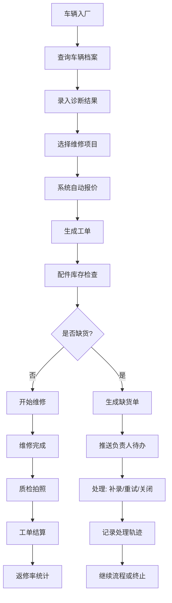

## 1. 产品概述

汽车维修报价协同台是面向汽车维修企业的全流程业务管理系统，覆盖报价管理、工单处理、配件协调、质量复盘等核心环节。系统通过角色化分工，让管理人员维护基础规则、一线人员高效处理业务、负责人跟踪异常事项，实现维修业务的数字化协同。

- 解决传统维修报价流程分散、缺货追踪混乱、质量复盘无数据支撑的痛点
- 目标用户包括维修店管理人员、一线技师、配件负责人、质量分析人员

## 2. 核心特性

### 2.1 用户角色

| 角色 | 注册方式 | 核心权限 |
|------|----------|----------|
| 管理人员 | 管理员创建 | 维护报价单字典、质检照片规则、车辆档案阈值；查看全量数据；复盘分析 |
| 一线人员 | 管理员创建 | 录入诊断结果、处理工单项目、上报配件缺货、查看分配的任务 |
| 负责人 | 管理员创建 | 处理缺货待办、补录/重试/关闭缺货单、查看处理历史 |
| 质量分析员 | 管理员创建 | 查看返修率报表、多维度分析维修质量 |

### 2.2 功能模块

1. **仪表盘**：今日工单概览、缺货待办提醒、返修率趋势、关键指标卡
2. **报价单字典管理**：维修项目分类、工时定价、配件价格库
3. **质检规则管理**：照片拍摄规则、质检节点配置、阈值告警设置
4. **车辆档案管理**：车辆信息录入、维修历史、阈值配置（里程/时间提醒）
5. **工单处理中心**：诊断结果录入、工单项目选择、报价生成
6. **配件缺货协同**：缺货上报、负责人待办、补录/重试/关闭流程、完整处理轨迹
7. **高级查询中心**：状态/日期/区域/负责人多维度组合查询
8. **复盘分析台**：返修率看板、原因分析、趋势对比、质量改善追踪

### 2.3 页面详情

| 页面名称 | 模块名称 | 功能描述 |
|----------|----------|----------|
| 登录页 | 认证模块 | 账号密码登录、角色识别、会话管理 |
| 仪表盘 | 数据概览 | 关键指标卡片、待办事项列表、返修率趋势图、今日工单数 |
| 报价单字典 | 基础配置 | 项目分类树、项目列表、价格编辑、批量导入导出 |
| 质检照片规则 | 基础配置 | 规则列表、照片数量要求、拍摄节点配置、模板管理 |
| 车辆档案阈值 | 基础配置 | 车辆档案列表、维修阈值设置、到期提醒、批量操作 |
| 诊断与工单 | 业务处理 | 车辆查询、诊断结果录入、工单项目勾选、自动报价计算 |
| 缺货待办中心 | 协同处理 | 缺货单列表、状态筛选、一键分配、处理记录时间线 |
| 缺货详情页 | 协同处理 | 缺货详情、处理操作（补录/重试/关闭）、完整操作日志 |
| 综合查询页 | 数据查询 | 多条件组合筛选器、结果列表、导出功能、保存常用查询 |
| 返修率分析 | 复盘看板 | 返修率趋势图、原因分布、技师/车型/区域对比、改善建议 |

## 3. 核心流程

### 3.1 工单处理流程
一线人员查询车辆→录入诊断结果→从字典选择维修项目→系统自动计算报价→确认后生成工单→触发配件检查

### 3.2 配件缺货处理流程
系统检测配件缺货→自动生成缺货单→推送至对应负责人待办→负责人可补录/重试/关闭→每步操作留痕→完整轨迹可回溯

### 3.3 质量复盘流程
按时间段/区域/负责人筛选→计算返修率→钻取分析原因→关联原始工单和处理记录→生成改善建议

## 4. 界面设计

### 4.1 设计风格
- **主色调**：深工业蓝 (#165DFF) 作为主色，搭配橙色 (#FF7D00) 作为缺货/告警强调色
- **辅助色**：成功绿 (#00B42A)、警告黄 (#FF7D00)、危险红 (#F53F3F)
- **背景**：深灰底色 (#1D1D1F) 配合卡片浅灰 (#2C2C2E)，营造专业工业感
- **按钮风格**：方角矩形，微立体阴影，hover 状态有轻微上浮动画
- **字体**：标题使用 Space Grotesk，正文使用 Inter，数字使用等宽字体 JetBrains Mono
- **布局风格**：左侧导航 + 顶部状态栏 + 内容卡片区，采用高密度信息布局
- **图标风格**：线性图标，统一 24px 网格，工业感线条

### 4.2 页面设计概览

| 页面名称 | 模块名称 | UI 元素 |
|----------|----------|----------|
| 仪表盘 | 概览卡片 | 渐变背景指标卡、悬停上浮效果、数字滚动动画、迷你趋势图 |
| 缺货待办 | 列表区 | 状态标签色带区分、紧急度标记、处理按钮组、展开式时间线 |
| 缺货详情 | 时间线 | 垂直时间线、操作节点标记、操作人/时间/备注完整展示 |
| 返修率分析 | 图表区 | 多折线对比图、热力图区域分布、柱状原因分析、交互式钻取 |
| 综合查询 | 筛选区 | 可折叠条件面板、标签式已选条件、保存查询按钮组 |

### 4.3 响应式设计
- Desktop-first 设计，主内容区最小宽度 1280px
- 平板端：左侧导航可折叠为图标模式
- 移动端：核心待办和查询功能做单列布局，图表做响应式缩放

### 4.4 交互与动效
- 页面加载：卡片依次淡入，stagger 延迟 80ms
- 缺货状态变更：状态标签颜色过渡动画 + 数字计数滚动
- 时间线展开：平滑高度过渡 + 节点标记脉冲效果
- 图表交互：hover 显示详情 tooltip，点击数据点钻取到关联工单
