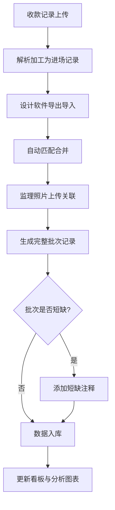
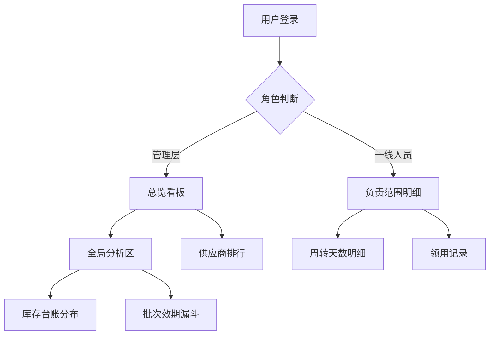

## 1. 产品概述

家装工地材料进场趋势看板是一款面向家装企业管理层与一线人员的数据可视化平台，用于追踪工地材料的进场、库存、领用及供应商情况，解决材料流转信息不透明、批次短缺难追溯、供应商绩效难量化等问题，帮助家装企业降低材料浪费、提升工地管理效率。

## 2. 核心功能

### 2.1 用户角色

| 角色 | 注册方式 | 核心权限 |
|------|----------|----------|
| 管理层 | 管理员邀请 | 查看全项目总览看板、所有工地数据、供应商排行、全局分析报表 |
| 一线人员（项目经理/监理） | 管理员邀请 | 仅查看自己负责范围内的周转天数明细、材料进场记录、领用记录 |

### 2.2 功能模块

1. **总览看板**：材料进场趋势、关键指标汇总、异常预警
2. **材料进场追踪**：批次管理、进场记录、短缺注释、多源数据合并
3. **数据分析区**：库存台账分布、批次效期漏斗、供应商排行、领用记录变化
4. **数据导入**：收款记录处理、设计软件导出合并、监理照片关联、批次时间记录

### 2.3 页面详情

| 页面名称 | 模块名称 | 功能描述 |
|----------|----------|----------|
| 总览看板 | 材料进场趋势图 | 折线图展示近30天/90天材料进场数量趋势，支持按材料类别筛选 |
| 总览看板 | 关键指标卡片 | 当月进场总量、在库总量、周转天数均值、短缺批次数 |
| 总览看板 | 异常预警面板 | 短缺批次提醒、效期临近批次警告、超期未领用材料提示 |
| 材料进场追踪 | 进场记录列表 | 展示材料进场批次、数量、供应商、进场时间，支持搜索筛选 |
| 材料进场追踪 | 短缺注释功能 | 对批次短缺项填写注释说明，记录注释人与时间 |
| 材料进场追踪 | 多源数据合并视图 | 将收款记录、设计软件导出、监理照片关联展示 |
| 数据导入 | 收款记录导入 | 上传收款记录文件，系统自动解析加工为材料进场数据 |
| 数据导入 | 设计软件导出合并 | 导入设计软件材料清单，与收款记录自动匹配 |
| 数据导入 | 监理照片关联 | 上传监理照片，与进场批次关联归档 |
| 数据导入 | 批次时间记录 | 每次导入自动记录批次号与导入时间戳 |
| 数据分析区 | 库存台账分布 | 饼图/柱状图展示各材料类别的库存占比与分布 |
| 数据分析区 | 批次效期漏斗 | 漏斗图展示批次从进场→在库→领用→效期预警的流转状态 |
| 数据分析区 | 供应商信息排行 | 横向柱状图展示供应商交付准时率、短缺率、材料质量评分 |
| 数据分析区 | 领用记录变化 | 面积图展示领用数量随时间的变化趋势，支持按工地/材料类别对比 |

## 3. 核心流程

### 3.1 材料进场数据处理流程

用户通过数据导入模块上传收款记录，系统解析并生成初始进场记录；随后用户可导入设计软件导出的材料清单，系统按材料名称/规格自动匹配合并；监理照片上传后关联至对应批次。每步操作自动记录批次号与时间戳。如发现批次短缺，用户可对短缺项添加注释。

### 3.2 数据处理流程图

### 3.2 用户查看流程

## 4. 用户界面设计

### 4.1 设计风格

- **主色调**：深蓝灰 (#1B2A4A) + 琥珀色点缀 (#F59E0B)，传达专业、可靠的工业管理感
- **辅助色**：冷灰 (#64748B) 用于背景层次，翡翠绿 (#10B981) 用于正向指标，珊瑚红 (#EF4444) 用于预警/短缺
- **按钮风格**：圆角 (8px)，主操作按钮琥珀色填充，次操作幽灵按钮描边
- **字体**：标题使用 DM Sans (Bold)，数据/正文使用 Source Sans 3
- **布局风格**：左侧固定导航栏 + 顶部指标条 + 主内容区卡片式布局
- **图标风格**：线性图标 (Lucide)，2px 描边，与整体工业简洁风统一

### 4.2 页面设计概览

| 页面名称 | 模块名称 | UI 元素 |
|----------|----------|---------|
| 总览看板 | 材料进场趋势图 | 折线图、时间范围切换器、材料类别筛选器 |
| 总览看板 | 关键指标卡片 | 4列网格卡片，数字动态计数，图标+颜色编码 |
| 总览看板 | 异常预警面板 | 红色/黄色标签列表，点击跳转详情 |
| 材料进场追踪 | 进场记录列表 | 分页表格，状态标签（已进场/在库/已领用），搜索框 |
| 材料进场追踪 | 短缺注释 | 行内编辑弹窗，注释历史时间线 |
| 材料进场追踪 | 多源数据合并视图 | 标签页切换（收款/设计导出/照片），关联状态指示灯 |
| 数据导入 | 导入表单 | 拖拽上传区，文件类型图标，批次信息预览卡片 |
| 数据分析区 | 库存台账分布 | 环形图 + 分类明细表格 |
| 数据分析区 | 批次效期漏斗 | 漏斗图，阶段间转化率标注 |
| 数据分析区 | 供应商排行 | 横向柱状图 + 评分雷达小图 |
| 数据分析区 | 领用记录变化 | 堆叠面积图，时间轴可缩放，多系列对比图例 |

### 4.3 响应式设计

- 桌面端优先 (1440px+)，完整看板布局
- 平板端 (768px-1024px)，卡片单列排列，图表自适应缩放
- 移动端 (< 768px)，关键指标卡片横向滚动，图表简化展示

### 4.4 动效设计

- 页面加载时指标卡片数字滚动计数动画
- 图表数据更新时平滑过渡动画
- 异常预警面板入场时从右侧滑入
- 表格行 hover 时微浮起效果
- 导入进度条带渐变流动效果
