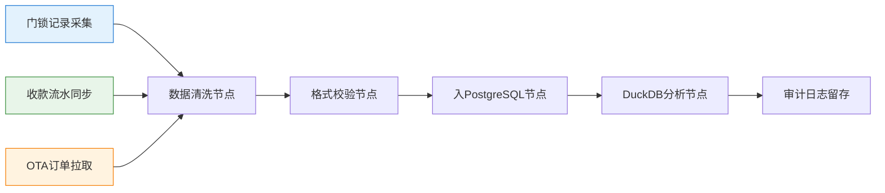
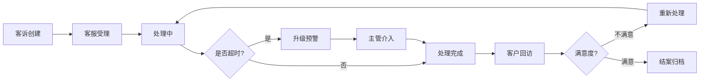

## 1. 产品概述

旅游民宿客诉处理风险监测图看板，用于实时监控民宿客诉处理全流程，通过可视化方式展示客诉处理变化趋势、处理时效、升级预警等关键指标，帮助运营管理人员及时发现风险、追溯问题、优化处理流程。

## 2. 核心功能

### 2.1 用户角色

| 角色 | 登录方式 | 核心权限 |
|------|----------|----------|
| 运营管理员 | 账号密码登录 | 查看全部看板、钻取明细、导出报表 |
| 区域经理 | 账号密码登录 | 查看所辖区域数据、处理超时预警 |
| 客服主管 | 账号密码登录 | 查看客诉明细、回访记录、责任归属 |

### 2.2 功能模块

1. **风险监测总览看板**：客诉趋势图、处理时效监控、超时预警、升级记录同环比
2. **取数链路审计**：门锁记录、收款流水、OTA订单同步节点可视化
3. **客诉明细管理**：客诉列表、回访结果、责任归属、跳转钻取
4. **多维报表分析**：按关闭时长、日期、区域多维度比较分析

### 2.3 页面详情

| 页面名称 | 模块名称 | 功能描述 |
|----------|----------|----------|
| 风险监测总览 | 客诉趋势仪表盘 | ECharts折线图展示客诉量日/周/月变化，支持同环比切换 |
| 风险监测总览 | 处理时效热力图 | 按区域展示平均处理时长，超时区域高亮告警 |
| 风险监测总览 | 升级记录时序图 | 展示客诉升级记录，支持环比同比对比分析 |
| 风险监测总览 | 超时预警列表 | 实时展示超时未处理客诉，点击跳转对应样本详情 |
| 取数链路审计 | 同步节点拓扑图 | 展示门锁/收款/OTA三类数据同步全链路节点状态 |
| 取数链路审计 | 同步日志详情 | 点击节点查看同步记录、耗时、异常信息 |
| 客诉明细管理 | 客诉列表 | 支持按状态/时间/区域筛选，点击回访结果跳转明细 |
| 客诉明细管理 | 责任归属面板 | 展示客诉责任分类统计，用于统一解释口径 |
| 多维报表分析 | 关闭时长分析 | 对比不同民宿的客诉关闭时长分布 |
| 多维报表分析 | 日期趋势对比 | 选择时间段进行客诉趋势同比环比分析 |
| 多维报表分析 | 区域比较分析 | 按行政区域对比客诉量、处理时效、满意度 |

## 3. 核心流程

### 3.1 数据同步审计流程

### 3.2 客诉处理追踪流程

## 4. 用户界面设计

### 4.1 设计风格

- **主色调**：深蓝色 `#1e3a5f`（专业、稳重）
- **警示色**：珊瑚红 `#e74c3c`（超时预警）、琥珀橙 `#f39c12`（升级提醒）
- **成功色**：森林绿 `#27ae60`（正常处理）
- **背景**：深色渐变背景，数据大屏风格
- **字体**：显示屏用 `Chakra Petch`，正文用 `Noto Sans SC`
- **卡片风格**：半透明玻璃拟态，圆角8px，细边框
- **动效**：数据加载数字滚动、告警脉冲闪烁、图表渐入动画

### 4.2 页面设计概览

| 页面名称 | 模块名称 | UI元素 |
|----------|----------|--------|
| 风险监测总览 | 顶部指标栏 | 6个核心KPI卡片，数字滚动动效，超限时红色闪烁 |
| 风险监测总览 | 趋势图表区 | 左右分栏布局，左侧趋势折线图，右侧时效热力图 |
| 风险监测总览 | 升级与预警区 | 上下布局，上方升级时序图，下方超时预警列表 |
| 取数链路审计 | 拓扑图区 | 居中展示同步链路拓扑，节点状态颜色区分，可交互点击 |
| 取数链路审计 | 日志详情区 | 底部抽屉式面板，展示选中节点的同步日志 |
| 客诉明细管理 | 筛选区 | 多条件筛选栏，下拉选择+日期范围+搜索框 |
| 客诉明细管理 | 数据表格 | 虚拟滚动表格，支持列宽调整、排序、分页 |
| 多维报表分析 | 维度选择器 | 标签页切换分析维度，支持多选对比 |
| 多维报表分析 | 对比图表区 | 可配置图表，支持柱状图/折线图/雷达图切换 |

### 4.3 响应式

- 桌面端优先（1920×1080），采用12栅格系统
- 图表区域自适应容器宽度，最小宽度320px
- 侧边导航栏在平板端折叠为图标模式
- 移动端（<768px）采用单列流式布局，图表缩放显示

### 4.4 交互细节

- **图表点击**：点击数据点跳转对应明细列表，高亮显示相关记录
- **预警点击**：点击超时预警项，弹出客诉详情模态框，关联同步链路节点
- **同环比切换**：下拉选择对比周期，图表自动重绘并标注差值百分比
- **节点悬停**：鼠标悬停同步节点，显示tooltip展示同步成功率、平均耗时
- **钻取联动**：回访结果字段可点击，跳转至完整客诉处理全流程时间线
