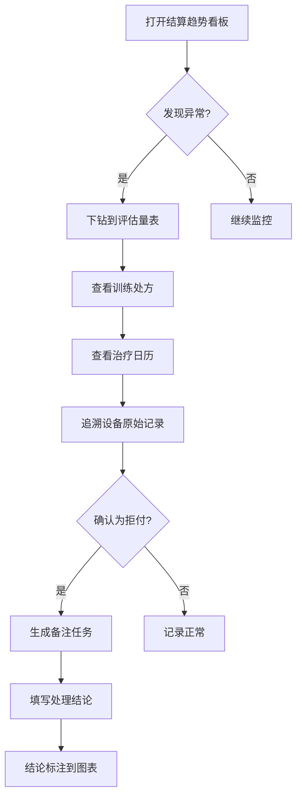

## 1. 产品概述

康复中心医保结算趋势看板，面向康复中心管理层与治疗师团队，用于复盘医保结算全流程中的问题。系统接入病历系统与打卡记录作为数据入口，支持从汇总数据逐层下钻到评估量表、训练处方、治疗日历，最终可追溯到康复设备中的原始记录。医保拒付发生时自动生成备注任务，处理结论与图表联动展示。重点监控训练完成率，治疗师常用筛选条件可保存为视图，早会直接打开同一口径。

- 目标用户：康复中心管理者、医保结算专员、康复治疗师
- 核心价值：缩短医保拒付排查周期、提升训练完成率可视性、统一团队复盘口径

## 2. 核心功能

### 2.1 用户角色

| 角色 | 注册方式 | 核心权限 |
|------|----------|----------|
| 管理者 | 管理员分配账号 | 查看全局看板、处理拒付备注、管理视图 |
| 医保结算专员 | 管理员分配账号 | 查看结算趋势、处理拒付备注任务 |
| 康复治疗师 | 管理员分配账号 | 查看自己负责的患者数据、保存个人筛选视图 |

### 2.2 功能模块

1. **结算趋势看板（首页）**：医保结算总览、训练完成率趋势、拒付率变化、关键指标卡片
2. **逐层下钻页**：评估量表列表→训练处方详情→治疗日历→设备原始记录
3. **拒付备注任务中心**：拒付记录列表、备注任务生成与处理、结论与图表联动
4. **筛选视图管理**：筛选条件保存、加载、共享，早会模式一键打开

### 2.3 页面详情

| 页面名称 | 模块名称 | 功能描述 |
|----------|----------|----------|
| 结算趋势看板 | 关键指标卡片 | 医保结算总额、拒付金额、拒付率、训练完成率 |
| 结算趋势看板 | 结算趋势图 | 月度/季度医保结算金额与拒付金额趋势折线图 |
| 结算趋势看板 | 训练完成率图 | 按科室/治疗师/时段的训练完成率柱状图 |
| 结算趋势看板 | 拒付原因分布 | 拒付原因饼图，点击可下钻 |
| 逐层下钻页 | 评估量表层 | 患者评估量表列表、量表得分变化、关联病历 |
| 逐层下钻页 | 训练处方层 | 处方详情、执行情况、完成率统计 |
| 逐层下钻页 | 治疗日历层 | 日历视图展示治疗安排与完成状态 |
| 逐层下钻页 | 设备原始记录 | 追溯到康复设备的原始训练数据 |
| 拒付备注任务中心 | 拒付记录列表 | 所有拒付记录及状态筛选 |
| 拒付备注任务中心 | 备注任务处理 | 生成备注任务、填写处理结论、状态流转 |
| 拒付备注任务中心 | 结论图表联动 | 处理结论标注在对应图表数据点上 |
| 筛选视图管理 | 视图保存 | 当前筛选条件保存为命名视图 |
| 筛选视图管理 | 视图加载 | 从已保存视图中加载筛选条件 |
| 筛选视图管理 | 早会模式 | 一键打开共享视图，统一口径 |

## 3. 核心流程

### 3.1 医保结算复盘流程

管理者打开看板首页，查看医保结算趋势与训练完成率。发现异常时段后，点击趋势图下钻到评估量表，查看该时段患者评估情况；继续下钻到训练处方，查看处方执行情况；再下钻到治疗日历，定位具体哪天哪些治疗未完成；最终追溯到设备原始记录，确认设备数据是否正常上报。

### 3.2 拒付备注任务流程

系统检测到医保拒付记录后，自动生成备注任务。结算专员在任务中心查看待处理拒付，填写原因分析与处理结论。处理结论会标注在结算趋势图对应数据点上，管理者可直接在图表上看到拒付处理状态。

### 3.3 早会视图流程

治疗师在日常工作中保存常用筛选条件为视图（如"本月我的患者训练完成率"）。早会时，团队成员打开同一共享视图，以统一口径复盘数据。

## 4. 用户界面设计

### 4.1 设计风格

- 主色调：深青色 (#0F766E) 表达医疗专业感，辅以琥珀色 (#D97706) 标注警告/拒付
- 按钮风格：圆角矩形，hover 时微抬阴影
- 字体：思源黑体 / Noto Sans SC，标题 20px、正文 14px、标注 12px
- 布局风格：左侧导航栏 + 右侧内容区，卡片式布局
- 图标：lucide-react 医疗相关图标

### 4.2 页面设计概览

| 页面名称 | 模块名称 | UI 元素 |
|----------|----------|---------|
| 结算趋势看板 | 关键指标卡片 | 四宫格卡片，数字突出，同比/环比小字 |
| 结算趋势看板 | 结算趋势图 | ECharts 折线图，支持点击下钻，tooltip 显示详情 |
| 结算趋势看板 | 训练完成率图 | ECharts 柱状图，颜色区分达标/未达标 |
| 结算趋势看板 | 拒付原因分布 | ECharts 饼图/环形图，可交互下钻 |
| 逐层下钻页 | 面包屑导航 | 评估量表 > 训练处方 > 治疗日历 > 设备记录 |
| 逐层下钻页 | 评估量表层 | 卡片列表，量表名+得分+趋势箭头 |
| 逐层下钻页 | 训练处方层 | 表格+侧边详情面板 |
| 逐层下钻页 | 治疗日历层 | 日历网格，颜色标识完成/未完成/拒付 |
| 逐层下钻页 | 设备原始记录 | 时间轴列表，详细参数表格 |
| 拒付备注任务中心 | 拒付记录列表 | 表格，状态标签彩色标记 |
| 拒付备注任务中心 | 备注任务处理 | 侧滑面板，表单+历史记录 |
| 筛选视图管理 | 视图列表 | 下拉菜单选择视图 |
| 筛选视图管理 | 早会模式 | 顶部横幅提示当前视图名称 |

### 4.3 响应式设计

- 桌面优先，支持 1440px 及以上宽屏
- 1280px 以下自适应收缩侧边栏为图标模式
- 不做移动端适配（康复中心内网使用为主）

## 5. 数据来源说明

- **病历系统**：患者基本信息、诊断、评估量表、训练处方
- **打卡记录**：治疗签到/签退、治疗时长、治疗项目
- **康复设备**：设备原始训练数据（力度、角度、次数、时长等）
- **医保结算**：结算金额、拒付记录、拒付原因
