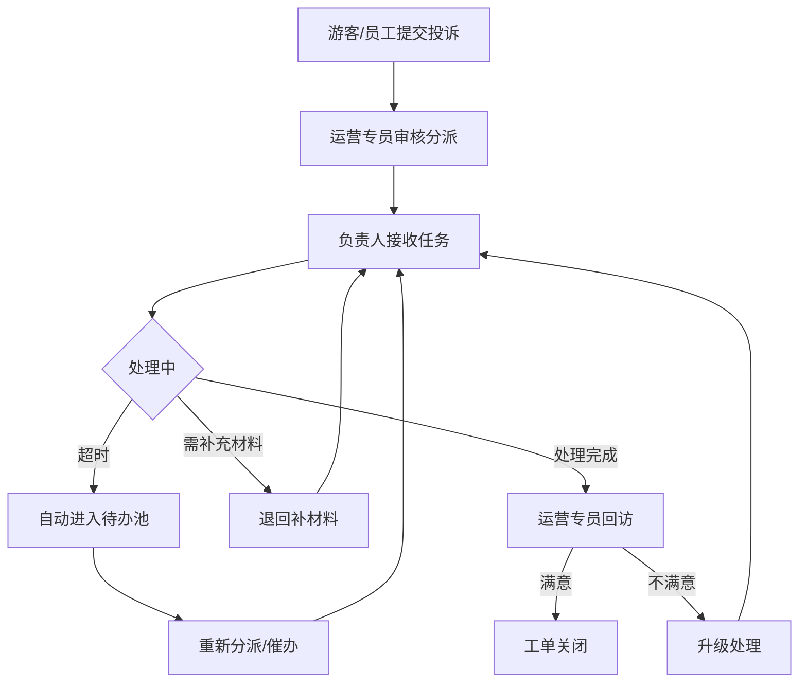

## 1. 产品概述

景区运营游客投诉任务分派台，用于沉淀景区运营过程中的游客投诉数据，实现投诉全流程管理，包括任务分派、处理时限追踪、升级记录、回访结果等核心功能。通过系统化的管理平台，提升景区运营服务质量和投诉处理效率。

- 核心目标：将游客投诉从线下分散处理转为线上标准化流程管理，形成可追溯、可分析的数据沉淀
- 目标用户：景区运营团队、客服人员、巡场人员、票务人员、管理层

## 2. 核心功能

### 2.1 用户角色

| 角色 | 注册方式 | 核心权限 |
|------|----------|----------|
| 游客 | 通过景区入口/小程序自助提交 | 提交投诉、查看处理进度、参与回访 |
| 票务员 | 运营后台分配账号 | 录入投诉、处理票务相关投诉、补充材料 |
| 巡场员 | 运营后台分配账号 | 接收现场投诉任务、现场核实、上传证据、更新处理进度 |
| 运营专员 | 运营后台分配账号 | 投诉分派、重新分派、驳回重提、升级处理、回访登记 |
| 运营主管 | 运营后台分配账号 | 查看全部投诉、报表分析、责任归属配置、问题标签管理、查看敏感字段 |

### 2.2 功能模块

1. **投诉任务分派台（主页）**：任务列表、操作区（处理时限/升级记录/回访结果）、侧边配置区（责任归属/问题标签/常用筛选）
2. **投诉详情页**：完整投诉信息、处理时间线、材料附件、操作历史
3. **报表分析页**：关闭时长统计、日期趋势、负责人绩效下钻
4. **待办池**：超时任务池、待补材料任务、被驳回重提任务
5. **系统配置页**：责任归属配置、问题标签管理、角色权限、敏感字段配置

### 2.3 页面详情

| 页面名称 | 模块名称 | 功能描述 |
|----------|----------|----------|
| 投诉任务分派台 | 任务列表区 | 展示投诉工单列表，支持状态标签、优先级、时限倒计时、负责人显示 |
| 投诉任务分派台 | 操作区 | 处理时限设置与展示、升级记录时间线、回访结果录入与展示 |
| 投诉任务分派台 | 侧边筛选区 | 责任归属筛选、问题标签筛选、常用筛选条件快速选择 |
| 投诉任务分派台 | 侧边配置区 | 责任归属快速配置入口、问题标签留痕标记 |
| 投诉详情页 | 基本信息 | 游客信息、投诉内容、来源渠道、提交时间 |
| 投诉详情页 | 处理时间线 | 分派、处理、升级、回访等全流程操作记录 |
| 投诉详情页 | 材料附件 | 图片、视频、文字说明等补充材料上传与查看 |
| 投诉详情页 | 操作面板 | 补充材料、驳回重提、重新分派、关闭工单等操作 |
| 待办池 | 超时任务 | 自动进入的超时任务列表，支持批量重新分派 |
| 待办池 | 待补材料 | 需要补充材料的任务清单 |
| 待办池 | 驳回重提 | 被驳回后需要重新处理的任务 |
| 报表分析页 | 关闭时长分析 | 按投诉类型、责任归属统计平均关闭时长、分布直方图 |
| 报表分析页 | 日期趋势 | 按日/周/月展示投诉量、处理率、超时率趋势 |
| 报表分析页 | 负责人下钻 | 按负责人统计处理量、平均处理时长、满意度 |
| 系统配置页 | 责任归属配置 | 部门/岗位/人员三级责任归属树配置 |
| 系统配置页 | 问题标签管理 | 投诉问题分类标签增删改、层级管理 |
| 系统配置页 | 敏感字段配置 | 配置哪些字段属于敏感信息，按角色控制可见性 |

## 3. 核心流程

### 3.1 投诉处理主流程

游客或一线员工提交投诉 → 系统自动分派或运营专员人工分派 → 负责人接收并处理 → （超时自动进入待办池）→ 如需补充材料则退回 → 处理完成 → 运营专员回访 → 工单关闭

### 3.2 流程图

## 4. 用户界面设计

### 4.1 设计风格

- **主色调**：深靛蓝 `#1e3a5f` 作为主色，传递专业稳重的企业级产品气质；配合琥珀金 `#d4a853` 作为强调色，用于高亮状态和关键操作
- **辅助色**：成功绿 `#10b981`、警告橙 `#f59e0b`、危险红 `#ef4444`、信息蓝 `#3b82f6`
- **背景**：采用分层灰色调，页面背景 `#f8fafc`、卡片背景 `#ffffff`、悬浮层带微妙阴影
- **按钮风格**：圆角 8px，主按钮采用深靛蓝填充配白色文字，悬停有微交互阴影变化
- **字体**：标题采用思源宋体（庄重专业），正文采用思源黑体（清晰易读）
- **布局风格**：三栏式仪表盘布局（左筛选配置 / 中任务操作 / 右详情或统计），卡片化信息组织
- **图标风格**：线性图标，2px 线条，统一圆角处理

### 4.2 页面设计概览

| 页面名称 | 模块名称 | UI 元素 |
|----------|----------|----------|
| 投诉任务分派台 | 顶部导航 | Logo、全局搜索、通知铃铛、用户头像菜单 |
| 投诉任务分派台 | 左侧筛选栏 | 责任归属树状选择器、问题标签多选、常用筛选快捷按钮组 |
| 投诉任务分派台 | 中央任务区 | 列表头（计数+批量操作）、工单卡片（标题/状态/优先级/倒计时/负责人/标签）、分页 |
| 投诉任务分派台 | 右侧操作面板 | Tab切换（处理时限/升级记录/回访结果），时限设置表单、时间线组件、回访评分表 |
| 投诉详情页 | 信息卡片 | 投诉基本信息网格、敏感字段遮罩、角色可见标识 |
| 投诉详情页 | 时间线 | 垂直时间线，带操作人、时间、类型图标、可展开详情 |
| 投诉详情页 | 附件区 | 文件缩略图网格、上传拖拽区、文件类型图标 |
| 报表分析页 | 顶部筛选 | 日期范围选择器、维度切换器、导出按钮 |
| 报表分析页 | 图表区 | 柱状图（关闭时长分布）、折线图（日期趋势）、数据表格（负责人下钻） |

### 4.3 响应式

- 桌面端优先（1440px 基准），三栏布局为标准工作视图
- 平板端（1024px）：左右侧栏可折叠收起，中央区域自适应
- 移动端（768px 以下）：单栏流式布局，侧边功能转为底部 Tab 和抽屉式面板

### 4.4 动效设计

- 页面加载：骨架屏占位 → 内容渐入（stagger 50ms）
- 时限倒计时：临近超时（<30分钟）数字从黑色渐变为橙色→红色，带脉冲动画
- 工单卡片：悬停时轻微上浮 + 阴影加深，过渡 200ms
- 操作反馈：按钮点击有微缩放（scale 0.97），成功操作显示顶部 Toast 滑入
- 时间线：滚动触发节点点亮动画
