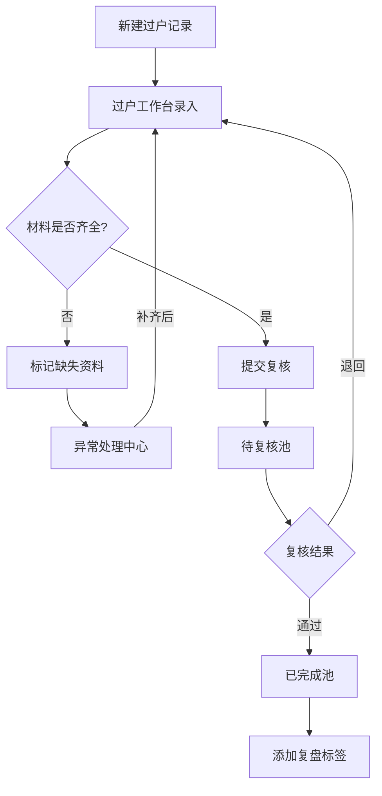
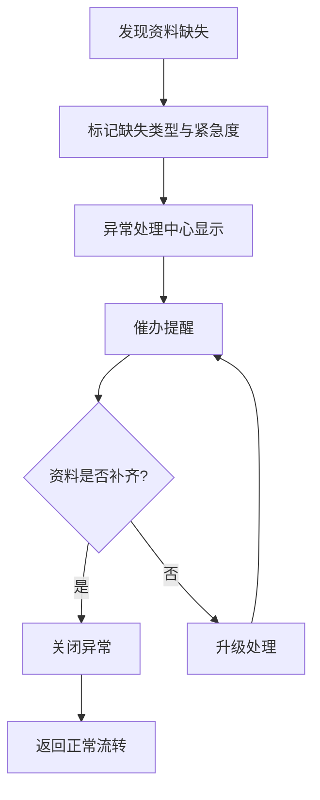

## 1. 产品概述
二手车门店过户材料跟进台——面向二手车门店的过户材料全生命周期管理系统，解决过户材料分散、状态不清、复核困难的问题，让报价历史、金融资料、车辆档案在同一屏内完成录入、处理、复核和回看。
- 目标用户：二手车门店过户专员、门店经理、财务复核人员
- 核心价值：消除材料分散导致的跟进遗漏，分离已完成与待复核记录避免混乱，通过汇总分析驱动门店运营优化

## 2. 核心功能

### 2.1 用户角色
| 角色 | 进入方式 | 核心权限 |
|------|----------|----------|
| 过户专员 | 管理员分配账号 | 录入/编辑过户材料、提交复核、查看自己负责的记录 |
| 门店经理 | 管理员分配账号 | 复核材料、查看全部记录、汇总分析、处理异常 |
| 财务人员 | 管理员分配账号 | 复核金融资料、查看财务相关字段 |

### 2.2 功能模块
1. **过户工作台**：单据全屏录入与编辑，报价历史/金融资料/车辆档案同屏展示
2. **记录池管理**：待处理池、待复核池、已完成池三池分离
3. **异常处理中心**：资料缺失标记与跟踪
4. **汇总看板**：按库存周转/来源渠道/责任人/复盘标签的统计报表
5. **记录回查**：已完成记录的搜索与详情回看

### 2.3 页面详情
| 页面名称 | 模块名称 | 功能描述 |
|----------|----------|----------|
| 过户工作台 | 报价历史面板 | 展示同一车辆的历次报价记录，支持新增报价，时间轴形式呈现 |
| 过户工作台 | 金融资料面板 | 贷款方案、首付比例、月供明细、金融机构信息，支持文件上传至MinIO |
| 过户工作台 | 车辆档案面板 | 车辆基础信息（品牌/型号/VIN/里程/车况评级）、行驶证/登记证扫描件 |
| 过户工作台 | 过户材料表单 | 买方/卖方身份信息、合同编号、过户税费、材料状态标记 |
| 记录池管理 | 待处理池 | 当前用户待处理的过户记录列表，支持快速筛选与批量操作 |
| 记录池管理 | 待复核池 | 已提交复核的记录，门店经理/财务人员在此完成复核操作 |
| 记录池管理 | 已完成池 | 已通过复核的记录归档，不可编辑但可查看和添加复盘标签 |
| 异常处理中心 | 缺失资料看板 | 按资料类型分类显示缺失项，标记紧急程度，支持催办提醒 |
| 异常处理中心 | 异常跟踪 | 异常状态流转（发现→催办→补齐→关闭），记录处理日志 |
| 汇总看板 | 库存周转分析 | 车辆从入库到过户完成的平均天数、周转率趋势图 |
| 汇总看板 | 来源渠道统计 | 按渠道（个人/4S店/拍卖/线上平台等）统计过户量与效率 |
| 汇总看板 | 责任人绩效 | 各过户专员处理量、平均处理时长、异常率 |
| 汇总看板 | 复盘标签云 | 标签频率统计、标签关联分析 |

## 3. 核心流程

### 3.1 过户材料录入与流转流程
1. 过户专员在「待处理池」选择或新建过户记录
2. 进入「过户工作台」，在同一屏内完成报价历史、金融资料、车辆档案的录入
3. 录入过程中如发现资料缺失，标记为异常并推送到「异常处理中心」
4. 材料齐全后提交复核，记录从「待处理池」流转到「待复核池」
5. 门店经理/财务人员在「待复核池」中进行复核，可退回或通过
6. 复核通过后记录流入「已完成池」，可添加复盘标签

### 3.2 流程图

### 3.3 异常处理流程

## 4. 用户界面设计

### 4.1 设计风格
- 主色调：深蓝灰 (#1E293B) + 琥珀色强调 (#F59E0B)，专业沉稳但不压抑
- 辅助色：翡翠绿 (#10B981) 用于完成状态，珊瑚红 (#EF4444) 用于异常告警
- 按钮风格：圆角 (8px)，次要按钮描边、主要按钮填充
- 字体：思源黑体 (Noto Sans SC) 为主，数字使用等宽字体 JetBrains Mono
- 布局风格：左侧固定导航 + 顶部面包屑 + 内容区，桌面优先
- 图标风格：线性图标，与 Naive UI 内置图标体系一致

### 4.2 页面设计概览
| 页面名称 | 模块名称 | UI 元素 |
|----------|----------|---------|
| 过户工作台 | 整体布局 | 三栏式布局：左列报价历史(30%)、中列过户表单(40%)、右列车辆档案+金融资料(30%)，深色侧栏+浅色内容区 |
| 过户工作台 | 报价历史面板 | 时间轴组件，每条报价卡片含日期/金额/状态标签，底部新增按钮 |
| 过户工作台 | 金融资料面板 | 折叠面板，贷款信息表单+文件上传区域（拖拽上传），上传进度条 |
| 过户工作台 | 车辆档案面板 | 上方车辆信息卡片（品牌/型号/VIN），下方证件扫描件缩略图网格 |
| 记录池管理 | 三个池子 | 顶部Tab切换（待处理/待复核/已完成），每个Tab下为数据表格+筛选器 |
| 异常处理中心 | 缺失看板 | 看板式布局（类似Trello），每列为一种缺失类型，卡片显示车辆信息与紧急度 |
| 汇总看板 | 统计图表 | 2×2网格布局，每个卡片含一个图表（柱状图/折线图/饼图/词云） |

### 4.3 响应式设计
- 桌面优先设计，最小支持 1280px 宽度
- 过户工作台在窄屏下三栏切换为上下堆叠（报价→表单→档案）
- 记录池表格在窄屏下隐藏次要列，提供抽屉式详情

### 4.4 交互细节
- 过户工作台面板间支持拖拽调整宽度
- 材料缺失时对应字段旁显示红色警示图标，hover 展示缺失原因
- 复核退回时必须填写退回原因，被退回记录在待处理池中以橙色边框高亮
- 已完成池记录使用锁定图标标识不可编辑状态
