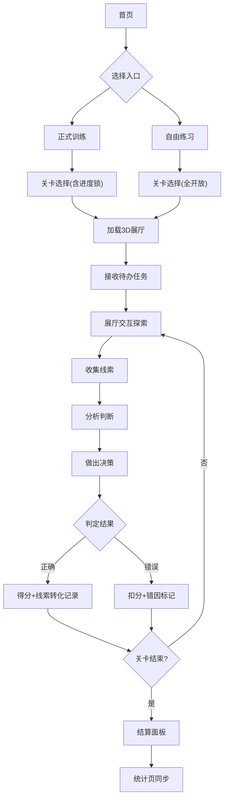

## 1. 产品概述
二手车门店试驾预约调度解谜游戏，面向门店新人培训。玩家在3D展厅场景中接收待办任务，通过翻阅试驾记录、分析客户线索、核查车辆档案来判断下一步动作，训练真实业务判断力。

## 2. 核心功能

### 2.1 用户角色
| 角色 | 注册方式 | 核心权限 |
|------|----------|----------|
| 学员 | 工号注册 | 正式训练、自由练习、统计查看 |
| 管理员 | 后台分配 | 关卡管理、学员数据查看 |

### 2.2 功能模块
1. **首页**: 双入口导航（正式训练 / 自由练习）、快速继续
2. **关卡选择页**: 按岗位/难度筛选关卡列表
3. **游戏主场景**: 3D展厅 + HUD任务面板 + 线索抽屉
4. **结算面板**: 得分、用时、错因分析
5. **统计页**: 线索转化率、关卡对比、趋势图表

### 2.3 页面详情
| 页面名称 | 模块名称 | 功能描述 |
|----------|----------|----------|
| 首页 | 双入口导航 | 左侧"正式训练"入口（含关卡进度锁）、右侧"自由练习"入口（全部关卡开放） |
| 首页 | 快速继续 | 显示上次未完成关卡，一键进入 |
| 关卡选择页 | 筛选栏 | 按岗位（销售/调度/客服）、难度（入门/进阶/爽约挑战）筛选 |
| 关卡选择页 | 关卡卡片 | 显示关卡名、难度标签、最佳得分、通关状态 |
| 游戏主场景 | 3D展厅 | Babylon.js渲染的二手车展厅，含展车、办公桌、档案柜等可交互物体 |
| 游戏主场景 | 任务面板(HUD) | 顶部显示当前待办任务描述、倒计时 |
| 游戏主场景 | 线索抽屉 | 底部/侧边抽屉，可展开查看试驾记录、客户线索、车辆档案三类线索卡片 |
| 游戏主场景 | 决策面板 | 根据分析结果选择下一步动作（批准预约/拒绝/改期/标记爽约风险等） |
| 结算面板 | 成绩概览 | 得分（满分100）、用时、星级评定 |
| 结算面板 | 错因分析 | 列出每个决策点的正确答案与玩家选择，标注差异及业务知识点 |
| 统计页 | 总览卡片 | 总训练时长、平均得分、线索转化率 |
| 统计页 | 关卡对比 | 表格+柱状图对比各关卡得分、用时、转化率 |
| 统计页 | 线索转化趋势 | 折线图展示各关卡"线索→正确决策"转化率变化趋势 |

## 3. 核心流程

玩家进入首页，选择正式训练或自由练习入口。选择关卡后加载3D展厅场景，接收待办任务。玩家在展厅中交互探索，收集三类线索（试驾记录/客户线索/车辆档案），分析后做出决策。系统实时判定并记录线索转化。关卡结束后进入结算面板，数据同步至统计页。

## 4. 用户界面设计

### 4.1 设计风格
- 主色调：深炭灰(#1A1A2E) + 琥珀金(#D4A574)，营造二手车展厅的高端商务感
- 辅助色：铁锈红(#C84B31)用于警告/错误，翡翠绿(#2EC4B6)用于正确/成功
- 按钮：圆角8px，琥珀金主按钮，深色次按钮，hover时微发光
- 字体：标题用 Noto Serif SC 衬线体，正文用 Noto Sans SC
- 布局：卡片式布局，暗色背景，金色边框点缀
- 图标：Lucide图标 + 自定义汽车/文件类图标

### 4.2 页面设计概览
| 页面名称 | 模块名称 | UI要素 |
|----------|----------|--------|
| 首页 | 双入口导航 | 深色背景，左右两张大卡片（训练/练习），琥珀金边框，微光呼吸动画 |
| 首页 | 快速继续 | 底部悬浮条，显示关卡名+进度百分比，点击渐变过渡进入 |
| 关卡选择页 | 筛选栏 | 顶部横向滚动标签组，选中态为琥珀金底色 |
| 关卡选择页 | 关卡卡片 | 3列网格，暗色卡片+金色顶部条，难度用色点标注(绿/黄/红) |
| 游戏主场景 | 3D展厅 | Babylon.js渲染，暖色环境光，聚光灯打在展车上，档案柜可点击高亮 |
| 游戏主场景 | 任务面板 | 顶部半透明暗条，白字任务描述，右侧倒计时数字 |
| 游戏主场景 | 线索抽屉 | 底部可拖拽面板，三列tab切换(记录/客户/车辆)，卡片式线索内容 |
| 游戏主场景 | 决策面板 | 右侧弹出面板，选项按钮纵向排列，选中高亮琥珀金 |
| 结算面板 | 成绩概览 | 居中大字得分+环形进度条，星级图标，用时显示 |
| 结算面板 | 错因分析 | 下方可滚动列表，红/绿标记对错，附业务知识要点 |
| 统计页 | 总览卡片 | 顶部三张统计卡片(时长/得分/转化率)，数字用琥珀金 |
| 统计页 | 关卡对比 | 表格+柱状图，柱体为琥珀金渐变 |
| 统计页 | 线索转化趋势 | 折线图，线条为翡翠绿，数据点可悬浮查看详情 |

### 4.3 响应式
- 桌面优先设计，最小支持1280px宽度
- 游戏场景全屏自适应，HUD按比例缩放
- 统计图表在窄屏下切换为纵向排列

### 4.4 3D场景指引
- 环境：室内展厅，暖色调HDRI，略带灰尘感的环境光
- 灯光：顶部区域光提供基础照明，聚光灯聚焦展车，档案柜上方小射灯
- 相机：第一人称视角，鼠标控制旋转，WASD移动，可走近物体交互
- 构图：展厅中央为展车，左侧办公桌（查看预约记录），右侧档案柜（查看车辆档案），后方接待台（客户线索）
- 交互：走近物体高亮轮廓，点击/按E键拾取线索，物理模拟开关车门(Cannon-es)
- 后处理：轻微环境光遮蔽(AO)，微弱辉光(Bloom)效果
- 资源：程序化生成展车模型(简化Box几何体组合)，档案柜/办公桌用基础几何体搭建
