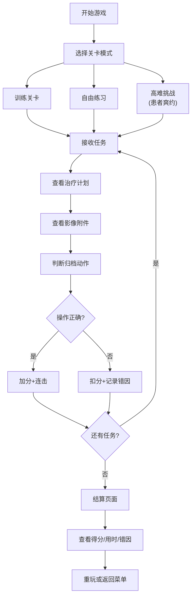
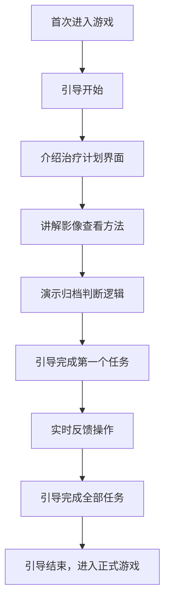

## 1. 产品概述

口腔诊所影像归档培训游戏，模拟真实口腔诊所的影像归档工作流程，用于培训新员工快速掌握影像归档技能。玩家通过接取任务、分析治疗计划、处理随访任务、判断影像附件归档来完成挑战，在游戏中学习专业知识。

- **目标用户**：口腔诊所新入职的影像归档人员、前台接待、护士等岗位员工
- **核心价值**：通过游戏化方式降低培训成本，提高培训效率，让新人在安全的模拟环境中快速掌握工作流程
- **市场定位**：专业医疗培训类严肃游戏，可用于口腔诊所内部培训或医学院校教学辅助

## 2. 核心功能

### 2.1 用户角色

| 角色 | 进入方式 | 核心权限 |
|------|----------|----------|
| 培训学员 | 直接进入游戏 | 完成所有关卡、查看学习进度、重玩关卡 |
| 培训管理员 | 选择管理员模式 | 查看学员统计数据、管理关卡配置（可选扩展） |

### 2.2 功能模块

1. **主菜单模块**：游戏标题、开始游戏、关卡选择、设置、新手引导入口
2. **关卡选择模块**：训练关卡列表、自由练习模式、高难挑战（患者爽约）、关卡进度显示
3. **游戏主场景**：任务面板、治疗计划查看、影像附件区、操作决策区、计时器、得分显示
4. **结算模块**：最终得分、用时统计、错误原因分析、正确操作回放、重玩/返回选项
5. **新手引导模块**：分步引导、治疗计划解读、操作提示、实时反馈

### 2.3 页面详情

| 页面名称 | 模块名称 | 功能描述 |
|-----------|-------------|---------------------|
| 主菜单 | 标题区 | 游戏 Logo、副标题动画效果 |
| 主菜单 | 按钮区 | 开始游戏、关卡选择、设置、新手引导按钮 |
| 关卡选择 | 关卡列表 | 显示所有训练关卡，按岗位分类（影像归档、前台、护士） |
| 关卡选择 | 模式切换 | 训练模式/自由练习/高难挑战切换 |
| 关卡选择 | 进度显示 | 已完成关卡、星级评价、最佳成绩 |
| 游戏主场景 | 任务面板 | 显示当前患者信息、任务要求、治疗计划 |
| 游戏主场景 | 影像区 | 展示 X 光片、CT 影像等附件，支持放大查看 |
| 游戏主场景 | 决策区 | 提供操作选项（归档、转发、退回、随访提醒等） |
| 游戏主场景 | 状态栏 | 实时得分、剩余时间、当前连击数 |
| 结算页面 | 成绩展示 | 最终得分、星级评价、总用时 |
| 结算页面 | 错因分析 | 列出所有错误操作及正确答案 |
| 结算页面 | 操作统计 | 正确率、平均响应时间、错误类型分布 |
| 新手引导 | 引导浮层 | 高亮关键区域、分步解说、操作提示 |

## 3. 核心流程

### 主流程
玩家进入游戏后，可选择新手引导或直接开始游戏。在关卡选择界面选择训练关卡、自由练习或高难挑战模式。进入游戏后接收任务，查看治疗计划和影像附件，在规定时间内做出正确的归档决策。完成所有任务后进入结算页面，查看得分、用时和错因分析。

### 关卡流程

### 新手引导流程

## 4. 用户界面设计

### 4.1 设计风格

**整体风格**：医疗科技感 + 游戏化趣味

- **主色调**：医疗蓝 `#1E88E5`（专业、信任）、健康绿 `#43A047`（正确、通过）
- **辅助色**：警示橙 `#FB8C00`（警告）、错误红 `#E53935`（错误）、信息紫 `#8E24AA`（高亮）
- **中性色**：深灰 `#263238`、中灰 `#607D8B`、浅灰 `#ECEFF1`、白色 `#FAFAFA`
- **按钮风格**：圆角 8px，带有微妙阴影，悬停时有轻微上浮效果
- **字体**：显示字体使用 `Noto Sans SC Bold`，正文字体使用 `Noto Sans SC Regular`
- **图标风格**：线性图标，使用 Lucide 图标库，统一 24px 尺寸
- **卡片风格**：白色背景，1px 边框，圆角 12px，柔和投影

### 4.2 页面设计概述

| 页面名称 | 模块名称 | UI 元素 |
|-----------|-------------|-------------|
| 主菜单 | 标题区 | 大型游戏 Logo，渐变色文字，入场动画 |
| 主菜单 | 按钮区 | 垂直排列的大按钮，每个按钮带有图标和描述文字 |
| 主菜单 | 背景 | 淡蓝色渐变背景，浮动的医疗图标装饰 |
| 关卡选择 | 关卡列表 | 卡片式布局，每个关卡显示名称、难度、星级、最佳成绩 |
| 关卡选择 | 模式切换 | 标签式切换按钮，带有选中动画 |
| 关卡选择 | 进度条 | 顶部显示总体完成进度 |
| 游戏主场景 | 布局 | 三栏布局：左侧任务面板、中间影像区、右侧决策区 |
| 游戏主场景 | 任务面板 | 患者头像、基本信息、治疗计划详情（可展开收起） |
| 游戏主场景 | 影像区 | 大尺寸影像显示，支持缩放、拖动切换多张影像 |
| 游戏主场景 | 决策区 | 4-6 个操作按钮，带有图标和文字说明 |
| 游戏主场景 | 顶部状态栏 | 计时器（倒计时动画）、得分（增加时有数字跳动动画）、连击数 |
| 结算页面 | 成绩展示 | 大型得分数字，星级评定动画，用时统计 |
| 结算页面 | 错因列表 | 可展开的错误条目，显示错误操作和正确答案对比 |
| 结算页面 | 统计图表 | 简单的正确率饼图、响应时间柱状图 |
| 新手引导 | 引导浮层 | 半透明遮罩，高亮目标区域，带箭头的气泡提示框 |

### 4.3 响应式设计

- **设计方式**：桌面优先，适配平板和移动端
- **桌面端**：1280px+，完整三栏布局
- **平板端**：768px-1279px，两栏布局（任务面板在上，影像区和决策区在下）
- **移动端**：<768px，单栏垂直布局，支持手势滑动切换区域
- **触摸优化**：按钮最小尺寸 44x44px，增加点击反馈效果

### 4.4 动效设计

- **页面切换**：淡入淡出 + 轻微滑动，300ms 缓动
- **按钮交互**：悬停时背景色变化 + 轻微上浮（translateY -2px），点击时缩放 0.98
- **得分增加**：数字从旧值滚动到新值，带有绿色高光闪烁
- **错误反馈**：红色边框闪烁，轻微抖动动画
- **正确反馈**：绿色对勾图标弹出，带有缩放动画
- **影像切换**：左右滑动过渡，300ms 缓动
- **计时器**：剩余时间 <30s 时变为红色并闪烁
- **新手引导**：高亮区域呼吸灯效果，提示框淡入淡出
