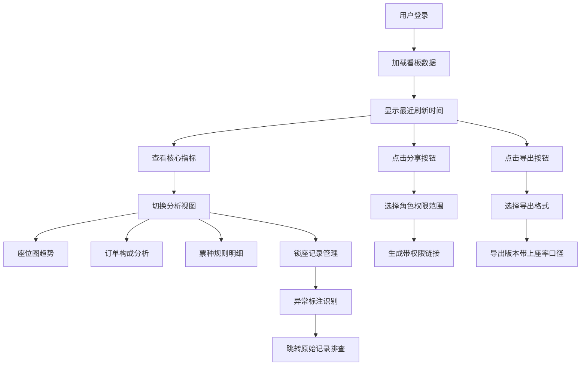

## 1. 产品概述

活动票务座位分配趋势看板是面向活动运营团队的数据分析工具，通过可视化方式拆解活动票务的座位分配数据，帮助运营人员实时掌握售票进度、识别异常情况、优化座位分配策略。

- 核心价值：整合多源票务数据（报名表、支付流水、票务平台），提供一站式座位分配分析能力
- 目标用户：活动运营经理、数据分析师、财务人员

## 2. 核心功能

### 2.1 用户角色

| 角色 | 注册方式 | 核心权限 |
|------|----------|----------|
| 系统管理员 | 系统创建 | 全量数据查看、用户管理、权限配置、数据导出 |
| 运营经理 | 邀请注册 | 活动全量数据查看、分享链接生成、数据导出 |
| 运营专员 | 邀请注册 | 限定活动数据查看、基础图表浏览 |
| 财务人员 | 邀请注册 | 支付相关数据查看、导出财务报表 |

### 2.2 功能模块

1. **看板主页**：数据概览、最近刷新时间、核心指标卡片
2. **座位图趋势**：时间序列座位分配趋势图、区域热力图
3. **购票订单构成**：订单来源分布、支付方式构成、票种销量占比
4. **票种规则明细**：票种定价、库存、销售进度、限制规则表格
5. **锁座记录管理**：锁座明细列表、异常标注、原始记录跳转

### 2.3 页面详情

| 页面名称 | 模块名称 | 功能描述 |
|-----------|-------------|---------------------|
| 看板主页 | 顶部状态栏 | 显示最近刷新时间、手动刷新按钮、分享按钮、导出按钮 |
| 看板主页 | 核心指标卡片 | 总座位数、已售座位数、上座率、锁座数、异常数 |
| 座位图趋势页 | 时间趋势图表 | 按小时/天维度展示座位分配曲线，支持多活动对比 |
| 座位图趋势页 | 区域热力图 | 各区域座位销售情况可视化，颜色深度代表销售率 |
| 订单构成页 | 饼图/环形图 | 展示订单来源、支付方式、票种占比分布 |
| 订单构成页 | 柱状图 | 各渠道购票数量对比、每日销量趋势 |
| 票种明细页 | 数据表格 | 展示各票种的定价、库存、已售、剩余、上座率、限制规则 |
| 锁座记录页 | 异常标注表格 | 标注超时锁座、重复锁座、金额异常等，支持跳转原始记录 |
| 锁座记录页 | 筛选搜索 | 按活动、时间、状态、异常类型筛选记录 |

## 3. 核心流程

用户进入看板后，系统自动加载最新数据并显示刷新时间。用户可通过顶部导航切换不同分析视图，点击分享生成带角色权限的链接，点击导出可下载包含上座率口径说明的报表。锁座记录中的异常条目可点击跳转至票务平台原始记录进行核对。

## 4. 用户界面设计

### 4.1 设计风格

- **主色调**：深邃蓝 `#0F172A` 作为背景，搭配科技蓝 `#3B82F6` 作为主强调色
- **辅助色**：成功绿 `#10B981`、警告橙 `#F59E0B`、危险红 `#EF4444`、中性灰 `#64748B`
- **按钮风格**：扁平化直角按钮，hover时有轻微上浮和阴影变化
- **字体**：显示字体使用 `Space Grotesk`，数据字体使用 `JetBrains Mono` 等宽字体
- **布局风格**：卡片式栅格布局，12列网格，卡片间8px圆角，16px间距
- **图标风格**：统一使用Lucide线性图标，尺寸16px/20px/24px

### 4.2 页面设计概览

| 页面名称 | 模块名称 | UI元素 |
|-----------|-------------|-------------|
| 看板主页 | 顶部状态栏 | 深色背景、白色文字、时间高亮显示、图标按钮组 |
| 看板主页 | 指标卡片 | 渐变背景、大字号数据、趋势箭头、小型柱状图预览 |
| 座位图趋势页 | 趋势图表 | 多色折线图、区域填充、交互式tooltip、时间轴缩放 |
| 座位图趋势页 | 区域热力图 | 色块矩阵、悬停详情、图例说明 |
| 订单构成页 | 饼图 | 环形空心设计、中心显示总数、图例可点击筛选 |
| 票种明细页 | 数据表格 | 斑马纹、固定表头、可排序、上座率用进度条可视化 |
| 锁座记录页 | 异常表格 | 异常行红色背景标注、跳转链接按钮、状态标签 |

### 4.3 响应式

- 采用桌面优先设计，最小支持1280px宽度
- 平板端自适应调整卡片列数，表格支持横向滚动
- 移动端折叠侧边栏，图表单列展示，表格简化显示

### 4.4 动效设计

- 页面加载：卡片依次淡入（0.3s延迟递增）
- 数据刷新：指标数字滚动动画
- 图表交互：hover时数据点放大高亮
- 按钮交互：点击时轻微缩放反馈（0.95倍）
- 异常闪烁：异常记录条目有呼吸灯效果提示
