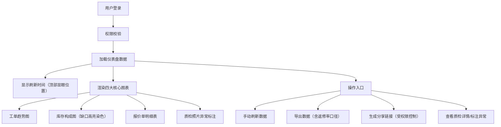

## 1. 产品概述
汽车维修工位排班风险监测系统，面向汽车维修企业管理层和调度人员，实时监控工位排班、工单流转、配件库存及质检质量风险。通过多维度数据可视化，识别排班瓶颈、库存缺口和质量异常，辅助决策优化。

## 2. 核心功能

### 2.1 用户角色
| 角色 | 注册方式 | 核心权限 |
|------|----------|----------|
| 管理员 | 后台创建 | 全功能访问、用户管理、系统配置、数据导出、分享管理 |
| 调度员 | 后台创建 | 工位排班查看、工单监控、库存查看、基础数据导出 |
| 质检员 | 后台创建 | 质检数据录入、异常标注、质量报表查看 |
| 只读用户 | 分享链接创建 | 受限范围数据查看（受角色权限控制） |

### 2.2 功能模块
1. **风险监测仪表盘**：全局数据概览、刷新时间、风险预警指标、角色权限标识
2. **工单项目趋势图**：按时间维度展示工单数量、类型、完成率趋势
3. **配件库存构成图**：库存分类占比、库存缺口单独染色高亮、缺货预警
4. **报价单明细视图**：报价单列表、价格构成、配件追溯关联
5. **质检照片异常标注**：质检照片上传、异常区域标注、异常分类统计
6. **数据导出模块**：支持导出多维度报表，自动携带返修率计算口径说明
7. **分享视图模块**：生成带权限控制的分享链接，无法绕过角色权限

### 2.3 页面详情
| 页面名称 | 模块名称 | 功能描述 |
|----------|----------|----------|
| 风险监测仪表盘 | 顶部状态栏 | 显眼位置显示最近刷新时间、手动刷新按钮、当前用户角色、导出按钮、分享按钮 |
| 风险监测仪表盘 | 风险预警卡片 | 工位过载预警、库存缺口预警、质检异常预警、返修率超标预警 |
| 风险监测仪表盘 | 工单项目趋势图 | 折线/柱状混合图，展示近30天工单数量、完成率、返修率趋势 |
| 风险监测仪表盘 | 配件库存构成图 | 饼图/环形图，库存缺口部分使用醒目的红色/橙色单独染色，不被平均值掩盖 |
| 风险监测仪表盘 | 报价单明细表格 | 可展开的报价单列表，关联配件使用明细 |
| 风险监测仪表盘 | 质检照片异常区 | 缩略图网格展示，异常照片标注红色边框，可点击查看详情和标注 |
| 质检详情页 | 照片标注工具 | 支持在照片上框选异常区域、添加备注、分类标注（划痕、凹陷、配件缺失等） |
| 数据导出弹窗 | 导出配置 | 选择导出范围、维度，展示返修率计算口径说明，一键导出 CSV/Excel |

## 3. 核心流程
用户登录后进入仪表盘，系统自动加载最新数据并在顶部显示刷新时间。用户可手动刷新数据、查看各图表详情、展开报价单追溯配件来源、点击质检照片查看异常标注。管理员可生成受权限控制的分享链接，或导出包含返修率口径的数据报表。

## 4. 用户界面设计

### 4.1 设计风格
- **主色调**：深工业蓝 (#0F172A) 作为背景，体现专业可靠感
- **强调色**：预警橙 (#F97316)、危险红 (#EF4444)、成功绿 (#10B981)、信息蓝 (#3B82F6)
- **库存缺口专用色**：高饱和警示红 (#DC2626) + 脉冲动画，确保不被平均值掩盖
- **字体**：标题使用 Space Grotesk 粗体，正文使用 JetBrains Mono 等宽字体，数字使用等宽字体确保对齐
- **布局风格**：工业仪表盘风格，卡片式布局，深色背景配高对比度数据
- **按钮风格**：圆角 6px，悬停微提升效果，危险操作使用红色渐变
- **图标风格**：Lucide 线性图标，统一 1px 描边

### 4.2 页面设计概览
| 页面名称 | 模块名称 | UI 元素 |
|----------|----------|---------|
| 仪表盘 | 顶部状态栏 | 深色背景条，左侧品牌 Logo + 刷新时间（绿色脉冲点 + 时间戳，字号 14px，加粗），右侧用户头像、角色标签、导出按钮、分享按钮 |
| 仪表盘 | 预警卡片行 | 4 张渐变卡片，每张含图标、数值、环比、趋势箭头，背景使用对应风险色渐变 |
| 仪表盘 | 工单趋势图 | Recharts 双 Y 轴组合图，柱状图展示工单数量，折线图展示返修率，tooltip 显示详情 |
| 仪表盘 | 库存构成图 | Recharts 定制饼图，缺口扇区外凸 + 脉冲发光动画，legend 单独列出缺口项 |
| 仪表盘 | 报价单明细 | 可展开行表格，展开后显示该报价单关联的配件使用明细和追溯链接 |
| 仪表盘 | 质检照片区 | 响应式网格布局，异常照片右下角红色角标 + 红色边框，hover 放大预览 |

### 4.3 响应式设计
- 桌面端优先设计（1440px 基准）
- 平板端（1024px）：两列布局，预警卡片换行
- 移动端（640px）：单列布局，图表简化展示，表格改为卡片式列表

### 4.4 动画与交互
- 页面加载：卡片渐次上浮进入（staggered fade-in-up）
- 刷新操作：数据区域骨架屏脉冲动画
- 库存缺口：持续的呼吸发光动画（pulse glow）
- 预警指标：数值变化时数字滚动动画
- 图表交互：hover 时对应扇区/柱子轻微放大并高亮
