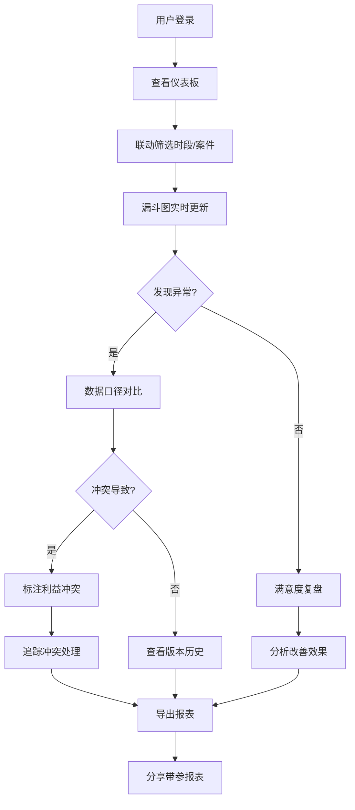

## 1. 产品概述

法律服务开庭日历漏斗报表系统，用于分析法律服务中的开庭日历数据，解决多数据源口径不一致、利益冲突数据缺口、客户满意度追踪等核心问题。目标用户为律所管理者、案件负责人和数据分析师。

通过可视化漏斗图和多维筛选，帮助团队快速识别开庭流程中的瓶颈，对比不同数据源的差异，追踪客户满意度变化，提升整体办案效率和服务质量。

## 2. 核心功能

### 2.1 用户角色

| 角色 | 注册方式 | 核心权限 |
|------|----------|----------|
| 系统管理员 | 账号登录 | 全功能访问、数据导入导出、用户管理 |
| 案件负责人 | 账号登录 | 查看所属案件数据、导出报表、标记异常 |
| 数据分析师 | 账号登录 | 高级筛选、多维度分析、生成复盘报告 |

### 2.2 功能模块

1. **仪表板总览**：漏斗报表、到场状态概览、关键指标卡片
2. **数据口径对比**：案件系统 vs 日历工具 vs 邮件附件三方数据对比
3. **利益冲突管理**：冲突标注、数据缺口可视化、冲突处理追踪
4. **客户满意度复盘**：满意度趋势、改善效果分析、关联因素挖掘
5. **筛选与导出**：多条件联动筛选、带参数截图导出、分享链接生成

### 2.3 页面详情

| 页面名称 | 模块名称 | 功能描述 |
|----------|----------|----------|
| 仪表板 | 漏斗报表 | 从案件登记到开庭完成的全流程漏斗可视化，支持时段筛选 |
| 仪表板 | 到场状态总览 | 饼图/柱状图展示各类到场状态占比，支持下钻查看详情 |
| 仪表板 | 关键指标卡片 | 开庭数、到场率、冲突率、满意度等核心KPI实时展示 |
| 数据对比 | 三方口径对比 | 案件系统、日历工具、邮件附件数据的差异对比表，高亮不一致项 |
| 数据对比 | 版本历史 | 数据层版本记录，支持回溯历史版本对比差异 |
| 利益冲突 | 冲突列表 | 标注的利益冲突案件列表，显示冲突类型和处理状态 |
| 利益冲突 | 缺口可视化 | 冲突导致的数据缺口在时间轴上的可视化展示 |
| 满意度复盘 | 趋势分析 | 客户满意度随时间变化趋势图，支持多维度对比 |
| 满意度复盘 | 改善追踪 | 改进措施实施前后的满意度对比分析 |
| 筛选导出 | 联动筛选 | 提醒名单与日历时段的联动筛选，实时更新图表 |
| 筛选导出 | 导出中心 | 支持PDF/Excel导出，截图自动附带筛选条件水印 |

## 3. 核心流程

用户登录系统后，首先查看仪表板了解整体开庭情况。通过联动筛选器选择特定时段或案件类型，漏斗图和到场状态实时更新。发现数据异常时，可切换到数据对比页面查看三方数据源的差异。对于利益冲突导致的数据缺口，在冲突管理页面进行标注和追踪。定期在满意度复盘页面分析客户满意度变化，评估改进效果。最后，通过导出功能生成带筛选条件的报表，便于团队分享和讨论。

## 4. 用户界面设计

### 4.1 设计风格

- **主色调**：深蓝色 #1e3a5f（专业、可信赖）
- **辅助色**：青色 #0d9488（数据可视化）、琥珀色 #f59e0b（警告）、红色 #ef4444（冲突）、绿色 #10b981（正常）
- **背景色**：浅灰蓝 #f8fafc（清爽）
- **按钮风格**：微圆角、微妙阴影、hover状态有轻微上浮效果
- **字体**：标题使用 Playfair Display（专业感），正文使用 Noto Sans SC（清晰易读）
- **布局风格**：卡片式布局，清晰的信息层级，充足的留白
- **图标风格**：线性图标，统一2px描边，配合圆角设计

### 4.2 页面设计概述

| 页面名称 | 模块名称 | UI 元素 |
|----------|----------|----------|
| 仪表板 | 漏斗报表 | Recharts 自定义漏斗图，渐变填充，悬浮显示详情，动画过渡 |
| 仪表板 | 到场状态总览 | 环形图+卡片组合，状态标签颜色编码，支持点击下钻 |
| 仪表板 | 关键指标卡片 | 微妙渐变背景，数字动画增长，趋势箭头指示 |
| 数据对比 | 三方口径对比 | 表格差异高亮，颜色编码不同状态，支持展开查看详情 |
| 利益冲突 | 缺口可视化 | 时间轴热力图，缺口区域红色渐变遮罩 |
| 满意度复盘 | 趋势分析 | 多折线对比图，关键节点标注，区域渐变填充 |
| 筛选导出 | 联动筛选 | 标签式筛选器，面包屑显示当前筛选条件，一键清除 |

### 4.3 响应式

采用桌面优先设计，在1200px以上展示完整的多栏布局。在平板端（768-1200px）自动调整为两栏布局，筛选器移至顶部。在移动端（768px以下）采用单栏流式布局，图表自适应宽度，筛选器改为抽屉式菜单。

所有交互元素确保最小44px触摸区域，优化移动端手势操作。
