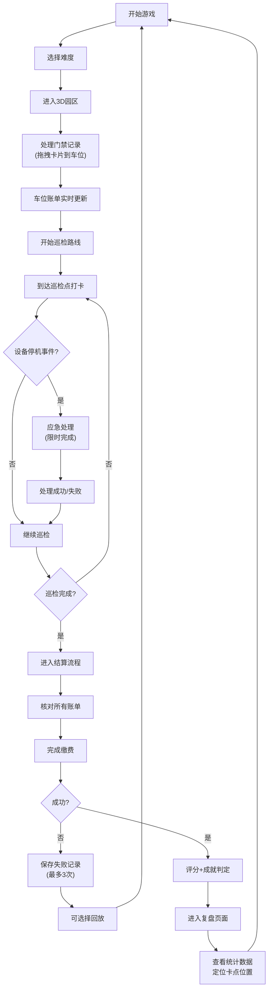

## 1. 产品概述
物业园区停车缴费调度解谜游戏，玩家扮演物业管理员，通过处理门禁记录、管理车位账单、完成巡检路线来学习和练习停车缴费判断流程。游戏融合突发事件、成就系统和复盘分析，提升玩家的实际操作能力。

- **核心目标**：通过沉浸式3D互动体验，让玩家掌握物业园区停车管理的完整流程
- **目标用户**：物业从业人员、停车场管理人员、相关专业学生
- **产品价值**：将枯燥的缴费流程转化为有趣的解谜游戏，降低学习成本，提高实操熟练度

## 2. 核心功能

### 2.1 用户角色
| 角色 | 登录方式 | 核心权限 |
|------|----------|----------|
| 玩家 | 无需登录，本地存储 | 游戏游玩、成就解锁、回放查看、复盘分析 |

### 2.2 功能模块
1. **主菜单页面**：游戏开始、难度选择、成就展示、设置
2. **游戏场景(3D)**：物业园区、可交互车位、门禁设备、建筑物
3. **门禁记录系统**：可拖拽的门禁卡片、车辆进出记录
4. **账单系统**：动态变化的车位账单、计时任务、费用计算
5. **巡检路线系统**：巡检点导航、任务完成验证、结算流程
6. **突发事件系统**：设备停机故障、应急处理
7. **回放系统**：失败记录存储(最多3次)、卡顿点定位
8. **复盘页面**：车位周转率统计、完成时间分析、卡点定位
9. **配置系统**：难度参数、道具冷却、成就条件、埋点配置

### 2.3 页面详情
| 页面名称 | 模块名称 | 功能描述 |
|----------|----------|----------|
| 主菜单 | 难度选择 | 简单/普通/困难三档，影响账单复杂度、突发事件频率 |
| 主菜单 | 成就展示 | 已解锁成就徽章、成就进度条 |
| 主菜单 | 历史记录 | 最近3次失败回放入口、最佳成绩展示 |
| 游戏场景 | 3D园区 | 可漫游的物业园区，包含8个车位、2个门禁、3栋建筑 |
| 游戏场景 | 门禁交互 | 拖拽门禁记录卡片到对应车位完成登记 |
| 游戏场景 | 账单面板 | 实时显示每个车位的停车时长、费用、优惠信息 |
| 游戏场景 | 巡检导航 | 箭头指引巡检顺序，到达检查点触发任务 |
| 游戏场景 | 突发事件 | 随机触发设备停机，需在限定时间内处理 |
| 结算页面 | 费用核算 | 所有车位费用汇总、异常账单标记 |
| 结算页面 | 评分系统 | 准确率、效率、应急处理三维评分 |
| 复盘页面 | 数据统计 | 车位周转率、平均处理时间、卡点热力图 |
| 复盘页面 | 回放功能 | 逐帧回放操作过程，卡顿点高亮标记 |
| 设置页面 | 游戏配置 | 难度调整、音效开关、埋点开关 |

## 3. 核心流程

### 游戏主流程
玩家选择难度后进入3D园区，需要按顺序处理：门禁登记→账单核对→巡检打卡→结算缴费。过程中会随机触发设备停机事件，成功完成所有任务后进入复盘分析。

## 4. 用户界面设计

### 4.1 设计风格
- **主色调**：深蓝(#1e3a5f)作为物业专业感主色，橙黄(#f59e0b)作为警示/强调色，青绿(#10b981)作为成功色
- **视觉风格**：科技感工业风，模拟真实物业监控中心氛围
- **字体**：标题使用 "Orbitron" 科技感字体，正文使用 "Noto Sans SC" 清晰易读
- **按钮**：圆角8px，带轻微3D凸起效果，hover时有发光边框
- **图标**：使用Lucide图标，统一线性风格

### 4.2 3D场景设计
- **环境**：傍晚时分，路灯亮起，营造值班监控氛围，使用HDRI环境贴图
- **光照**：主光源模拟夕阳，辅光源为路灯和建筑内部灯光，投射柔和阴影
- **相机**：第三人称跟随视角，可通过WASD移动，鼠标旋转视角
- **交互元素**：车位有发光边框，hover时高亮，点击弹出详细信息
- **后处理**：Bloom效果突出UI元素，轻微色差模拟监控屏幕质感

### 4.3 页面设计概览
| 页面名称 | 模块名称 | UI元素 |
|----------|----------|--------|
| 主菜单 | 背景 | 循环播放的3D园区预览动画，粒子效果 |
| 主菜单 | 标题 | 渐变色发光文字，入场动画 |
| 主菜单 | 按钮组 | 垂直排列，hover时上浮+发光 |
| 游戏场景 | HUD | 左上角小地图，右上角计时器，底部任务栏 |
| 游戏场景 | 门禁卡片 | 半透明玻璃质感，可拖拽，带有车辆信息 |
| 游戏场景 | 账单面板 | 浮动窗口，数字变化时有滚动动画 |
| 游戏场景 | 巡检箭头 | 发光半透明箭头，沿路径移动动画 |
| 结算页面 | 账单列表 | 卡片式布局，异常项红色标记 |
| 复盘页面 | 统计图表 | 柱状图+热力图，数据变化动画 |
| 复盘页面 | 时间轴 | 可拖动时间轴，卡点位置红色标记 |

### 4.4 响应式
- 桌面端优先设计，支持1920×1080及以上分辨率
- 3D场景自适应窗口大小，UI元素使用相对定位
- 不支持移动端，专注桌面端沉浸式体验

### 4.5 3D场景交互
- **门禁拖拽**：鼠标点击门禁卡片→拖动到对应车位→释放完成登记，有吸附和碰撞检测
- **账单查看**：点击车位弹出详细账单，滚动查看历史记录
- **巡检移动**：WASD控制角色移动，Shift加速，到达巡检点自动触发打卡
- **突发事件**：屏幕闪烁红色警报，弹窗显示故障信息，倒计时处理
