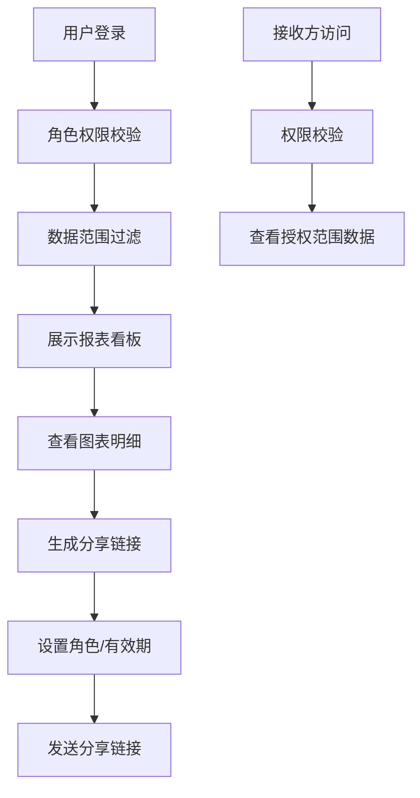
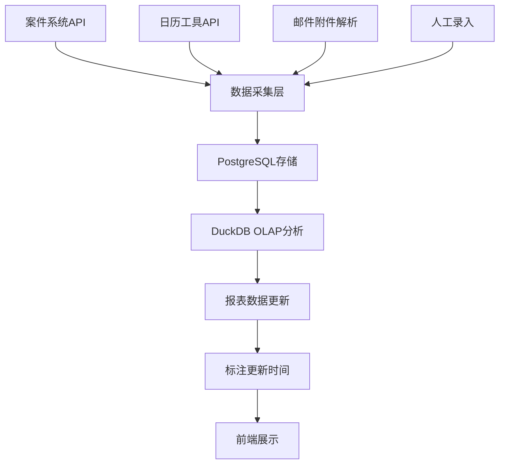

## 1. 产品概述

法律服务费用报价漏斗报表系统，用于拆解和可视化法律服务费用的全流程数据。通过多维度图表展示对账差异、合同构成、单据明细和审批异常，支持按角色权限的数据访问控制，帮助律师事务所实现费用透明化管理和精细化运营。

### 1.1 核心目标
- 实现法律服务费用全流程可视化追踪
- 按角色权限控制数据访问范围
- 提供多维度数据分析和导出功能
- 支持邮件附件作为明细追溯来源

## 2. 核心功能

### 2.1 用户角色与权限

| 角色 | 注册方式 | 核心权限 |
|------|----------|----------|
| 合伙人 | 系统管理员创建 | 查看所有数据、导出完整报表、管理分享链接 |
| 律师 | 系统管理员创建 | 查看本人负责案件数据、导出本人范围数据 |
| 助理 | 系统管理员创建 | 查看分配案件数据、协助处理单据 |
| 客户 | 邮件邀请链接 | 仅查看本人相关案件的非敏感数据 |
| 外部人员 | 无 | 无法访问任何敏感明细数据 |

### 2.2 功能模块

1. **报表看板页**：对账差异趋势图、合同附件构成图、单据明细表、审批节点异常标注
2. **数据详情页**：案件明细、费用明细、回款周期追踪
3. **分享管理页**：生成分享链接、设置角色权限、有效期管理
4. **导出中心**：报表导出、回款周期口径同步、明细追溯

### 2.3 页面详情

| 页面名称 | 模块名称 | 功能描述 |
|----------|----------|----------|
| 报表看板页 | 对账差异趋势 | 按时间维度展示报价与实际对账差异趋势线，标注最后更新时间 |
| 报表看板页 | 合同附件构成 | 饼图/环形图展示各类合同附件占比，支持下钻查看明细 |
| 报表看板页 | 单据明细表 | 数据表格展示所有单据明细，支持筛选、排序、搜索 |
| 报表看板页 | 审批节点异常 | 时间线标注审批流程中的异常节点，显示异常原因和处理状态 |
| 数据详情页 | 案件详情 | 展示案件基本信息、关联合同、费用明细 |
| 数据详情页 | 回款追踪 | 按回款周期口径展示收款计划和实际回款情况 |
| 分享管理页 | 链接管理 | 生成带权限的分享链接，设置访问有效期和角色限制 |
| 导出中心 | 报表导出 | 导出PDF/Excel格式报表，自动附带回款周期口径说明 |

## 3. 核心流程

### 3.1 用户访问流程
用户登录系统后，系统根据角色自动过滤可访问数据范围，展示相应的报表看板。用户可以通过分享链接将报表分享给其他授权用户，接收方根据自身角色查看对应范围的数据。

### 3.2 数据同步流程
系统从案件系统、日历工具获取基础数据，解析邮件附件作为明细追溯来源，通过DuckDB进行OLAP分析后更新报表数据，每张图表标注最后更新时间。

## 4. 用户界面设计

### 4.1 设计风格
- **主色调**：深蓝(#1e3a5f)作为主色，代表专业和可信赖；金色(#d4af37)作为强调色，体现法律服务的高端属性
- **辅助色**：浅灰(#f5f7fa)作为背景色，深灰(#333333)作为文字色
- **按钮风格**：圆角4px，悬浮时有轻微阴影和颜色加深效果
- **字体**：标题使用 Noto Serif SC，正文使用 Inter，数字使用 JetBrains Mono
- **布局风格**：卡片式布局，顶部导航 + 侧边筛选栏 + 主内容区
- **图标**：使用 lucide-react 线性图标，保持简洁专业

### 4.2 页面设计概述

| 页面名称 | 模块名称 | UI元素 |
|----------|----------|--------|
| 报表看板页 | 顶部导航 | Logo、用户信息、角色标识、导出按钮、分享按钮 |
| 报表看板页 | 筛选区域 | 时间范围选择、案件类型筛选、律师筛选、状态筛选 |
| 报表看板页 | 对账差异趋势 | 折线图、X轴时间、Y轴差异金额、数据点悬浮提示、更新时间标签 |
| 报表看板页 | 合同附件构成 | 环形图、图例、点击下钻、更新时间标签 |
| 报表看板页 | 单据明细表 | 固定表头、斑马纹、行悬浮高亮、分页、更新时间标签 |
| 报表看板页 | 审批节点异常 | 时间线组件、异常节点红色标注、状态标签、更新时间标签 |
| 数据详情页 | 案件信息卡 | 案件名称、编号、律师、客户、状态标签 |
| 数据详情页 | 费用明细 | 分组展示、费用项、金额、时间、附件链接 |
| 分享管理页 | 链接列表 | 链接URL、角色限制、有效期、访问次数、复制按钮 |
| 导出中心 | 导出配置 | 格式选择、口径说明预览、导出按钮 |

### 4.3 响应式设计
- **Desktop-first**：优先适配1920x1080分辨率
- **平板适配**：1024px断点，侧边栏收起为图标模式
- **手机适配**：768px断点，图表堆叠展示，支持横向滑动查看数据表格
- **触摸优化**：按钮最小高度44px，图表支持手势缩放

### 4.4 数据可视化规范
- 每张图表右上角标注"最后更新时间：YYYY-MM-DD HH:mm"
- 异常数据使用红色边框和背景高亮
- 鼠标悬停显示详细数据和追溯来源链接
- 支持图表全屏查看
- 导出图片时自动包含更新时间水印
