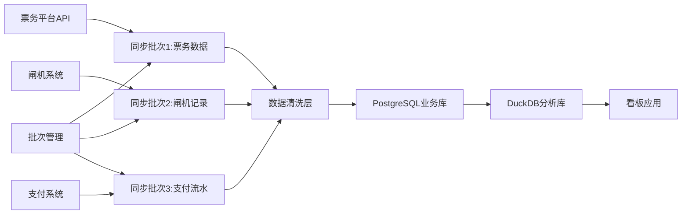
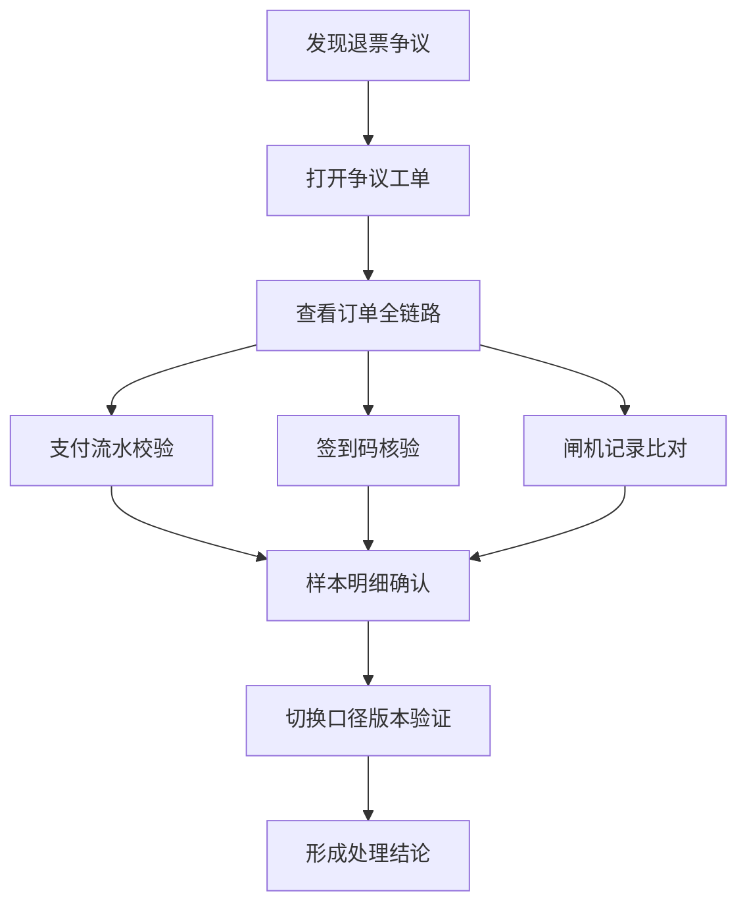

## 1. 产品概述

活动票务赞助权益趋势看板是面向活动运营团队的数据分析平台，用于实时监控活动票务销售、赞助权益核销、用户签到等全链路数据变化。通过多维度对比分析（同环比、区域对比、核销效率），帮助运营团队快速洞察业务趋势，及时发现退票争议等异常情况，为活动复盘提供可追溯的数据口径支持。

- **目标用户**：活动运营经理、数据分析人员、赞助权益管理人员
- **解决问题**：数据分散难以联动分析、核销口径不透明导致复盘困难、退票争议缺乏样本明细支撑、同环比分析需要手动计算
- **产品价值**：统一数据视图、可追溯的口径管理、智能化异常检测、多维度对比分析

## 2. 核心功能

### 2.1 用户角色

| 角色 | 登录方式 | 核心权限 |
|------|----------|----------|
| 运营管理员 | SSO单点登录 | 查看所有看板、管理口径版本、操作数据同步 |
| 数据分析师 | SSO单点登录 | 查看所有看板、导出报表、钻取明细 |
| 赞助方对接人 | 账号密码登录 | 仅查看对应赞助权益数据、下载核销明细 |

### 2.2 功能模块

1. **综合看板首页**：KPI概览卡片、赞助权益趋势图、核心指标同环比
2. **票种分析页**：票种规则对比、购票订单趋势、同环比分析
3. **座位图分析页**：可视化座位图、区域销售热力图、点击跳转明细
4. **核销效率页**：多维度核销效率对比、口径版本管理、日期/区域比较
5. **退票争议页**：退票争议列表、样本明细弹窗、签到码口径解释
6. **数据同步页**：取数链路监控、批次回看、同步任务管理

### 2.3 页面详情

| 页面名称 | 模块名称 | 功能描述 |
|----------|----------|----------|
| 综合看板首页 | KPI卡片组 | 展示总销量、核销率、赞助权益使用率、退票率等核心指标，支持点击钻取 |
| 综合看板首页 | 赞助权益趋势图 | 多系列折线图展示各类权益核销趋势，支持时间范围筛选 |
| 综合看板首页 | 同环比对比栏 | 核心指标与上期、去年同期对比，异常指标高亮预警 |
| 票种分析页 | 票种规则对比表 | 展示不同票种的价格、权益、销量、收入对比 |
| 票种分析页 | 购票订单趋势 | 按日/周/月展示订单量趋势，支持同环比叠加 |
| 票种分析页 | 票种销售漏斗 | 从浏览→下单→支付→核销的转化漏斗 |
| 座位图分析页 | 可视化座位图 | 按场馆区域展示座位销售状态，支持缩放和区域筛选 |
| 座位图分析页 | 区域热力图 | 不同区域的销售热度和均价热力分布 |
| 座位图分析页 | 座位明细弹窗 | 点击座位展示购票人、票价、签到状态等明细信息 |
| 核销效率页 | 核销效率对比图 | 按日期/区域/票种多维度对比核销效率 |
| 核销效率页 | 口径版本选择器 | 支持切换不同版本的核销效率计算口径 |
| 核销效率页 | 口径变更说明 | 展示各版本口径的计算公式和变更原因 |
| 退票争议页 | 争议工单列表 | 展示退票争议工单，支持筛选和搜索 |
| 退票争议页 | 样本明细弹窗 | 展示争议订单的全链路明细（支付、签到、闸机记录） |
| 退票争议页 | 签到码口径解释 | 展示签到码的生成、核销、作废规则说明 |
| 数据同步页 | 取数链路拓扑图 | 展示票务平台→闸机记录→支付流水的数据流向 |
| 数据同步页 | 批次管理列表 | 展示历史同步批次，支持回看和重跑指定批次 |
| 数据同步页 | 同步任务监控 | 实时监控同步任务状态、进度和错误日志 |

## 3. 核心流程

### 3.1 日常监控流程

运营管理员登录看板 → 查看首页KPI和趋势图 → 发现异常指标（如退票率升高）→ 点击钻取到退票争议页 → 查看争议工单 → 打开样本明细排查原因 → 切换口径版本验证数据一致性 → 导出报表用于复盘

### 3.2 数据同步流程

### 3.3 争议排查流程

## 4. 用户界面设计

### 4.1 设计风格

- **主色调**：深海蓝 `#0F172A` 作为背景主色，体现数据分析的专业感和沉稳感
- **强调色**：科技青 `#06B6D4` 用于图表和交互元素，活力橙 `#F97316` 用于预警高亮
- **中性色**：冷灰系列 `#64748B / #94A3B8 / #CBD5E1` 用于文本和边框
- **按钮风格**：微圆角（6px）、轻微阴影、hover状态上浮2px的微动效
- **字体**：展示字体使用 `Space Grotesk` 体现科技感，正文字体使用 `Inter` 保证可读性
- **布局风格**：卡片式布局，卡片边缘1px细边框，卡片之间8px间距，整体采用不对称网格打破单调感
- **图标风格**：线性风格 `lucide-react` 图标，与整体科技感保持一致

### 4.2 视觉特点

- 深色主题为主，减少长时间看板监控的视觉疲劳
- 图表采用ECharts自定义主题，渐变色填充+发光描边效果
- 关键指标卡片采用悬浮玻璃拟态效果，带轻微模糊背景
- 数据变化采用数字滚动动画，配合趋势箭头指示
- 座位图采用SVG矢量渲染，支持平滑的缩放过渡动画

### 4.3 页面设计概述

| 页面名称 | 模块名称 | UI元素 |
|----------|----------|--------|
| 综合看板首页 | KPI卡片组 | 玻璃拟态卡片、数字滚动动画、趋势箭头、同比变化百分比 |
| 综合看板首页 | 赞助权益趋势图 | ECharts多系列折线图、渐变色区域填充、数据点发光效果 |
| 综合看板首页 | 同环比对比栏 | 横向对比条、正负值颜色区分、异常指标脉冲动画 |
| 票种分析页 | 票种规则对比表 | 斑马纹表格、可排序列头、hover行高亮 |
| 票种分析页 | 购票订单趋势 | 柱状图+折线图组合、同环比虚线叠加 |
| 座位图分析页 | 可视化座位图 | SVG交互座位、点击选中动画、区域色块区分 |
| 座位图分析页 | 区域热力图 | 颜色渐变热力、hover显示详情tooltip |
| 核销效率页 | 核销效率对比图 | 分组柱状图、多维度筛选器、口径版本标签 |
| 退票争议页 | 样本明细弹窗 | 抽屉式弹窗、时间轴布局展示全链路数据 |
| 数据同步页 | 取数链路拓扑图 | 节点连线动画、状态颜色区分、批次进度条 |

### 4.4 响应式

- 采用桌面优先设计，主显示区域最小支持1440px宽度
- 侧边导航栏在1280px以下自动收起为图标模式
- KPI卡片在平板端自动调整为2列布局
- 表格在小屏幕下支持横向滚动，保持列完整性
- 所有图表支持自适应容器宽度，重绘动画流畅

### 4.5 交互动效

- 页面加载采用渐进式显示，各模块按0.1s间隔错峰入场
- 数字变化采用平滑滚动动画（0.6s）
- 图表数据更新时采用ECharts的animationDuration配置实现平滑过渡
- 抽屉弹窗采用贝塞尔曲线缓动（0.3s ease-out）
- 按钮hover状态：背景色过渡+轻微上移+阴影加深
