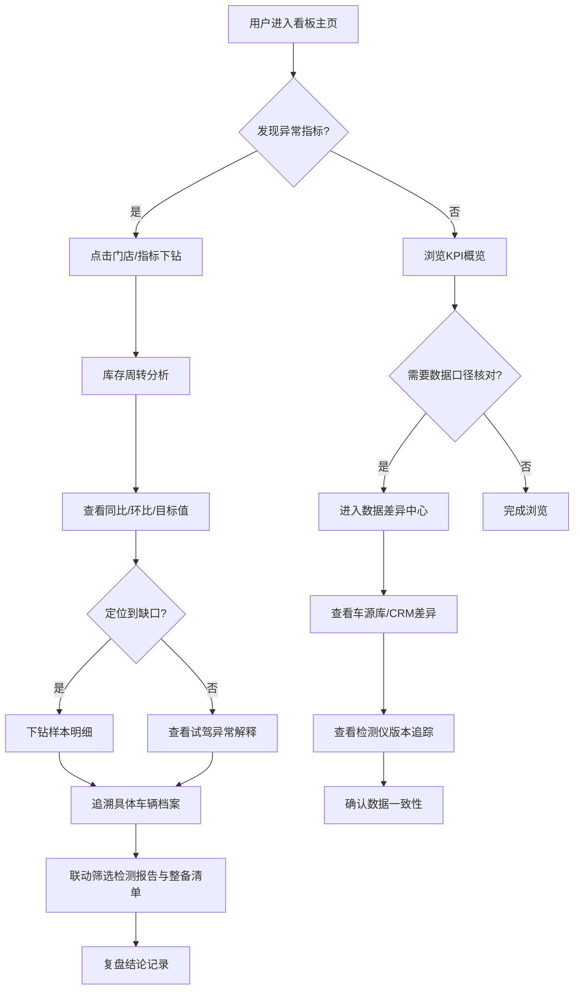

## 1. 产品概述

二手车门店过户材料趋势看板——面向二手车门店运营与管理层的一站式数据分析平台。解决过户材料缺失追踪难、多源数据口径不一致、库存周转手算繁琐等核心痛点，实现对过户全流程材料的数据化监控与智能复盘。

- 目标用户：二手车门店店长、运营主管、数据分析师
- 核心价值：将分散在车源库、检测仪、CRM中的数据统一呈现，自动计算库存周转指标，减少运营手算，提升复盘效率

## 2. 核心功能

### 2.1 用户角色

| 角色 | 权限说明 |
|------|----------|
| 店长 | 查看全部门店数据、导出报表、设定周转目标值 |
| 运营主管 | 查看本门店数据、筛选分析、追溯样本明细 |
| 数据分析师 | 全量数据访问、差异记录查询、自定义筛选条件 |

### 2.2 功能模块

1. **看板主页**：核心KPI概览、地图门店分布、库存周转趋势、材料缺失热力图
2. **车辆档案总览**：单车全生命周期档案，串联检测报告、整备清单、试驾记录
3. **数据差异中心**：车源库 vs CRM 口径差异记录、检测仪版本差异追踪
4. **库存周转分析**：同比/环比/目标值三线对比、缺口样本下钻

### 2.3 页面详情

| 页面名称 | 模块名称 | 功能描述 |
|----------|----------|----------|
| 看板主页 | KPI指标卡 | 展示在库车辆数、过户完成率、平均周转天数、材料缺失率 |
| 看板主页 | 门店地图 | Mapbox GL 地图展示门店分布，气泡大小表示库存量，颜色表示周转状态 |
| 看板主页 | 库存周转趋势 | 折线图展示周转天数趋势，叠加同比/环比/目标值三线 |
| 看板主页 | 材料缺失热力图 | 按材料类型与门店维度展示缺失热力图，点击可下钻到样本明细 |
| 车辆档案总览 | 车辆列表 | 支持搜索、筛选的车辆列表，展示车架号、车型、入库时间、当前状态 |
| 车辆档案总览 | 档案详情面板 | 单车档案详情：基本信息、检测报告摘要、整备清单、试驾记录 |
| 车辆档案总览 | 联动筛选 | 检测报告与整备清单联动筛选，选中某检测项自动关联整备任务 |
| 数据差异中心 | 差异概览 | 车源库/检测仪/CRM三者数据差异统计卡片 |
| 数据差异中心 | 差异明细表 | 可筛选的差异记录表格，支持按版本、字段、门店过滤 |
| 数据差异中心 | 版本追踪 | 检测仪版本变更时间线，标注每次变更影响范围 |
| 库存周转分析 | 周转三线对比 | 同比、环比、目标值在同一图表中展示，减少手算 |
| 库存周转分析 | 缺口下钻 | 点击缺口指标自动展开对应样本明细，追溯具体车辆 |
| 库存周转分析 | 试驾异常解释 | 试驾记录异常点自动标注，辅助解释周转异常原因 |

## 3. 核心流程

用户打开看板主页，快速浏览KPI指标与门店地图，发现某门店周转异常后点击进入库存周转分析，查看同比/环比/目标值三线对比，定位缺口后下钻到样本明细，同时参考试驾记录解释异常点。在日常复盘中，用户通过数据差异中心查看车源库与CRM的口径差异，确保数据源一致性。车辆档案总览用于查看单车全生命周期，联动筛选检测报告与整备清单。

## 4. 用户界面设计

### 4.1 设计风格

- **主色调**：深蓝灰 (#1a1f2e) 作为背景底色，搭配琥珀金 (#f59e0b) 作为强调色，传达专业与信赖感
- **辅助色**：翠绿 (#10b981) 表示正向/达标，玫红 (#ef4444) 表示异常/缺口，钢蓝 (#3b82f6) 表示信息/中性
- **按钮风格**：圆角矩形 (rounded-lg)，轻微阴影，hover 态发光效果
- **字体**：数据数字使用 JetBrains Mono，界面文字使用 Noto Sans SC
- **布局风格**：左侧导航 + 右侧内容区，卡片式模块布局，顶部粘性工具栏
- **图标风格**：线性图标 (Lucide)，24px，与文字等高对齐

### 4.2 页面设计概览

| 页面名称 | 模块名称 | UI要素 |
|----------|----------|--------|
| 看板主页 | KPI指标卡 | 4列网格，每卡片深色背景+大数字+迷你趋势图，数字用JetBrains Mono |
| 看板主页 | 门店地图 | Mapbox GL全幅地图，暗色底图，气泡标注门店，hover弹窗 |
| 看板主页 | 库存周转趋势 | 面积折线图，三线叠加（同比虚线/环比实线/目标点线），工具提示 |
| 看板主页 | 材料缺失热力图 | 行列表格热力图，颜色深浅表示缺失程度，点击行展开明细 |
| 车辆档案总览 | 车辆列表 | 左侧列表（虚拟滚动），右侧详情面板，分栏联动 |
| 车辆档案总览 | 档案详情面板 | 标签页切换（基本信息/检测报告/整备清单/试驾记录），联动高亮 |
| 数据差异中心 | 差异概览 | 3列统计卡片，带环形图展示差异数据占比 |
| 数据差异中心 | 差异明细表 | 可排序、可筛选数据表格，行展开查看字段级差异 |
| 库存周转分析 | 周转三线对比 | 主图表区域，工具栏切换时间范围，标注异常区间 |
| 库存周转分析 | 缺口下钻 | 滑出式面板，列出缺口对应的车辆样本，支持进一步筛选 |
| 库存周转分析 | 试驾异常解释 | 时间轴式试驾记录，异常点红标+注释气泡 |

### 4.3 响应式设计

- 桌面优先设计，最小宽度 1280px
- 1440px 以上充分利用空间展示更多数据列
- 移动端暂不作为核心适配目标，仅保证基本可读性

### 4.4 设计特色

- 数据卡片加载时使用骨架屏过渡
- 地图交互支持平滑缩放与飞行动画
- 图表切换使用淡入淡出过渡
- 缺口下钻使用侧滑面板动画
- 差异记录变更使用闪烁高亮提示
