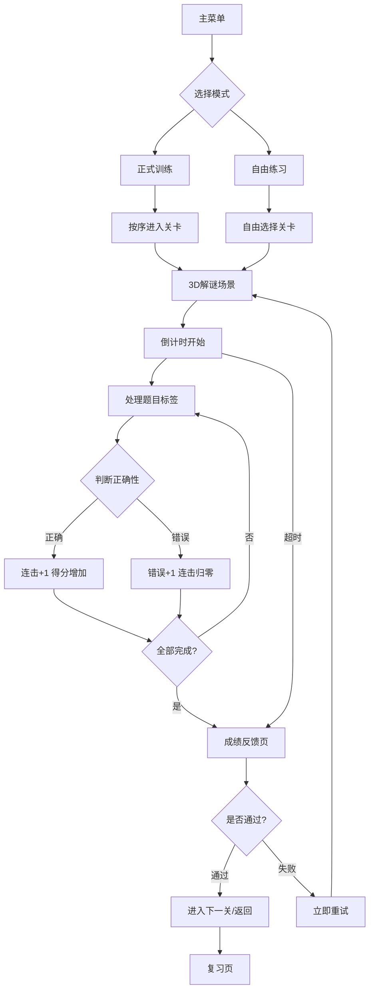

## 1. 产品概述

青少年培训教材发放调度解谜游戏——一款将教材分发流程转化为3D交互式解谜挑战的培训工具。玩家在倒计时压力下处理题目标签、追踪学习进度并获取成绩反馈，评分综合考量速度、错误次数与连续正确数，帮助青少年在趣味中掌握教材分发调度技能。

- 目标用户：青少年培训学员、教学主管
- 核心价值：将枯燥的教材发放流程转化为沉浸式3D解谜体验，提升学习效率与参与度

## 2. 核心功能

### 2.1 用户角色

| 角色 | 权限说明 |
|------|----------|
| 学员 | 参与正式训练与自由练习、查看个人成绩与复习 |
| 教学主管 | 挑选/管理关卡、查看培训数据、配置训练参数 |

### 2.2 功能模块

1. **主菜单页**：模式选择（正式训练/自由练习）、办公模式开关、设置入口
2. **关卡选择页**：按分类展示可用关卡、教学主管筛选功能
3. **游戏场景页**：3D解谜主场景、倒计时、题目标签处理、物理交互
4. **成绩反馈页**：评分详情、速度/错误/连击分析、重试入口
5. **复习页**：多关卡完成率对比、历史记录、趋势图
6. **设置页**：声音/震动/动画强度开关、办公模式配置

### 2.3 页面详情

| 页面名称 | 模块名称 | 功能描述 |
|----------|----------|----------|
| 主菜单页 | 模式选择 | 正式训练与自由练习入口，带3D场景背景 |
| 主菜单页 | 办公模式 | 一键切换声音/震动/动画为低强度或关闭 |
| 关卡选择页 | 关卡列表 | 按难度和分类展示关卡，标记完成状态 |
| 关卡选择页 | 主管筛选 | 按教材类别、难度、培训批次筛选 |
| 游戏场景页 | 3D场景 | PlayCanvas渲染的教材仓库与分发台 |
| 游戏场景页 | 倒计时 | 顶部倒计时进度条，时间不足时闪烁警示 |
| 游戏场景页 | 题目标签 | 教材需求标签，玩家需拖拽匹配到正确位置 |
| 游戏场景页 | 学习进度 | 侧边栏实时进度条与正确率 |
| 游戏场景页 | 物理交互 | Ammo.js驱动的教材箱体物理拖拽与堆叠 |
| 成绩反馈页 | 评分面板 | 综合评分（速度+错误+连击），星级评定 |
| 成绩反馈页 | 错误回顾 | 标记错误题目，展示正确答案 |
| 成绩反馈页 | 重试按钮 | 失败后立即重试，无需返回菜单 |
| 复习页 | 完成率对比 | 柱状图/雷达图对比各关卡完成率 |
| 复习页 | 趋势分析 | 时间维度的成绩变化折线图 |
| 设置页 | 声音控制 | 音量滑块、音效开关 |
| 设置页 | 震动控制 | 震动开关与强度调节 |
| 设置页 | 动画控制 | 动画强度三档（高/中/关） |

## 3. 核心流程

**游戏主流程**：玩家从主菜单选择模式→选择关卡→进入3D场景→倒计时开始→处理题目标签（拖拽教材到对应分发位）→物理引擎模拟教材箱体运动→实时计算正确/错误→倒计时结束或全部完成→展示成绩反馈→重试或返回。

**教学模式分流**：正式训练模式下关卡顺序锁定、不可跳过；自由练习模式可任意选择关卡、无顺序限制。

**办公模式**：开启后声音静音、震动关闭、动画降为最低档，确保办公室环境不打扰他人。

## 4. 用户界面设计

### 4.1 设计风格

- **主色调**：深蓝科技色 `#0A1628` + 亮青色 `#00E5FF` 作为强调色
- **辅助色**：橙色 `#FF6B35`（警示/错误）、绿色 `#00E676`（正确/成功）
- **按钮风格**：圆角玻璃拟态按钮，带微妙光泽和阴影
- **字体**：标题使用 `Orbitron`（科技感），正文使用 `Noto Sans SC`
- **布局风格**：3D场景全屏沉浸式，UI控件浮层叠加
- **图标风格**：线性图标，统一描边宽度2px，青色高亮

### 4.2 页面设计概览

| 页面名称 | 模块名称 | UI元素 |
|----------|----------|--------|
| 主菜单页 | 模式选择 | 深色全屏背景，3D粒子效果，玻璃拟态卡片按钮，Orbitron大标题 |
| 关卡选择页 | 关卡列表 | 网格卡片，完成状态角标，难度星级，悬浮发光效果 |
| 游戏场景页 | 3D场景 | PlayCanvas全屏渲染，教材仓库+分发台模型，Ammo.js物理箱体 |
| 游戏场景页 | HUD | 顶部倒计时条，侧边进度面板，题目标签浮层 |
| 成绩反馈页 | 评分面板 | 星级动画展示，分数跳动动画，雷达图评分维度 |
| 复习页 | 对比图表 | 柱状图/雷达图，渐变配色，悬浮提示 |
| 设置页 | 开关控件 | 自定义滑动开关，强度滑块，即时预览 |

### 4.3 响应式设计

- 桌面优先设计，3D场景自适应窗口大小
- 平板端：触控优化，按钮触控区域≥44px
- 移动端：简化3D场景细节，增加触控手势支持

### 4.4 3D场景指引

- **环境**：低饱和度仓库室内环境，HDRI营造温暖办公灯光氛围
- **光照**：主方向光+环境光，教材分发台区域聚光灯突出
- **相机**：45度俯视等距视角，可拖拽旋转，缩放限制
- **焦点**：教材分发台为中心，题目标签浮动在3D空间中
- **交互**：拖拽教材箱体到对应标签位置，物理引擎模拟投掷和堆叠
- **动画**：正确放置时粒子爆发效果，错误时箱体弹回抖动
- **后处理**：辉光(Bloom)效果，办公模式下关闭后处理节省性能
