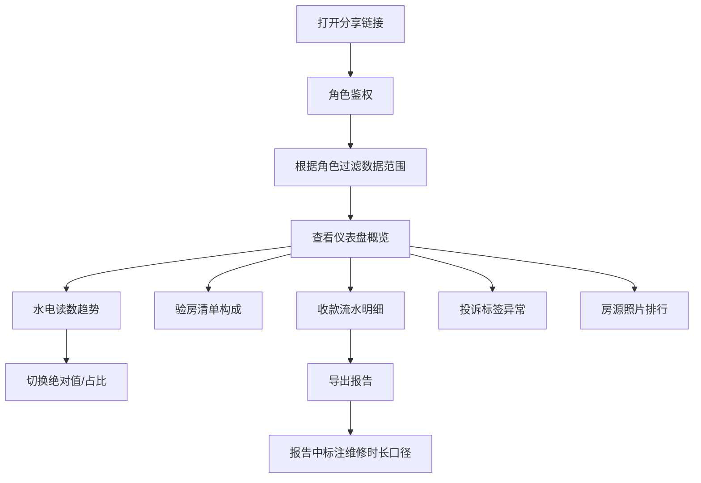

## 1. 产品概述
长租公寓退租验房风险监测图是一款数据可视化平台，用于拆解长租公寓退租验房全链路数据，帮助运营、维修和管理人员实时监控退租风险、验房质量和收款情况。平台整合抄表表格、CRM系统和支付流水数据，通过多维度图表展示退租验房过程中的关键指标和异常风险点。

## 2. 核心功能

### 2.1 用户角色
| 角色 | 访问方式 | 核心权限 |
|------|----------|----------|
| 运营主管 | 分享链接 + 角色鉴权 | 查看全部房源数据，下载完整报告 |
| 区域经理 | 分享链接 + 角色鉴权 | 查看管辖区域房源数据，下载区域报告 |
| 维修主管 | 分享链接 + 角色鉴权 | 查看维修相关数据，关注维修时长指标 |
| 客服主管 | 分享链接 + 角色鉴权 | 查看投诉标签数据，关注异常标注 |

### 2.2 功能模块
1. **仪表盘概览页**：核心指标卡片、水电读数趋势图、验房清单构成图
2. **流水明细页**：收款流水明细表、支付追溯来源
3. **风险监测页**：投诉标签异常标注、房源照片排行
4. **数据下载页**：报告导出、维修时长口径说明

### 2.3 页面详情
| 页面名称 | 模块名称 | 功能描述 |
|----------|----------|----------|
| 仪表盘 | 指标卡片 | 展示退租率、验房通过率、平均维修时长、投诉率等核心KPI，每张卡片显示最后更新时间 |
| 仪表盘 | 水电读数趋势图 | 折线图展示退租房源近6个月水电读数变化，标记异常波动点，支持按房源筛选 |
| 仪表盘 | 验房清单构成图 | 环形图展示验房问题类别构成（墙面、地面、家电、家具等），支持钻取查看明细 |
| 流水明细 | 收款流水明细表 | 数据表格展示退租结算收款明细，关联支付流水号，支持按时间、房源、金额筛选 |
| 风险监测 | 投诉标签异常标注 | 散点图展示投诉标签分布，异常标签高亮标注（如多次投诉、高额赔偿） |
| 风险监测 | 房源照片排行 | 柱状图展示房源维修/投诉排行，支持切换绝对值和占比两种展示模式 |
| 数据下载 | 报告导出 | 支持导出Excel/PDF格式报告，文件中标注维修时长口径定义 |

## 3. 核心流程
用户通过分享链接进入系统，系统根据角色权限自动过滤可见数据范围。用户可在各图表间切换查看，点击图表支持钻取和筛选。导出报告时系统自动嵌入数据口径说明，确保数据可追溯。

## 4. 用户界面设计

### 4.1 设计风格
- **主色调**：深靛蓝 (#1E3A8A)，代表专业和信任
- **辅助色**：珊瑚橙 (#F97316) 用于风险预警，翡翠绿 (#10B981) 用于正常状态
- **中性色**： slate 色系 (#0F172A 至 #F8FAFC)
- **字体**：标题使用 Space Grotesk，正文使用 Inter
- **布局风格**：卡片式布局，圆角 12px，卡片悬浮阴影效果
- **图标风格**：线性图标，来自 lucide-react

### 4.2 页面设计概述
| 页面名称 | 模块名称 | UI 元素 |
|----------|----------|---------|
| 仪表盘 | 指标卡片 | 渐变背景、数据脉冲动画、最后更新时间微提示 |
| 仪表盘 | 水电读数趋势图 | ECharts 折线图、悬浮 tooltip、异常点标记 |
| 仪表盘 | 验房清单构成图 | ECharts 环形图、图例交互、钻取动画 |
| 流水明细 | 收款流水明细表 | 固定表头、斑马纹、行高亮化、排序筛选 |
| 风险监测 | 投诉标签异常标注 | ECharts 散点图、异常点红色光晕、标签聚类 |
| 风险监测 | 房源照片排行 | 切换按钮动画、柱状图渐变色、数据标签 |
| 数据下载 | 报告导出 | 按钮悬浮效果、口径说明折叠面板 |

### 4.3 响应式
- 桌面端优先设计，适配 1920px、1440px、1024px 宽度
- 侧边栏在平板端可折叠，移动端转为底部导航
- 图表容器自适应宽度，移动端单列堆叠展示

### 4.4 交互细节
- 页面加载时卡片依次淡入（animation-delay 递增）
- 图表数据加载时显示骨架屏
- 卡片悬浮时轻微上浮 + 阴影加深
- 切换数据模式（绝对值/占比）时有过渡动画
- 表格行悬浮时背景色变化
