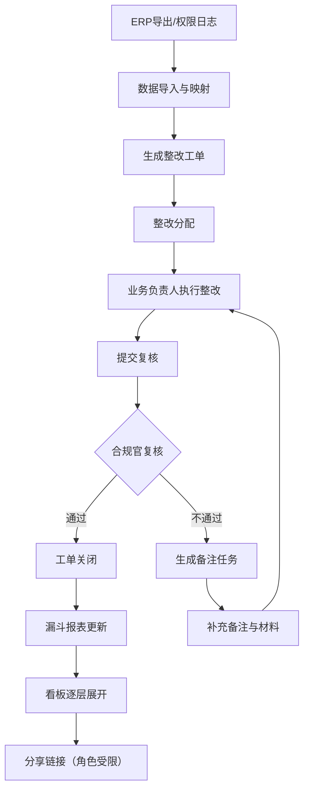

## 1. 产品概述

合规审计整改跟踪漏斗报表系统——面向企业合规团队，通过漏斗可视化复盘整改跟踪全流程，从审计发现到整改关闭逐层下钻，重点监控首次解决率，确保合规审计问题闭环管理。

- 目标用户：审计员、业务负责人、合规官、管理层
- 核心价值：将散落在 ERP、权限日志、邮件材料中的整改数据统一归集，以漏斗+看板形式呈现整改效率瓶颈，驱动首次解决率提升

## 2. 核心功能

### 2.1 用户角色

| 角色 | 注册方式 | 核心权限 |
|------|----------|----------|
| 审计员 | 管理员分配账号 | 创建/编辑工单、上传材料、提交复核、查看漏斗报表 |
| 业务负责人 | 管理员分配账号 | 执行整改、提交整改证明、查看本部门工单 |
| 合规官 | 管理员分配账号 | 复核整改结果、审批关闭、查看全量报表与明细 |
| 管理层 | 管理员分配账号 | 查看汇总看板、趋势图表、无权修改原始记录 |

### 2.2 功能模块

1. **数据入口页**：ERP 导出文件上传、权限日志导入、数据映射与校验
2. **漏斗报表页**：整改跟踪漏斗图、首次解决率指标、处理结论标注
3. **看板页**：按复核意见/关闭原因/工单状态逐层展开的多维看板
4. **明细页**：工单详情、邮件材料原始记录追溯、整改历史时间线
5. **分享链接页**：角色范围受限的报表分享、外部人员敏感数据脱敏
6. **备注任务页**：复核不通过自动生成的备注任务列表与处理

### 2.3 页面明细

| 页面名称 | 模块名称 | 功能描述 |
|----------|----------|----------|
| 数据入口页 | ERP 导入区 | 拖拽上传 ERP 导出文件，自动解析字段映射，校验数据完整性 |
| 数据入口页 | 权限日志导入区 | 上传权限日志 CSV/JSON，自动关联审计工单 |
| 数据入口页 | 导入历史 | 展示历史导入记录、状态、行数、错误提示 |
| 漏斗报表页 | 漏斗图 | 从"审计发现→整改分配→整改执行→复核→关闭"的漏斗可视化 |
| 漏斗报表页 | 首次解决率卡片 | 首次复核即通过的工单占比，同比/环比趋势迷你图 |
| 漏斗报表页 | 处理结论侧栏 | 图表旁展示各阶段处理结论摘要，点击可展开完整内容 |
| 看板页 | 复核意见展开 | 按复核意见（通过/不通过/退回修改）分类统计与下钻 |
| 看板页 | 关闭原因展开 | 按关闭原因（整改完成/风险接受/不再适用）分类统计 |
| 看板页 | 工单状态展开 | 按工单状态（待整改/整改中/待复核/已关闭）逐层展开 |
| 明细页 | 工单基本信息 | 工单编号、审计发现描述、责任部门、截止日期 |
| 明细页 | 邮件材料追溯 | 可点击查看邮件原始记录、附件材料、发送时间与收件人 |
| 明细页 | 整改时间线 | 从发现问题到关闭的完整时间线，含各阶段耗时 |
| 明细页 | 复核记录 | 复核人、复核时间、复核意见、备注 |
| 备注任务页 | 任务列表 | 复核不通过自动生成的备注任务，含优先级与截止日期 |
| 备注任务页 | 任务详情 | 点击进入关联工单明细，补充备注并重新提交 |
| 分享链接页 | 生成链接 | 按角色范围生成时效性分享链接 |
| 分享链接页 | 权限预览 | 预览不同角色看到的脱敏效果 |

## 3. 核心流程

用户通过 ERP 导出和权限日志将审计数据导入系统，系统自动生成整改工单并进入漏斗流程。业务负责人执行整改后提交复核，合规官复核——若通过则工单关闭；若不通过则自动生成备注任务，业务负责人需补充材料后重新提交。全流程数据在看板中按复核意见、关闭原因、工单状态逐层展开，分享链接按角色限制可见范围。

## 4. 用户界面设计

### 4.1 设计风格

- 主色调：深蓝灰（#1B2A4A）搭配琥珀色（#D97706）强调色，体现合规审慎与审计警示
- 辅助色：翡翠绿（#059669）表示通过、玫瑰红（#E11D48）表示不通过、石板灰（#64748B）表示待处理
- 按钮风格：圆角微凸（rounded-lg + shadow-sm），主按钮琥珀色填充，次按钮描边
- 字体：Noto Sans SC 为主字体，数字用 DM Mono 等宽字体增强数据可读性
- 布局：左侧固定导航 + 右侧内容区，桌面优先，数据密集场景用卡片网格
- 图标风格：lucide-react 线性图标，16px 常规 / 20px 强调

### 4.2 页面设计概览

| 页面名称 | 模块名称 | UI 元素 |
|----------|----------|---------|
| 数据入口页 | ERP 导入区 | 拖拽上传区（虚线边框）、字段映射表格、校验进度条、琥珀色确认按钮 |
| 数据入口页 | 权限日志导入区 | 文件选择器、JSON/CSV 切换标签、预览表格 |
| 数据入口页 | 导入历史 | 时间线列表、状态徽标（绿色成功/红色失败）、行数统计 |
| 漏斗报表页 | 漏斗图 | Recharts 漏斗图、渐变色带、悬浮详情卡片、各阶段转化率标注 |
| 漏斗报表页 | 首次解决率卡片 | 大号 DM Mono 数字、迷你趋势折线图、同比环比箭头指示 |
| 漏斗报表页 | 处理结论侧栏 | 右侧抽屉面板、按阶段分组的结论卡片、展开/收起切换 |
| 看板页 | 复核意见展开 | 可折叠树形卡片、点击下钻到工单列表、饼图 + 表格双视图 |
| 看板页 | 关闭原因展开 | 水平堆叠条形图、原因标签色块、点击过滤 |
| 看板页 | 工单状态展开 | 看板列视图（Kanban）、拖拽状态列、卡片含优先级色标 |
| 明细页 | 工单基本信息 | 顶部信息卡、标签式分区（基本信息/整改/复核/关闭） |
| 明细页 | 邮件材料追溯 | 嵌套折叠面板、邮件头信息、附件图标列表、原文预览模态框 |
| 明细页 | 整改时间线 | 垂直时间线组件、节点色标、耗时标注 |
| 备注任务页 | 任务列表 | 表格视图、优先级色标列、到期日高亮、批量操作栏 |
| 分享链接页 | 生成链接 | 角色复选框组、有效期选择器、一键复制链接按钮 |

### 4.3 响应式

- 桌面优先设计，1920px/1440px 为主视口
- 平板端：导航折叠为汉堡菜单，看板列横向滚动
- 移动端：漏斗图简化为进度条，表格转为卡片列表

### 4.4 3D 场景

不适用
