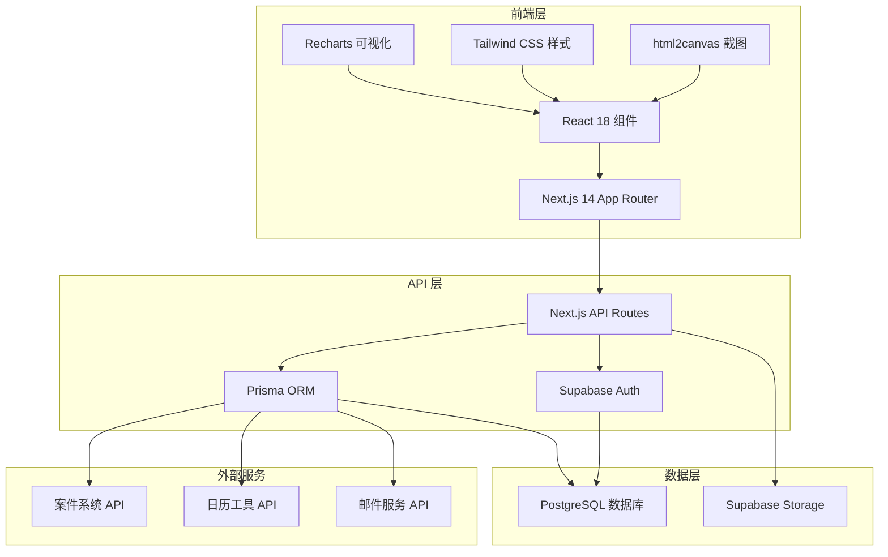
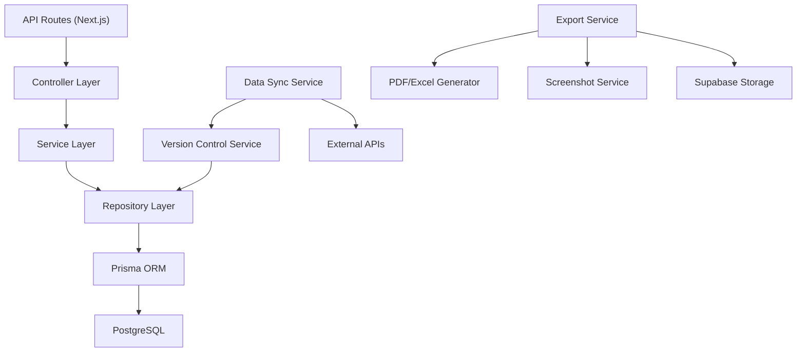
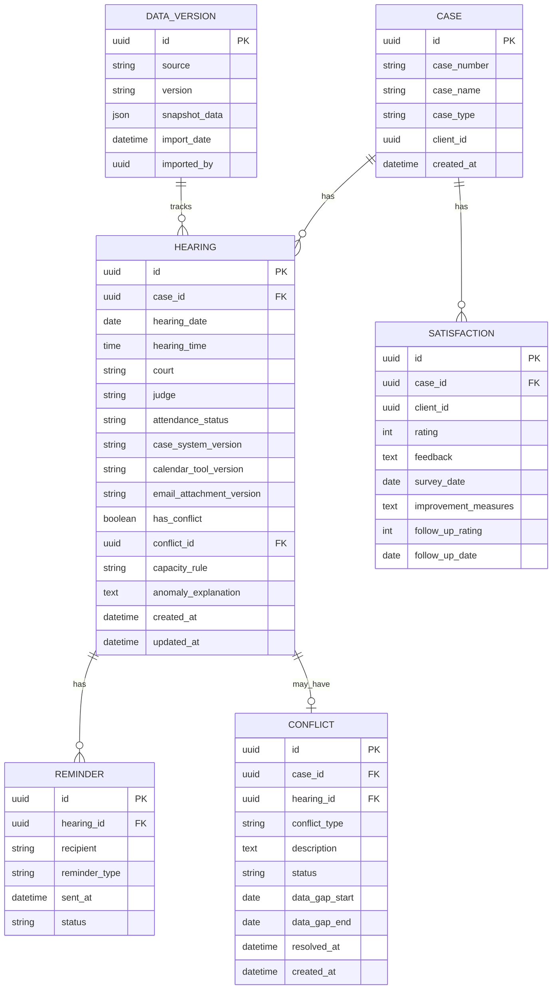

## 1. 架构设计



## 2. 技术描述

- **前端框架**: Next.js 14 (App Router) + React 18
- **样式方案**: Tailwind CSS 3.4
- **图表库**: Recharts 2.12
- **ORM**: Prisma 5.10
- **数据库**: PostgreSQL 16 (Supabase 托管)
- **认证**: Supabase Auth
- **存储**: Supabase Storage
- **截图导出**: html2canvas + jspdf
- **Excel导出**: xlsx
- **开发语言**: TypeScript 5.4

## 3. 路由定义

| 路由 | 用途 |
|------|------|
| / | 仪表板总览页 |
| /data-compare | 数据口径对比页 |
| /conflicts | 利益冲突管理页 |
| /satisfaction | 客户满意度复盘页 |
| /export | 导出中心页 |
| /api/hearings | 开庭数据 CRUD API |
| /api/compare | 数据对比 API |
| /api/conflicts | 冲突管理 API |
| /api/satisfaction | 满意度数据 API |
| /api/export | 导出 API |

## 4. API 定义

### 4.1 TypeScript 类型定义

```typescript
// 案件类型
interface Case {
  id: string;
  caseNumber: string;
  caseName: string;
  caseType: string;
  clientId: string;
  createdAt: Date;
}

// 开庭记录
interface Hearing {
  id: string;
  caseId: string;
  hearingDate: Date;
  hearingTime: string;
  court: string;
  judge: string;
  attendanceStatus: 'ATTENDED' | 'ABSENT' | 'POSTPONED' | 'CANCELLED';
  caseSystemVersion: string;
  calendarToolVersion: string;
  emailAttachmentVersion: string;
  hasConflict: boolean;
  conflictId?: string;
  capacityRule?: string;
  anomalyExplanation?: string;
  createdAt: Date;
  updatedAt: Date;
}

// 数据版本记录
interface DataVersion {
  id: string;
  source: 'CASE_SYSTEM' | 'CALENDAR_TOOL' | 'EMAIL_ATTACHMENT';
  version: string;
  snapshotData: JSON;
  importDate: Date;
  importedBy: string;
}

// 利益冲突
interface Conflict {
  id: string;
  caseId: string;
  hearingId?: string;
  conflictType: string;
  description: string;
  status: 'PENDING' | 'RESOLVED' | 'ESCALATED';
  dataGapStart?: Date;
  dataGapEnd?: Date;
  resolvedAt?: Date;
  createdAt: Date;
}

// 客户满意度
interface Satisfaction {
  id: string;
  caseId: string;
  clientId: string;
  rating: number;
  feedback: string;
  surveyDate: Date;
  improvementMeasures?: string;
  followUpRating?: number;
  followUpDate?: Date;
}

// 提醒名单
interface Reminder {
  id: string;
  hearingId: string;
  recipient: string;
  reminderType: 'EMAIL' | 'SMS' | 'CALENDAR';
  sentAt: Date;
  status: 'SENT' | 'FAILED' | 'OPENED';
}

// 筛选条件
interface FilterParams {
  dateRange?: { start: Date; end: Date };
  caseTypes?: string[];
  attendanceStatuses?: string[];
  hasConflicts?: boolean;
  timeSlots?: string[];
  reminderStatuses?: string[];
}
```

### 4.2 API 请求响应格式

```typescript
// GET /api/hearings
interface HearingsResponse {
  data: Hearing[];
  total: number;
  filters: FilterParams;
}

// GET /api/compare
interface CompareResponse {
  caseSystemData: Hearing[];
  calendarToolData: Hearing[];
  emailAttachmentData: Hearing[];
  discrepancies: Discrepancy[];
}

interface Discrepancy {
  hearingId: string;
  field: string;
  caseSystemValue: any;
  calendarToolValue: any;
  emailAttachmentValue: any;
}
```

## 5. 服务端架构



## 6. 数据模型

### 6.1 ER 图



### 6.2 Prisma Schema 定义

```prisma
model Case {
  id          String      @id @default(uuid())
  caseNumber  String      @unique
  caseName    String
  caseType    String
  clientId    String
  createdAt   DateTime    @default(now())
  hearings    Hearing[]
  satisfactions Satisfaction[]
}

model Hearing {
  id                     String    @id @default(uuid())
  caseId                 String
  hearingDate            DateTime
  hearingTime            String
  court                  String
  judge                  String?
  attendanceStatus       String
  caseSystemVersion      String
  calendarToolVersion    String
  emailAttachmentVersion String
  hasConflict            Boolean   @default(false)
  conflictId             String?
  capacityRule           String?
  anomalyExplanation     String?
  createdAt              DateTime  @default(now())
  updatedAt              DateTime  @updatedAt
  case                   Case      @relation(fields: [caseId], references: [id])
  conflict               Conflict? @relation(fields: [conflictId], references: [id])
  reminders              Reminder[]
}

model Conflict {
  id           String     @id @default(uuid())
  caseId       String
  hearingId    String?
  conflictType String
  description  String
  status       String
  dataGapStart DateTime?
  dataGapEnd   DateTime?
  resolvedAt   DateTime?
  createdAt    DateTime   @default(now())
  case         Case       @relation(fields: [caseId], references: [id])
  hearings     Hearing[]
}

model DataVersion {
  id            String   @id @default(uuid())
  source        String
  version       String
  snapshotData  Json
  importDate    DateTime @default(now())
  importedBy    String
}

model Satisfaction {
  id                  String   @id @default(uuid())
  caseId              String
  clientId            String
  rating              Int
  feedback            String?
  surveyDate          DateTime
  improvementMeasures String?
  followUpRating      Int?
  followUpDate        DateTime?
  case                Case     @relation(fields: [caseId], references: [id])
}

model Reminder {
  id            String   @id @default(uuid())
  hearingId     String
  recipient     String
  reminderType  String
  sentAt        DateTime @default(now())
  status        String
  hearing       Hearing  @relation(fields: [hearingId], references: [id])
}
```
