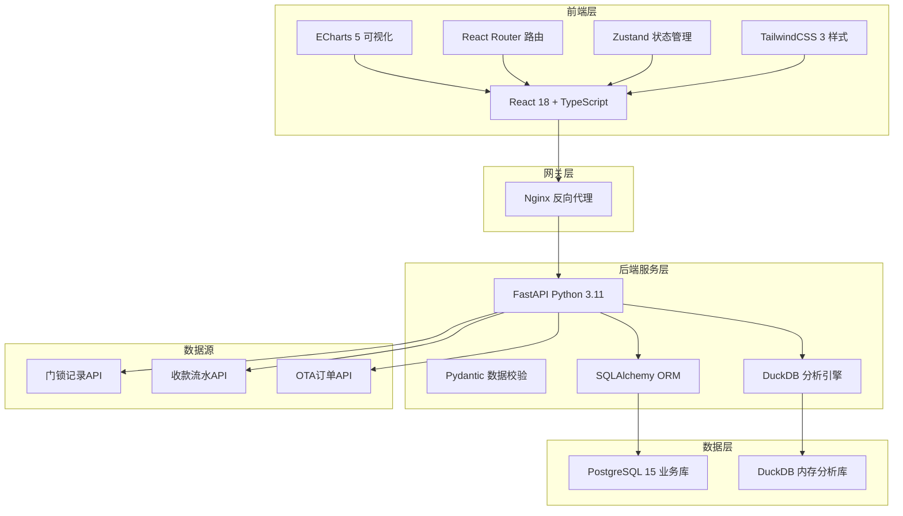
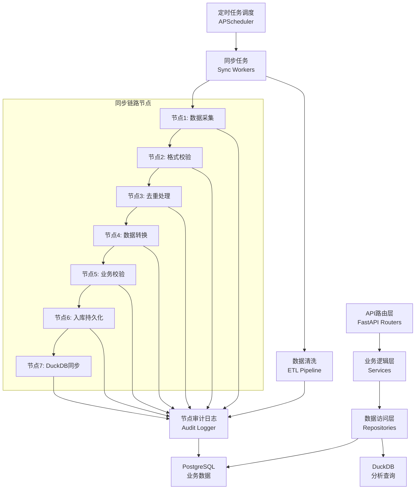
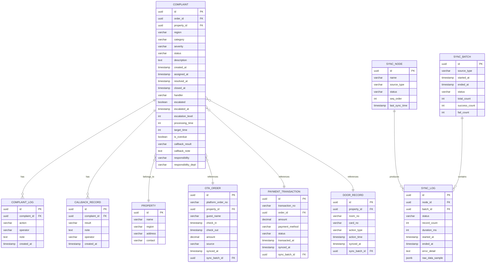

## 1. 架构设计



## 2. 技术描述

- **前端**：React 18 + TypeScript + Vite 5 + TailwindCSS 3 + ECharts 5 + React Router 6 + Zustand + Lucide Icons
- **后端**：FastAPI 0.109 + Python 3.11 + SQLAlchemy 2.0 + Pydantic 2.0 + Uvicorn
- **数据库**：PostgreSQL 15（业务数据持久化）+ DuckDB 0.10（OLAP分析查询）
- **初始化工具**：前端使用 `pnpm create vite-init`，后端使用 `poetry` 或 `pip`
- **数据同步**：定时任务从门锁系统、支付网关、OTA平台拉取数据，经过可审计的同步节点处理后入库

## 3. 前端路由定义

| 路由路径 | 页面名称 | 说明 |
|----------|----------|------|
| `/dashboard` | 风险监测总览 | 首页，展示客诉趋势、处理时效、超时预警 |
| `/audit` | 取数链路审计 | 展示门锁/收款/OTA数据同步节点状态 |
| `/complaints` | 客诉明细管理 | 客诉列表、筛选、详情钻取 |
| `/reports` | 多维报表分析 | 关闭时长、日期、区域多维度对比 |

## 4. API 定义

### 4.1 TypeScript 类型定义

```typescript
// 客诉记录
interface Complaint {
  id: string;
  orderId: string;
  propertyId: string;
  propertyName: string;
  region: string;
  category: string;
  severity: 'low' | 'medium' | 'high' | 'critical';
  status: 'pending' | 'processing' | 'escalated' | 'resolved' | 'closed';
  description: string;
  createdAt: string;
  assignedAt: string;
  resolvedAt: string | null;
  closedAt: string | null;
  handler: string;
  escalated: boolean;
  escalatedAt: string | null;
  escalationLevel: number;
  processingTime: number; // 分钟
  targetTime: number; // 目标处理时长（分钟）
  isOverdue: boolean;
  callbackResult: 'satisfied' | 'unsatisfied' | 'pending' | null;
  callbackNote: string | null;
  responsibility: string | null;
  responsibilityDept: string | null;
}

// 同步节点
interface SyncNode {
  id: string;
  name: string;
  source: 'door_lock' | 'payment' | 'ota';
  status: 'pending' | 'running' | 'success' | 'failed';
  lastSyncTime: string | null;
  recordCount: number;
  successCount: number;
  failCount: number;
  avgDuration: number; // 毫秒
  errorMessage: string | null;
}

// 同步日志
interface SyncLog {
  id: string;
  nodeId: string;
  batchId: string;
  status: 'success' | 'failed';
  recordCount: number;
  duration: number;
  startedAt: string;
  endedAt: string;
  errorDetail: string | null;
  rawDataSample: Record<string, unknown> | null;
}

// KPI指标
interface KPIData {
  totalComplaints: number;
  pendingCount: number;
  overdueCount: number;
  avgProcessingTime: number;
  escalationRate: number;
  satisfactionRate: number;
  period: 'day' | 'week' | 'month';
  compareValue: {
    totalComplaints: number;
    overdueCount: number;
    avgProcessingTime: number;
    escalationRate: number;
    satisfactionRate: number;
  };
}

// 报表数据
interface ReportData {
  dimension: 'closeDuration' | 'date' | 'region';
  categories: string[];
  series: {
    name: string;
    data: number[];
  }[];
}
```

### 4.2 后端API接口

| 方法 | 路径 | 说明 | 请求参数 | 返回格式 |
|------|------|------|----------|----------|
| GET | `/api/kpi` | 获取KPI指标 | `period: day\|week\|month` | `KPIData` |
| GET | `/api/complaints/trend` | 客诉趋势数据 | `startDate, endDate, compare: yoy\|mom\|none` | `{dates: string[], current: number[], compare: number[]}` |
| GET | `/api/complaints` | 客诉列表 | `page, pageSize, status, region, startDate, endDate, keyword` | `{list: Complaint[], total: number}` |
| GET | `/api/complaints/:id` | 客诉详情 | `id` | `Complaint` |
| GET | `/api/complaints/overdue` | 超时预警列表 | `limit` | `Complaint[]` |
| GET | `/api/complaints/heatmap` | 处理时效热力图 | `date` | `{region: string[], avgTime: number[], overdueCount: number[]}` |
| GET | `/api/escalations/series` | 升级记录时序 | `startDate, endDate, compare: yoy\|mom\|none` | `{dates: string[], current: number[], compare: number[], levels: number[][]}` |
| GET | `/api/sync/nodes` | 同步节点列表 | - | `SyncNode[]` |
| GET | `/api/sync/nodes/:id/logs` | 节点同步日志 | `nodeId, page, pageSize` | `{list: SyncLog[], total: number}` |
| GET | `/api/reports/close-duration` | 关闭时长报表 | `propertyIds` | `ReportData` |
| GET | `/api/reports/date-compare` | 日期对比报表 | `startDate1, endDate1, startDate2, endDate2` | `ReportData` |
| GET | `/api/reports/region-compare` | 区域对比报表 | `regions, metrics` | `ReportData` |

## 5. 后端服务架构



## 6. 数据模型

### 6.1 ER图



### 6.2 DDL语句

```sql
-- 民宿表
CREATE TABLE properties (
    id UUID PRIMARY KEY DEFAULT gen_random_uuid(),
    name VARCHAR(200) NOT NULL,
    region VARCHAR(100) NOT NULL,
    address VARCHAR(500),
    contact VARCHAR(50),
    created_at TIMESTAMP DEFAULT CURRENT_TIMESTAMP,
    updated_at TIMESTAMP DEFAULT CURRENT_TIMESTAMP
);

CREATE INDEX idx_properties_region ON properties(region);

-- OTA订单表
CREATE TABLE ota_orders (
    id UUID PRIMARY KEY DEFAULT gen_random_uuid(),
    platform_order_no VARCHAR(100) NOT NULL UNIQUE,
    property_id UUID NOT NULL REFERENCES properties(id),
    guest_name VARCHAR(100),
    check_in DATE,
    check_out DATE,
    amount DECIMAL(10,2),
    source VARCHAR(50),
    synced_at TIMESTAMP,
    sync_batch_id UUID,
    created_at TIMESTAMP DEFAULT CURRENT_TIMESTAMP
);

CREATE INDEX idx_ota_orders_property ON ota_orders(property_id);
CREATE INDEX idx_ota_orders_checkin ON ota_orders(check_in);

-- 收款流水表
CREATE TABLE payment_transactions (
    id UUID PRIMARY KEY DEFAULT gen_random_uuid(),
    transaction_no VARCHAR(100) NOT NULL UNIQUE,
    order_id UUID REFERENCES ota_orders(id),
    property_id UUID NOT NULL REFERENCES properties(id),
    amount DECIMAL(10,2) NOT NULL,
    payment_method VARCHAR(50),
    status VARCHAR(30),
    transacted_at TIMESTAMP,
    synced_at TIMESTAMP,
    sync_batch_id UUID,
    created_at TIMESTAMP DEFAULT CURRENT_TIMESTAMP
);

CREATE INDEX idx_payment_property ON payment_transactions(property_id);
CREATE INDEX idx_payment_transacted ON payment_transactions(transacted_at);

-- 门锁记录表
CREATE TABLE door_records (
    id UUID PRIMARY KEY DEFAULT gen_random_uuid(),
    property_id UUID NOT NULL REFERENCES properties(id),
    room_no VARCHAR(30),
    card_no VARCHAR(50),
    action_type VARCHAR(30),
    action_time TIMESTAMP,
    synced_at TIMESTAMP,
    sync_batch_id UUID,
    created_at TIMESTAMP DEFAULT CURRENT_TIMESTAMP
);

CREATE INDEX idx_door_property ON door_records(property_id);
CREATE INDEX idx_door_action_time ON door_records(action_time);

-- 客诉表
CREATE TABLE complaints (
    id UUID PRIMARY KEY DEFAULT gen_random_uuid(),
    order_id UUID REFERENCES ota_orders(id),
    property_id UUID NOT NULL REFERENCES properties(id),
    region VARCHAR(100) NOT NULL,
    category VARCHAR(50) NOT NULL,
    severity VARCHAR(20) NOT NULL CHECK (severity IN ('low', 'medium', 'high', 'critical')),
    status VARCHAR(30) NOT NULL CHECK (status IN ('pending', 'processing', 'escalated', 'resolved', 'closed')),
    description TEXT,
    created_at TIMESTAMP DEFAULT CURRENT_TIMESTAMP,
    assigned_at TIMESTAMP,
    resolved_at TIMESTAMP,
    closed_at TIMESTAMP,
    handler VARCHAR(100),
    escalated BOOLEAN DEFAULT FALSE,
    escalated_at TIMESTAMP,
    escalation_level INT DEFAULT 0,
    processing_time INT DEFAULT 0,
    target_time INT NOT NULL DEFAULT 1440,
    is_overdue BOOLEAN DEFAULT FALSE,
    callback_result VARCHAR(20) CHECK (callback_result IN ('satisfied', 'unsatisfied', 'pending')),
    callback_note TEXT,
    responsibility VARCHAR(100),
    responsibility_dept VARCHAR(100)
);

CREATE INDEX idx_complaints_status ON complaints(status);
CREATE INDEX idx_complaints_region ON complaints(region);
CREATE INDEX idx_complaints_created ON complaints(created_at);
CREATE INDEX idx_complaints_overdue ON complaints(is_overdue) WHERE is_overdue = TRUE;
CREATE INDEX idx_complaints_property ON complaints(property_id);

-- 客诉处理日志
CREATE TABLE complaint_logs (
    id UUID PRIMARY KEY DEFAULT gen_random_uuid(),
    complaint_id UUID NOT NULL REFERENCES complaints(id),
    action VARCHAR(50) NOT NULL,
    operator VARCHAR(100),
    note TEXT,
    created_at TIMESTAMP DEFAULT CURRENT_TIMESTAMP
);

CREATE INDEX idx_complaint_logs_complaint ON complaint_logs(complaint_id);

-- 回访记录表
CREATE TABLE callback_records (
    id UUID PRIMARY KEY DEFAULT gen_random_uuid(),
    complaint_id UUID NOT NULL REFERENCES complaints(id),
    result VARCHAR(20) NOT NULL CHECK (result IN ('satisfied', 'unsatisfied', 'pending')),
    note TEXT,
    operator VARCHAR(100),
    created_at TIMESTAMP DEFAULT CURRENT_TIMESTAMP
);

CREATE INDEX idx_callback_complaint ON callback_records(complaint_id);

-- 同步节点表
CREATE TABLE sync_nodes (
    id UUID PRIMARY KEY DEFAULT gen_random_uuid(),
    name VARCHAR(100) NOT NULL,
    source_type VARCHAR(30) NOT NULL CHECK (source_type IN ('door_lock', 'payment', 'ota')),
    status VARCHAR(20) NOT NULL DEFAULT 'pending' CHECK (status IN ('pending', 'running', 'success', 'failed')),
    seq_order INT NOT NULL,
    last_sync_time TIMESTAMP,
    created_at TIMESTAMP DEFAULT CURRENT_TIMESTAMP,
    updated_at TIMESTAMP DEFAULT CURRENT_TIMESTAMP
);

-- 同步批次表
CREATE TABLE sync_batches (
    id UUID PRIMARY KEY DEFAULT gen_random_uuid(),
    source_type VARCHAR(30) NOT NULL,
    started_at TIMESTAMP DEFAULT CURRENT_TIMESTAMP,
    ended_at TIMESTAMP,
    status VARCHAR(20) NOT NULL DEFAULT 'running',
    total_count INT DEFAULT 0,
    success_count INT DEFAULT 0,
    fail_count INT DEFAULT 0
);

-- 同步日志表
CREATE TABLE sync_logs (
    id UUID PRIMARY KEY DEFAULT gen_random_uuid(),
    node_id UUID NOT NULL REFERENCES sync_nodes(id),
    batch_id UUID NOT NULL REFERENCES sync_batches(id),
    status VARCHAR(20) NOT NULL CHECK (status IN ('success', 'failed')),
    record_count INT DEFAULT 0,
    duration_ms INT DEFAULT 0,
    started_at TIMESTAMP DEFAULT CURRENT_TIMESTAMP,
    ended_at TIMESTAMP,
    error_detail TEXT,
    raw_data_sample JSONB
);

CREATE INDEX idx_sync_logs_node ON sync_logs(node_id);
CREATE INDEX idx_sync_logs_batch ON sync_logs(batch_id);
CREATE INDEX idx_sync_logs_created ON sync_logs(started_at);

-- 初始化同步节点
INSERT INTO sync_nodes (name, source_type, status, seq_order) VALUES
('门锁数据采集', 'door_lock', 'success', 1),
('门锁格式校验', 'door_lock', 'success', 2),
('门锁去重处理', 'door_lock', 'success', 3),
('门锁数据转换', 'door_lock', 'success', 4),
('门锁业务校验', 'door_lock', 'success', 5),
('门锁入库持久化', 'door_lock', 'success', 6),
('门锁DuckDB同步', 'door_lock', 'success', 7),
('收款数据采集', 'payment', 'success', 1),
('收款格式校验', 'payment', 'success', 2),
('收款去重处理', 'payment', 'success', 3),
('收款数据转换', 'payment', 'success', 4),
('收款业务校验', 'payment', 'success', 5),
('收款入库持久化', 'payment', 'success', 6),
('收款DuckDB同步', 'payment', 'success', 7),
('OTA数据采集', 'ota', 'success', 1),
('OTA格式校验', 'ota', 'success', 2),
('OTA去重处理', 'ota', 'success', 3),
('OTA数据转换', 'ota', 'success', 4),
('OTA业务校验', 'ota', 'success', 5),
('OTA入库持久化', 'ota', 'success', 6),
('OTADuckDB同步', 'ota', 'success', 7);
```
