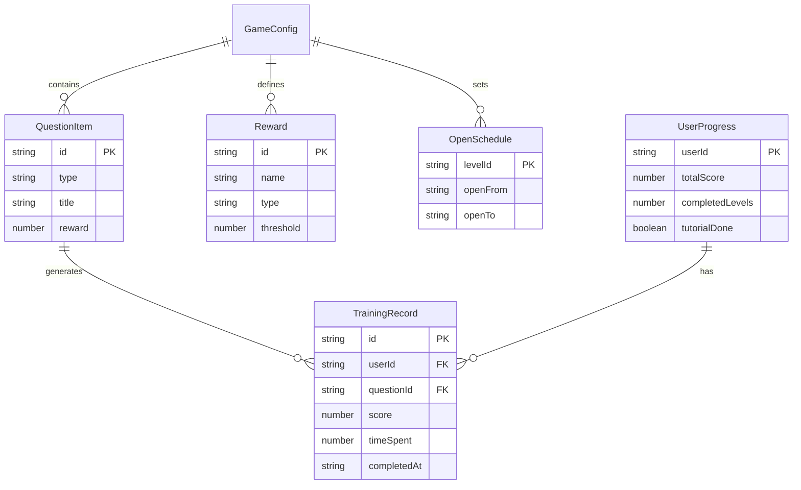

## 1. 架构设计

```mermaid
flowchart TD
    "前端层 Phaser 3 游戏引擎" --> "状态管理 Zustand"
    "状态管理 Zustand" --> "数据持久化 localStorage"
    "前端层 Phaser 3 游戏引擎" --> "物理引擎 Matter.js"
    "前端层 Phaser 3 游戏引擎" --> "UI 覆盖层 React"
    "UI 覆盖层 React" --> "配置管理页"
    "UI 覆盖层 React" --> "成绩与复盘页"
    "数据持久化 localStorage" --> "题目配置"
    "数据持久化 localStorage" --> "训练记录"
    "数据持久化 localStorage" --> "用户进度"
```

## 2. 技术说明

- 前端游戏引擎：Phaser 3 + TypeScript
- 物理引擎：Matter.js（用于对账差异排序的拖拽物理效果和合同附件的拖放碰撞检测）
- 构建工具：Vite
- UI 覆盖层：React 18 + Tailwind CSS（用于配置管理页和成绩复盘页等非游戏画面）
- 状态管理：Zustand（共享游戏状态与 UI 状态）
- 数据持久化：localStorage（模拟训练记录存储，无需后端）
- 图表：Chart.js（回款周期分析图表）

## 3. 路由定义

| 路由 | 用途 |
|------|------|
| / | 游戏主界面（Phaser 画布 + 关卡地图） |
| /game/:levelId | 进入具体关卡（金额校验/支付流水/对账差异/合同附件） |
| /config | 配置管理页（题目/素材/奖励/开放时间/训练模式） |
| /records | 成绩与复盘页（训练记录 + 回款周期图表） |

## 4. API 定义

本项目为纯前端应用，数据存储于 localStorage，无需后端 API。数据访问通过 Zustand store 封装的 localStorage 操作实现。

核心数据接口：

```typescript
interface QuestionItem {
  id: string
  type: 'amount_verify' | 'payment_flow' | 'reconcile_sort' | 'contract_attach'
  title: string
  description: string
  data: AmountVerifyData | PaymentFlowData | ReconcileSortData | ContractAttachData
  reward: number
  timeLimit?: number
}

interface AmountVerifyData {
  quoteItems: Array<{ service: string; unitPrice: number; quantity: number; amount: number }>
  contractItems: Array<{ service: string; amount: number }>
  inconsistencies: Array<{ index: number; reason: string }>
}

interface PaymentFlowData {
  targetAmount: number
  flows: Array<{ id: string; date: string; amount: number; summary: string; status: string }>
  correctFlowIds: string[]
}

interface ReconcileSortData {
  differences: Array<{ id: string; type: string; amount: number; project: string; severity: number }>
  correctOrder: string[]
}

interface ContractAttachData {
  contractClauses: Array<{ id: string; clause: string; requiredAttachment: string }>
  attachmentPool: Array<{ id: string; name: string; type: string }>
  correctMapping: Record<string, string>
}

interface TrainingRecord {
  id: string
  userId: string
  questionId: string
  questionType: string
  score: number
  maxScore: number
  timeSpent: number
  mistakes: Array<{ description: string; reason: string }>
  completedAt: string
  paymentCycleDays?: number
}

interface GameConfig {
  questions: QuestionItem[]
  rewards: Array<{ id: string; name: string; type: 'points' | 'badge' | 'title'; threshold: number }>
  openSchedule: Array<{ levelId: string; openFrom: string; openTo: string }>
  trainingMode: 'practice' | 'timed' | 'exam'
}
```

## 5. 服务器架构图

不适用，本项目为纯前端应用。

## 6. 数据模型

### 6.1 数据模型定义



### 6.2 数据定义语言

使用 localStorage 键值存储：

- `law_game_config` → GameConfig JSON
- `law_game_records` → TrainingRecord[] JSON
- `law_game_progress` → UserProgress JSON
