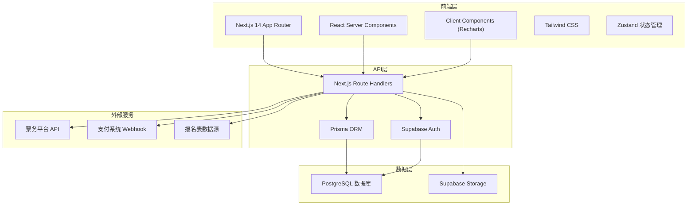
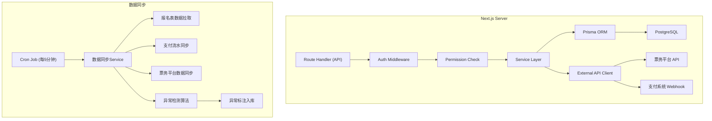
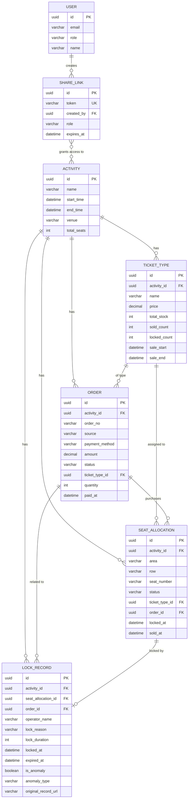

## 1. 架构设计



## 2. 技术描述

- **前端框架**：Next.js 14 (App Router) + React 18 + TypeScript
- **图表库**：Recharts 2.12.x
- **ORM**：Prisma 5.10.x
- **数据库**：PostgreSQL 15 (Supabase托管)
- **认证服务**：Supabase Auth
- **样式方案**：Tailwind CSS 3.4.x
- **状态管理**：Zustand 4.5.x
- **图标库**：Lucide React 0.344.x
- **数据导出**：xlsx (SheetJS) + jsPDF
- **包管理器**：pnpm 9.x
- **Node版本**：20.x LTS

## 3. 路由定义

| 路由 | 页面组件 | 权限要求 | 用途 |
|-------|---------|----------|------|
| `/` | `app/page.tsx` | 已登录 | 看板主页，数据概览 |
| `/seat-trend` | `app/seat-trend/page.tsx` | 已登录 | 座位图趋势分析 |
| `/order-composition` | `app/order-composition/page.tsx` | 已登录 | 购票订单构成分析 |
| `/ticket-types` | `app/ticket-types/page.tsx` | 已登录 | 票种规则明细 |
| `/lock-records` | `app/lock-records/page.tsx` | 已登录 | 锁座记录异常管理 |
| `/share/[token]` | `app/share/[token]/page.tsx` | 链接权限 | 分享链接访问页 |
| `/api/auth/[...nextauth]` | - | - | Supabase Auth 集成 |
| `/api/dashboard/overview` | - | 已登录 | 获取概览数据 |
| `/api/dashboard/seat-trend` | - | 已登录 | 获取座位趋势数据 |
| `/api/dashboard/orders` | - | 已登录 | 获取订单构成数据 |
| `/api/dashboard/ticket-types` | - | 已登录 | 获取票种明细数据 |
| `/api/dashboard/lock-records` | - | 已登录 | 获取锁座记录数据 |
| `/api/share/create` | - | 已登录 | 创建分享链接 |
| `/api/export/dashboard` | - | 已登录 | 导出看板数据 |

## 4. API 定义

### 4.1 类型定义

```typescript
// 核心数据类型
interface SeatAllocation {
  id: string;
  activityId: string;
  area: string;
  row: string;
  seatNumber: string;
  status: 'available' | 'locked' | 'sold' | 'reserved';
  ticketTypeId: string;
  orderId?: string;
  lockedAt?: Date;
  soldAt?: Date;
  createdAt: Date;
  updatedAt: Date;
}

interface Order {
  id: string;
  activityId: string;
  orderNo: string;
  source: 'online' | 'offline' | 'partner' | 'staff';
  paymentMethod: 'alipay' | 'wechat' | 'card' | 'cash' | 'free';
  amount: number;
  status: 'pending' | 'paid' | 'refunded' | 'cancelled';
  ticketTypeId: string;
  quantity: number;
  buyerName: string;
  buyerPhone: string;
  paidAt?: Date;
  createdAt: Date;
}

interface TicketType {
  id: string;
  activityId: string;
  name: string;
  price: number;
  originalPrice: number;
  totalStock: number;
  soldCount: number;
  lockedCount: number;
  maxPerOrder: number;
  saleStartTime: Date;
  saleEndTime: Date;
  description: string;
  restrictions: string[];
}

interface LockRecord {
  id: string;
  activityId: string;
  seatAllocationId: string;
  orderId?: string;
  operatorId: string;
  operatorName: string;
  lockReason: string;
  lockDuration: number; // 分钟
  lockedAt: Date;
  expiredAt: Date;
  releasedAt?: Date;
  releaseReason?: string;
  isAnomaly: boolean;
  anomalyType?: 'timeout' | 'duplicate' | 'amount_mismatch' | 'manual_override';
  anomalyDescription?: string;
  originalRecordUrl?: string;
}

interface ShareLink {
  id: string;
  token: string;
  createdBy: string;
  role: 'admin' | 'manager' | 'operator' | 'finance';
  activityIds: string[]; // 空数组表示全部
  expiresAt: Date;
  createdAt: Date;
}

// 上座率口径说明
interface OccupancyRateSpec {
  calculationMethod: string;
  formula: string;
  excludedSeats: string[];
  dataSources: string[];
  updateTime: Date;
}
```

### 4.2 请求响应示例

**GET /api/dashboard/overview**
```typescript
// Response
{
  totalSeats: 5000,
  soldSeats: 3850,
  occupancyRate: 0.77,
  lockedSeats: 280,
  anomalyCount: 12,
  lastRefreshedAt: "2026-06-21T15:30:00Z",
  occupancyRateSpec: {
    calculationMethod: "已售座位数 / (总座位数 - 预留座位数)",
    formula: "soldSeats / (totalSeats - reservedSeats)",
    excludedSeats: ["VIP预留区A1-A20", "工作人员区B1-B50"],
    dataSources: ["报名表", "支付流水", "票务平台"],
    updateTime: "2026-06-21T15:30:00Z"
  }
}
```

## 5. 服务器架构



## 6. 数据模型

### 6.1 ER图



### 6.2 DDL 语句

```sql
-- 活动表
CREATE TABLE activities (
    id UUID PRIMARY KEY DEFAULT gen_random_uuid(),
    name VARCHAR(255) NOT NULL,
    start_time TIMESTAMPTZ NOT NULL,
    end_time TIMESTAMPTZ NOT NULL,
    venue VARCHAR(255) NOT NULL,
    total_seats INTEGER NOT NULL DEFAULT 0,
    created_at TIMESTAMPTZ DEFAULT NOW(),
    updated_at TIMESTAMPTZ DEFAULT NOW()
);

-- 座位分配表
CREATE TABLE seat_allocations (
    id UUID PRIMARY KEY DEFAULT gen_random_uuid(),
    activity_id UUID REFERENCES activities(id) ON DELETE CASCADE,
    area VARCHAR(100) NOT NULL,
    row VARCHAR(50) NOT NULL,
    seat_number VARCHAR(50) NOT NULL,
    status VARCHAR(20) NOT NULL DEFAULT 'available',
    ticket_type_id UUID REFERENCES ticket_types(id),
    order_id UUID REFERENCES orders(id),
    locked_at TIMESTAMPTZ,
    sold_at TIMESTAMPTZ,
    created_at TIMESTAMPTZ DEFAULT NOW(),
    updated_at TIMESTAMPTZ DEFAULT NOW(),
    UNIQUE(activity_id, area, row, seat_number)
);

CREATE INDEX idx_seat_allocations_activity ON seat_allocations(activity_id);
CREATE INDEX idx_seat_allocations_status ON seat_allocations(status);

-- 票种表
CREATE TABLE ticket_types (
    id UUID PRIMARY KEY DEFAULT gen_random_uuid(),
    activity_id UUID REFERENCES activities(id) ON DELETE CASCADE,
    name VARCHAR(100) NOT NULL,
    price DECIMAL(10,2) NOT NULL,
    original_price DECIMAL(10,2) NOT NULL,
    total_stock INTEGER NOT NULL DEFAULT 0,
    sold_count INTEGER NOT NULL DEFAULT 0,
    locked_count INTEGER NOT NULL DEFAULT 0,
    max_per_order INTEGER NOT NULL DEFAULT 10,
    sale_start_time TIMESTAMPTZ NOT NULL,
    sale_end_time TIMESTAMPTZ NOT NULL,
    description TEXT,
    restrictions TEXT[],
    created_at TIMESTAMPTZ DEFAULT NOW(),
    updated_at TIMESTAMPTZ DEFAULT NOW()
);

-- 订单表
CREATE TABLE orders (
    id UUID PRIMARY KEY DEFAULT gen_random_uuid(),
    activity_id UUID REFERENCES activities(id) ON DELETE CASCADE,
    order_no VARCHAR(50) UNIQUE NOT NULL,
    source VARCHAR(20) NOT NULL,
    payment_method VARCHAR(20) NOT NULL,
    amount DECIMAL(10,2) NOT NULL DEFAULT 0,
    status VARCHAR(20) NOT NULL DEFAULT 'pending',
    ticket_type_id UUID REFERENCES ticket_types(id),
    quantity INTEGER NOT NULL DEFAULT 1,
    buyer_name VARCHAR(100),
    buyer_phone VARCHAR(20),
    paid_at TIMESTAMPTZ,
    created_at TIMESTAMPTZ DEFAULT NOW(),
    updated_at TIMESTAMPTZ DEFAULT NOW()
);

CREATE INDEX idx_orders_activity ON orders(activity_id);
CREATE INDEX idx_orders_status ON orders(status);
CREATE INDEX idx_orders_created ON orders(created_at);

-- 锁座记录表
CREATE TABLE lock_records (
    id UUID PRIMARY KEY DEFAULT gen_random_uuid(),
    activity_id UUID REFERENCES activities(id) ON DELETE CASCADE,
    seat_allocation_id UUID REFERENCES seat_allocations(id) ON DELETE CASCADE,
    order_id UUID REFERENCES orders(id),
    operator_id UUID,
    operator_name VARCHAR(100) NOT NULL,
    lock_reason VARCHAR(255) NOT NULL,
    lock_duration INTEGER NOT NULL,
    locked_at TIMESTAMPTZ NOT NULL DEFAULT NOW(),
    expired_at TIMESTAMPTZ NOT NULL,
    released_at TIMESTAMPTZ,
    release_reason VARCHAR(255),
    is_anomaly BOOLEAN NOT NULL DEFAULT FALSE,
    anomaly_type VARCHAR(30),
    anomaly_description TEXT,
    original_record_url VARCHAR(500),
    created_at TIMESTAMPTZ DEFAULT NOW()
);

CREATE INDEX idx_lock_records_activity ON lock_records(activity_id);
CREATE INDEX idx_lock_records_anomaly ON lock_records(is_anomaly);
CREATE INDEX idx_lock_records_expired ON lock_records(expired_at);

-- 用户表
CREATE TABLE users (
    id UUID PRIMARY KEY DEFAULT gen_random_uuid(),
    email VARCHAR(255) UNIQUE NOT NULL,
    role VARCHAR(20) NOT NULL DEFAULT 'operator',
    name VARCHAR(100) NOT NULL,
    created_at TIMESTAMPTZ DEFAULT NOW()
);

-- 分享链接表
CREATE TABLE share_links (
    id UUID PRIMARY KEY DEFAULT gen_random_uuid(),
    token VARCHAR(64) UNIQUE NOT NULL,
    created_by UUID REFERENCES users(id) ON DELETE CASCADE,
    role VARCHAR(20) NOT NULL,
    activity_ids UUID[] DEFAULT '{}',
    expires_at TIMESTAMPTZ NOT NULL,
    created_at TIMESTAMPTZ DEFAULT NOW()
);

CREATE INDEX idx_share_links_token ON share_links(token);
```
