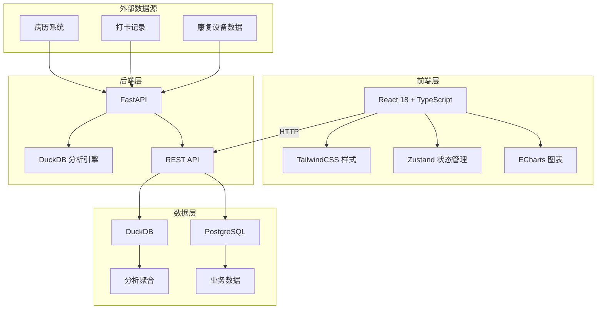
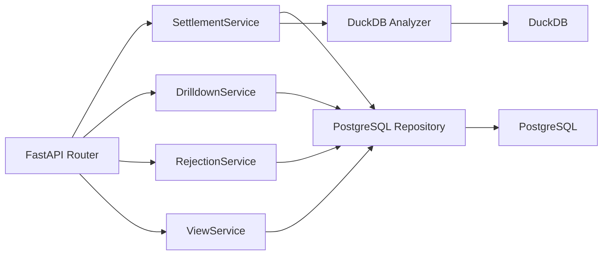
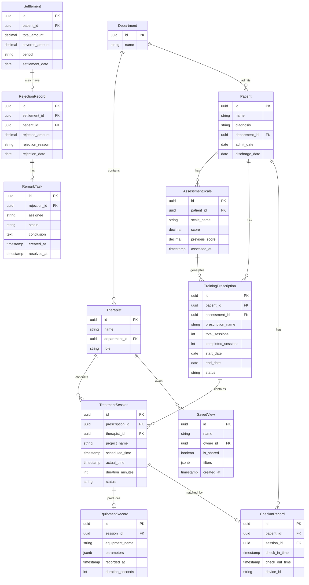

## 1. 架构设计



前端使用 React + ECharts 实现可视化看板，通过 REST API 与 FastAPI 后端通信。后端 PostgreSQL 存储业务数据（病历、打卡、拒付备注、视图配置），DuckDB 作为 OLAP 引擎处理聚合分析查询。数据入口为病历系统和打卡记录，通过 FastAPI 接口写入 PostgreSQL，再同步到 DuckDB 进行分析计算。

## 2. 技术说明

- **前端**：React@18 + TypeScript + TailwindCSS@3 + Vite + Zustand
- **图表库**：ECharts@5（echarts-for-react 封装）
- **初始化工具**：vite-init（react-ts 模板）
- **后端**：FastAPI + Uvicorn + SQLAlchemy + asyncpg
- **数据库**：PostgreSQL（业务数据持久化）+ DuckDB（OLAP 聚合分析）
- **Python 版本**：3.11+

## 3. 路由定义

| 路由 | 用途 |
|------|------|
| `/` | 结算趋势看板首页，关键指标与趋势图 |
| `/drilldown` | 逐层下钻页，评估量表→训练处方→治疗日历→设备记录 |
| `/drilldown/assessment/:patientId` | 指定患者的评估量表详情 |
| `/drilldown/prescription/:prescriptionId` | 训练处方详情 |
| `/drilldown/calendar/:patientId` | 治疗日历 |
| `/drilldown/equipment/:recordId` | 设备原始记录 |
| `/rejection` | 拒付备注任务中心 |
| `/views` | 筛选视图管理 |

## 4. API 定义

### 4.1 结算趋势

| 方法 | 路径 | 说明 |
|------|------|------|
| GET | `/api/settlement/trend` | 获取结算趋势数据，支持月度/季度粒度 |
| GET | `/api/settlement/summary` | 获取关键指标汇总（总额、拒付率、完成率） |

### 4.2 训练完成率

| 方法 | 路径 | 说明 |
|------|------|------|
| GET | `/api/training/completion` | 训练完成率数据，支持按科室/治疗师/时段筛选 |

### 4.3 逐层下钻

| 方法 | 路径 | 说明 |
|------|------|------|
| GET | `/api/assessment/list` | 评估量表列表 |
| GET | `/api/assessment/:id` | 评估量表详情 |
| GET | `/api/prescription/:id` | 训练处方详情 |
| GET | `/api/calendar/:patientId` | 治疗日历数据 |
| GET | `/api/equipment/:recordId` | 设备原始记录 |

### 4.4 拒付备注

| 方法 | 路径 | 说明 |
|------|------|------|
| GET | `/api/rejection/list` | 拒付记录列表 |
| POST | `/api/rejection/:id/remark` | 创建/更新备注任务 |
| PUT | `/api/rejection/:id/conclusion` | 填写处理结论 |

### 4.5 视图管理

| 方法 | 路径 | 说明 |
|------|------|------|
| GET | `/api/views` | 获取已保存视图列表 |
| POST | `/api/views` | 保存筛选视图 |
| GET | `/api/views/:id` | 加载指定视图的筛选条件 |

### 4.6 TypeScript 类型定义

```typescript
interface SettlementTrend {
  period: string
  totalAmount: number
  rejectedAmount: number
  rejectionRate: number
  completionRate: number
}

interface AssessmentScale {
  id: string
  patientId: string
  patientName: string
  scaleName: string
  score: number
  previousScore: number
  assessedAt: string
  hasLinkedPrescription: boolean
}

interface TrainingPrescription {
  id: string
  patientId: string
  assessmentId: string
  prescriptionName: string
  totalSessions: number
  completedSessions: number
  completionRate: number
  startDate: string
  endDate: string
  status: 'active' | 'completed' | 'expired'
}

interface TreatmentCalendarDay {
  date: string
  scheduledCount: number
  completedCount: number
  missedCount: number
  rejectedCount: number
  details: TreatmentSession[]
}

interface TreatmentSession {
  id: string
  time: string
  projectName: string
  therapistName: string
  status: 'completed' | 'missed' | 'rejected' | 'scheduled'
  equipmentId?: string
}

interface EquipmentRecord {
  id: string
  sessionId: string
  equipmentName: string
  parameters: Record<string, number | string>
  recordedAt: string
  duration: number
}

interface RejectionRecord {
  id: string
  settlementId: string
  patientId: string
  patientName: string
  rejectedAmount: number
  rejectionReason: string
  rejectionDate: string
  remarkTask?: RemarkTask
}

interface RemarkTask {
  id: string
  rejectionId: string
  assignee: string
  status: 'pending' | 'processing' | 'resolved'
  conclusion?: string
  createdAt: string
  resolvedAt?: string
}

interface SavedView {
  id: string
  name: string
  owner: string
  isShared: boolean
  filters: ViewFilters
  createdAt: string
}

interface ViewFilters {
  dateRange: [string, string]
  department?: string
  therapist?: string
  patientId?: string
  completionRateRange?: [number, number]
  rejectionStatus?: string
}
```

## 5. 服务器架构



- **Router 层**：FastAPI 路由，参数校验，响应格式化
- **Service 层**：业务逻辑，编排 Repository 和 Analyzer
- **Repository 层**：PostgreSQL 增删改查，通过 SQLAlchemy 异步操作
- **Analyzer 层**：DuckDB 执行 OLAP 聚合查询，从 PostgreSQL 同步数据后计算

## 6. 数据模型

### 6.1 数据模型定义



### 6.2 数据定义语言

```sql
CREATE TABLE department (
    id UUID PRIMARY KEY DEFAULT gen_random_uuid(),
    name VARCHAR(100) NOT NULL
);

CREATE TABLE therapist (
    id UUID PRIMARY KEY DEFAULT gen_random_uuid(),
    name VARCHAR(100) NOT NULL,
    department_id UUID REFERENCES department(id),
    role VARCHAR(50) DEFAULT 'therapist'
);

CREATE TABLE patient (
    id UUID PRIMARY KEY DEFAULT gen_random_uuid(),
    name VARCHAR(100) NOT NULL,
    diagnosis TEXT,
    department_id UUID REFERENCES department(id),
    admit_date DATE,
    discharge_date DATE
);

CREATE TABLE assessment_scale (
    id UUID PRIMARY KEY DEFAULT gen_random_uuid(),
    patient_id UUID REFERENCES patient(id),
    scale_name VARCHAR(200) NOT NULL,
    score DECIMAL(5,2),
    previous_score DECIMAL(5,2),
    assessed_at TIMESTAMP DEFAULT NOW()
);

CREATE TABLE training_prescription (
    id UUID PRIMARY KEY DEFAULT gen_random_uuid(),
    patient_id UUID REFERENCES patient(id),
    assessment_id UUID REFERENCES assessment_scale(id),
    prescription_name VARCHAR(200) NOT NULL,
    total_sessions INT DEFAULT 0,
    completed_sessions INT DEFAULT 0,
    start_date DATE,
    end_date DATE,
    status VARCHAR(20) DEFAULT 'active'
);

CREATE TABLE treatment_session (
    id UUID PRIMARY KEY DEFAULT gen_random_uuid(),
    prescription_id UUID REFERENCES training_prescription(id),
    therapist_id UUID REFERENCES therapist(id),
    project_name VARCHAR(200) NOT NULL,
    scheduled_time TIMESTAMP,
    actual_time TIMESTAMP,
    duration_minutes INT DEFAULT 0,
    status VARCHAR(20) DEFAULT 'scheduled'
);

CREATE TABLE check_in_record (
    id UUID PRIMARY KEY DEFAULT gen_random_uuid(),
    patient_id UUID REFERENCES patient(id),
    session_id UUID REFERENCES treatment_session(id),
    check_in_time TIMESTAMP,
    check_out_time TIMESTAMP,
    device_id VARCHAR(100)
);

CREATE TABLE equipment_record (
    id UUID PRIMARY KEY DEFAULT gen_random_uuid(),
    session_id UUID REFERENCES treatment_session(id),
    equipment_name VARCHAR(200) NOT NULL,
    parameters JSONB DEFAULT '{}',
    recorded_at TIMESTAMP DEFAULT NOW(),
    duration_seconds INT DEFAULT 0
);

CREATE TABLE settlement (
    id UUID PRIMARY KEY DEFAULT gen_random_uuid(),
    patient_id UUID REFERENCES patient(id),
    total_amount DECIMAL(12,2) DEFAULT 0,
    covered_amount DECIMAL(12,2) DEFAULT 0,
    period VARCHAR(20) NOT NULL,
    settlement_date DATE NOT NULL
);

CREATE TABLE rejection_record (
    id UUID PRIMARY KEY DEFAULT gen_random_uuid(),
    settlement_id UUID REFERENCES settlement(id),
    patient_id UUID REFERENCES patient(id),
    rejected_amount DECIMAL(12,2) DEFAULT 0,
    rejection_reason TEXT,
    rejection_date DATE NOT NULL
);

CREATE TABLE remark_task (
    id UUID PRIMARY KEY DEFAULT gen_random_uuid(),
    rejection_id UUID REFERENCES rejection_record(id),
    assignee VARCHAR(100),
    status VARCHAR(20) DEFAULT 'pending',
    conclusion TEXT,
    created_at TIMESTAMP DEFAULT NOW(),
    resolved_at TIMESTAMP
);

CREATE TABLE saved_view (
    id UUID PRIMARY KEY DEFAULT gen_random_uuid(),
    name VARCHAR(200) NOT NULL,
    owner_id UUID REFERENCES therapist(id),
    is_shared BOOLEAN DEFAULT FALSE,
    filters JSONB DEFAULT '{}',
    created_at TIMESTAMP DEFAULT NOW()
);

CREATE INDEX idx_assessment_patient ON assessment_scale(patient_id);
CREATE INDEX idx_prescription_patient ON training_prescription(patient_id);
CREATE INDEX idx_prescription_assessment ON training_prescription(assessment_id);
CREATE INDEX idx_session_prescription ON treatment_session(prescription_id);
CREATE INDEX idx_session_therapist ON treatment_session(therapist_id);
CREATE INDEX idx_session_status ON treatment_session(status);
CREATE INDEX idx_checkin_patient ON check_in_record(patient_id);
CREATE INDEX idx_checkin_session ON check_in_record(session_id);
CREATE INDEX idx_equipment_session ON equipment_record(session_id);
CREATE INDEX idx_settlement_patient ON settlement(patient_id);
CREATE INDEX idx_settlement_period ON settlement(period);
CREATE INDEX idx_settlement_date ON settlement(settlement_date);
CREATE INDEX idx_rejection_settlement ON rejection_record(settlement_id);
CREATE INDEX idx_rejection_date ON rejection_record(rejection_date);
CREATE INDEX idx_remark_rejection ON remark_task(rejection_id);
CREATE INDEX idx_remark_status ON remark_task(status);
CREATE INDEX idx_view_owner ON saved_view(owner_id);
```
