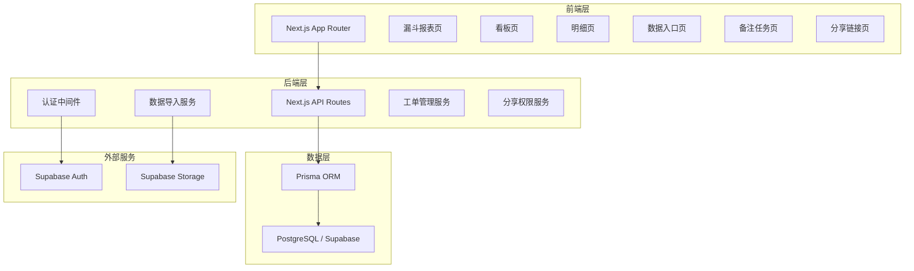
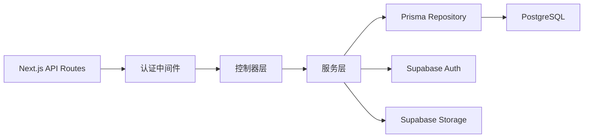
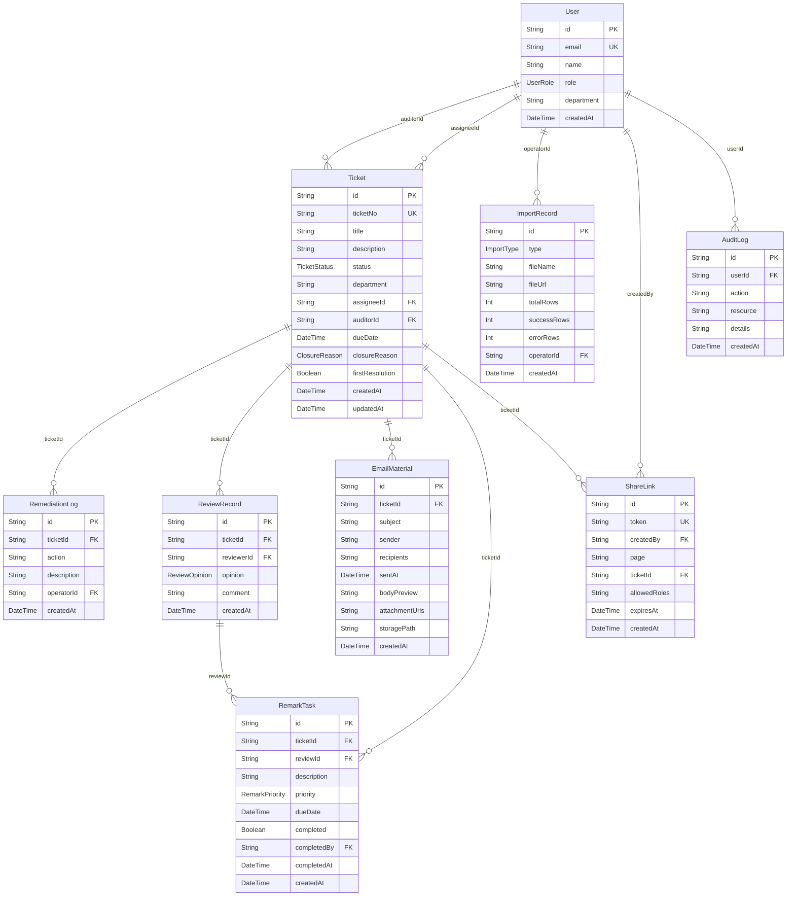

## 1. 架构设计



## 2. 技术说明

- 前端：Next.js 14 (App Router) + Tailwind CSS + Recharts + Zustand
- 初始化工具：create-next-app
- 后端：Next.js API Routes (Route Handlers)
- 数据库：PostgreSQL (Supabase 托管)
- ORM：Prisma
- 认证：Supabase Auth
- 存储：Supabase Storage (邮件材料附件)

## 3. 路由定义

| 路由 | 用途 |
|------|------|
| `/` | 仪表盘首页，展示漏斗概览与关键指标 |
| `/funnel` | 漏斗报表页，整改跟踪漏斗图与首次解决率 |
| `/board` | 看板页，按复核意见/关闭原因/工单状态展开 |
| `/import` | 数据入口页，ERP 导出与权限日志导入 |
| `/tickets/[id]` | 工单明细页，邮件材料追溯与整改时间线 |
| `/tasks` | 备注任务页，复核不通过生成的任务列表 |
| `/share/[token]` | 分享链接页，角色受限的报表查看 |
| `/admin` | 管理页面，用户与角色管理 |

## 4. API 定义

### 4.1 认证相关

```typescript
interface AuthUser {
  id: string
  email: string
  role: "auditor" | "business_owner" | "compliance_officer" | "management"
  department?: string
}

// POST /api/auth/login
interface LoginRequest { email: string; password: string }
interface LoginResponse { user: AuthUser; token: string }

// GET /api/auth/me
interface MeResponse { user: AuthUser }
```

### 4.2 数据导入

```typescript
// POST /api/imports/erp
interface ErpImportRequest {
  fileUrl: string
  mapping: Record<string, string>
}
interface ErpImportResponse {
  importId: string
  totalRows: number
  successRows: number
  errorRows: number
  errors: Array<{ row: number; field: string; message: string }>
}

// POST /api/imports/permission-log
interface PermissionLogImportRequest {
  fileUrl: string
  format: "csv" | "json"
}
interface PermissionLogImportResponse {
  importId: string
  totalRecords: number
  linkedTickets: number
}
```

### 4.3 工单管理

```typescript
type TicketStatus = "pending_remediation" | "in_remediation" | "pending_review" | "closed"
type ReviewOpinion = "approved" | "rejected" | "returned_for_modification"
type ClosureReason = "remediated" | "risk_accepted" | "no_longer_applicable"

interface Ticket {
  id: string
  ticketNo: string
  title: string
  description: string
  status: TicketStatus
  department: string
  assigneeId: string
  auditorId: string
  dueDate: string
  closureReason?: ClosureReason
  createdAt: string
  updatedAt: string
  firstResolution: boolean
}

// GET /api/tickets?page=1&pageSize=20&status=&department=
interface TicketListResponse {
  tickets: Ticket[]
  total: number
  page: number
  pageSize: number
}

// GET /api/tickets/:id
interface TicketDetailResponse {
  ticket: Ticket
  remediationLog: RemediationLog[]
  reviewRecords: ReviewRecord[]
  emailMaterials: EmailMaterial[]
  remarkTasks: RemarkTask[]
}

// POST /api/tickets/:id/review
interface ReviewRequest {
  opinion: ReviewOpinion
  comment: string
}
interface ReviewResponse {
  review: ReviewRecord
  remarkTask?: RemarkTask
}
```

### 4.4 漏斗数据

```typescript
// GET /api/funnel?startDate=&endDate=&department=
interface FunnelData {
  stages: Array<{
    stage: "discovered" | "assigned" | "remediating" | "reviewing" | "closed"
    count: number
    conversionRate: number
    conclusions: Array<{ summary: string; detail: string }>
  }>
  firstResolutionRate: number
  firstResolutionTrend: Array<{ month: string; rate: number }>
}
```

### 4.5 看板数据

```typescript
// GET /api/board?groupBy=review_opinion&status=&department=
interface BoardData {
  groupBy: "review_opinion" | "closure_reason" | "status"
  groups: Array<{
    key: string
    label: string
    count: number
    children?: Array<{
      key: string
      label: string
      count: number
      tickets: Array<{ id: string; ticketNo: string; title: string; status: TicketStatus }>
    }>
  }>
}
```

### 4.6 分享链接

```typescript
// POST /api/shares
interface CreateShareRequest {
  scope: Array<"auditor" | "business_owner" | "compliance_officer" | "management">
  expiresIn: number
  page: "funnel" | "board" | "ticket"
  ticketId?: string
}
interface CreateShareResponse {
  shareToken: string
  shareUrl: string
  expiresAt: string
}

// GET /api/shares/[token]
interface ShareAccessResponse {
  allowed: boolean
  role: string
  data: FunnelData | BoardData | TicketDetailResponse
  masked: boolean
}
```

## 5. 服务端架构图



## 6. 数据模型

### 6.1 数据模型定义



### 6.2 数据定义语言

```sql
CREATE TYPE user_role AS ENUM ('auditor', 'business_owner', 'compliance_officer', 'management');
CREATE TYPE ticket_status AS ENUM ('pending_remediation', 'in_remediation', 'pending_review', 'closed');
CREATE TYPE review_opinion AS ENUM ('approved', 'rejected', 'returned_for_modification');
CREATE TYPE closure_reason AS ENUM ('remediated', 'risk_accepted', 'no_longer_applicable');
CREATE TYPE import_type AS ENUM ('erp_export', 'permission_log');
CREATE TYPE remark_priority AS ENUM ('high', 'medium', 'low');

CREATE TABLE "User" (
  id UUID PRIMARY KEY DEFAULT gen_random_uuid(),
  email VARCHAR(255) UNIQUE NOT NULL,
  name VARCHAR(100) NOT NULL,
  role user_role NOT NULL,
  department VARCHAR(100),
  created_at TIMESTAMP NOT NULL DEFAULT NOW()
);

CREATE TABLE "Ticket" (
  id UUID PRIMARY KEY DEFAULT gen_random_uuid(),
  ticket_no VARCHAR(50) UNIQUE NOT NULL,
  title VARCHAR(500) NOT NULL,
  description TEXT,
  status ticket_status NOT NULL DEFAULT 'pending_remediation',
  department VARCHAR(100),
  assignee_id UUID REFERENCES "User"(id),
  auditor_id UUID REFERENCES "User"(id),
  due_date TIMESTAMP,
  closure_reason closure_reason,
  first_resolution BOOLEAN NOT NULL DEFAULT FALSE,
  created_at TIMESTAMP NOT NULL DEFAULT NOW(),
  updated_at TIMESTAMP NOT NULL DEFAULT NOW()
);

CREATE TABLE "ImportRecord" (
  id UUID PRIMARY KEY DEFAULT gen_random_uuid(),
  type import_type NOT NULL,
  file_name VARCHAR(255) NOT NULL,
  file_url TEXT NOT NULL,
  total_rows INT NOT NULL DEFAULT 0,
  success_rows INT NOT NULL DEFAULT 0,
  error_rows INT NOT NULL DEFAULT 0,
  operator_id UUID REFERENCES "User"(id),
  created_at TIMESTAMP NOT NULL DEFAULT NOW()
);

CREATE TABLE "RemediationLog" (
  id UUID PRIMARY KEY DEFAULT gen_random_uuid(),
  ticket_id UUID NOT NULL REFERENCES "Ticket"(id) ON DELETE CASCADE,
  action VARCHAR(200) NOT NULL,
  description TEXT,
  operator_id UUID REFERENCES "User"(id),
  created_at TIMESTAMP NOT NULL DEFAULT NOW()
);

CREATE TABLE "ReviewRecord" (
  id UUID PRIMARY KEY DEFAULT gen_random_uuid(),
  ticket_id UUID NOT NULL REFERENCES "Ticket"(id) ON DELETE CASCADE,
  reviewer_id UUID NOT NULL REFERENCES "User"(id),
  opinion review_opinion NOT NULL,
  comment TEXT,
  created_at TIMESTAMP NOT NULL DEFAULT NOW()
);

CREATE TABLE "EmailMaterial" (
  id UUID PRIMARY KEY DEFAULT gen_random_uuid(),
  ticket_id UUID NOT NULL REFERENCES "Ticket"(id) ON DELETE CASCADE,
  subject VARCHAR(500) NOT NULL,
  sender VARCHAR(255) NOT NULL,
  recipients TEXT NOT NULL,
  sent_at TIMESTAMP NOT NULL,
  body_preview TEXT,
  attachment_urls TEXT,
  storage_path TEXT,
  created_at TIMESTAMP NOT NULL DEFAULT NOW()
);

CREATE TABLE "RemarkTask" (
  id UUID PRIMARY KEY DEFAULT gen_random_uuid(),
  ticket_id UUID NOT NULL REFERENCES "Ticket"(id) ON DELETE CASCADE,
  review_id UUID NOT NULL REFERENCES "ReviewRecord"(id) ON DELETE CASCADE,
  description TEXT NOT NULL,
  priority remark_priority NOT NULL DEFAULT 'medium',
  due_date TIMESTAMP,
  completed BOOLEAN NOT NULL DEFAULT FALSE,
  completed_by UUID REFERENCES "User"(id),
  completed_at TIMESTAMP,
  created_at TIMESTAMP NOT NULL DEFAULT NOW()
);

CREATE TABLE "ShareLink" (
  id UUID PRIMARY KEY DEFAULT gen_random_uuid(),
  token VARCHAR(100) UNIQUE NOT NULL,
  created_by UUID NOT NULL REFERENCES "User"(id),
  page VARCHAR(50) NOT NULL,
  ticket_id UUID REFERENCES "Ticket"(id),
  allowed_roles VARCHAR(255) NOT NULL,
  expires_at TIMESTAMP NOT NULL,
  created_at TIMESTAMP NOT NULL DEFAULT NOW()
);

CREATE TABLE "AuditLog" (
  id UUID PRIMARY KEY DEFAULT gen_random_uuid(),
  user_id UUID REFERENCES "User"(id),
  action VARCHAR(100) NOT NULL,
  resource VARCHAR(100) NOT NULL,
  details JSONB,
  created_at TIMESTAMP NOT NULL DEFAULT NOW()
);

CREATE INDEX idx_ticket_status ON "Ticket"(status);
CREATE INDEX idx_ticket_department ON "Ticket"(department);
CREATE INDEX idx_ticket_assignee ON "Ticket"(assignee_id);
CREATE INDEX idx_ticket_auditor ON "Ticket"(auditor_id);
CREATE INDEX idx_remark_task_ticket ON "RemarkTask"(ticket_id);
CREATE INDEX idx_remark_task_completed ON "RemarkTask"(completed);
CREATE INDEX idx_email_material_ticket ON "EmailMaterial"(ticket_id);
CREATE INDEX idx_review_ticket ON "ReviewRecord"(ticket_id);
CREATE INDEX idx_share_token ON "ShareLink"(token);
CREATE INDEX idx_audit_log_user ON "AuditLog"(user_id);
CREATE INDEX idx_audit_log_created ON "AuditLog"(created_at);
```
