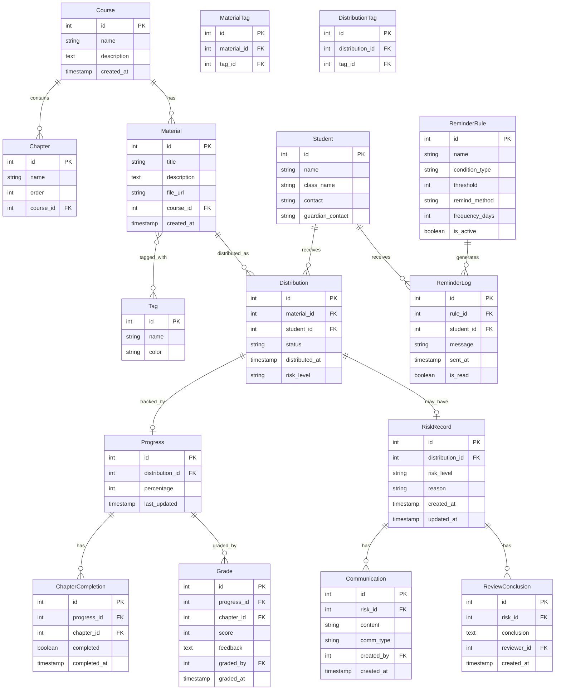

## 1. 架构设计

```mermaid
graph TB
    subgraph "前端层"
        "Nuxt 3 SSR" --> "Naive UI 组件库"
        "Nuxt 3 SSR" --> "Pinia 状态管理"
        "Nuxt 3 SSR" --> "ECharts 图表"
    end
    subgraph "后端层"
        "Django REST Framework" --> "教材管理API"
        "Django REST Framework" --> "进度跟踪API"
        "Django REST Framework" --> "提醒规则API"
        "Django REST Framework" --> "统计看板API"
    end
    subgraph "数据层"
        "PostgreSQL" --> "业务数据存储"
        "MinIO" --> "教材文件存储"
    end
    "Nuxt 3 SSR" -->|"HTTP/REST"| "Django REST Framework"
    "Django REST Framework" -->|"SQL"| "PostgreSQL"
    "Django REST Framework" -->|"S3 API"| "MinIO"
```

## 2. 技术说明

- 前端：Nuxt 3 + Naive UI + Pinia + ECharts
- 初始化工具：npx nuxi@latest init
- 后端：Django 5 + Django REST Framework + django-minio-storage
- 数据库：PostgreSQL 16
- 文件存储：MinIO（教材PDF/附件）
- 通信协议：REST API + JWT认证

## 3. 路由定义

| 路由 | 用途 |
|------|------|
| / | 重定向至工作台 |
| /dashboard | 教材发放工作台（待办入口+记录列表） |
| /progress | 学习进度跟踪页 |
| /risk | 风险预警列表页 |
| /reminders | 提醒规则管理页 |
| /analytics | 管理层看板页 |

## 4. API 定义

### 4.1 认证

```typescript
POST /api/auth/login/
  Request: { username: string; password: string }
  Response: { access: string; refresh: string; user: UserProfile }

POST /api/auth/refresh/
  Request: { refresh: string }
  Response: { access: string }
```

### 4.2 教材管理

```typescript
GET /api/materials/
  Query: { page: number; page_size: number; tag: string; search: string }
  Response: { count: number; results: Material[] }

POST /api/materials/
  Request: FormData { title, description, tag_ids, file }
  Response: Material

GET /api/materials/:id/
  Response: Material

POST /api/distributions/
  Request: { material_id: number; student_ids: number[]; chapter_ids: number[] }
  Response: { created_count: number; distributions: Distribution[] }

GET /api/distributions/
  Query: { status: "pending"|"following"|"reviewing"|"completed"; tag: string; risk_level: string }
  Response: { count: number; results: Distribution[] }
```

### 4.3 学习进度

```typescript
GET /api/progress/
  Query: { student_id: number; distribution_id: number; course_id: number }
  Response: { count: number; results: Progress[] }

PATCH /api/progress/:id/
  Request: { percentage: number; chapter_completions: ChapterCompletion[] }
  Response: Progress

POST /api/grades/
  Request: { progress_id: number; score: number; feedback: string; chapter_id: number }
  Response: Grade
```

### 4.4 风险与跟进

```typescript
GET /api/risks/
  Query: { risk_level: "high"|"medium"|"low"; course_id: number }
  Response: { count: number; results: RiskRecord[] }

GET /api/risks/:id/
  Response: RiskRecord (含 communications + review_conclusions)

POST /api/communications/
  Request: { risk_id: number; content: string; comm_type: "phone"|"email"|"in_person"|"online" }
  Response: Communication

POST /api/reviews/
  Request: { risk_id: number; conclusion: string; reviewer_id: number }
  Response: ReviewConclusion
```

### 4.5 提醒规则

```typescript
GET /api/reminder-rules/
  Response: { count: number; results: ReminderRule[] }

POST /api/reminder-rules/
  Request: { name: string; condition_type: string; threshold: number; remind_method: string; frequency_days: number }
  Response: ReminderRule

GET /api/reminder-logs/
  Query: { rule_id: number; student_id: number }
  Response: { count: number; results: ReminderLog[] }
```

### 4.6 统计看板

```typescript
GET /api/analytics/completion-trend/
  Query: { period: "month"|"quarter"|"year"; course_id?: number }
  Response: { labels: string[]; planned: number[]; actual: number[] }

GET /api/analytics/risk-distribution/
  Query: { course_id?: number }
  Response: { high: number; medium: number; low: number; by_course: Record<string, RiskDist> }

GET /api/analytics/overview/
  Response: { total_students: number; completion_rate: number; risk_count: number; pending_count: number }
```

### 4.7 类型定义

```typescript
interface Material {
  id: number
  title: string
  description: string
  tags: Tag[]
  file_url: string
  course: Course
  created_at: string
}

interface Tag {
  id: number
  name: string
  color: string
}

interface Course {
  id: number
  name: string
  chapters: Chapter[]
}

interface Chapter {
  id: number
  name: string
  order: number
  course: number
}

interface Distribution {
  id: number
  material: number
  student: Student
  status: "pending" | "following" | "reviewing" | "completed"
  distributed_at: string
  risk_level: "high" | "medium" | "low" | null
  tags: Tag[]
}

interface Student {
  id: number
  name: string
  class_name: string
  contact: string
}

interface Progress {
  id: number
  distribution: number
  percentage: number
  chapter_completions: ChapterCompletion[]
  last_updated: string
}

interface ChapterCompletion {
  chapter_id: number
  completed: boolean
  completed_at: string | null
}

interface Grade {
  id: number
  progress: number
  chapter: number
  score: number
  feedback: string
  graded_at: string
  graded_by: number
}

interface RiskRecord {
  id: number
  distribution: Distribution
  risk_level: "high" | "medium" | "low"
  reason: string
  communications: Communication[]
  review_conclusions: ReviewConclusion[]
  created_at: string
}

interface Communication {
  id: number
  risk: number
  content: string
  comm_type: "phone" | "email" | "in_person" | "online"
  created_at: string
  created_by: number
}

interface ReviewConclusion {
  id: number
  risk: number
  conclusion: string
  reviewer: number
  reviewer_name: string
  created_at: string
}

interface ReminderRule {
  id: number
  name: string
  condition_type: "progress_below" | "no_update_days" | "grade_below"
  threshold: number
  remind_method: "in_app" | "email" | "both"
  frequency_days: number
  is_active: boolean
}

interface ReminderLog {
  id: number
  rule: number
  student: number
  message: string
  sent_at: string
  is_read: boolean
}
```

## 5. 服务端架构图

```mermaid
graph LR
    subgraph "Django REST"
        "AuthController" --> "AuthService"
        "MaterialController" --> "MaterialService"
        "ProgressController" --> "ProgressService"
        "RiskController" --> "RiskService"
        "ReminderController" --> "ReminderService"
        "AnalyticsController" --> "AnalyticsService"
    end
    subgraph "数据访问层"
        "AuthService" --> "UserRepository"
        "MaterialService" --> "MaterialRepository"
        "ProgressService" --> "ProgressRepository"
        "RiskService" --> "RiskRepository"
        "ReminderService" --> "ReminderRepository"
        "AnalyticsService" --> "AnalyticsRepository"
    end
    subgraph "存储层"
        "MaterialRepository" --> "PostgreSQL"
        "ProgressRepository" --> "PostgreSQL"
        "RiskRepository" --> "PostgreSQL"
        "ReminderRepository" --> "PostgreSQL"
        "MaterialService" --> "MinIO"
    end
```

## 6. 数据模型

### 6.1 数据模型定义



### 6.2 数据定义语言

```sql
CREATE TABLE course (
    id SERIAL PRIMARY KEY,
    name VARCHAR(200) NOT NULL,
    description TEXT,
    created_at TIMESTAMP WITH TIME ZONE DEFAULT NOW()
);

CREATE TABLE chapter (
    id SERIAL PRIMARY KEY,
    name VARCHAR(200) NOT NULL,
    "order" INTEGER NOT NULL,
    course_id INTEGER REFERENCES course(id) ON DELETE CASCADE,
    created_at TIMESTAMP WITH TIME ZONE DEFAULT NOW()
);

CREATE TABLE tag (
    id SERIAL PRIMARY KEY,
    name VARCHAR(100) NOT NULL UNIQUE,
    color VARCHAR(7) NOT NULL DEFAULT '#1B3A5C'
);

CREATE TABLE material (
    id SERIAL PRIMARY KEY,
    title VARCHAR(300) NOT NULL,
    description TEXT,
    file_url VARCHAR(500),
    course_id INTEGER REFERENCES course(id) ON DELETE SET NULL,
    created_at TIMESTAMP WITH TIME ZONE DEFAULT NOW()
);

CREATE TABLE material_tags (
    id SERIAL PRIMARY KEY,
    material_id INTEGER REFERENCES material(id) ON DELETE CASCADE,
    tag_id INTEGER REFERENCES tag(id) ON DELETE CASCADE,
    UNIQUE(material_id, tag_id)
);

CREATE TABLE student (
    id SERIAL PRIMARY KEY,
    name VARCHAR(100) NOT NULL,
    class_name VARCHAR(100),
    contact VARCHAR(50),
    guardian_contact VARCHAR(50)
);

CREATE TABLE distribution (
    id SERIAL PRIMARY KEY,
    material_id INTEGER REFERENCES material(id) ON DELETE CASCADE,
    student_id INTEGER REFERENCES student(id) ON DELETE CASCADE,
    status VARCHAR(20) NOT NULL DEFAULT 'pending',
    distributed_at TIMESTAMP WITH TIME ZONE DEFAULT NOW(),
    risk_level VARCHAR(10)
);

CREATE TABLE distribution_tags (
    id SERIAL PRIMARY KEY,
    distribution_id INTEGER REFERENCES distribution(id) ON DELETE CASCADE,
    tag_id INTEGER REFERENCES tag(id) ON DELETE CASCADE,
    UNIQUE(distribution_id, tag_id)
);

CREATE TABLE progress (
    id SERIAL PRIMARY KEY,
    distribution_id INTEGER REFERENCES distribution(id) ON DELETE CASCADE UNIQUE,
    percentage INTEGER NOT NULL DEFAULT 0,
    last_updated TIMESTAMP WITH TIME ZONE DEFAULT NOW()
);

CREATE TABLE chapter_completion (
    id SERIAL PRIMARY KEY,
    progress_id INTEGER REFERENCES progress(id) ON DELETE CASCADE,
    chapter_id INTEGER REFERENCES chapter(id) ON DELETE CASCADE,
    completed BOOLEAN NOT NULL DEFAULT FALSE,
    completed_at TIMESTAMP WITH TIME ZONE,
    UNIQUE(progress_id, chapter_id)
);

CREATE TABLE grade (
    id SERIAL PRIMARY KEY,
    progress_id INTEGER REFERENCES progress(id) ON DELETE CASCADE,
    chapter_id INTEGER REFERENCES chapter(id) ON DELETE CASCADE,
    score INTEGER NOT NULL,
    feedback TEXT,
    graded_by INTEGER,
    graded_at TIMESTAMP WITH TIME ZONE DEFAULT NOW()
);

CREATE TABLE risk_record (
    id SERIAL PRIMARY KEY,
    distribution_id INTEGER REFERENCES distribution(id) ON DELETE CASCADE,
    risk_level VARCHAR(10) NOT NULL,
    reason TEXT,
    created_at TIMESTAMP WITH TIME ZONE DEFAULT NOW(),
    updated_at TIMESTAMP WITH TIME ZONE DEFAULT NOW()
);

CREATE TABLE communication (
    id SERIAL PRIMARY KEY,
    risk_id INTEGER REFERENCES risk_record(id) ON DELETE CASCADE,
    content TEXT NOT NULL,
    comm_type VARCHAR(20) NOT NULL,
    created_by INTEGER,
    created_at TIMESTAMP WITH TIME ZONE DEFAULT NOW()
);

CREATE TABLE review_conclusion (
    id SERIAL PRIMARY KEY,
    risk_id INTEGER REFERENCES risk_record(id) ON DELETE CASCADE,
    conclusion TEXT NOT NULL,
    reviewer_id INTEGER,
    created_at TIMESTAMP WITH TIME ZONE DEFAULT NOW()
);

CREATE TABLE reminder_rule (
    id SERIAL PRIMARY KEY,
    name VARCHAR(200) NOT NULL,
    condition_type VARCHAR(50) NOT NULL,
    threshold INTEGER NOT NULL,
    remind_method VARCHAR(20) NOT NULL DEFAULT 'in_app',
    frequency_days INTEGER NOT NULL DEFAULT 7,
    is_active BOOLEAN NOT NULL DEFAULT TRUE
);

CREATE TABLE reminder_log (
    id SERIAL PRIMARY KEY,
    rule_id INTEGER REFERENCES reminder_rule(id) ON DELETE CASCADE,
    student_id INTEGER REFERENCES student(id) ON DELETE CASCADE,
    message TEXT NOT NULL,
    sent_at TIMESTAMP WITH TIME ZONE DEFAULT NOW(),
    is_read BOOLEAN NOT NULL DEFAULT FALSE
);

CREATE INDEX idx_distribution_status ON distribution(status);
CREATE INDEX idx_distribution_risk ON distribution(risk_level);
CREATE INDEX idx_progress_last_updated ON progress(last_updated);
CREATE INDEX idx_risk_record_level ON risk_record(risk_level);
CREATE INDEX idx_reminder_log_student ON reminder_log(student_id);
CREATE INDEX idx_reminder_log_read ON reminder_log(is_read);
```
