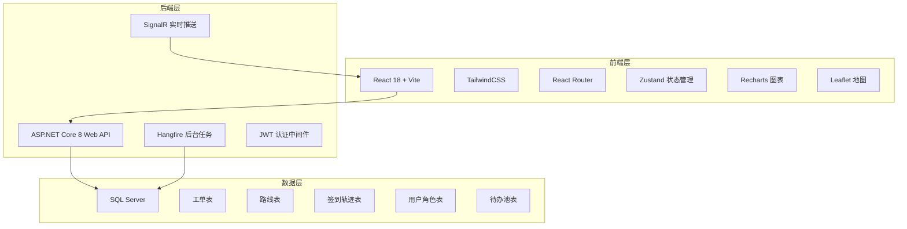
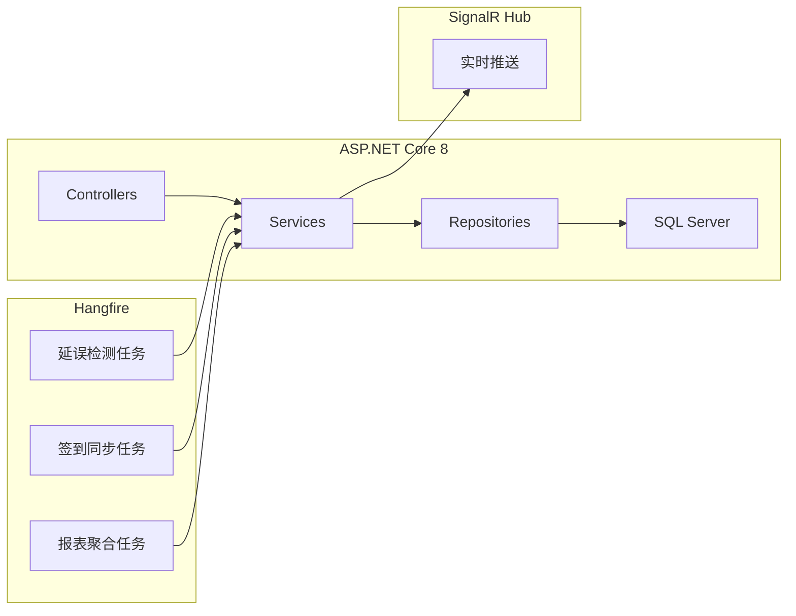
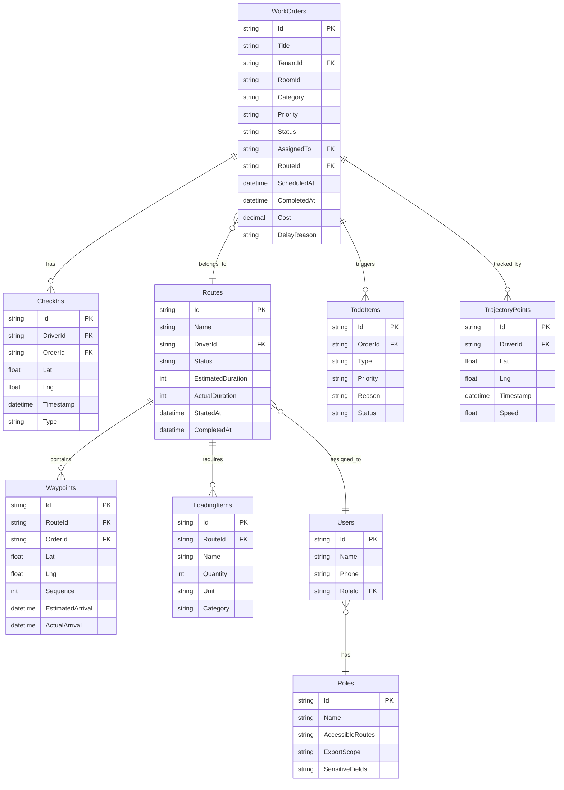

## 1. 架构设计



## 2. 技术说明

- **前端**：React@18 + TailwindCSS@3 + Vite，使用 React Router v6 路由，Zustand 状态管理，Recharts 图表库，Leaflet 地图组件
- **初始化工具**：Vite (create-vite)
- **后端**：ASP.NET Core 8 Web API + Hangfire 后台任务调度 + SignalR 实时通信
- **数据库**：SQL Server，前端阶段使用 Mock 数据模拟接口
- **认证**：JWT Token + 角色声明，前端模拟角色切换

## 3. 路由定义

| 路由 | 用途 |
|------|------|
| `/` | 排程调度台首页，路线看板与地图概览 |
| `/route-planner` | 路线计划编排页 |
| `/trajectory` | 轨迹回放页 |
| `/work-orders` | 工单管理页 |
| `/todo-pool` | 待办池页（延误工单处理） |
| `/reports` | 报表分析页 |
| `/permissions` | 角色权限配置页 |

## 4. API 定义

### 4.1 TypeScript 类型定义

```typescript
interface WorkOrder {
  id: string;
  title: string;
  description: string;
  tenantId: string;
  tenantName: string;
  tenantPhone: string;
  roomId: string;
  roomAddress: string;
  category: string;
  priority: "urgent" | "high" | "normal" | "low";
  status: "pending" | "assigned" | "in_progress" | "completed" | "delayed" | "rejected";
  assignedTo: string;
  routeId: string;
  createdAt: string;
  scheduledAt: string;
  completedAt: string | null;
  photos: string[];
  cost: number | null;
  signatureUrl: string | null;
  receiptPhotos: string[];
  delayReason: string | null;
}

interface Route {
  id: string;
  name: string;
  driverId: string;
  driverName: string;
  status: "planned" | "in_progress" | "completed" | "delayed";
  workOrders: string[];
  waypoints: Waypoint[];
  estimatedDuration: number;
  actualDuration: number | null;
  loadingList: LoadingItem[];
  startedAt: string | null;
  completedAt: string | null;
}

interface Waypoint {
  orderId: string;
  lat: number;
  lng: number;
  address: string;
  estimatedArrival: string;
  actualArrival: string | null;
  sequence: number;
}

interface CheckIn {
  id: string;
  driverId: string;
  orderId: string;
  lat: number;
  lng: number;
  timestamp: string;
  type: "arrival" | "departure" | "break";
  photoUrl: string | null;
}

interface TrajectoryPoint {
  lat: number;
  lng: number;
  timestamp: string;
  speed: number;
}

interface LoadingItem {
  id: string;
  name: string;
  quantity: number;
  unit: string;
  category: "material" | "tool";
}

interface TodoItem {
  id: string;
  orderId: string;
  type: "delay" | "rejection" | "reassign";
  priority: "urgent" | "high" | "normal";
  reason: string;
  createdAt: string;
  assignedTo: string;
  attachments: string[];
  status: "pending" | "processing" | "resolved";
}

interface UserRole {
  id: string;
  name: string;
  role: "tenant" | "butler" | "maintenance" | "finance";
  accessibleRoutes: string[];
  exportScope: string[];
  sensitiveFields: string[];
}

interface ReportFilter {
  dimension: "on_time_rate" | "date" | "responsible";
  dateRange: { start: string; end: string };
  responsibleId: string | null;
  groupBy: "day" | "week" | "month";
}
```

### 4.2 接口端点

| 方法 | 端点 | 描述 |
|------|------|------|
| GET | `/api/work-orders` | 获取工单列表（支持筛选） |
| GET | `/api/work-orders/:id` | 获取工单详情 |
| POST | `/api/work-orders` | 创建工单 |
| PUT | `/api/work-orders/:id` | 更新工单 |
| POST | `/api/work-orders/:id/receipt` | 上传签收凭证 |
| GET | `/api/routes` | 获取路线列表 |
| POST | `/api/routes` | 创建路线 |
| PUT | `/api/routes/:id` | 更新路线 |
| POST | `/api/routes/:id/dispatch` | 派单 |
| GET | `/api/check-ins` | 获取签到记录 |
| POST | `/api/check-ins` | 签到 |
| GET | `/api/trajectory/:driverId` | 获取轨迹数据 |
| GET | `/api/todo-pool` | 获取待办池列表 |
| POST | `/api/todo-pool/:id/reassign` | 重新分派 |
| POST | `/api/todo-pool/:id/supplement` | 补充材料 |
| POST | `/api/todo-pool/:id/reject` | 驳回重提 |
| GET | `/api/reports` | 获取报表数据 |
| GET | `/api/roles` | 获取角色权限配置 |
| PUT | `/api/roles/:id` | 更新角色权限 |

## 5. 服务端架构图



## 6. 数据模型

### 6.1 数据模型定义



### 6.2 数据定义语言（DDL）

```sql
CREATE TABLE Roles (
    Id NVARCHAR(36) PRIMARY KEY,
    Name NVARCHAR(50) NOT NULL,
    AccessibleRoutes NVARCHAR(500),
    ExportScope NVARCHAR(500),
    SensitiveFields NVARCHAR(500)
);

CREATE TABLE Users (
    Id NVARCHAR(36) PRIMARY KEY,
    Name NVARCHAR(100) NOT NULL,
    Phone NVARCHAR(20),
    RoleId NVARCHAR(36) FOREIGN KEY REFERENCES Roles(Id)
);

CREATE TABLE Routes (
    Id NVARCHAR(36) PRIMARY KEY,
    Name NVARCHAR(200) NOT NULL,
    DriverId NVARCHAR(36) FOREIGN KEY REFERENCES Users(Id),
    Status NVARCHAR(20) NOT NULL DEFAULT 'planned',
    EstimatedDuration INT,
    ActualDuration INT,
    StartedAt DATETIME2,
    CompletedAt DATETIME2,
    CreatedAt DATETIME2 NOT NULL DEFAULT GETUTCDATE()
);

CREATE TABLE WorkOrders (
    Id NVARCHAR(36) PRIMARY KEY,
    Title NVARCHAR(200) NOT NULL,
    Description NVARCHAR(2000),
    TenantId NVARCHAR(36) FOREIGN KEY REFERENCES Users(Id),
    RoomId NVARCHAR(36),
    RoomAddress NVARCHAR(300),
    Category NVARCHAR(50),
    Priority NVARCHAR(20) NOT NULL DEFAULT 'normal',
    Status NVARCHAR(20) NOT NULL DEFAULT 'pending',
    AssignedTo NVARCHAR(36) FOREIGN KEY REFERENCES Users(Id),
    RouteId NVARCHAR(36) FOREIGN KEY REFERENCES Routes(Id),
    ScheduledAt DATETIME2 NOT NULL,
    CompletedAt DATETIME2,
    Cost DECIMAL(12,2),
    DelayReason NVARCHAR(500),
    CreatedAt DATETIME2 NOT NULL DEFAULT GETUTCDATE()
);

CREATE TABLE Waypoints (
    Id NVARCHAR(36) PRIMARY KEY,
    RouteId NVARCHAR(36) FOREIGN KEY REFERENCES Routes(Id),
    OrderId NVARCHAR(36) FOREIGN KEY REFERENCES WorkOrders(Id),
    Lat FLOAT NOT NULL,
    Lng FLOAT NOT NULL,
    Address NVARCHAR(300),
    Sequence INT NOT NULL,
    EstimatedArrival DATETIME2,
    ActualArrival DATETIME2
);

CREATE TABLE CheckIns (
    Id NVARCHAR(36) PRIMARY KEY,
    DriverId NVARCHAR(36) FOREIGN KEY REFERENCES Users(Id),
    OrderId NVARCHAR(36) FOREIGN KEY REFERENCES WorkOrders(Id),
    Lat FLOAT NOT NULL,
    Lng FLOAT NOT NULL,
    Timestamp DATETIME2 NOT NULL DEFAULT GETUTCDATE(),
    Type NVARCHAR(20) NOT NULL,
    PhotoUrl NVARCHAR(500)
);

CREATE TABLE TrajectoryPoints (
    Id NVARCHAR(36) PRIMARY KEY,
    DriverId NVARCHAR(36) FOREIGN KEY REFERENCES Users(Id),
    Lat FLOAT NOT NULL,
    Lng FLOAT NOT NULL,
    Timestamp DATETIME2 NOT NULL,
    Speed FLOAT
);

CREATE TABLE LoadingItems (
    Id NVARCHAR(36) PRIMARY KEY,
    RouteId NVARCHAR(36) FOREIGN KEY REFERENCES Routes(Id),
    Name NVARCHAR(200) NOT NULL,
    Quantity INT NOT NULL DEFAULT 1,
    Unit NVARCHAR(20),
    Category NVARCHAR(20) NOT NULL
);

CREATE TABLE TodoItems (
    Id NVARCHAR(36) PRIMARY KEY,
    OrderId NVARCHAR(36) FOREIGN KEY REFERENCES WorkOrders(Id),
    Type NVARCHAR(20) NOT NULL,
    Priority NVARCHAR(20) NOT NULL DEFAULT 'normal',
    Reason NVARCHAR(1000),
    Status NVARCHAR(20) NOT NULL DEFAULT 'pending',
    AssignedTo NVARCHAR(36) FOREIGN KEY REFERENCES Users(Id),
    CreatedAt DATETIME2 NOT NULL DEFAULT GETUTCDATE()
);

CREATE INDEX IX_WorkOrders_Status ON WorkOrders(Status);
CREATE INDEX IX_WorkOrders_AssignedTo ON WorkOrders(AssignedTo);
CREATE INDEX IX_WorkOrders_RouteId ON WorkOrders(RouteId);
CREATE INDEX IX_CheckIns_DriverId ON CheckIns(DriverId);
CREATE INDEX IX_CheckIns_Timestamp ON CheckIns(Timestamp);
CREATE INDEX IX_TrajectoryPoints_DriverId ON TrajectoryPoints(DriverId);
CREATE INDEX IX_TrajectoryPoints_Timestamp ON TrajectoryPoints(Timestamp);
CREATE INDEX IX_TodoItems_Status ON TodoItems(Status);
```
