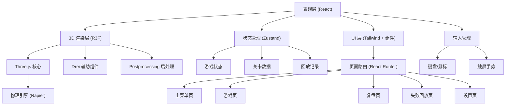

## 1. 架构设计



## 2. 技术选型说明

- **前端框架**：React 18 + TypeScript
- **构建工具**：Vite 5
- **样式方案**：TailwindCSS 3
- **3D 渲染**：Three.js + @react-three/fiber + @react-three/drei
- **物理引擎**：@react-three/rapier (Rapier 物理引擎的 React 封装)
- **后处理**：@react-three/postprocessing
- **状态管理**：Zustand
- **路由管理**：react-router-dom
- **图标库**：lucide-react
- **图表库**：recharts（复盘页数据可视化）

## 3. 路由定义

| 路由 | 页面组件 | 用途 |
|-------|----------|------|
| `/` | `MainMenu` | 主菜单页面 |
| `/game/:levelId` | `GameLevel` | 游戏关卡页 |
| `/loading` | `LoadingScreen` | 素材加载页 |
| `/review/:levelId` | `ReviewPage` | 复盘页面 |
| `/replay` | `ReplayPage` | 失败回放列表页 |
| `/replay/:replayId` | `ReplayPlayer` | 失败回放播放页 |
| `/settings` | `SettingsPage` | 设置页面 |

## 4. 状态管理

### 4.1 游戏状态 Store

```typescript
interface GameState {
  currentPhase: 'observe' | 'transcript' | 'application' | 'complete';
  score: number;
  timeRemaining: number;
  isPaused: boolean;
  selectedStudent: Student | null;
  missingMaterials: string[];
  operationHistory: OperationRecord[];
  classroomUtilization: UtilizationDataPoint[];
  
  startLevel: (levelId: string) => void;
  nextPhase: () => void;
  prevPhase: () => void;
  selectStudent: (student: Student) => void;
  submitScore: (studentId: string, score: number) => void;
  checkMaterials: (studentId: string) => boolean;
  addMissingMaterial: (material: string) => void;
  resolveMissingMaterial: (material: string) => void;
  pauseGame: () => void;
  resumeGame: () => void;
  completeLevel: (success: boolean) => void;
}
```

### 4.2 回放状态 Store

```typescript
interface ReplayState {
  replays: ReplayRecord[];
  currentReplay: ReplayRecord | null;
  isPlaying: boolean;
  playbackSpeed: number;
  currentFrame: number;
  
  saveReplay: (levelData: LevelResult) => void;
  loadReplay: (replayId: string) => void;
  playReplay: () => void;
  pauseReplay: () => void;
  seekToFrame: (frame: number) => void;
  setPlaybackSpeed: (speed: number) => void;
  getStuckPoints: () => StuckPoint[];
}
```

## 5. 数据模型

### 5.1 学生数据

```typescript
interface Student {
  id: string;
  name: string;
  studentId: string;
  major: string;
  grade: string;
  avatar: string;
  seatNumber: number;
  hasApplied: boolean;
}
```

### 5.2 成绩单数据

```typescript
interface Transcript {
  studentId: string;
  courses: CourseScore[];
  gpa: number;
  rank: number;
}

interface CourseScore {
  courseName: string;
  courseId: string;
  score: number;
  credits: number;
}
```

### 5.3 申请材料数据

```typescript
interface ApplicationMaterial {
  id: string;
  name: string;
  type: 'transcript' | 'application_form' | 'id_copy' | 'recommendation' | 'certificate';
  required: boolean;
  submitted: boolean;
}
```

### 5.4 关卡数据

```typescript
interface Level {
  id: string;
  name: string;
  description: string;
  difficulty: 'easy' | 'medium' | 'hard';
  timeLimit: number;
  students: Student[];
  transcripts: Transcript[];
  materials: ApplicationMaterial[];
  targetUtilization: number;
}
```

### 5.5 操作记录

```typescript
interface OperationRecord {
  timestamp: number;
  type: string;
  payload: Record<string, any>;
  phase: string;
}
```

### 5.6 回放记录

```typescript
interface ReplayRecord {
  id: string;
  levelId: string;
  levelName: string;
  timestamp: number;
  duration: number;
  success: boolean;
  finalScore: number;
  operations: OperationRecord[];
  stuckPoints: StuckPoint[];
}

interface StuckPoint {
  timestamp: number;
  phase: string;
  description: string;
  duration: number;
}
```

## 6. 核心组件结构

```
src/
├── components/
│   ├── game/
│   │   ├── ClassroomScene.tsx      # 3D 教室场景
│   │   ├── StudentDesk.tsx         # 学生课桌
│   │   ├── TeacherDesk.tsx         # 讲台
│   │   ├── PaperDocument.tsx       # 纸质文件模型
│   │   └── FirstPersonControls.tsx # 第一人称控制
│   ├── ui/
│   │   ├── HUD.tsx                 # 游戏 HUD
│   │   ├── StudentPanel.tsx        # 学生名单面板
│   │   ├── TranscriptPanel.tsx     # 成绩单面板
│   │   ├── MaterialPanel.tsx       # 申请材料面板
│   │   ├── MissingMaterialModal.tsx # 材料缺失弹窗
│   │   ├── ProgressBar.tsx         # 进度条
│   │   └── Button.tsx              # 通用按钮
│   └── chart/
│       └── UtilizationChart.tsx    # 利用率图表
├── pages/
│   ├── MainMenu.tsx
│   ├── GameLevel.tsx
│   ├── LoadingScreen.tsx
│   ├── ReviewPage.tsx
│   ├── ReplayPage.tsx
│   ├── ReplayPlayer.tsx
│   └── SettingsPage.tsx
├── stores/
│   ├── useGameStore.ts
│   ├── useReplayStore.ts
│   └── useSettingsStore.ts
├── data/
│   ├── levels.ts
│   └── mockData.ts
├── hooks/
│   ├── useKeyboardControls.ts
│   ├── useTouchControls.ts
│   ├── useLoadingProgress.ts
│   └── useGameTimer.ts
├── utils/
│   ├── replaySystem.ts
│   ├── utilizationCalculator.ts
│   └── helpers.ts
├── types/
│   └── index.ts
├── App.tsx
├── main.tsx
└── index.css
```

## 7. 物理引擎使用

使用 `@react-three/rapier` 实现：
- 玩家碰撞检测（墙体、桌椅阻挡）
- 可拾取物品的物理交互
- 文件掉落等简单物理效果
- 触发区域检测（靠近课桌自动显示信息）

## 8. 性能优化

- 3D 模型使用低多边形 + 实例化渲染 (InstancedMesh)
- 纹理压缩和懒加载
- 状态更新节流
- 离屏组件使用 Suspense
- 使用 useMemo/useCallback 减少重渲染
