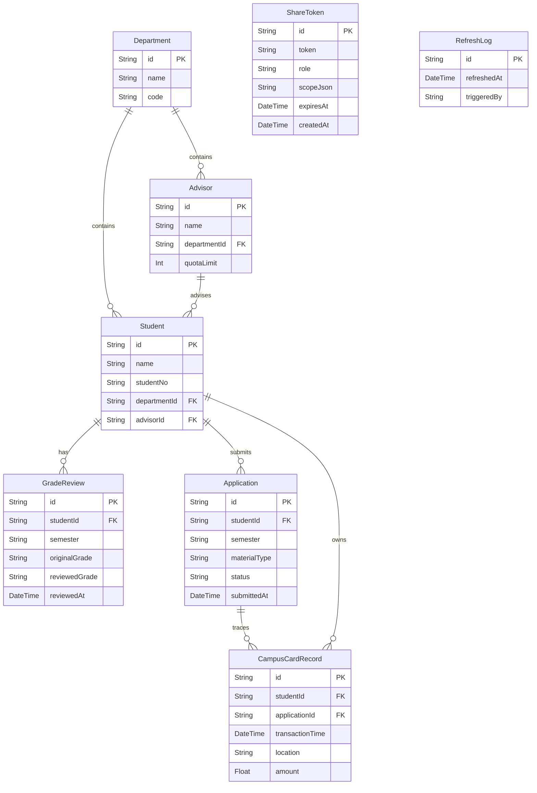

## 1. 架构设计

```mermaid
flowchart TB
    subgraph "前端层"
        "Next.js App Router" --> "React组件"
        "React组件" --> "Recharts图表"
        "React组件" --> "角色权限HOC"
    end
    subgraph "API层"
        "Next.js API Routes" --> "Prisma ORM"
        "Next.js API Routes" --> "Supabase Auth"
    end
    subgraph "数据层"
        "Prisma ORM" --> "PostgreSQL (Supabase)"
        "Supabase Auth" --> "角色会话"
    end
    subgraph "外部数据源"
        "教务库" --> "数据同步服务"
        "学生申请表" --> "数据同步服务"
        "一卡通系统" --> "数据同步服务"
        "数据同步服务" --> "PostgreSQL (Supabase)"
    end
```

## 2. 技术说明

- 前端：Next.js 14 (App Router) + Tailwind CSS 3 + Recharts
- 初始化工具：create-next-app
- 后端：Next.js API Routes (Route Handlers)
- 数据库：PostgreSQL (Supabase托管)
- ORM：Prisma
- 认证：Supabase Auth
- 数据源对接：教务库/学生申请表/一卡通系统通过数据同步服务写入PostgreSQL，前端仅从PostgreSQL读取

## 3. 路由定义

| 路由 | 用途 |
|------|------|
| / | 监测总览页，展示四大图表卡片与刷新时间 |
| /trend | 学生名单趋势详情页 |
| /composition | 成绩单构成详情页 |
| /materials | 申请材料明细详情页 |
| /advisor-anomaly | 导师名额异常详情页 |
| /share/[token] | 分享链接入口，根据角色权限展示数据 |
| /api/refresh | 手动触发数据刷新 |
| /api/share | 生成/验证分享链接 |
| /api/export | 导出报告（含教室利用率口径说明） |
| /api/students/trend | 学生名单趋势数据接口 |
| /api/grades/composition | 成绩单构成数据接口 |
| /api/materials | 申请材料明细数据接口 |
| /api/advisors/anomaly | 导师名额异常数据接口 |

## 4. API定义

### 4.1 TypeScript 类型定义

```typescript
type Role = "admin" | "dean" | "advisor" | "student"

interface RefreshResponse {
  lastRefreshedAt: string
  status: "success" | "in_progress"
}

interface ShareTokenPayload {
  token: string
  role: Role
  scope: { departmentId?: string; advisorId?: string; studentId?: string }
  expiresAt: string
}

interface TrendDataPoint {
  period: string
  count: number
  department?: string
  yoyChange?: number
  momChange?: number
}

interface GradeComposition {
  grade: string
  count: number
  percentage: number
  beforeReview?: { grade: string; count: number; percentage: number }[]
  afterReview?: { grade: string; count: number; percentage: number }[]
}

interface MaterialDetail {
  applicationId: string
  studentName: string
  materialType: string
  status: "submitted" | "missing" | "under_review"
  campusCardRecords?: CampusCardRecord[]
}

interface CampusCardRecord {
  transactionId: string
  time: string
  location: string
  amount: number
}

interface AdvisorAnomaly {
  advisorId: string
  advisorName: string
  studentCount: number
  expectedCount: number
  deviation: number
  isAnomaly: boolean
  department: string
}

interface ExportPayload {
  format: "pdf" | "xlsx"
  role: Role
  scope: object
  includeCaliberNote: true
}
```

### 4.2 请求/响应模式

| 接口 | 方法 | 请求参数 | 响应 |
|------|------|----------|------|
| /api/students/trend | GET | semester?, department? | TrendDataPoint[] |
| /api/grades/composition | GET | semester?, department? | GradeComposition[] |
| /api/materials | GET | department?, advisorId?, studentId? | MaterialDetail[] |
| /api/advisors/anomaly | GET | department? | AdvisorAnomaly[] |
| /api/refresh | POST | - | RefreshResponse |
| /api/share | POST | Role, scope, expiresAt | ShareTokenPayload |
| /api/share/[token] | GET | token | 验证后重定向至总览页 |
| /api/export | POST | ExportPayload | 文件流 |

## 5. 服务架构图

```mermaid
flowchart LR
    "API Route Handler" --> "Service Layer"
    "Service Layer" --> "Prisma Repository"
    "Prisma Repository" --> "PostgreSQL"
    "Service Layer" --> "Supabase Auth Client"
    "API Route Handler" --> "Role Guard Middleware"
```

## 6. 数据模型

### 6.1 数据模型定义



### 6.2 数据定义语言

```sql
CREATE TABLE "Department" (
  id TEXT PRIMARY KEY DEFAULT gen_random_uuid(),
  name TEXT NOT NULL,
  code TEXT NOT NULL UNIQUE
);

CREATE TABLE "Advisor" (
  id TEXT PRIMARY KEY DEFAULT gen_random_uuid(),
  name TEXT NOT NULL,
  department_id TEXT NOT NULL REFERENCES "Department"(id),
  quota_limit INTEGER NOT NULL DEFAULT 10
);

CREATE TABLE "Student" (
  id TEXT PRIMARY KEY DEFAULT gen_random_uuid(),
  name TEXT NOT NULL,
  student_no TEXT NOT NULL UNIQUE,
  department_id TEXT NOT NULL REFERENCES "Department"(id),
  advisor_id TEXT NOT NULL REFERENCES "Advisor"(id)
);

CREATE TABLE "GradeReview" (
  id TEXT PRIMARY KEY DEFAULT gen_random_uuid(),
  student_id TEXT NOT NULL REFERENCES "Student"(id),
  semester TEXT NOT NULL,
  original_grade TEXT NOT NULL,
  reviewed_grade TEXT,
  reviewed_at TIMESTAMP
);

CREATE TABLE "Application" (
  id TEXT PRIMARY KEY DEFAULT gen_random_uuid(),
  student_id TEXT NOT NULL REFERENCES "Student"(id),
  semester TEXT NOT NULL,
  material_type TEXT NOT NULL,
  status TEXT NOT NULL DEFAULT 'missing',
  submitted_at TIMESTAMP
);

CREATE TABLE "CampusCardRecord" (
  id TEXT PRIMARY KEY DEFAULT gen_random_uuid(),
  student_id TEXT NOT NULL REFERENCES "Student"(id),
  application_id TEXT REFERENCES "Application"(id),
  transaction_time TIMESTAMP NOT NULL,
  location TEXT NOT NULL,
  amount REAL NOT NULL
);

CREATE TABLE "ShareToken" (
  id TEXT PRIMARY KEY DEFAULT gen_random_uuid(),
  token TEXT NOT NULL UNIQUE,
  role TEXT NOT NULL,
  scope_json TEXT NOT NULL DEFAULT '{}',
  expires_at TIMESTAMP NOT NULL,
  created_at TIMESTAMP NOT NULL DEFAULT NOW()
);

CREATE TABLE "RefreshLog" (
  id TEXT PRIMARY KEY DEFAULT gen_random_uuid(),
  refreshed_at TIMESTAMP NOT NULL DEFAULT NOW(),
  triggered_by TEXT NOT NULL
);

CREATE INDEX idx_student_department ON "Student"(department_id);
CREATE INDEX idx_student_advisor ON "Student"(advisor_id);
CREATE INDEX idx_grade_review_student ON "GradeReview"(student_id);
CREATE INDEX idx_grade_review_semester ON "GradeReview"(semester);
CREATE INDEX idx_application_student ON "Application"(student_id);
CREATE INDEX idx_campus_card_student ON "CampusCardRecord"(student_id);
CREATE INDEX idx_campus_card_application ON "CampusCardRecord"(application_id);
CREATE INDEX idx_share_token ON "ShareToken"(token);
```
