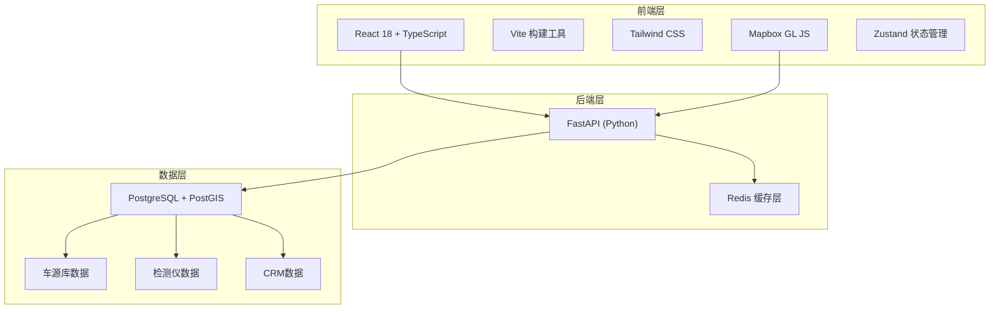
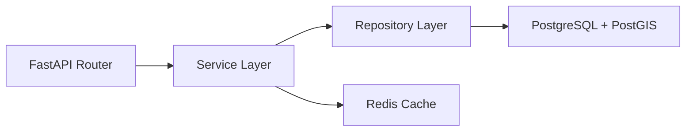
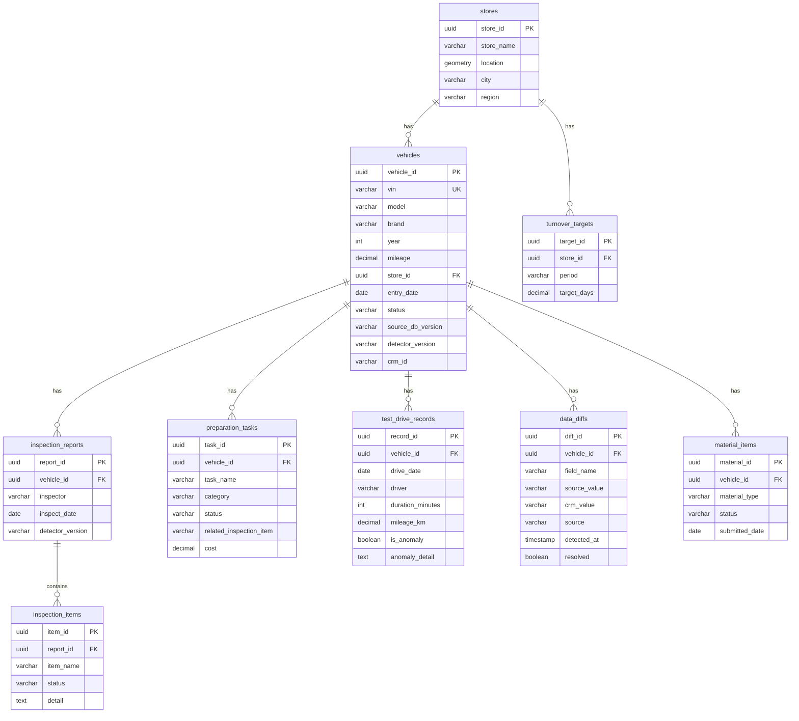

## 1. 架构设计



## 2. 技术说明

- **前端**：React@18 + TypeScript + Tailwind CSS@3 + Vite
- **初始化工具**：vite-init (react-ts 模板)
- **地图引擎**：Mapbox GL JS (@mapbox/mapbox-gl-js)
- **图表库**：Recharts（轻量、React原生支持）
- **后端**：FastAPI (Python 3.11+)
- **数据库**：PostgreSQL 16 + PostGIS 扩展
- **缓存**：Redis 7
- **状态管理**：Zustand

## 3. 路由定义

| 路由 | 用途 |
|------|------|
| `/` | 看板主页 - KPI概览、门店地图、趋势图表 |
| `/vehicles` | 车辆档案总览 - 车辆列表与详情面板 |
| `/diff` | 数据差异中心 - 差异统计与明细 |
| `/turnover` | 库存周转分析 - 同比环比目标值对比 |

## 4. API定义

### 4.1 看板主页接口

```typescript
interface DashboardKPI {
  total_vehicles: number
  transfer_completion_rate: number
  avg_turnover_days: number
  material_missing_rate: number
  kpi_trends: {
    date: string
    turnover_days: number
    completion_rate: number
    missing_rate: number
  }[]
}

interface StoreMapPoint {
  store_id: string
  store_name: string
  lng: number
  lat: number
  vehicle_count: number
  turnover_status: "normal" | "warning" | "critical"
}

interface TurnoverTrend {
  month: string
  current: number
  yoy: number
  mom: number
  target: number
}

interface MaterialHeatmap {
  material_type: string
  store_name: string
  missing_count: number
  missing_rate: number
  samples: MaterialSample[]
}

interface MaterialSample {
  vehicle_id: string
  vin: string
  model: string
  missing_items: string[]
}
```

### 4.2 车辆档案接口

```typescript
interface VehicleListItem {
  vehicle_id: string
  vin: string
  model: string
  brand: string
  store_name: string
  entry_date: string
  status: "in_stock" | "transfer_processing" | "transferred" | "sold"
  turnover_days: number
}

interface VehicleDetail {
  vehicle_id: string
  vin: string
  model: string
  brand: string
  year: number
  mileage: number
  store_id: string
  store_name: string
  entry_date: string
  status: string
  source_db_version: string
  detector_version: string
  crm_id: string
  inspection_reports: InspectionReport[]
  preparation_list: PreparationItem[]
  test_drive_records: TestDriveRecord[]
}

interface InspectionReport {
  report_id: string
  inspector: string
  inspect_date: string
  detector_version: string
  items: InspectionItem[]
}

interface InspectionItem {
  item_name: string
  status: "pass" | "fail" | "warning"
  detail: string
}

interface PreparationItem {
  task_id: string
  task_name: string
  category: string
  status: "pending" | "in_progress" | "completed"
  related_inspection_item: string
  cost: number
}

interface TestDriveRecord {
  record_id: string
  drive_date: string
  driver: string
  duration_minutes: number
  mileage_km: number
  is_anomaly: boolean
  anomaly_detail: string | null
}
```

### 4.3 数据差异接口

```typescript
interface DiffSummary {
  source_vs_crm: { total: number; resolved: number; pending: number }
  detector_version_diff: { total: number; versions: VersionEntry[] }
}

interface VersionEntry {
  version: string
  count: number
  change_date: string
  affected_stores: string[]
}

interface DiffRecord {
  diff_id: string
  vehicle_id: string
  vin: string
  field_name: string
  source_value: string
  crm_value: string
  source: "vehicle_source" | "detector" | "crm"
  detected_at: string
  resolved: boolean
}
```

### 4.4 库存周转接口

```typescript
interface TurnoverComparison {
  period: string
  current_value: number
  yoy_value: number
  mom_value: number
  target_value: number
  gap_to_target: number
}

interface TurnoverGapSample {
  vehicle_id: string
  vin: string
  model: string
  store_name: string
  turnover_days: number
  gap_reason: string
  test_drive_anomaly: TestDriveRecord | null
}
```

## 5. 服务端架构图



## 6. 数据模型

### 6.1 数据模型定义



### 6.2 数据定义语言

```sql
CREATE EXTENSION IF NOT EXISTS postgis;

CREATE TABLE stores (
    store_id UUID PRIMARY KEY DEFAULT gen_random_uuid(),
    store_name VARCHAR(100) NOT NULL,
    location GEOMETRY(Point, 4326),
    city VARCHAR(50),
    region VARCHAR(50),
    created_at TIMESTAMP DEFAULT NOW()
);

CREATE TABLE vehicles (
    vehicle_id UUID PRIMARY KEY DEFAULT gen_random_uuid(),
    vin VARCHAR(17) UNIQUE NOT NULL,
    model VARCHAR(100),
    brand VARCHAR(50),
    year INTEGER,
    mileage DECIMAL(10,1),
    store_id UUID REFERENCES stores(store_id),
    entry_date DATE NOT NULL,
    status VARCHAR(20) DEFAULT 'in_stock',
    source_db_version VARCHAR(20),
    detector_version VARCHAR(20),
    crm_id VARCHAR(50),
    created_at TIMESTAMP DEFAULT NOW()
);

CREATE TABLE inspection_reports (
    report_id UUID PRIMARY KEY DEFAULT gen_random_uuid(),
    vehicle_id UUID REFERENCES vehicles(vehicle_id),
    inspector VARCHAR(50),
    inspect_date DATE,
    detector_version VARCHAR(20)
);

CREATE TABLE inspection_items (
    item_id UUID PRIMARY KEY DEFAULT gen_random_uuid(),
    report_id UUID REFERENCES inspection_reports(report_id),
    item_name VARCHAR(100),
    status VARCHAR(20),
    detail TEXT
);

CREATE TABLE preparation_tasks (
    task_id UUID PRIMARY KEY DEFAULT gen_random_uuid(),
    vehicle_id UUID REFERENCES vehicles(vehicle_id),
    task_name VARCHAR(100),
    category VARCHAR(50),
    status VARCHAR(20) DEFAULT 'pending',
    related_inspection_item VARCHAR(100),
    cost DECIMAL(10,2)
);

CREATE TABLE test_drive_records (
    record_id UUID PRIMARY KEY DEFAULT gen_random_uuid(),
    vehicle_id UUID REFERENCES vehicles(vehicle_id),
    drive_date DATE,
    driver VARCHAR(50),
    duration_minutes INTEGER,
    mileage_km DECIMAL(6,1),
    is_anomaly BOOLEAN DEFAULT FALSE,
    anomaly_detail TEXT
);

CREATE TABLE data_diffs (
    diff_id UUID PRIMARY KEY DEFAULT gen_random_uuid(),
    vehicle_id UUID REFERENCES vehicles(vehicle_id),
    field_name VARCHAR(100),
    source_value TEXT,
    crm_value TEXT,
    source VARCHAR(20),
    detected_at TIMESTAMP DEFAULT NOW(),
    resolved BOOLEAN DEFAULT FALSE
);

CREATE TABLE turnover_targets (
    target_id UUID PRIMARY KEY DEFAULT gen_random_uuid(),
    store_id UUID REFERENCES stores(store_id),
    period VARCHAR(20),
    target_days DECIMAL(5,1)
);

CREATE TABLE material_items (
    material_id UUID PRIMARY KEY DEFAULT gen_random_uuid(),
    vehicle_id UUID REFERENCES vehicles(vehicle_id),
    material_type VARCHAR(50),
    status VARCHAR(20),
    submitted_date DATE
);

CREATE INDEX idx_vehicles_store ON vehicles(store_id);
CREATE INDEX idx_vehicles_status ON vehicles(status);
CREATE INDEX idx_vehicles_vin ON vehicles(vin);
CREATE INDEX idx_inspection_reports_vehicle ON inspection_reports(vehicle_id);
CREATE INDEX idx_preparation_tasks_vehicle ON preparation_tasks(vehicle_id);
CREATE INDEX idx_test_drive_vehicle ON test_drive_records(vehicle_id);
CREATE INDEX idx_data_diffs_vehicle ON data_diffs(vehicle_id);
CREATE INDEX idx_data_diffs_resolved ON data_diffs(resolved);
CREATE INDEX idx_material_items_vehicle ON material_items(vehicle_id);
CREATE INDEX idx_material_items_type ON material_items(material_type);
CREATE INDEX idx_stores_location ON stores USING GIST(location);
```
