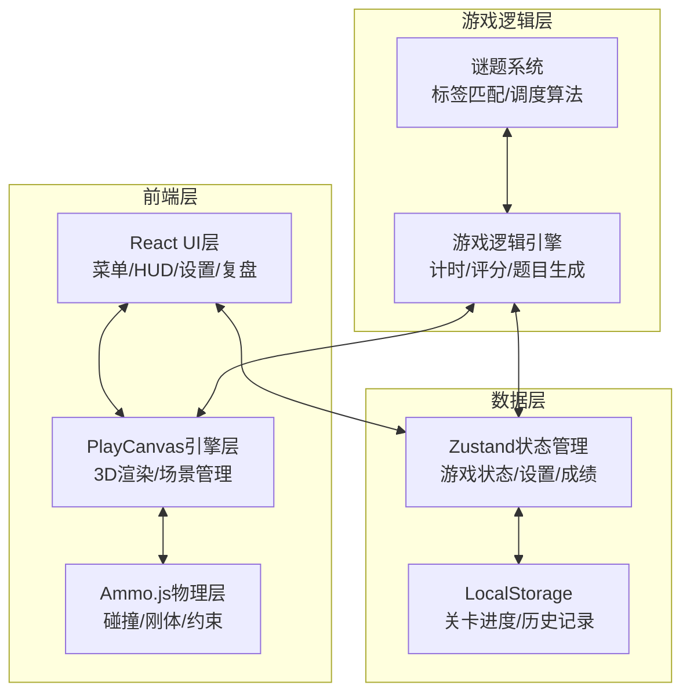
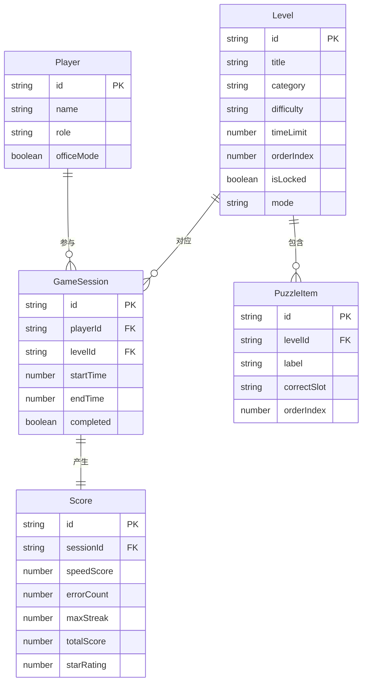

## 1. 架构设计



## 2. 技术说明

- **前端框架**：React@18 + TypeScript + Tailwind CSS@3 + Vite
- **3D引擎**：PlayCanvas（playcanvas npm包）
- **物理引擎**：Ammo.js（ammo.js npm包）
- **状态管理**：Zustand
- **路由**：React Router DOM v6
- **图表**：Recharts（复习页数据可视化）
- **音效**：Web Audio API
- **震动**：Vibration API
- **数据持久化**：LocalStorage（Mock数据，无后端）
- **初始化工具**：Vite

## 3. 路由定义

| 路由 | 用途 |
|------|------|
| `/` | 主菜单页，模式选择与设置入口 |
| `/levels` | 关卡选择页，正式训练/自由练习关卡列表 |
| `/game/:levelId` | 游戏场景页，3D解谜主场景 |
| `/result/:levelId` | 成绩反馈页，评分详情与重试 |
| `/review` | 复习页，多关卡完成率对比 |
| `/settings` | 设置页，声音/震动/动画控制 |

## 4. 数据模型

### 4.1 数据模型定义



### 4.2 数据定义

**关卡数据结构**：
```typescript
interface Level {
  id: string;
  title: string;
  category: 'math' | 'science' | 'language' | 'history';
  difficulty: 'easy' | 'medium' | 'hard';
  timeLimit: number;
  orderIndex: number;
  isLocked: boolean;
  mode: 'formal' | 'free';
  puzzleItems: PuzzleItem[];
}

interface PuzzleItem {
  id: string;
  label: string;
  correctSlot: string;
  orderIndex: number;
}

interface Score {
  speedScore: number;
  errorCount: number;
  maxStreak: number;
  totalScore: number;
  starRating: 1 | 2 | 3;
  completionRate: number;
}

interface GameSettings {
  soundEnabled: boolean;
  soundVolume: number;
  vibrationEnabled: boolean;
  vibrationIntensity: number;
  animationIntensity: 'high' | 'medium' | 'off';
  officeMode: boolean;
}

interface GameSession {
  id: string;
  levelId: string;
  startTime: number;
  endTime: number | null;
  completed: boolean;
  score: Score | null;
  errors: { puzzleId: string; playerAnswer: string; correctAnswer: string }[];
}
```

**Mock初始数据**：
- 6个预设关卡（数学2个、科学2个、语文1个、历史1个）
- 每关卡5-8个谜题项目
- 正式训练3个关卡按序解锁，自由练习3个关卡全开放

## 5. 评分算法

```
基础分 = 1000
速度加成 = max(0, (剩余时间 / 总时间)) × 300
错误惩罚 = 错误次数 × 50
连击奖励 = 最大连续正确 × 20
总分 = 基础分 + 速度加成 - 错误惩罚 + 连击奖励
星级 = 总分 >= 1000 ? 3 : 总分 >= 600 ? 2 : 1
完成率 = 正确题数 / 总题数 × 100%
```

## 6. 核心模块架构

### 6.1 PlayCanvas 集成

- 使用 `playcanvas` npm包，在React组件中通过 `useRef` + `useEffect` 管理canvas生命周期
- 封装 `PlayCanvasApp` 类管理引擎初始化、场景创建、渲染循环
- 3D模型使用程序化生成（Box、Cylinder等基础几何体），无需外部模型资源

### 6.2 Ammo.js 集成

- Ammo.js通过动态import加载，避免阻塞首屏
- 创建物理世界（btDiscreteDynamicsWorld），配置重力与碰撞检测
- 教材箱体使用btBoxShape刚体，分发台使用btStaticPlaneShape静态体
- 拖拽交互：鼠标拾取时创建btPoint2PointConstraint约束

### 6.3 游戏状态管理

- Zustand store管理：当前关卡、计时器、错误计数、连击数、设置项
- 游戏会话数据同步写入LocalStorage实现持久化
- 办公模式切换时自动调整声音/震动/动画设置
