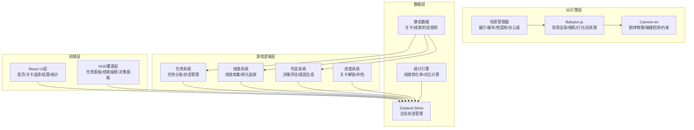
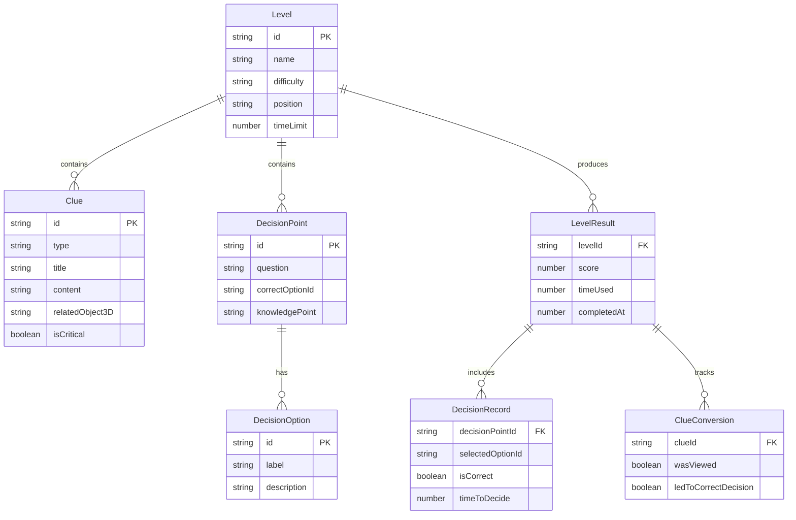

## 1. 架构设计



## 2. 技术说明
- 前端框架：React 18 + TypeScript + Vite
- 3D引擎：Babylon.js @latest + Cannon-es @latest
- 状态管理：Zustand
- 样式方案：Tailwind CSS 3
- 路由：React Router DOM 6
- 初始化工具：vite-init (react-ts 模板)
- 后端：无（纯前端，数据持久化使用 localStorage）

## 3. 路由定义
| 路由 | 用途 |
|------|------|
| / | 首页，双入口导航（正式训练/自由练习）+ 快速继续 |
| /training | 正式训练关卡选择，含进度锁 |
| /practice | 自由练习关卡选择，全部关卡开放 |
| /game/:levelId | 游戏主场景，3D展厅 + HUD |
| /result/:levelId | 结算面板，得分/用时/错因 |
| /stats | 统计页，线索转化/关卡对比/趋势 |

## 4. API定义
无后端API，所有数据为前端静态数据 + localStorage持久化。

核心TypeScript类型定义：

```typescript
interface Level {
  id: string
  name: string
  difficulty: "beginner" | "advanced" | "noshow"
  position: "sales" | "scheduler" | "service"
  task: TaskDefinition
  clues: Clue[]
  decisions: DecisionPoint[]
  timeLimit: number
}

interface TaskDefinition {
  title: string
  description: string
  customerName: string
  requestedCar: string
  requestedTime: string
}

interface Clue {
  id: string
  type: "test_drive_record" | "customer_profile" | "vehicle_archive"
  title: string
  content: string
  relatedObject3D: string
  isCritical: boolean
}

interface DecisionPoint {
  id: string
  question: string
  options: DecisionOption[]
  correctOptionId: string
  knowledgePoint: string
}

interface DecisionOption {
  id: string
  label: string
  description: string
}

interface LevelResult {
  levelId: string
  score: number
  timeUsed: number
  decisions: DecisionRecord[]
  clueConversions: ClueConversion[]
  completedAt: number
}

interface DecisionRecord {
  decisionPointId: string
  selectedOptionId: string
  isCorrect: boolean
  timeToDecide: number
}

interface ClueConversion {
  clueId: string
  wasViewed: boolean
  ledToCorrectDecision: boolean
}
```

## 5. 服务器架构图
无后端服务，纯前端应用。

## 6. 数据模型

### 6.1 数据模型定义



### 6.2 数据定义语言
使用 localStorage 存储，键值设计：
- `game_progress`: 关卡解锁状态与进度 (JSON)
- `level_results`: 各关卡最佳成绩记录 (JSON数组)
- `clue_stats`: 线索转化统计数据 (JSON)
- `player_profile`: 玩家工号与基本设置 (JSON)
