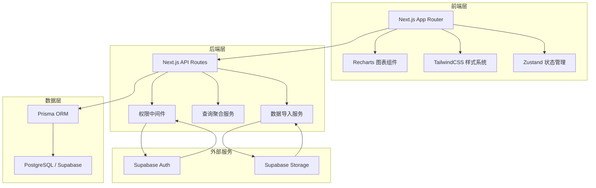
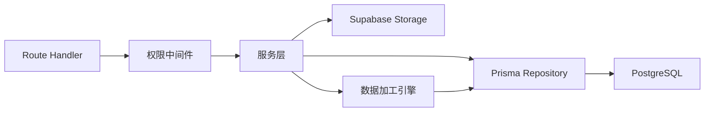
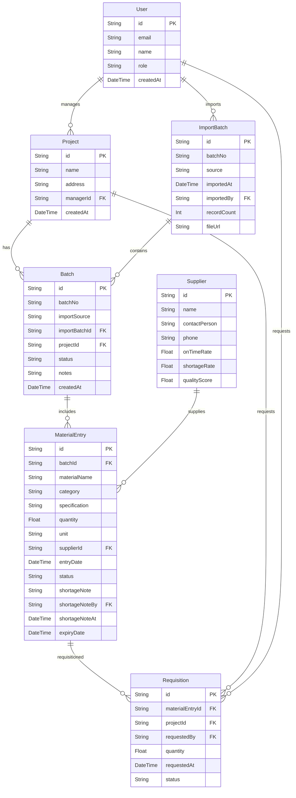

## 1. 架构设计



## 2. 技术说明

- **前端**：Next.js 14 (App Router) + TailwindCSS 3 + Recharts + Zustand
- **初始化工具**：create-next-app
- **后端**：Next.js API Routes (Route Handlers)
- **数据库**：PostgreSQL (Supabase 托管)
- **ORM**：Prisma
- **认证**：Supabase Auth (JWT + Row Level Security)
- **文件存储**：Supabase Storage (监理照片、导入文件)
- **图表**：Recharts (折线图、环形图、漏斗图、面积图、柱状图)

## 3. 路由定义

| 路由 | 用途 |
|------|------|
| `/` | 总览看板页面，展示趋势图、指标卡片、异常预警 |
| `/tracking` | 材料进场追踪，进场记录列表、短缺注释、多源数据合并 |
| `/import` | 数据导入页面，收款记录/设计导出/照片上传 |
| `/analytics` | 数据分析区，库存台账/批次漏斗/供应商排行/领用变化 |
| `/api/materials` | 材料进场记录 CRUD |
| `/api/batches` | 批次管理 API |
| `/api/suppliers` | 供应商 CRUD |
| `/api/import` | 数据导入处理 API |
| `/api/analytics/inventory` | 库存台账分布数据 |
| `/api/analytics/funnel` | 批次效期漏斗数据 |
| `/api/analytics/suppliers` | 供应商排行数据 |
| `/api/analytics/requisitions` | 领用记录变化数据 |

## 4. API 定义

### 4.1 材料进场记录

```typescript
interface MaterialEntry {
  id: string
  batchId: string
  materialName: string
  category: string
  specification: string
  quantity: number
  unit: string
  supplierId: string
  entryDate: Date
  status: "ARRIVED" | "IN_STOCK" | "RECLAIMED" | "EXPIRED"
  shortageNote: string | null
  shortageNoteBy: string | null
  shortageNoteAt: Date | null
}

interface MaterialEntryResponse {
  data: MaterialEntry[]
  total: number
  page: number
  pageSize: number
}
```

### 4.2 批次

```typescript
interface Batch {
  id: string
  batchNo: string
  importSource: "PAYMENT" | "DESIGN_EXPORT" | "PHOTO" | "MANUAL"
  importBatchId: string
  importedAt: Date
  projectId: string
  status: "COMPLETE" | "SHORTAGE" | "PARTIAL"
  notes: string | null
}

interface ImportBatch {
  id: string
  batchNo: string
  source: "PAYMENT" | "DESIGN_EXPORT" | "PHOTO"
  importedAt: Date
  importedBy: string
  recordCount: number
  fileUrl: string | null
}
```

### 4.3 供应商

```typescript
interface Supplier {
  id: string
  name: string
  contactPerson: string
  phone: string
  deliveryOnTimeRate: number
  shortageRate: number
  qualityScore: number
}
```

### 4.4 分析数据

```typescript
interface InventoryDistribution {
  category: string
  quantity: number
  percentage: number
}

interface FunnelStage {
  stage: string
  count: number
  conversionRate: number
}

interface SupplierRanking {
  supplierId: string
  supplierName: string
  onTimeRate: number
  shortageRate: number
  qualityScore: number
  totalDeliveries: number
}

interface RequisitionTrend {
  date: string
  category: string
  quantity: number
}
```

## 5. 服务端架构图



## 6. 数据模型

### 6.1 数据模型定义



### 6.2 数据定义语言

```sql
CREATE TABLE "User" (
  "id" TEXT PRIMARY KEY DEFAULT gen_random_uuid(),
  "email" TEXT NOT NULL UNIQUE,
  "name" TEXT NOT NULL,
  "role" TEXT NOT NULL DEFAULT 'STAFF',
  "createdAt" TIMESTAMP NOT NULL DEFAULT NOW()
);

CREATE TABLE "Project" (
  "id" TEXT PRIMARY KEY DEFAULT gen_random_uuid(),
  "name" TEXT NOT NULL,
  "address" TEXT,
  "managerId" TEXT REFERENCES "User"("id"),
  "createdAt" TIMESTAMP NOT NULL DEFAULT NOW()
);

CREATE TABLE "Supplier" (
  "id" TEXT PRIMARY KEY DEFAULT gen_random_uuid(),
  "name" TEXT NOT NULL,
  "contactPerson" TEXT,
  "phone" TEXT,
  "onTimeRate" FLOAT DEFAULT 0,
  "shortageRate" FLOAT DEFAULT 0,
  "qualityScore" FLOAT DEFAULT 0
);

CREATE TABLE "ImportBatch" (
  "id" TEXT PRIMARY KEY DEFAULT gen_random_uuid(),
  "batchNo" TEXT NOT NULL UNIQUE,
  "source" TEXT NOT NULL,
  "importedAt" TIMESTAMP NOT NULL DEFAULT NOW(),
  "importedBy" TEXT REFERENCES "User"("id"),
  "recordCount" INT DEFAULT 0,
  "fileUrl" TEXT
);

CREATE TABLE "Batch" (
  "id" TEXT PRIMARY KEY DEFAULT gen_random_uuid(),
  "batchNo" TEXT NOT NULL,
  "importSource" TEXT NOT NULL,
  "importBatchId" TEXT REFERENCES "ImportBatch"("id"),
  "projectId" TEXT REFERENCES "Project"("id"),
  "status" TEXT NOT NULL DEFAULT 'COMPLETE',
  "notes" TEXT,
  "createdAt" TIMESTAMP NOT NULL DEFAULT NOW()
);

CREATE TABLE "MaterialEntry" (
  "id" TEXT PRIMARY KEY DEFAULT gen_random_uuid(),
  "batchId" TEXT REFERENCES "Batch"("id"),
  "materialName" TEXT NOT NULL,
  "category" TEXT NOT NULL,
  "specification" TEXT,
  "quantity" FLOAT NOT NULL,
  "unit" TEXT NOT NULL,
  "supplierId" TEXT REFERENCES "Supplier"("id"),
  "entryDate" TIMESTAMP NOT NULL,
  "status" TEXT NOT NULL DEFAULT 'ARRIVED',
  "shortageNote" TEXT,
  "shortageNoteBy" TEXT REFERENCES "User"("id"),
  "shortageNoteAt" TIMESTAMP,
  "expiryDate" TIMESTAMP
);

CREATE TABLE "Requisition" (
  "id" TEXT PRIMARY KEY DEFAULT gen_random_uuid(),
  "materialEntryId" TEXT REFERENCES "MaterialEntry"("id"),
  "projectId" TEXT REFERENCES "Project"("id"),
  "requestedBy" TEXT REFERENCES "User"("id"),
  "quantity" FLOAT NOT NULL,
  "requestedAt" TIMESTAMP NOT NULL DEFAULT NOW(),
  "status" TEXT NOT NULL DEFAULT 'PENDING'
);

CREATE INDEX "idx_material_entry_batch" ON "MaterialEntry"("batchId");
CREATE INDEX "idx_material_entry_supplier" ON "MaterialEntry"("supplierId");
CREATE INDEX "idx_material_entry_status" ON "MaterialEntry"("status");
CREATE INDEX "idx_material_entry_category" ON "MaterialEntry"("category");
CREATE INDEX "idx_material_entry_date" ON "MaterialEntry"("entryDate");
CREATE INDEX "idx_batch_project" ON "Batch"("projectId");
CREATE INDEX "idx_batch_import_batch" ON "Batch"("importBatchId");
CREATE INDEX "idx_requisition_project" ON "Requisition"("projectId");
CREATE INDEX "idx_requisition_date" ON "Requisition"("requestedAt");
CREATE INDEX "idx_import_batch_source" ON "ImportBatch"("source");
```
